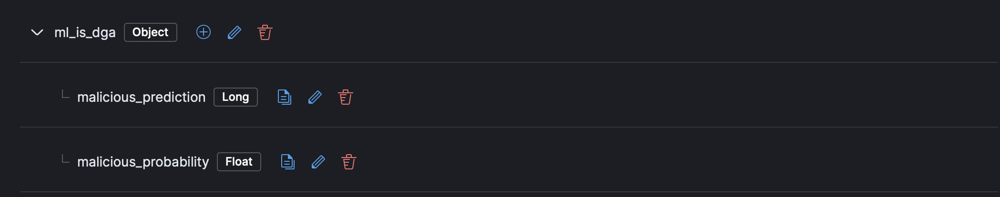

# Domain Generation Algorithm Detection

The Domain Generation Algorithm (DGA) Detection package contains assets to detect DGA activity in your network data. This package requires a Platinum subscription. Please ensure that you have a Trial or Platinum level subscription installed on your cluster before proceeding. This package is licensed under [Elastic License 2.0](https://www.elastic.co/licensing/elastic-license).

For more detailed information refer to the following blogs:
- [Detect domain generation algorithm (DGA) activity with new Kibana integration](https://www.elastic.co/security-labs/detect-domain-generation-algorithm-activity-with-new-kibana-integration)
- [Combining supervised and unsupervised machine learning for DGA detection](https://www.elastic.co/blog/supervised-and-unsupervised-machine-learning-for-dga-detection)

## Installation

1. **Upgrading**: If upgrading from a version below v2.0.0, see the section v2.0.0 and beyond.
1. **Add the Integration Package**: Install the package via **Management > Integrations > Add Domain Generation Algorithm Detection**. Configure the integration name and agent policy. Click Save and Continue.
1. **Install assets**: Install the assets by clicking **Settings > Install Domain Generation Algorithm Detection assets**.
1. **Configure the ingest pipeline**: Once you’ve installed the package you can ingest your data using the ingest pipeline via the ingest pipeline. This will enrich your incoming data with its predictions from the machine learning model. You can use one of the following methods depending on your setup:
    - If using an Elastic Beat such as Packetbeat, add the ingest pipeline to it by adding a simple configuration [setting](https://www.elastic.co/guide/en/elasticsearch/reference/current/ingest.html#pipelines-for-beats) to `packetbeat.yml`.
    - If adding the ingest pipeline to an existing pipeline, use a [pipeline processor](https://www.elastic.co/guide/en/elasticsearch/reference/current/pipeline-processor.html). For example, you can check if winlogbeat, default index pattern `winlogbeat-*`, or Elastic Defend  (the default index pattern being `logs-endpoint.events.process-default`), already has an ingest pipeline by navigating to **Stack Management > Data > Index Management**, finding the index (sometimes you need to toggle "Include hidden indices"), and checking the index's settings for a default or final [pipeline](https://www.elastic.co/guide/en/elasticsearch/reference/current/ingest.html#set-default-pipeline). To enable the enrichment policy as the default pipeline on an index, you can use this example and replace `INDEX_NAME` with the desired index/data stream name:  
      ```
      PUT INDEX_NAME/_settings
      {
        "index" : {
          "default_pipeline" : "<VERSION>-ml_dga_ingest_pipeline"
        }
      }
      ```
1. **Add the required mapping to the index or component template**: Go to **Stack Management > Index Management > Component Templates**. Templates that can be edited to add custom components will be marked with a `@custom` suffix. For instance, the custom component template for Elastic Defend processes is `logs-endpoint.events.network@custom`. **Note:** Do not attempt to edit the `@package` template.
    
    - If the `@custom` component template does not exist, you can execute the following command in the Dev Console to create it and then continue to the rollover step.
      ```
      PUT _component_template/{COMPONENT_TEMPLATE_NAME}@custom
      {
        "template": {
          "mappings": {
            "properties": {
              "ml_is_dga": {
                "type": "object",
                "properties": {
                  "malicious_prediction": {
                    "type": "long"
                  },
                  "malicious_probability": {
                    "type": "float"
                  }
                }
              }
            }
          }
        }
      }
      ```
    - If the `@custom` component template already exists, click the three dots next to it and select **Edit**. 
    
    Proceed to the mappings step. Click **Add Field** at the bottom of the page and create an an `Object` field for `ml_is_dga`. 
    
    Finally create two properties under `ml_is_dga`.
    
    The first for `malicious_prediction` of type `Long` and then for `prediction_probability` or type `Float`.
    
    Your component mappings should look like the following:
    
    Click **Review** then **Save Component Template**.
1. **Rollover** Depending on your environment, you may need to [rollover](https://www.elastic.co/guide/en/elasticsearch/reference/current/indices-rollover-index.html) in order for these mappings to get picked up.
  ```
  POST INDEX_NAME/_rollover
  ```
1. **(Optional) [Create a data view](https://www.elastic.co/guide/en/kibana/current/data-views.html)** for your network logs.
1. **Add preconfigured anomaly detection jobs**: In **Machine Learning > Anomaly Detection**, when you create a job, you should see an option to `Use preconfigured jobs` with a card for `DGA`. When you select the card, you will see a pre-configured anomaly detection job that you can enable depending on what makes the most sense for your environment. Note this job is only useful for indices that have been enriched by the ingest pipeline.
1. **Enable detection rules**: You can also enable detection rules to alert on DGA activity in your environment, based on anomalies flagged by the above ML jobs. As of version 2.0.0 of this package, these rules are available as part of the Detection Engine in **Security > Rules**, and can be found using the tag `Use Case: Domain Generated Algorithm Detection`. See this [documentation](https://www.elastic.co/guide/en/security/current/prebuilt-rules-management.html#load-prebuilt-rules) for more information on importing and enabling the rules.


*In **Security > Rules**, filtering with the “Use Case: Domain Generation Algorithm Detection” tag*

## Anomaly Detection Jobs

| Job | Description |
|---|---|
| dga_high_sum_probability | Detects potential DGA (domain generation algorithm) activity that is often used by malware command and control (C2) channels. Looks for a source IP address making DNS requests that have an aggregate high probability of being DGA activity.| 

## v2.0.0 and beyond

v2.0.0 of the package introduces breaking changes, namely deprecating detection rules from the package. To continue receiving updates to DGA Detection, we recommend upgrading to v2.0.0 after doing the following:
- Uninstall existing rules associated with this package: Navigate to **Security > Rules** and delete the following rules:
    - Machine Learning Detected DGA activity using a known SUNBURST DNS domain
    - Machine Learning Detected a DNS Request Predicted to be a DGA Domain
    - Potential DGA Activity
    - Machine Learning Detected a DNS Request With a High DGA Probability Score

Depending on the version of the package you're using, you might also be able to search for the above rules using the tag `DGA`
- Upgrade the DGA package to v2.0.0 using the steps [here](https://www.elastic.co/guide/en/fleet/current/upgrade-integration.html)
- Install the new rules as described in the [Enable detection rules](#enable-detection-rules) section below

In version 2.0.1 and after, the package ignores data in cold and frozen data tiers to reduce heap memory usage, avoid running on outdated data, and to follow best practices.

## Licensing

Usage in production requires that you have a license key that permits use of machine learning features.
