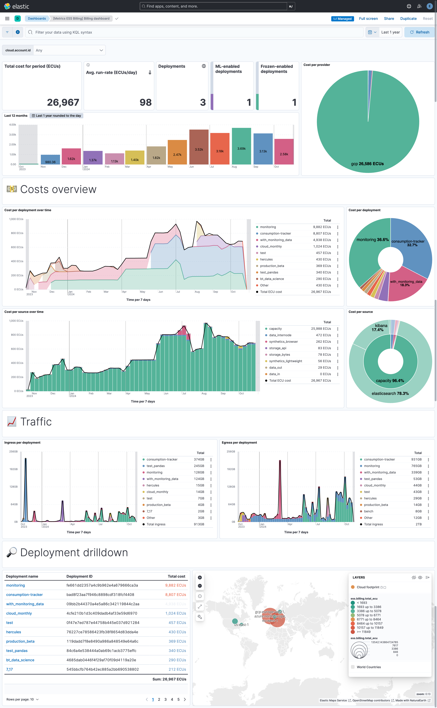
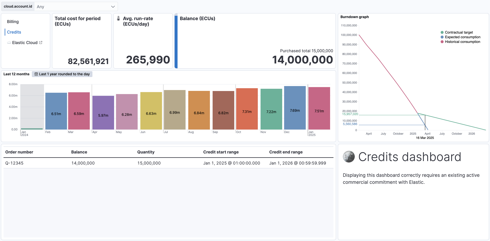

# Elasticsearch Service Billing

The Elasticsearch Service Billing integration allows you to monitor Elasticsearch Service usage and costs. It collects billing data from the [Elasticsearch Service billing API](https://www.elastic.co/guide/en/cloud/current/Billing_Costs_Analysis.html) and sends it to your target Elasticsearch cluster. Dashboards are provided out-of-the-box to help you visualize your Elasticsearch Service usage and costs.

Using this integration, you could for instance create alerts whenever a new deployment is created, or when your baseline spending exceeds a certain threshold.

## Data streams

The Elasticsearch Service Billing integration collects the following data streams:

* Your daily spending in the `metrics-ess_billing.billing` data stream.
* For customers with a yearly commitment with Elastic, your credit status in the `metrics-ess_billing.credit` data stream.

By default, the last year of data of billing data is collected upon first execution of the integration. The data is then collected daily, the integration will automatically collect the latest data every day.

## Requirements

You need Elasticsearch for storing and searching your data and Kibana for visualizing and managing it.
You can use our hosted Elasticsearch Service on Elastic Cloud, which is recommended, or self-manage the Elastic Stack on your own hardware.

You will need to recover the identifier of your organization, which can be seen in the [cloud organization page](https://cloud.elastic.co/account/members).

You will also need to provision an API key with the `Billing admin` role in the [API keys page](https://cloud.elastic.co/account/keys).

For private cloud, or admin users, the cloud endpoint can be altered to match your requirements. You can change this in the "advanced settings" section of the integration configuration.

## Setup

For step-by-step instructions on how to set up an integration, see the
[Getting started](https://www.elastic.co/guide/en/starting-with-the-elasticsearch-platform-and-its-solutions/current/getting-started-observability.html) guide.

If you run in the cloud (Cloud Hosted of Serverless), this integration is available [agentless](https://www.elastic.co/guide/en/serverless/current/security-agentless-integrations.html) from cluster version 8.17 onward - if this criteria is met, you don't need to install an Elastic Agent to gather these metrics.

## Data streams reference

###  `metrics-ess_billing.billing` data stream

The `metrics-ess_billing.billing` data stream collects billing data from the Elasticsearch Service billing API. This exposes information about the ECU consumption for each deployment or service provided by Elastic (serverless projects, synthetics monitors).

An example event for `billing` looks as following:

```json
{
    "@timestamp": "2024-01-10T00:00:00.000Z",
    "agent": {
        "ephemeral_id": "fb0f134f-4261-49f2-922c-6f2785960a4e",
        "id": "6c2fb3e5-8b0c-4044-a920-bc47cd3ac9a3",
        "name": "docker-fleet-agent",
        "type": "filebeat",
        "version": "8.15.1"
    },
    "cloud": {
        "account": {
            "id": "3166899605"
        },
        "geo": {
            "location": {
                "lat": 53.34979997947812,
                "lon": -6.260300064459443
            },
            "name": "gcp-europe-west1"
        },
        "instance": {
            "id": "eb4bdbcfca05493bb72aa0b65cc1a2d3",
            "name": "monitoring"
        },
        "machine": {
            "type": "es.ml.n2.68x32x45"
        },
        "provider": "gcp",
        "region": "gcp-europe-west1"
    },
    "data_stream": {
        "dataset": "ess_billing.billing",
        "namespace": "default",
        "type": "metrics"
    },
    "ecs": {
        "version": "8.0.0"
    },
    "elastic_agent": {
        "id": "6c2fb3e5-8b0c-4044-a920-bc47cd3ac9a3",
        "snapshot": false,
        "version": "8.15.1"
    },
    "ess": {
        "billing": {
            "deployment_id": "eb4bdbcfca05493bb72aa0b65cc1a2d3",
            "deployment_name": "monitoring",
            "display_quantity": {
                "formatted_value": "24 hours",
                "type": "default",
                "value": 24
            },
            "from": "2024-01-10T00:00:00.000Z",
            "kind": "elasticsearch",
            "name": "Cloud Standard, GCP europe-west1 (Belgium), gcp.es.ml.n2.68x32x45, 8GB, 1AZ",
            "organization_id": "3166899605",
            "quantity": {
                "formatted_value": "24 hours",
                "value": 24
            },
            "ram_per_zone": 8192,
            "rate": {
                "formatted_value": "0.3528 per hour",
                "value": 0.3528
            },
            "sku": "gcp.es.ml.n2.68x32x45_gcp-europe-west1_8192_1",
            "to": "2024-01-11T00:00:00.000Z",
            "total_ecu": 8.4672,
            "type": "capacity",
            "unit": "hour",
            "zone_count": 1
        }
    },
    "event": {
        "agent_id_status": "verified",
        "created": "2024-10-28T08:41:53.653Z",
        "dataset": "ess_billing.billing",
        "ingested": "2024-10-28T08:41:53Z",
        "module": "ess_billing"
    },
    "input": {
        "type": "cel"
    },
    "tags": [
        "billing",
        "forwarded"
    ]
}
```

**Exported fields**

| Field | Description | Type |
|---|---|---|
| @timestamp | Event timestamp. | date |
| cloud.account.id |  | keyword |
| data_stream.dataset | Data stream dataset. | constant_keyword |
| data_stream.namespace | Data stream namespace. | constant_keyword |
| data_stream.type | Data stream type. | constant_keyword |
| ess.billing.cloud.machine.type | The machine type of the instance (e.g., n2.68x16x45). | keyword |
| ess.billing.cloud.service.type | The service type of the serverless project. | keyword |
| ess.billing.deployment_id | ID of the Elasticsearch Service deployment. | keyword |
| ess.billing.deployment_name | Name of the Elasticsearch Service deployment. | keyword |
| ess.billing.deployment_type | Type of the Elasticsearch Service deployment. | keyword |
| ess.billing.display_quantity.formatted_value | Human-readable representation of the quantity used (e.g., "24 hours"). | keyword |
| ess.billing.display_quantity.type | Type of quantity displayed (default or custom). | keyword |
| ess.billing.display_quantity.value | Actual quantity used (e.g., 24). | float |
| ess.billing.from | Start time of the billing period. | date |
| ess.billing.kind | Type of service being billed (e.g., elasticsearch, kibana). | keyword |
| ess.billing.name | Description of the SKU or resource being billed. | keyword |
| ess.billing.organization_id | ID of the organization in Elastic Cloud. | keyword |
| ess.billing.quantity.formatted_value | Human-readable representation of the billed quantity (e.g., "24 hours"). | keyword |
| ess.billing.quantity.value | Billed quantity. | float |
| ess.billing.ram_per_zone | RAM size per zone in megabytes. | integer |
| ess.billing.rate.formatted_value | Human-readable representation of the rate (e.g., "0.7992 per hour"). | keyword |
| ess.billing.rate.value | Billed rate per unit of usage. | float |
| ess.billing.sku | Unique identifier for the service or product (SKU). | keyword |
| ess.billing.to | End time of the billing period. | date |
| ess.billing.total_ecu | Total Elasticsearch Compute Units (ECU) used. | float |
| ess.billing.type | Type of billing (e.g., capacity, usage). | keyword |
| ess.billing.unit | Unit of the resource being billed (e.g., hour, GB). | keyword |
| ess.billing.zone_count | Number of availability zones. | integer |
| event.module | Event module | constant_keyword |
| input.type |  | keyword |




### `metrics-ess_billing.credit` data stream

The `metrics-ess_billing.credit` data stream collects credit data from the Elasticsearch Service billing API. This is only available for customers with a direct yearly or multi-year contract with Elastic (not marketplace or monthly subscriptions).

An example event for `credits` looks as following:

```json
{
    "@timestamp": "2025-01-29T15:57:57.368Z",
    "agent": {
        "ephemeral_id": "3fefd74f-7a64-4bad-82e8-6c226de5d333",
        "id": "bb84ef9e-6cd6-4177-822a-b3a0f05644f3",
        "name": "docker-fleet-agent",
        "type": "filebeat",
        "version": "8.17.0"
    },
    "cloud": {
        "account": {
            "id": "12345678"
        }
    },
    "data_stream": {
        "dataset": "ess_billing.credits",
        "namespace": "default",
        "type": "metrics"
    },
    "ecs": {
        "version": "8.0.0"
    },
    "elastic_agent": {
        "id": "bb84ef9e-6cd6-4177-822a-b3a0f05644f3",
        "snapshot": false,
        "version": "8.17.0"
    },
    "ess": {
        "billing": {
            "active": false,
            "ecu_balance": 1463000,
            "ecu_quantity": 1463000,
            "start": "2025-07-01T00:00:00.000Z",
            "end": "2026-06-30T23:59:59.999Z",
            "organization_id": "12345678",
            "type": "prepaid_consumption"
        }
    },
    "event": {
        "agent_id_status": "verified",
        "dataset": "ess_billing.credits",
        "ingested": "2025-01-29T15:57:58Z"
    },
    "input": {
        "type": "cel"
    },
    "tags": [
        "billing",
        "forwarded"
    ]
}
```

**Exported fields**

| Field | Description | Type |
|---|---|---|
| @timestamp | Event timestamp. | date |
| cloud.account.id |  | keyword |
| data_stream.dataset | Data stream dataset. | constant_keyword |
| data_stream.namespace | Data stream namespace. | constant_keyword |
| data_stream.type | Data stream type. | constant_keyword |
| ess.billing.active | Whether the credit line is active. | boolean |
| ess.billing.ecu_balance | Balance of Elastic Consumption Units (ECUs) in the credit line. | long |
| ess.billing.ecu_quantity | Initially purchased quantity of Elastic Consumption Units (ECUs) in the credit line. | long |
| ess.billing.end | End date of the credit line. | date |
| ess.billing.organization_id | ID of the organization in Elastic Cloud. | keyword |
| ess.billing.start | Start date of the credit line. | date |
| ess.billing.type | Type of the credit line. | keyword |
| input.type |  | keyword |



