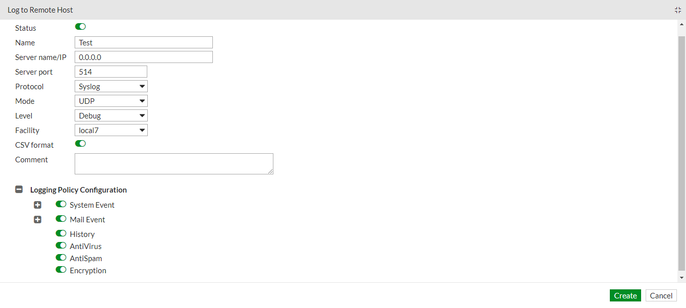

# Fortinet FortiMail

## Overview

The [Fortinet FortiMail](https://www.fortinet.com/products/email-security) integration allows users to monitor History, System, Mail, Antispam, Antivirus, and Encryption events. FortiMail delivers advanced multi-layered protection against the full spectrum of email-borne threats. Powered by FortiGuard Labs threat intelligence and integrated into the Fortinet Security Fabric, FortiMail helps your organization prevent, detect, and respond to email-based threats including spam, phishing, malware, zero-day threats, impersonation, and Business Email Compromise (BEC) attacks.

Use the Fortinet FortiMail integration to collect and parse data from the Syslog. Then visualize that data in Kibana.

## Data streams

The Fortinet FortiMail integration collects one type of data stream: log.

**Log** helps users to keep a record of email activity and traffic including system-related events, such as system restarts and HA activity, virus detections, spam filtering results, POP3, SMTP, IMAP, and webmail events. See more details [About FortiMail logging](https://docs.fortinet.com/document/fortimail/7.2.2/administration-guide/435158/about-fortimail-logging)

This integration targets the six types of events as mentioned below:

- **History** records all email traffic going through the FortiMail unit.

- **System** records system management activities, including changes to the system configuration as well as administrator and user login and logouts.

- **Mail** records mail activities.

- **Antispam** records spam detection events.

- **Antivirus** records virus intrusion events.

- **Encryption** records detection of IBE-related events.

## Requirements

Elasticsearch is needed to store and search data, and Kibana is needed for visualizing and managing it. You can use our hosted Elasticsearch Service on Elastic Cloud, which is recommended, or self-manage the Elastic Stack on your hardware.

This module has been tested against **Fortinet FortiMail version 7.2.2**.

**Note:** The User must have to **Enable CSV format** option.

## Setup

### To collect data from Fortinet FortiMail Syslog server, follow the below steps:

- [Configure Syslog server](https://docs.fortinet.com/document/fortimail/7.2.2/administration-guide/332364/configuring-logging#logging_2063907032_1949484)



## Logs Reference

### Log

This is the `Log` dataset.

#### Example

An example event for `log` looks as following:

```json
{
    "@timestamp": "2013-02-25T07:01:34.000Z",
    "agent": {
        "ephemeral_id": "d71bab02-1a42-4119-ae2a-78113cf3e0c2",
        "id": "5fcd6016-3c0e-45e7-b624-cc2a254f1769",
        "name": "docker-fleet-agent",
        "type": "filebeat",
        "version": "8.3.0"
    },
    "data_stream": {
        "dataset": "fortinet_fortimail.log",
        "namespace": "ep",
        "type": "logs"
    },
    "destination": {
        "ip": "81.2.69.194"
    },
    "ecs": {
        "version": "8.7.0"
    },
    "elastic_agent": {
        "id": "5fcd6016-3c0e-45e7-b624-cc2a254f1769",
        "snapshot": false,
        "version": "8.3.0"
    },
    "email": {
        "direction": "unknown",
        "from": {
            "address": [
                "aaa@bbb.com"
            ]
        },
        "subject": "Test12345",
        "to": {
            "address": [
                "user1@example.com"
            ]
        },
        "x_mailer": "proxy"
    },
    "event": {
        "agent_id_status": "verified",
        "code": "0200025843",
        "dataset": "fortinet_fortimail.log",
        "ingested": "2023-03-16T06:09:49Z",
        "kind": "event",
        "original": "\u003c187\u003edate=2013-02-25,time=07:01:34,device_id=FE100C3909600504,log_id=0200025843,type=statistics,pri=information,session_id=\"r1PF1YTh025836-r1PF1YTh025836\",client_name=\"user\",dst_ip=\"81.2.69.194\",endpoint=\"\",from=\"aaa@bbb.com\",to=\"user1@example.com\",polid=\"0:1:0\",domain=\"example.com\",subject=\"Test12345\",mailer=\"proxy\",resolved=\"FAIL\",direction=\"unknown\",virus=\"\",disposition=\"Delay\",classifier=\"Session Limits\",message_length=\"199986\"",
        "outcome": "failure"
    },
    "fortinet_fortimail": {
        "log": {
            "classifier": "Session Limits",
            "client": {
                "name": "user"
            },
            "date": "2013-02-25",
            "destination_ip": "81.2.69.194",
            "device_id": "FE100C3909600504",
            "direction": "unknown",
            "disposition": "Delay",
            "domain": "example.com",
            "from": "aaa@bbb.com",
            "id": "0200025843",
            "mailer": "proxy",
            "message_length": 199986,
            "policy_id": "0:1:0",
            "priority": "information",
            "priority_number": 187,
            "resolved": "FAIL",
            "session_id": "r1PF1YTh025836-r1PF1YTh025836",
            "subject": "Test12345",
            "time": "07:01:34",
            "to": "user1@example.com",
            "type": "statistics"
        }
    },
    "input": {
        "type": "udp"
    },
    "log": {
        "level": "information",
        "source": {
            "address": "172.23.0.5:36516"
        },
        "syslog": {
            "facility": {
                "code": 22
            },
            "priority": 187,
            "severity": {
                "code": 6
            }
        }
    },
    "observer": {
        "product": "FortiMail",
        "serial_number": "FE100C3909600504",
        "type": "firewall",
        "vendor": "Fortinet"
    },
    "related": {
        "ip": [
            "81.2.69.194"
        ],
        "user": [
            "user",
            "aaa@bbb.com",
            "user1@example.com"
        ]
    },
    "server": {
        "domain": "example.com",
        "registered_domain": "example.com",
        "top_level_domain": "com"
    },
    "source": {
        "user": {
            "name": "user"
        }
    },
    "tags": [
        "preserve_original_event",
        "preserve_duplicate_custom_fields",
        "forwarded",
        "fortinet_fortimail-log"
    ]
}
```

**Exported fields**

| Field | Description | Type |
|---|---|---|
| @timestamp | Event timestamp. | date |
| data_stream.dataset | Data stream dataset. | constant_keyword |
| data_stream.namespace | Data stream namespace. | constant_keyword |
| data_stream.type | Data stream type. | constant_keyword |
| event.dataset | Event dataset. | constant_keyword |
| event.module | Event module. | constant_keyword |
| fortinet_fortimail.log.action |  | keyword |
| fortinet_fortimail.log.classifier |  | keyword |
| fortinet_fortimail.log.client.cc |  | keyword |
| fortinet_fortimail.log.client.ip |  | ip |
| fortinet_fortimail.log.client.name |  | keyword |
| fortinet_fortimail.log.date |  | keyword |
| fortinet_fortimail.log.destination_ip |  | ip |
| fortinet_fortimail.log.detail |  | keyword |
| fortinet_fortimail.log.device_id |  | keyword |
| fortinet_fortimail.log.direction |  | keyword |
| fortinet_fortimail.log.disposition |  | keyword |
| fortinet_fortimail.log.domain |  | keyword |
| fortinet_fortimail.log.endpoint |  | keyword |
| fortinet_fortimail.log.from |  | keyword |
| fortinet_fortimail.log.hfrom |  | keyword |
| fortinet_fortimail.log.id |  | keyword |
| fortinet_fortimail.log.ip |  | ip |
| fortinet_fortimail.log.mailer |  | keyword |
| fortinet_fortimail.log.message |  | keyword |
| fortinet_fortimail.log.message_id |  | keyword |
| fortinet_fortimail.log.message_length |  | long |
| fortinet_fortimail.log.module |  | keyword |
| fortinet_fortimail.log.network |  | keyword |
| fortinet_fortimail.log.notif_delay |  | keyword |
| fortinet_fortimail.log.policy_id |  | keyword |
| fortinet_fortimail.log.port |  | long |
| fortinet_fortimail.log.priority |  | keyword |
| fortinet_fortimail.log.priority_number |  | long |
| fortinet_fortimail.log.read_status |  | keyword |
| fortinet_fortimail.log.reason |  | keyword |
| fortinet_fortimail.log.recv_time |  | keyword |
| fortinet_fortimail.log.resolved |  | keyword |
| fortinet_fortimail.log.scan_time |  | double |
| fortinet_fortimail.log.sent_from |  | keyword |
| fortinet_fortimail.log.session_id |  | keyword |
| fortinet_fortimail.log.source.folder |  | keyword |
| fortinet_fortimail.log.source.ip |  | ip |
| fortinet_fortimail.log.source.type |  | keyword |
| fortinet_fortimail.log.status |  | keyword |
| fortinet_fortimail.log.sub_module |  | keyword |
| fortinet_fortimail.log.sub_type |  | keyword |
| fortinet_fortimail.log.subject |  | keyword |
| fortinet_fortimail.log.time |  | keyword |
| fortinet_fortimail.log.to |  | keyword |
| fortinet_fortimail.log.type |  | keyword |
| fortinet_fortimail.log.ui |  | keyword |
| fortinet_fortimail.log.ui_ip |  | ip |
| fortinet_fortimail.log.user |  | keyword |
| fortinet_fortimail.log.virus |  | keyword |
| fortinet_fortimail.log.xfer_time |  | double |
| input.type | Type of Filebeat input. | keyword |
| log.offset | Log offset. | long |
| log.source.address | Source address from which the log event was read / sent from. | keyword |
| tags | User defined tags. | keyword |
