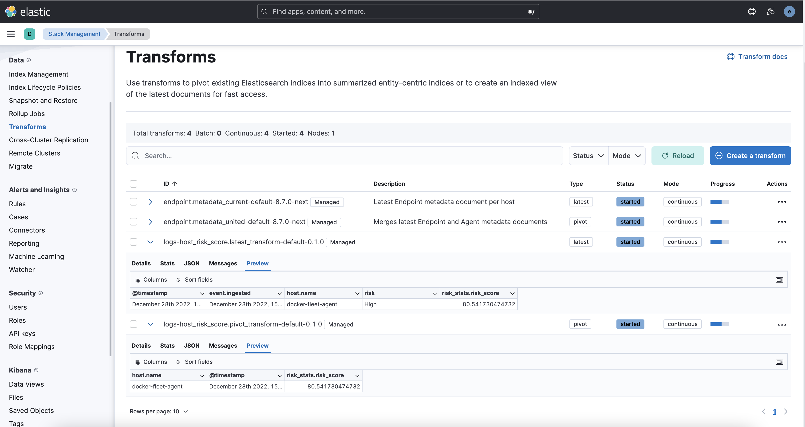

# Host Risk Score

The host risk score feature highlights risky hosts from within your environment. It utilizes a transform with a scripted metric aggregation to calculate host risk scores based on alerts that were generated within the past five days. The transform runs hourly to update the score as new alerts are generated.

Each rule’s contribution to the host risk score is based on the rule’s risk score (`signal.rule.risk_score`) and a time decay factor to reduce the impact of stale alerts. The risk score is calculated using a weighted sum where rules with higher time-corrected risk scores also have higher weights. Each host risk score is normalized to a scale of 0 to 100.

Specific host attributes can boost the final risk score. For example, alert activity on a server poses a greater risk than that on a laptop. Therefore, the host risk score is 1.5 times higher if the host is a server. This boosted score is finalized after calculating the weighted sum of the time-corrected risks.

## Installation

You can install the Host Risk Score package via **Management > Integrations > Host Risk Score**.

To inspect the installed assets, you can navigate to **Stack Management > Data > Transforms**.

Namely, the following transforms are installed with the Host Risk Score package:

| Transform name | Purpose | Source index | Destination index |
|---|---|---|---|
| host_risk_score.pivot_transform | Calculates the Host risk score | `.alerts-security.alerts-default` | `.alerts-security.host-risk-score-[version]` |
| host_risk_score.latest_transform | Surfaces the latest 5 days of the pivot transform results | `.alerts-security.host-risk-score.latest` | `.alerts-security.host-risk-score-latest-[version]` |

## Additional information

This package replicates the [Host Risk Score](https://www.elastic.co/guide/en/security/current/host-risk-score.html) functionality in the Security App's Entity Analytics dashboard.

The notable differences is that this Integration package:
* Only supports the default space, while [the other solution](https://www.elastic.co/guide/en/security/current/host-risk-score.html) supports other spaces.
* This integration package does not automatically surface the contents of the transforms' destination indices in the _Security App_.
