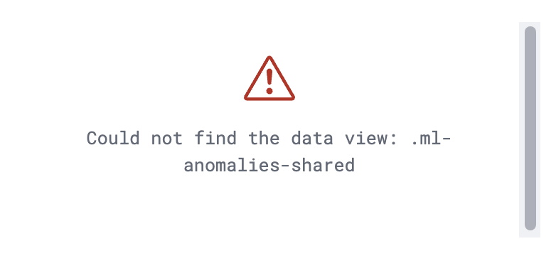

# Host Traffic Anomalies
The Host Traffic Anomalies package includes a dashboard that offers a high-level overview of Anomaly Detection alerts coming from our prebuilt ML security module, `Security: Host`.

## Installation
1. **Add the Integration Package**: Install the package via **Management > Integrations > Add Host Traffic Anomalies**.
1. **Start preconfigured anomaly detection jobs**: Go to **Machine Learning** -> Under **Anomaly Detection**, select **Jobs** -> Click **Create anomaly detection job button** -> Select your data view (ex: "logs-*") -> Select **Security: Host** -> Click **Create jobs**.
1. **Data view configuration for Dashboards**: For the dashboard to work as expected, the following settings need to be configured in Kibana. 
    1. You have started the above anomaly detection jobs.
    1. You have **read** access to `.ml-anomalies-shared` index or are assigned the `machine_learning_user` role. For more information on roles, please refer to [Built-in roles in Elastic](https://www.elastic.co/guide/en/elasticsearch/reference/current/built-in-roles.html). Please be aware that a user who has access to the underlying machine learning results indices can see the results of _all_ jobs in _all_ spaces. Be mindful of granting permissions if you use Kibana spaces to control which users can see which machine learning results. For more information on machine learning privileges, refer to [setup-privileges](https://www.elastic.co/guide/en/machine-learning/current/setup.html#setup-privileges).
    1. After enabling the jobs, go to **Management > Stack Management > Kibana > Data Views**.  Click on **Create data view** with the following settings:
        - Name: `.ml-anomalies-shared`
        - Index pattern : `.ml-anomalies-shared`
        - Select **Show Advanced settings** enable **Allow hidden and system indices**
        - Custom data view ID: `.ml-anomalies-shared`

    _**Warning**_: When creating the data views for the dashboards, ensure that the `Custom data view ID` is set to the value specified above and is not left empty. Omitting or misconfiguring this field may result in broken visualizations, as illustrated by the error message below.
    