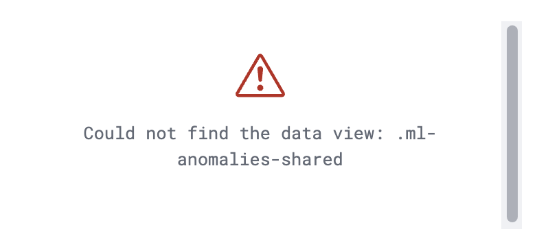

# Host Traffic Anomalies
The Host Traffic Anomalies package includes a dashboard that offers a high-level overview of Anomaly Detection alerts coming from our prebuilt ML security module, `Security: Host`.

## Installation
1. **Add the Integration Package**: Install the package via **Management > Integrations > Add Host Traffic Anomalies**.
1. **Start preconfigured anomaly detection jobs**: Go to **Machine Learning** -> Under **Anomaly Detection**, select **Jobs** -> Click **Create anomaly detection job button** -> Select your data view (ex: "logs-*") -> Select **Security: Host** -> Click **Create jobs**.
1. **Data view configuration for Dashboards**: For the dashboard to work as expected, the following settings need to be configured in Kibana. 
    1. You have started the above anomaly detection jobs.
    1. You have **read** access to `.ml-anomalies-shared` index or are assigned the `machine_learning_user` role. For more information on roles, please refer to [Built-in roles in Elastic](https://www.elastic.co/guide/en/elasticsearch/reference/current/built-in-roles.html). Please be aware that a user who has access to the underlying machine learning results indices can see the results of _all_ jobs in _all_ spaces. Be mindful of granting permissions if you use Kibana spaces to control which users can see which machine learning results. For more information on machine learning privileges, refer to [setup-privileges](https://www.elastic.co/guide/en/machine-learning/current/setup.html#setup-privileges).
    1. After enabling the jobs, go to **Management > Stack Management > Kibana > Data Views**.  Click on **Create data view** with the following settings:
        - Name: `.ml-anomalies-shared`
        - Index pattern : `.ml-anomalies-shared*`
        - Select **Show Advanced settings** enable **Allow hidden and system indices**
        - Custom data view ID: `.ml-anomalies-shared`

    _**Warning**_: When creating the data views for the dashboards, ensure that the `Custom data view ID` is set to the value specified above and is not left empty. Omitting or misconfiguring this field may result in broken visualizations, as illustrated by the error message below.
    

## v2.0.0 and beyond

v2.0.0 of the package introduces support for Entity Analytics (EA) in Elastic Stack version 9.4, adding new fields for proper entity resolution.

- The new ML jobs include an `_ea` suffix in their names, as outlined below. These jobs are available through the `Security: Host` module in Kibana. To install them, go to **Machine Learning** -> **Anomaly Detection** -> **Jobs** -> **Create anomaly detection job** -> select your data view -> select **Security: Host** -> **Create jobs**.
- Previously installed `Security: Host` ML jobs will continue to run, allowing time to transition to the new Entity Analytics jobs.
- We recommend installing the new ML jobs first and verifying that they are properly set up, collecting data, and generating anomalies before upgrading to the latest detection rules included in 9.4.
- A new dashboard is available in this version with the suffix "(Entity Analytics)" in the title. If you are still running jobs from before this version, the original dashboard without the suffix remains available.

The new Entity Analytics ML job IDs for this dashboard are:
- `high_count_events_for_a_host_name_ea`
- `low_count_events_for_a_host_name_ea`