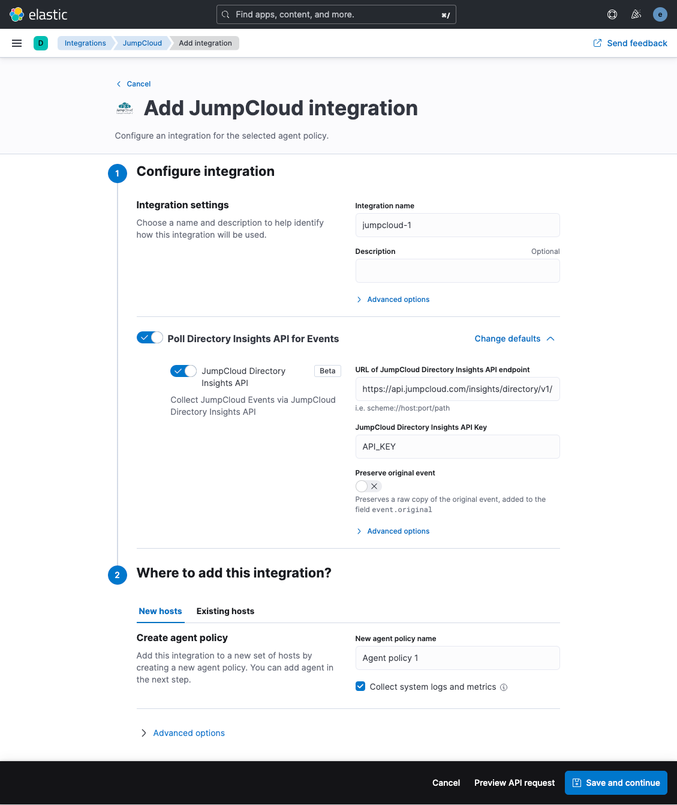

# JumpCloud

The JumpCloud integration allows you to monitor events related to the JumpCloud Directory as a Service via the Directory Insights API.

You can find out more about JumpCloud and JumpCloud Directory Insights [here](https://jumpcloud.com/platform/directory-insights)

## Data streams

A single data stream named "jumpcloud.events" is used by this integration.

## Requirements

An Elastic Stack with an Elastic Agent is a fundamental requirement.

An established JumpCloud tenancy with active users is the the other requirement. Basic Directory Insights API access is available to all subscription levels.

NOTE: The lowest level of subscription currently has retention limits, with access to Directory Insights events for the last 15 days at most. Other subscriptions levels provide 90 days or longer historical event access.

A JumpCloud API key is required, the JumpCloud documentation describing how to create one is [here](https://support.jumpcloud.com/s/article/jumpcloud-apis1)

This JumpCloud Directory Insights API is documented [here](https://docs.jumpcloud.com/api/insights/directory/1.0/index.html#section/Overview)

## Configuration

### JumpCloud API Key

Ensure you have created a JumpCloud admin API key that you have access to, refer to the link above which provides instructions how to create one.

### Enabling the integration in Elastic

1. In Kibana go to **Management > Integrations**
2. In "Search for integrations" search bar type **JumpCloud**
3. Click on "JumpCloud" integration from the search results.
4. Click on **Add JumpCloud** button to add the JumpCloud integration.
5. Configure the integration as appropriate
6. Assign the integration to a new Elastic Agent host, or an existing Elastic Agent host



## Events

The JumpCloud events dataset provides events from JumpCloud Directory Insights events that have been received.

All JumpCloud Directory Insights events are available in the `jumpcloud.events` field group.

**Exported fields**

| Field | Description | Type |
|---|---|---|
| @timestamp | Event timestamp. | date |
| data_stream.dataset | Data stream dataset. | constant_keyword |
| data_stream.namespace | Data stream namespace. | constant_keyword |
| data_stream.type | Data stream type. | constant_keyword |
| input.type |  | keyword |
| jumpcloud.event.application.display_label |  | keyword |
| jumpcloud.event.application.display_name |  | keyword |
| jumpcloud.event.application.id |  | keyword |
| jumpcloud.event.application.name |  | keyword |
| jumpcloud.event.application.package_manager |  | keyword |
| jumpcloud.event.application.sso_type |  | keyword |
| jumpcloud.event.application.sso_url |  | keyword |
| jumpcloud.event.association.action_source |  | keyword |
| jumpcloud.event.association.connection.from.name |  | keyword |
| jumpcloud.event.association.connection.from.object_id |  | keyword |
| jumpcloud.event.association.connection.from.type |  | keyword |
| jumpcloud.event.association.connection.to.name |  | keyword |
| jumpcloud.event.association.connection.to.object_id |  | keyword |
| jumpcloud.event.association.connection.to.type |  | keyword |
| jumpcloud.event.association.op |  | keyword |
| jumpcloud.event.attr |  | keyword |
| jumpcloud.event.auth_context.auth_methods.duo.success |  | boolean |
| jumpcloud.event.auth_context.auth_methods.jumpcloud_go.success |  | boolean |
| jumpcloud.event.auth_context.auth_methods.jumpcloud_go_uv.success |  | boolean |
| jumpcloud.event.auth_context.auth_methods.jumpcloud_protect.success |  | boolean |
| jumpcloud.event.auth_context.auth_methods.password.success |  | boolean |
| jumpcloud.event.auth_context.auth_methods.totp.success |  | boolean |
| jumpcloud.event.auth_context.auth_methods.webauthn.success |  | boolean |
| jumpcloud.event.auth_context.jumpcloud_protect_device.app_version |  | keyword |
| jumpcloud.event.auth_context.jumpcloud_protect_device.geoip.continent_code |  | keyword |
| jumpcloud.event.auth_context.jumpcloud_protect_device.geoip.country_code |  | keyword |
| jumpcloud.event.auth_context.jumpcloud_protect_device.geoip.latitude |  | float |
| jumpcloud.event.auth_context.jumpcloud_protect_device.geoip.longitude |  | float |
| jumpcloud.event.auth_context.jumpcloud_protect_device.geoip.region_code |  | keyword |
| jumpcloud.event.auth_context.jumpcloud_protect_device.geoip.region_name |  | keyword |
| jumpcloud.event.auth_context.jumpcloud_protect_device.geoip.timezone |  | keyword |
| jumpcloud.event.auth_context.jumpcloud_protect_device.id |  | keyword |
| jumpcloud.event.auth_context.jumpcloud_protect_device.ip |  | keyword |
| jumpcloud.event.auth_context.jumpcloud_protect_device.make |  | keyword |
| jumpcloud.event.auth_context.jumpcloud_protect_device.model |  | keyword |
| jumpcloud.event.auth_context.jumpcloud_protect_device.os |  | keyword |
| jumpcloud.event.auth_context.jumpcloud_protect_device.os_version |  | keyword |
| jumpcloud.event.auth_context.jumpcloud_protect_device.user_id |  | keyword |
| jumpcloud.event.auth_context.jumpcloud_protect_device.username |  | keyword |
| jumpcloud.event.auth_context.policies_applied.id |  | keyword |
| jumpcloud.event.auth_context.policies_applied.metadata.action |  | keyword |
| jumpcloud.event.auth_context.policies_applied.metadata.resource_type |  | keyword |
| jumpcloud.event.auth_context.policies_applied.name |  | keyword |
| jumpcloud.event.auth_context.system.displayName |  | keyword |
| jumpcloud.event.auth_context.system.hostname |  | keyword |
| jumpcloud.event.auth_context.system.id |  | keyword |
| jumpcloud.event.auth_context.system.os |  | keyword |
| jumpcloud.event.auth_context.system.version |  | keyword |
| jumpcloud.event.auth_meta.auth_methods.password.success |  | boolean |
| jumpcloud.event.auth_method |  | keyword |
| jumpcloud.event.available_os_updates.allows_install_later |  | boolean |
| jumpcloud.event.available_os_updates.download_size |  | long |
| jumpcloud.event.available_os_updates.human_readable_name |  | keyword |
| jumpcloud.event.available_os_updates.human_readable_name_locale |  | keyword |
| jumpcloud.event.available_os_updates.install_size |  | long |
| jumpcloud.event.available_os_updates.is_config_data_update |  | boolean |
| jumpcloud.event.available_os_updates.is_critical |  | boolean |
| jumpcloud.event.available_os_updates.is_firmware_update |  | boolean |
| jumpcloud.event.available_os_updates.is_major_os_update |  | boolean |
| jumpcloud.event.available_os_updates.metadata_url |  | keyword |
| jumpcloud.event.available_os_updates.product_key |  | keyword |
| jumpcloud.event.available_os_updates.requires_bootstrap_token |  | boolean |
| jumpcloud.event.available_os_updates.restart_required |  | boolean |
| jumpcloud.event.available_os_updates.version |  | keyword |
| jumpcloud.event.base |  | keyword |
| jumpcloud.event.changes |  | flattened |
| jumpcloud.event.client_ip |  | keyword |
| jumpcloud.event.command.force |  | boolean |
| jumpcloud.event.command.items |  | keyword |
| jumpcloud.event.command.managed_apps_only |  | boolean |
| jumpcloud.event.command.payload |  | keyword |
| jumpcloud.event.command.queries |  | keyword |
| jumpcloud.event.command.request_type |  | keyword |
| jumpcloud.event.command_uuid |  | keyword |
| jumpcloud.event.connection_id |  | keyword |
| jumpcloud.event.deref |  | long |
| jumpcloud.event.dn |  | keyword |
| jumpcloud.event.error_code |  | long |
| jumpcloud.event.error_message |  | keyword |
| jumpcloud.event.event_type |  | keyword |
| jumpcloud.event.filter |  | keyword |
| jumpcloud.event.geoip.continent_code |  | keyword |
| jumpcloud.event.geoip.country_code |  | keyword |
| jumpcloud.event.geoip.latitude |  | float |
| jumpcloud.event.geoip.longitude |  | float |
| jumpcloud.event.geoip.region_code |  | keyword |
| jumpcloud.event.geoip.region_name |  | keyword |
| jumpcloud.event.geoip.timezone |  | keyword |
| jumpcloud.event.id |  | keyword |
| jumpcloud.event.idp_initiated |  | boolean |
| jumpcloud.event.initiated_by.administrator |  | boolean |
| jumpcloud.event.initiated_by.email |  | keyword |
| jumpcloud.event.initiated_by.id |  | keyword |
| jumpcloud.event.initiated_by.type |  | keyword |
| jumpcloud.event.initiated_by.username |  | keyword |
| jumpcloud.event.mdm_device_id |  | keyword |
| jumpcloud.event.mdm_device_manager_id |  | keyword |
| jumpcloud.event.mdm_type |  | keyword |
| jumpcloud.event.mech |  | keyword |
| jumpcloud.event.message |  | keyword |
| jumpcloud.event.mfa |  | boolean |
| jumpcloud.event.mfa_meta.type |  | keyword |
| jumpcloud.event.number_of_results |  | long |
| jumpcloud.event.operation_number |  | long |
| jumpcloud.event.operation_type |  | keyword |
| jumpcloud.event.organization |  | keyword |
| jumpcloud.event.os_meta_family |  | keyword |
| jumpcloud.event.previous_state |  | keyword |
| jumpcloud.event.process_name |  | keyword |
| jumpcloud.event.profile_list.has_removal_passcode |  | boolean |
| jumpcloud.event.profile_list.is_encrypted |  | boolean |
| jumpcloud.event.profile_list.is_managed |  | boolean |
| jumpcloud.event.profile_list.payload_content.payload_description |  | keyword |
| jumpcloud.event.profile_list.payload_content.payload_display_name |  | keyword |
| jumpcloud.event.profile_list.payload_content.payload_identifier |  | keyword |
| jumpcloud.event.profile_list.payload_content.payload_organization |  | keyword |
| jumpcloud.event.profile_list.payload_content.payload_type |  | keyword |
| jumpcloud.event.profile_list.payload_content.payload_uuid |  | keyword |
| jumpcloud.event.profile_list.payload_content.payload_version |  | float |
| jumpcloud.event.profile_list.payload_description |  | keyword |
| jumpcloud.event.profile_list.payload_display_name |  | keyword |
| jumpcloud.event.profile_list.payload_identifier |  | keyword |
| jumpcloud.event.profile_list.payload_organization |  | keyword |
| jumpcloud.event.profile_list.payload_removal_disallowed |  | boolean |
| jumpcloud.event.profile_list.payload_uuid |  | keyword |
| jumpcloud.event.profile_list.payload_verion |  | float |
| jumpcloud.event.profile_list.payload_version |  | float |
| jumpcloud.event.profile_list.signer_certificates |  | keyword |
| jumpcloud.event.provider |  | keyword |
| jumpcloud.event.query_responses.available_device_capacity |  | long |
| jumpcloud.event.query_responses.device_capacity |  | long |
| jumpcloud.event.query_responses.device_name |  | keyword |
| jumpcloud.event.query_responses.is_supervised |  | boolean |
| jumpcloud.event.query_responses.model_name |  | keyword |
| jumpcloud.event.query_responses.os_version |  | keyword |
| jumpcloud.event.query_responses.product_name |  | keyword |
| jumpcloud.event.query_responses.wifi_mac |  | keyword |
| jumpcloud.event.repeat_count |  | long |
| jumpcloud.event.request_type |  | keyword |
| jumpcloud.event.resource.application_type |  | keyword |
| jumpcloud.event.resource.displayLabel |  | keyword |
| jumpcloud.event.resource.displayName |  | keyword |
| jumpcloud.event.resource.display_name |  | keyword |
| jumpcloud.event.resource.email_type |  | keyword |
| jumpcloud.event.resource.enterprise_id |  | keyword |
| jumpcloud.event.resource.hostname |  | keyword |
| jumpcloud.event.resource.id |  | keyword |
| jumpcloud.event.resource.install_type |  | keyword |
| jumpcloud.event.resource.name |  | keyword |
| jumpcloud.event.resource.package_manager |  | keyword |
| jumpcloud.event.resource.policy_id |  | keyword |
| jumpcloud.event.resource.policy_name |  | keyword |
| jumpcloud.event.resource.policy_template_id |  | keyword |
| jumpcloud.event.resource.policy_template_name |  | keyword |
| jumpcloud.event.resource.recipient_email |  | keyword |
| jumpcloud.event.resource.runtime_permissions |  | keyword |
| jumpcloud.event.resource.type |  | keyword |
| jumpcloud.event.resource.update_mode |  | keyword |
| jumpcloud.event.resource.username |  | keyword |
| jumpcloud.event.scan_initiated |  | boolean |
| jumpcloud.event.scope |  | long |
| jumpcloud.event.security_info.management_status.enrolled_via_dep |  | boolean |
| jumpcloud.event.security_info.management_status.is_activation_lock_manageable |  | boolean |
| jumpcloud.event.security_info.management_status.is_user_enrollment |  | boolean |
| jumpcloud.event.security_info.management_status.user_approved_enrollment |  | boolean |
| jumpcloud.event.security_info.secure_boot.secure_boot_level |  | keyword |
| jumpcloud.event.service |  | keyword |
| jumpcloud.event.src_ip |  | keyword |
| jumpcloud.event.sso_token_success |  | boolean |
| jumpcloud.event.start_tls |  | boolean |
| jumpcloud.event.state |  | keyword |
| jumpcloud.event.status |  | keyword |
| jumpcloud.event.success |  | boolean |
| jumpcloud.event.system.displayName |  | keyword |
| jumpcloud.event.system.hostname |  | keyword |
| jumpcloud.event.system.id |  | keyword |
| jumpcloud.event.system_timestamp |  | keyword |
| jumpcloud.event.target_resource.type |  | keyword |
| jumpcloud.event.timestamp |  | keyword |
| jumpcloud.event.tls_established |  | boolean |
| jumpcloud.event.useragent.device |  | keyword |
| jumpcloud.event.useragent.major |  | keyword |
| jumpcloud.event.useragent.minor |  | keyword |
| jumpcloud.event.useragent.name |  | keyword |
| jumpcloud.event.useragent.os |  | keyword |
| jumpcloud.event.useragent.os_full |  | keyword |
| jumpcloud.event.useragent.os_major |  | keyword |
| jumpcloud.event.useragent.os_minor |  | keyword |
| jumpcloud.event.useragent.os_name |  | keyword |
| jumpcloud.event.useragent.os_patch |  | keyword |
| jumpcloud.event.useragent.os_version |  | keyword |
| jumpcloud.event.useragent.patch |  | keyword |
| jumpcloud.event.useragent.version |  | keyword |
| jumpcloud.event.username |  | keyword |
| jumpcloud.event.version |  | keyword |


An example event for `events` looks as following:

```json
{
    "@timestamp": "2023-01-14T08:16:06.495Z",
    "agent": {
        "ephemeral_id": "e2d0afd0-0975-4fa9-9aba-651f43f2d8d4",
        "id": "bac6d975-c0ec-4381-aeef-e1316762e2e5",
        "name": "elastic-agent-32306",
        "type": "filebeat",
        "version": "8.13.0"
    },
    "client": {
        "geo": {
            "city_name": "London",
            "continent_name": "Europe",
            "country_iso_code": "GB",
            "country_name": "United Kingdom",
            "location": {
                "lat": 51.5142,
                "lon": -0.0931
            },
            "region_iso_code": "GB-ENG",
            "region_name": "England"
        },
        "ip": "81.2.69.144"
    },
    "data_stream": {
        "dataset": "jumpcloud.events",
        "namespace": "38185",
        "type": "logs"
    },
    "ecs": {
        "version": "8.11.0"
    },
    "elastic_agent": {
        "id": "bac6d975-c0ec-4381-aeef-e1316762e2e5",
        "snapshot": false,
        "version": "8.13.0"
    },
    "event": {
        "action": "admin_login_attempt",
        "agent_id_status": "verified",
        "category": [
            "authentication"
        ],
        "created": "2025-09-19T10:07:32.322Z",
        "dataset": "jumpcloud.events",
        "id": "63c264c6c1bd55c1b7e901a4",
        "ingested": "2025-09-19T10:07:35Z",
        "module": "directory",
        "original": "{\"@version\":\"1\",\"changes\":[{\"field\":\"active\",\"to\":true},{\"field\":\"displayName\",\"to\":\"Willy Wonka\"},{\"field\":\"emails\",\"to\":[{\"primary\":true,\"type\":\"work\",\"value\":\"w.wonka@chocolate.biz\"}]},{\"field\":\"externalId\",\"to\":\"63ec9bba89a64e507ce0a4c2\"},{\"field\":\"schemas\",\"to\":[\"urn:ietf:params:scim:schemas:core:2.0:User\",\"urn:ietf:params:scim:schemas:extension:enterprise:2.0:User\"]}],\"client_ip\":\"81.2.69.144\",\"event_type\":\"admin_login_attempt\",\"geoip\":{\"continent_code\":\"OC\",\"country_code\":\"AU\",\"latitude\":-27.658,\"longitude\":152.8915,\"region_code\":\"QLD\",\"region_name\":\"Queensland\",\"timezone\":\"Australia/Brisbane\"},\"id\":\"63c264c6c1bd55c1b7e901a4\",\"initiated_by\":{\"email\":\"user.name@sub.domain.tld\",\"id\":\"123456789abcdef123456789\",\"type\":\"admin\"},\"mfa\":true,\"organization\":\"1234abcdef123456789abcde\",\"provider\":null,\"service\":\"directory\",\"success\":true,\"timestamp\":\"2023-01-14T08:16:06.495Z\",\"useragent\":{\"device\":\"Mac\",\"major\":\"109\",\"minor\":\"0\",\"name\":\"Chrome\",\"os\":\"Mac OS X\",\"os_full\":\"Mac OS X 10.15.7\",\"os_major\":\"10\",\"os_minor\":\"15\",\"os_name\":\"Mac OS X\",\"os_patch\":\"7\",\"os_version\":\"10.15.7\",\"patch\":\"0\",\"version\":\"109.0.0.0\"}}",
        "outcome": "success",
        "type": [
            "info"
        ]
    },
    "input": {
        "type": "httpjson"
    },
    "jumpcloud": {
        "event": {
            "changes": [
                {
                    "field": "active",
                    "to": true
                },
                {
                    "field": "displayName",
                    "to": "Willy Wonka"
                },
                {
                    "field": "emails",
                    "to": [
                        {
                            "primary": true,
                            "type": "work",
                            "value": "w.wonka@chocolate.biz"
                        }
                    ]
                },
                {
                    "field": "externalId",
                    "to": "63ec9bba89a64e507ce0a4c2"
                },
                {
                    "field": "schemas",
                    "to": [
                        "urn:ietf:params:scim:schemas:core:2.0:User",
                        "urn:ietf:params:scim:schemas:extension:enterprise:2.0:User"
                    ]
                }
            ],
            "client_ip": "81.2.69.144",
            "event_type": "admin_login_attempt",
            "geoip": {
                "continent_code": "OC",
                "country_code": "AU",
                "latitude": -27.658,
                "longitude": 152.8915,
                "region_code": "QLD",
                "region_name": "Queensland",
                "timezone": "Australia/Brisbane"
            },
            "id": "63c264c6c1bd55c1b7e901a4",
            "initiated_by": {
                "email": "user.name@sub.domain.tld",
                "id": "123456789abcdef123456789",
                "type": "admin"
            },
            "mfa": true,
            "organization": "1234abcdef123456789abcde",
            "service": "directory",
            "success": true,
            "timestamp": "2023-01-14T08:16:06.495Z",
            "useragent": {
                "device": "Mac",
                "major": "109",
                "minor": "0",
                "name": "Chrome",
                "os": "Mac OS X",
                "os_full": "Mac OS X 10.15.7",
                "os_major": "10",
                "os_minor": "15",
                "os_name": "Mac OS X",
                "os_patch": "7",
                "os_version": "10.15.7",
                "patch": "0",
                "version": "109.0.0.0"
            },
            "version": "1"
        }
    },
    "source": {
        "user": {
            "email": "user.name@sub.domain.tld",
            "id": "123456789abcdef123456789"
        }
    },
    "tags": [
        "preserve_original_event",
        "preserve_duplicate_custom_fields",
        "forwarded"
    ],
    "user_agent": {
        "device": {
            "name": "Mac"
        },
        "name": "Chrome",
        "os": {
            "full": "Mac OS X 10.15.7",
            "name": "Mac OS X",
            "version": "10.15.7"
        },
        "version": "109.0.0.0"
    }
}
```
