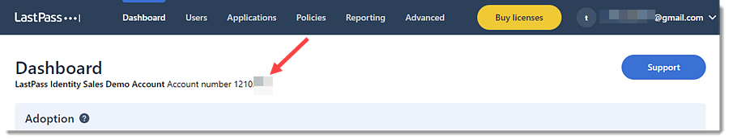
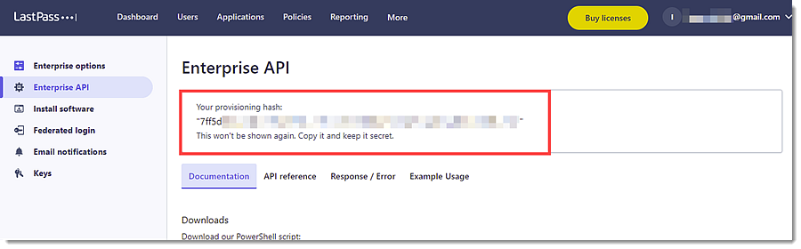

# LastPass

## Overview

The [LastPass](https://www.lastpass.com/) integration allows users to monitor Detailed Shared Folder Data, User Data, and Event Report Logs. LastPass is a cloud-based password manager that stores users' login information online in a secure database and allows users to generate unique passwords for each site they visit. In addition, LastPass stores all users' passwords and enables them to log into their accounts with ease. It’s available on all major platforms, including mobile devices, computers, and browser extensions.

## Data streams

The LastPass integration collects logs for three types of events: Detailed Shared Folder Data, User Data, and Event Report.

**Detailed Shared Folder Data** is used to get a detailed list of all shared folders, the sites within them, and the permissions granted to them. See more details in the doc [here](https://support.lastpass.com/help/get-detailed-shared-folder-data-via-lastpass-api).

**User Data** is used to get account details about the user. See more details in the doc [here](https://support.lastpass.com/help/get-user-data-via-lastpass-api).

**Event Report** is used to gather information about events that have taken place in the user's LastPass Business account. See more details in the doc [here](https://support.lastpass.com/help/event-reporting-via-lastpass-api).

## Requirements

Elasticsearch is needed to store and search data, and Kibana is needed for visualizing and managing it. You can use our hosted Elasticsearch Service on Elastic Cloud, which is recommended, or self-manage the Elastic Stack on your hardware.

  - **NOTE**
    - A **business account** is required to use the LastPass integration.
    - The LastPass **Provisioning API** does not support **managing groups for pre-configured SSO (Cloud) apps** for LastPass Business accounts.

## Setup

### To collect data from the LastPass REST APIs, follow the below steps:

1. Log in with the user's **email address** and **master password** to access the [Admin Console](https://admin.lastpass.com).
2. If prompted, complete the steps for **multifactor authentication** (if it is enabled for the user account).
3. To get an **Account Number(CID)**, follow the below steps:
  - On the **Dashboard** tab, the **Account Number(CID)** is located at the top of the page. it is preceded by the words **Account number**.
  
4. To create a **Provisioning Hash**, follow the below steps:
  - Go to **Advanced** -> **Enterprise API**.
  - Choose from the following options:
    - If the user has not previously created a provisioning hash, click **Create provisioning hash** -> **OK**, then the provisioning hash is shown at the top of the page.
    - If the user previously created a provisioning hash but has since forgotten it, the user can generate a new one.
    - **NOTE**: If the user has already created a provisioning hash, then generating a new one will invalidate the previous hash, and will require updating all integrations with the newly generated hash.
    - To proceed with creating a new provisioning hash, click **Reset your provisioning hash** -> **OK**, then a new provisioning hash is shown at the top of the page.
    

## Logs reference

### detailed_shared_folder

This is the `detailed_shared_folder` dataset.

#### Example

An example event for `detailed_shared_folder` looks as following:

```json
{
    "@timestamp": "2024-05-24T11:28:38.242Z",
    "agent": {
        "ephemeral_id": "4a4388c0-12ab-4c2c-910c-c912f6bd4730",
        "id": "b0183e4b-ecd8-4ee9-8e73-bb43ce3ddcf2",
        "name": "docker-fleet-agent",
        "type": "filebeat",
        "version": "8.12.2"
    },
    "data_stream": {
        "dataset": "lastpass.detailed_shared_folder",
        "namespace": "ep",
        "type": "logs"
    },
    "ecs": {
        "version": "8.11.0"
    },
    "elastic_agent": {
        "id": "b0183e4b-ecd8-4ee9-8e73-bb43ce3ddcf2",
        "snapshot": false,
        "version": "8.12.2"
    },
    "event": {
        "agent_id_status": "verified",
        "created": "2024-05-24T11:28:38.242Z",
        "dataset": "lastpass.detailed_shared_folder",
        "ingested": "2024-05-24T11:28:50Z",
        "kind": "state",
        "original": "{\"id\":\"101\",\"score\":99,\"sharedfoldername\":\"ThisSFName\",\"users\":{\"can_administer\":true,\"give\":false,\"readonly\":true,\"sites\":[\"aaa.com\",\"bbb.com\"],\"username\":\"joe.user@lastpass.com\"}}",
        "type": [
            "info"
        ]
    },
    "input": {
        "type": "httpjson"
    },
    "lastpass": {
        "detailed_shared_folder": {
            "name": "ThisSFName",
            "score": 99,
            "shared_folder": {
                "id": "101"
            },
            "user": {
                "can_administer": true,
                "give": false,
                "name": "joe.user@lastpass.com",
                "read_only": true,
                "site": [
                    "aaa.com",
                    "bbb.com"
                ]
            }
        }
    },
    "related": {
        "user": [
            "joe.user@lastpass.com"
        ]
    },
    "tags": [
        "preserve_original_event",
        "preserve_duplicate_custom_fields",
        "forwarded",
        "lastpass-detailed_shared_folder"
    ],
    "user": {
        "email": "joe.user@lastpass.com"
    }
}
```

**Exported fields**

| Field | Description | Type |
|---|---|---|
| @timestamp | Event timestamp. | date |
| cloud.image.id | Image ID for the cloud instance. | keyword |
| data_stream.dataset | Data stream dataset. | constant_keyword |
| data_stream.namespace | Data stream namespace. | constant_keyword |
| data_stream.type | Data stream type. | constant_keyword |
| event.dataset | Event dataset. | constant_keyword |
| event.module | Event module. | constant_keyword |
| host.containerized | If the host is a container. | boolean |
| host.os.build | OS build information. | keyword |
| host.os.codename | OS codename, if any. | keyword |
| input.type | Input type | keyword |
| lastpass.detailed_shared_folder.deleted |  | boolean |
| lastpass.detailed_shared_folder.name |  | keyword |
| lastpass.detailed_shared_folder.score |  | double |
| lastpass.detailed_shared_folder.shared_folder.id |  | keyword |
| lastpass.detailed_shared_folder.user.can_administer |  | boolean |
| lastpass.detailed_shared_folder.user.give |  | boolean |
| lastpass.detailed_shared_folder.user.name |  | keyword |
| lastpass.detailed_shared_folder.user.read_only |  | boolean |
| lastpass.detailed_shared_folder.user.site |  | keyword |
| lastpass.detailed_shared_folder.user.super_admin |  | boolean |
| log.offset | Log offset | long |


### event_report

This is the `event_report` dataset.

#### Example

An example event for `event_report` looks as following:

```json
{
    "@timestamp": "2015-07-17T09:51:51.000Z",
    "agent": {
        "ephemeral_id": "9ece9bbd-9d6c-4204-bd9f-3182e1a55f27",
        "id": "02365282-f602-4b79-beec-adb210ac6467",
        "name": "docker-fleet-agent",
        "type": "filebeat",
        "version": "8.7.1"
    },
    "data_stream": {
        "dataset": "lastpass.event_report",
        "namespace": "ep",
        "type": "logs"
    },
    "ecs": {
        "version": "8.11.0"
    },
    "elastic_agent": {
        "id": "02365282-f602-4b79-beec-adb210ac6467",
        "snapshot": false,
        "version": "8.7.1"
    },
    "event": {
        "action": "failed login attempt",
        "agent_id_status": "verified",
        "category": [
            "authentication"
        ],
        "created": "2023-08-14T22:51:42.186Z",
        "dataset": "lastpass.event_report",
        "ingested": "2023-08-14T22:51:43Z",
        "kind": "event",
        "original": "{\"Action\":\"Failed Login Attempt\",\"Data\":\"\",\"IP_Address\":\"10.16.21.21\",\"Time\":\"2015-07-17 09:51:51\",\"Username\":\"j.user@example.com\",\"id\":\"Event1\"}",
        "outcome": "failure",
        "timezone": "UTC",
        "type": [
            "start"
        ]
    },
    "input": {
        "type": "httpjson"
    },
    "lastpass": {
        "event_report": {
            "action": "Failed Login Attempt",
            "ip": "10.16.21.21",
            "time": "2015-07-17T09:51:51.000Z",
            "user_name": "j.user@example.com"
        }
    },
    "related": {
        "ip": [
            "10.16.21.21"
        ],
        "user": [
            "j.user@example.com"
        ]
    },
    "source": {
        "ip": "10.16.21.21"
    },
    "tags": [
        "preserve_original_event",
        "preserve_duplicate_custom_fields",
        "forwarded",
        "lastpass-event_report"
    ],
    "user": {
        "email": [
            "j.user@example.com"
        ]
    }
}

```

**Exported fields**

| Field | Description | Type |
|---|---|---|
| @timestamp | Event timestamp. | date |
| cloud.image.id | Image ID for the cloud instance. | keyword |
| data_stream.dataset | Data stream dataset. | constant_keyword |
| data_stream.namespace | Data stream namespace. | constant_keyword |
| data_stream.type | Data stream type. | constant_keyword |
| event.dataset | Event dataset. | constant_keyword |
| event.module | Event module. | constant_keyword |
| host.containerized | If the host is a container. | boolean |
| host.os.build | OS build information. | keyword |
| host.os.codename | OS codename, if any. | keyword |
| input.type | Input type | keyword |
| lastpass.event_report.action |  | keyword |
| lastpass.event_report.data.added_site |  | keyword |
| lastpass.event_report.data.deleted_site |  | keyword |
| lastpass.event_report.data.failed_login |  | keyword |
| lastpass.event_report.data.group_name |  | keyword |
| lastpass.event_report.data.login_site |  | keyword |
| lastpass.event_report.data.original |  | text |
| lastpass.event_report.data.renamed_shared_folder_name |  | keyword |
| lastpass.event_report.data.saml_login |  | keyword |
| lastpass.event_report.data.secure_note |  | keyword |
| lastpass.event_report.data.shared_folder_name |  | keyword |
| lastpass.event_report.data.shared_folder_user_permissions.admin |  | keyword |
| lastpass.event_report.data.shared_folder_user_permissions.hide_password |  | keyword |
| lastpass.event_report.data.shared_folder_user_permissions.read_only |  | keyword |
| lastpass.event_report.data.site |  | keyword |
| lastpass.event_report.data.user_email |  | keyword |
| lastpass.event_report.ip |  | ip |
| lastpass.event_report.time |  | date |
| lastpass.event_report.user_name |  | keyword |
| log.offset | Log offset | long |


### user

This is the `user` dataset.

#### Example

An example event for `user` looks as following:

```json
{
    "@timestamp": "2023-07-24T13:40:43.764Z",
    "agent": {
        "ephemeral_id": "7022fcec-d213-4320-8c7d-663b20b9d82c",
        "id": "e4c29d91-bbb7-42b8-80fd-85ddb56d2300",
        "name": "docker-fleet-agent",
        "type": "filebeat",
        "version": "8.8.2"
    },
    "data_stream": {
        "dataset": "lastpass.user",
        "namespace": "ep",
        "type": "logs"
    },
    "ecs": {
        "version": "8.11.0"
    },
    "elastic_agent": {
        "id": "e4c29d91-bbb7-42b8-80fd-85ddb56d2300",
        "snapshot": false,
        "version": "8.8.2"
    },
    "event": {
        "agent_id_status": "verified",
        "category": [
            "iam"
        ],
        "created": "2023-07-24T13:40:43.764Z",
        "dataset": "lastpass.user",
        "ingested": "2023-07-24T13:40:46Z",
        "kind": "state",
        "original": "{\"admin\":false,\"applications\":0,\"attachments\":1,\"created\":\"2014-03-12 10:02:56\",\"disabled\":false,\"formfills\":2,\"fullname\":\"Ned Flanders\",\"groups\":[\"Domain Admins\",\"Dev Team\",\"Support Team\"],\"id\":\"101\",\"last_login\":\"2015-05-29 11:45:05\",\"last_pw_change\":\"2015-05-19 10:58:33\",\"linked\":\"personal.account@mydomain.com\",\"mpstrength\":\"100\",\"neverloggedin\":false,\"notes\":19,\"password_reset_required\":false,\"sites\":72,\"username\":\"user1@lastpass.com\"}",
        "type": [
            "user"
        ]
    },
    "input": {
        "type": "httpjson"
    },
    "lastpass": {
        "user": {
            "application": 0,
            "attachment": 1,
            "created": "2014-03-12T10:02:56.000Z",
            "disabled": false,
            "form_fill": 2,
            "full_name": "Ned Flanders",
            "group": [
                "Domain Admins",
                "Dev Team",
                "Support Team"
            ],
            "id": "101",
            "last_login": "2015-05-29T11:45:05.000Z",
            "last_password_change": "2015-05-19T10:58:33.000Z",
            "linked": "personal.account@mydomain.com",
            "master_password_strength": 100,
            "never_logged_in": false,
            "note": 19,
            "password_reset_required": false,
            "sites": 72,
            "user_name": "user1@lastpass.com"
        }
    },
    "related": {
        "user": [
            "user1@lastpass.com",
            "Ned Flanders"
        ]
    },
    "tags": [
        "preserve_original_event",
        "preserve_duplicate_custom_fields",
        "forwarded",
        "lastpass-user"
    ],
    "user": {
        "email": "user1@lastpass.com",
        "full_name": "Ned Flanders",
        "group": {
            "name": [
                "Domain Admins",
                "Dev Team",
                "Support Team"
            ]
        },
        "id": "101"
    }
}

```

**Exported fields**

| Field | Description | Type |
|---|---|---|
| @timestamp | Event timestamp. | date |
| cloud.image.id | Image ID for the cloud instance. | keyword |
| data_stream.dataset | Data stream dataset. | constant_keyword |
| data_stream.namespace | Data stream namespace. | constant_keyword |
| data_stream.type | Data stream type. | constant_keyword |
| event.dataset | Event dataset. | constant_keyword |
| event.module | Event module. | constant_keyword |
| host.containerized | If the host is a container. | boolean |
| host.os.build | OS build information. | keyword |
| host.os.codename | OS codename, if any. | keyword |
| input.type | Input type | keyword |
| lastpass.user.application |  | long |
| lastpass.user.attachment |  | long |
| lastpass.user.created |  | date |
| lastpass.user.disabled |  | boolean |
| lastpass.user.duo.user_name |  | keyword |
| lastpass.user.form_fill |  | long |
| lastpass.user.full_name |  | keyword |
| lastpass.user.group |  | keyword |
| lastpass.user.id |  | keyword |
| lastpass.user.last_login |  | date |
| lastpass.user.last_password_change |  | date |
| lastpass.user.linked |  | keyword |
| lastpass.user.master_password_strength |  | long |
| lastpass.user.never_logged_in |  | boolean |
| lastpass.user.note |  | long |
| lastpass.user.password_reset_required |  | boolean |
| lastpass.user.sites |  | long |
| lastpass.user.total_score |  | double |
| lastpass.user.user_name |  | keyword |
| log.offset | Log offset | long |

