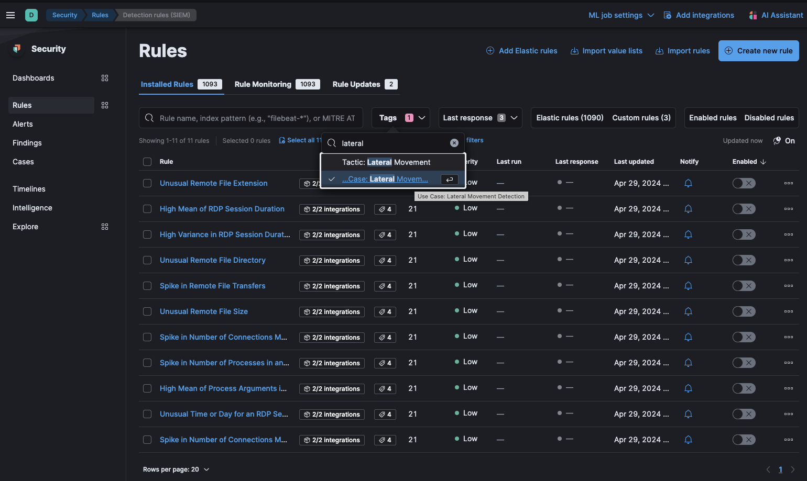

# Lateral Movement Detection Model

The Lateral movement detection model package contains assets that detect lateral movement based on file transfer activity and Windows RDP events. This package requires a Platinum subscription. Please ensure that you have a Trial, Platinum, or Enterprise subscription before proceeding. This package is licensed under [Elastic License 2.0](https://www.elastic.co/licensing/elastic-license).

For more detailed information refer to the following blogs:
- [Detecting Lateral Movement activity: A new Kibana integration](https://www.elastic.co/blog/detecting-lateral-movement-activity-a-new-kibana-integration)
- [Identifying malicious Remote Desktop Protocol (RDP) connections with Elastic Security](https://www.elastic.co/blog/remote-desktop-protocol-connections-elastic-security)

## Installation

1. **Upgrading**: If upgrading from a version below v2.0.0, see the section v2.0.0 and beyond.
1. **Add the Integration Package**: Install the package via **Management > Integrations > Add Lateral Movement Detection**. Configure the integration name and agent policy. Click **Save and Continue**.
1. **Check the health of the transform**: The transform is scheduled to run every hour. This transform creates the index `ml-rdp-lmd`. To check the health of the transform go to **Management > Stack Management > Data > Transforms** under `logs-lmd.pivot_transform-default-<FLEET-TRANSFORM-VERSION>`.
1. **Create data views for anomaly detection jobs**: The anomaly detection jobs under this package rely on two indices. One has file transfer events (`logs-*`), and the other index (`ml-rdp-lmd`) collects RDP session information from a transform. Before enabling the anomaly detection jobs, create a data view with both index patterns.
    1. Go to **Stack Management > Kibana > Data Views** and click **Create data view**.
    1. Enter the name of your respective index patterns in the **Index pattern** box, i.e., `logs-*, ml-rdp-lmd`, and copy the same in the **Name** field.
    1. Select `@timestamp` under the **Timestamp** field and click on **Save data view to Kibana**.
    1. Use the new data view (`logs-*, ml-rdp-lmd`) to create anomaly detection jobs for this package.
1. **Add preconfigured anomaly detection jobs**: In **Machine Learning > Anomaly Detection**, when you create a job, you should see an option to `Use preconfigured jobs` with a card for **Lateral Movement Detection**. When you select the card, you will see pre-configured anomaly detection jobs that you can enable depending on what makes the most sense for your environment. **_Note_**: In the Machine Learning app, these configurations are available only when data exists that matches the query specified in the [lmd-ml file](https://github.com/elastic/integrations/blob/main/packages/lmd/kibana/ml_module/lmd-ml.json#L10). For example, this would be available in `logs-endpoint.events.*` if you used Elastic Defend to collect events.
1. **Data view configuration for Dashboards**: For the dashboard to work as expected, the following settings need to be configured in Kibana.
    1. You have started the above anomaly detection jobs.
    1. You have **read** access to `.ml-anomalies-shared` index or are assigned the `machine_learning_user` role. For more information on roles, please refer to [Built-in roles in Elastic](https://www.elastic.co/guide/en/elasticsearch/reference/current/built-in-roles.html). Please be aware that a user who has access to the underlying machine learning results indices can see the results of _all_ jobs in _all_ spaces. Be mindful of granting permissions if you use Kibana spaces to control which users can see which machine learning results. For more information on machine learning privileges, refer to [setup-privileges](https://www.elastic.co/guide/en/machine-learning/current/setup.html#setup-privileges).
    1. After enabling the jobs, go to **Management > Stack Management > Kibana > Data Views**.  Click on **Create data view** with the following settings:
        - Name: `.ml-anomalies-shared`
        - Index pattern : `.ml-anomalies-shared`
        - Select **Show Advanced settings** enable **Allow hidden and system indices**
        - Custom data view ID: `.ml-anomalies-shared`
1. **Enabling detection rules**:  You can also enable detection rules to alert on Lateral Movement activity in your environment, based on anomalies flagged by the above ML jobs. As of version 2.0.0 of this package, these rules are available as part of the Detection Engine, and can be found using the tag `Use Case: Lateral Movement Detection`. See this [documentation](https://www.elastic.co/guide/en/security/current/prebuilt-rules-management.html#load-prebuilt-rules) for more information on importing and enabling the rules.
1. **Use with Living off the Land Detection**: This integration package can be used along with Living off the Land detection, see the section Install Living off the Land package to detect malicious processes.


*In Security > Rules, filtering with the “Use Case: Lateral Movement Detection” tag*

## Dashboard

After the anomaly detectors and the data views for the dashboard are configured, the **Lateral Movement Detection Dashboard** is available under **Analytics > Dashboard**. This dashboard gives an overview of anomalies triggered for the lateral movement detection package.

### Install ProblemChild package to detect malicious processes

To detect malicious RDP processes started in a session, install the [Living off the Land Attack (LotL) Detection package](https://docs.elastic.co/integrations/problemchild). Follow the steps under the package [overview](https://docs.elastic.co/integrations/problemchild) to install the related assets. Use the below filter query to examine model predictions on RDP events only. 

Clone the anomaly detection jobs available under the Living off the Land Attack (LotL) Detection package and follow the below steps to customize them only to process Windows RDP events in the datafeed:
1. Click on the **Actions** panel at the right-most corner of the anomaly detection job and then select the **Edit job** option.
2. Under the **Datafeed** panel, enter the below query to filter malicious RDP processes.
````
{
  "bool": {
    "minimum_should_match": 1,
    "should": [
      {
        "match": {
          "problemchild.prediction": 1
        }
      },
      {
        "match": {
          "blocklist_label": 1
        }
      }
    ],
    "must_not": [
      {
        "terms": {
          "user.name": [
            "system"
          ]
        }
      }
    ],
    "filter": [
      {
        "exists": {
          "field": "process.Ext.session_info.client_address"
        }
      },
      {
        "exists": {
          "field": "process.Ext.authentication_id"
        }
      },
      {
        "exists": {
          "field": "host.ip"
        }
      },
      {
        "term": {
          "event.category": "process"
        }
      },
      {
        "term": {
          "process.Ext.session_info.logon_type": "RemoteInteractive"
        }
      }
    ]
  }
}
````

## Anomaly Detection Jobs 

Detects potential lateral movement activity by identifying malicious file transfers and RDP sessions in an environment.

| Job                                               | Description                                                                                     |
|---------------------------------------------------|-------------------------------------------------------------------------------------------------|
| lmd_high_count_remote_file_transfer                   | Detects unusually high file transfers to a remote host in the network.                          | 
| lmd_high_file_size_remote_file_transfer               | Detects unusually high size of files shared with a remote host in the network.                  |
| lmd_rare_file_extension_remote_transfer               | Detects rare file extensions shared with a remote host in the network.                          |
| lmd_rare_file_path_remote_transfer                    | Detects unusual folders and directories on which a file is transferred (by a host).             |
 | lmd_high_mean_rdp_session_duration                    | Detects unusually high mean of RDP session duration.                                            |
| lmd_high_var_rdp_session_duration                     | Detects unusually high variance in RDP session duration.                                        |
 | lmd_high_sum_rdp_number_of_processes                  | Detects unusually high number of processes started in a single RDP session.                     |
 | lmd_unusual_time_weekday_rdp_session_start            | Detects an RDP session started at an usual time or weekday.                                     |
 | lmd_high_rdp_distinct_count_source_ip_for_destination | Detects a high count of source IPs making an RDP connection with a single destination IP.       |
 | lmd_high_rdp_distinct_count_destination_ip_for_source | Detects a high count of destination IPs establishing an RDP connection with a single source IP. |
 | lmd_high_mean_rdp_process_args                        | Detects unusually high number of process arguments in an RDP session.                           |

## v2.0.0 and beyond

v2.0.0 of the package introduces breaking changes, namely deprecating detection rules from the package. To continue receiving updates to Lateral Movement Detection, we recommend upgrading to v2.0.0 after doing the following:
- Delete existing ML jobs: Navigate to **Machine Learning > Anomaly Detection** and delete jobs corresponding to the following IDs:
    - high-count-remote-file-transfer
    - high-file-size-remote-file-transfer
    - rare-file-extension-remote-transfer
    - rare-file-path-remote-transfer
    - high-mean-rdp-session-duration
    - high-var-rdp-session-duration
    - high-sum-rdp-number-of-processes
    - unusual-time-weekday-rdp-session-start
    - high-rdp-distinct-count-source-ip-for-destination
    - high-rdp-distinct-count-destination-ip-for-source
    - high-mean-rdp-process-args

Depending on the version of the package you're using, you might also be able to search for the above jobs using the group `lateral_movement`.
- Uninstall existing rules associated with this package: Navigate to **Security > Rules** and delete the following rules:
    - Spike in Remote File Transfers
    - Unusual Remote File Size
    - Unusual Remote File Directory
    - Unusual Remote File Extension
    - Malicious Remote File Creation
    - Remote File Creation on a Sensitive Directory
    - Spike in number of processes in an RDP session
    - High mean of RDP session duration
    - High variance in RDP session duration
    - Unusually high number of process arguments in an RDP session
    - Spike in number of connections made to a source IP
    - Spike in number of connections made to a destination IP
    - Unusual time or day for an RDP session start 

Depending on the version of the package you're using, you might also be able to search for the above rules using the tag `Lateral Movement`.
- Upgrade the Lateral Movement Detection package to v2.0.0 using the steps [here](https://www.elastic.co/guide/en/fleet/current/upgrade-integration.html)
- Install the new rules as described in the [Enabling detection rules](#enabling-detection-rules) section below

In version 2.1.2, the package ignores data in cold and frozen data tiers to reduce heap memory usage, avoid running on outdated data, and to follow best practices.

## Licensing

Usage in production requires that you have a license key that permits use of machine learning features.