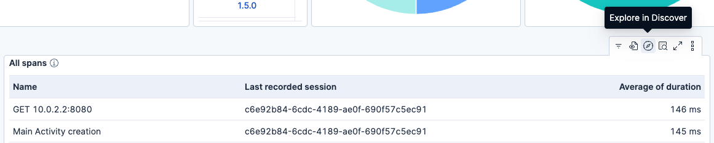
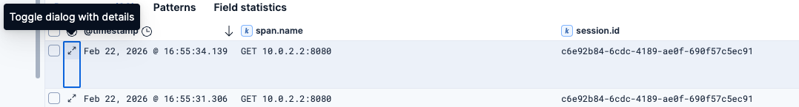
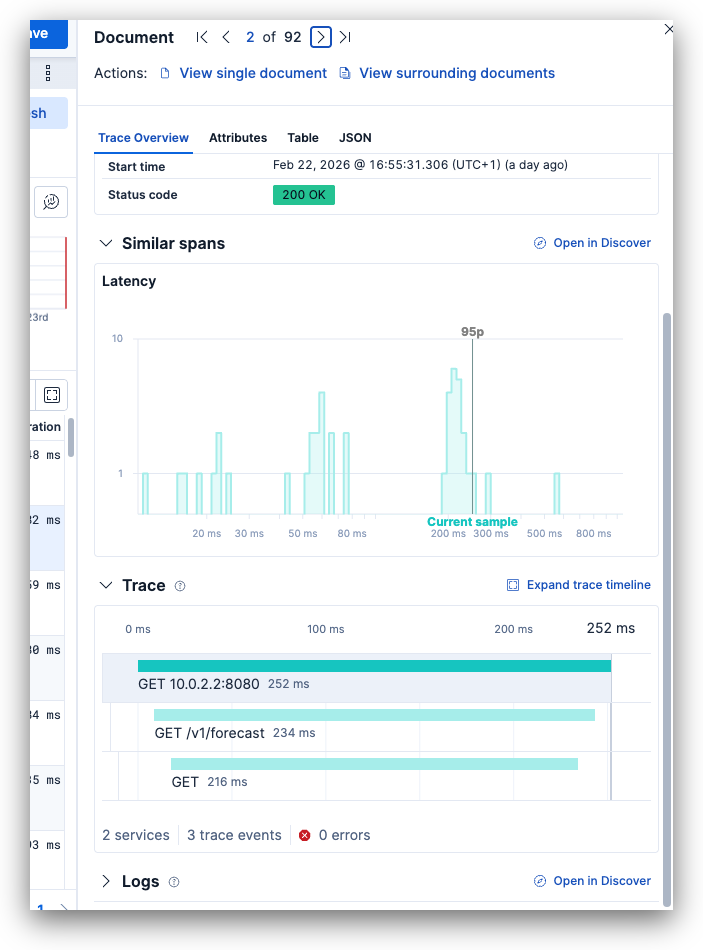
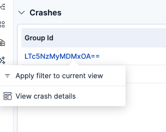

{{- generatedHeader }}
# Android OpenTelemetry Assets

## Overview

Use this package to get Kibana dashboards for visualizing telemetry data from your Android applications instrumented with [OpenTelemetry](https://opentelemetry.io/). The dashboards provide visibility into application health, crash analysis, span performance, and session-level insights.

The [Elastic Distribution of OpenTelemetry Android (EDOT Android)](https://www.elastic.co/docs/reference/opentelemetry/edot-sdks/android) is the easiest way to populate these dashboards. It is an APM agent built on top of OpenTelemetry that provides automatic instrumentation, session tracking, disk buffering, and central configuration out of the box. Any other OpenTelemetry-compatible Android instrumentation will also work, as long as the expected telemetry fields are present.

### Compatibility

This package has been tested with EDOT Android and OpenTelemetry semantic conventions. The dashboards query data from `logs-generic.otel*` and `traces-generic.otel*` index patterns, and filter on `os.name: "Android"`.

## What do I need to use this package?

- An Android application instrumented with an OpenTelemetry SDK (such as [EDOT Android](https://www.elastic.co/docs/reference/opentelemetry/edot-sdks/android)) sending data to the Elastic Stack.
- Kibana 8.19.0 or later, or Kibana 9.1.0 or later.
- Telemetry data must include the following fields for full dashboard functionality:
  - `os.name` (set to `"Android"`)
  - `session.id`
  - `service.name` and `service.version`
  - `exception.stacktrace`, `exception.type`, and `exception.message` (for crash analysis)
  - `os.version` and `device.manufacturer` (for device breakdown charts)
  - `span.name` and `span.status.code` (for span analysis)

EDOT Android populates all of these fields automatically. If you are using a different OpenTelemetry SDK, ensure they are configured in your instrumentation.

### Try it out

Check out the EDOT Android's [Demo application](https://github.com/elastic/android-agent-demo) guide to set up a test environment and take a quick look at what its data looks like with the dashboards provided in this package.

## Dashboards

### Application Overview

The main dashboard provides a high-level view of your Android application's health and usage. It includes controls to filter by application name and version, along with the following panels:

- **Device installations** — Total number of unique device installations, tracked by an installation ID stored in each device's cache.
- **Sessions** — Number of unique sessions. A session represents a period of user interaction with the application.
- **Installations by manufacturer** — Donut chart showing the distribution of installations across Android device manufacturers.
- **Installations by OS version** — Donut chart showing the distribution of installations across Android OS versions.
- **All spans** — Table of spans grouped by name with average duration, which can be further explored by a drilldown into Discover to see more span details with the trace waterfall UI.
- **Failed spans** — Table of spans with an "Error" status, grouped by name and occurrence count, with a similar drilldown into Discover to see span details with the trace waterfall UI.
- **Total spans / Failed spans** — Metric counters for total and errored span counts.
- **Logs** — Total recorded log count.
- **Crashes** — List of crashes grouped by a computed stacktrace group ID, with total crash count and crashes-per-session average. Clicking a crash group drills down into the Exception Details dashboard.
- **Event timeline** — Shows a list of logs and spans in chronological order, useful to trace back the steps a user took during a session.

### Exception Details

A drilldown dashboard opened from the Application Overview when selecting a specific crash group. It shows:

- **Top affected sessions** — Sessions with the most occurrences of the selected exception, with a drilldown to view session details.
- **Occurrences by session** — Average number of times the exception occurs per session.
- **Total occurrences** — Total count of the selected exception.
- **Top exception messages** — Most common messages associated with the exception, useful when stacktraces have variable message content.
- **Top affected OS versions** — Donut chart of exception occurrences by Android OS version.
- **Top affected manufacturers** — Donut chart of exception occurrences by device manufacturer.
- **Full stacktrace** — The complete stacktrace for the selected exception.

## Setting it up

1. Instrument your Android application with an OpenTelemetry SDK and start sending data to your Elastic Stack.
2. Install this package in Kibana and open the **[Android OTel] Application Overview** dashboard.

For the full setup guide, refer to the [EDOT Android getting started documentation](https://www.elastic.co/docs/reference/opentelemetry/edot-sdks/android/getting-started).

## Visualizing your data

1. In the top search bar in Kibana, search for **Dashboards**.
2. In the search bar, type **Android OTel**.
3. Open the **[Android OTel] Application Overview** dashboard and verify that data is populated.
4. Select your application from the list of "Applications" in one of the top panels of the dashboard.
5. (Optional) Select the version of your application to narrow down your results.
6. (Recommended) Click on values across the dashboard's panels to create filters and focus the dashboard on the specific data you'd like to inspect.

### Checking trace waterfall details

Within the **[Android OTel] Application Overview** dashboard, go to a panel that shows a list of spans and click on its "Explore in Discover" button.

Then expand the details for one of the spans in Discover.

You'll see the trace waterfall UI in there. You can expand it to become fullscreen and start drilling down to other details from there.

### Viewing details from a crash

Within the **[Android OTel] Application Overview** dashboard, scroll down to the "Crashes" section to see the list of crashes by group ID. Select one group ID and click on "View crash details" to see that crash's details in a separate dashboard.

## Troubleshooting

If you do not see data in the dashboards, make sure that:

- Your Android application is sending telemetry to the Elastic Stack. You can verify this in Kibana's Discover by searching for `os.name: "Android"` in the `logs-generic.otel*` or `traces-generic.otel*` index patterns.
- The `session.id` field is present in the telemetry data. If you are not using EDOT Android, you may need to configure session tracking manually.
- The `service.name` field is set correctly so the application name filter works as expected.
- The time range selected in Kibana covers the period when your application was sending telemetry. If the default time range doesn't show any data, try expanding it (for example, to "Last 7 days" or "Last 30 days") to confirm data has been ingested.

For general help with the EDOT Android SDK, refer to [EDOT Android troubleshooting](https://www.elastic.co/docs/troubleshoot/ingest/opentelemetry/edot-sdks/android).
