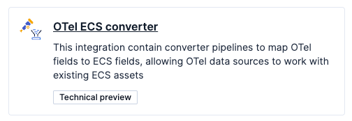
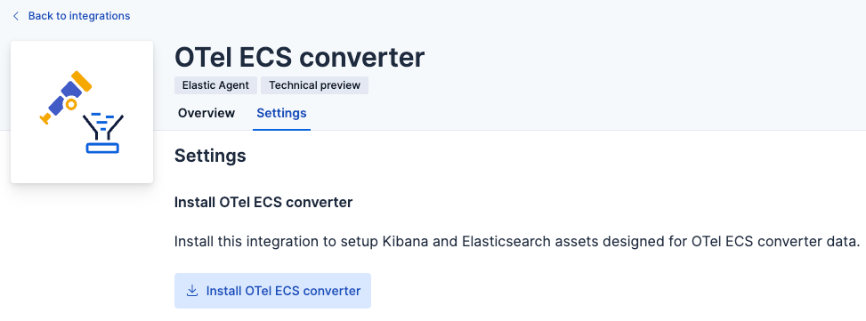
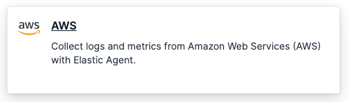
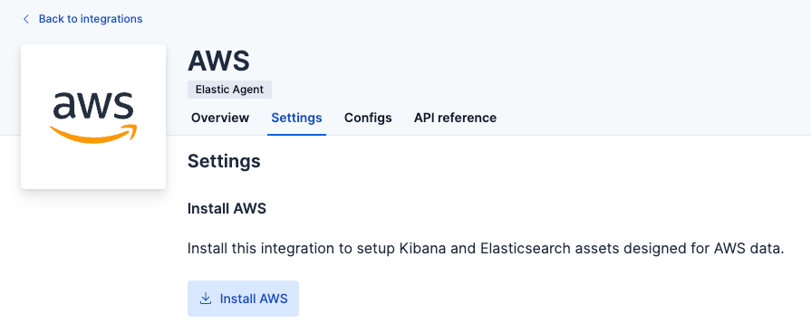

# OTel ECS converter

OTel ECS converter integration provide pipelines to convert OTel native fields to ECS fields in documents.
The table below lists supported data source, source OTel data set and destination ECS data set:

| Data source     | OTel data set (source) | ECS data set (destination) |
|-----------------|------------------------|----------------------------|
| AWS ELB logs    | aws.elbaccess.otel     | aws.elb_logs               |
| VPC flow logs   | aws.vpcflow.otel       | aws.vpcflow                |
| CloudTrail logs | aws.cloudtrail.otel    | aws.cloudtrail             |

## Instructions

This integration works on OTel documents. Hence, you should ingest OTel native documents from sources stated above.
The destination data sets are installed with the **AWS integration**. Hence, you must install the integration.

1. Install the **OTel ECS converter** integration

   Search the integration from the catalog,

   

   Then install assets through settings section,

   

   This installs the required pipelines which parse and re-route to destination data set

2. Install the **AWS integration** assets

   You only needs to install assets of the integration, to do install them,
   find the **AWS** integration by searching or browsing the catalog.

   

   Navigate to the **Settings** tab and click **Install AWS**. Confirm by clicking **Install AWS** in the popup.

   

3. Ingest OTel native data into the data sets