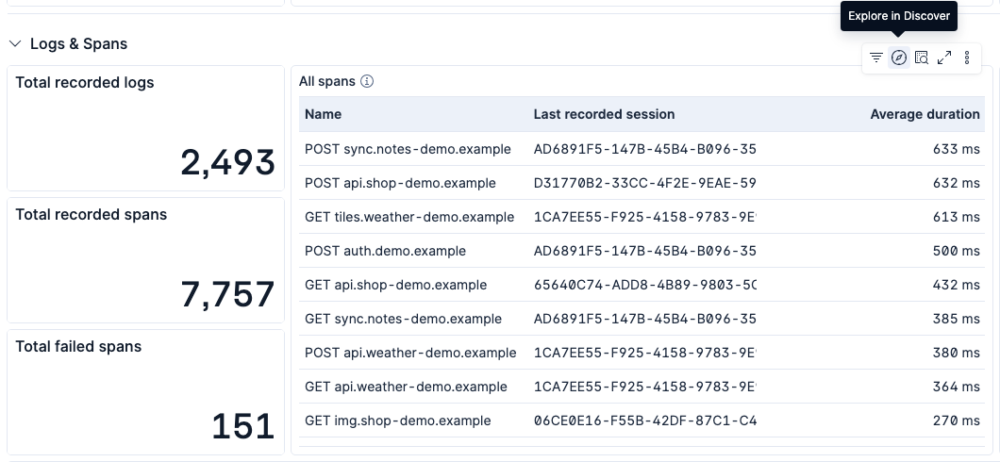
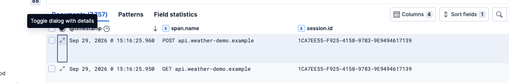
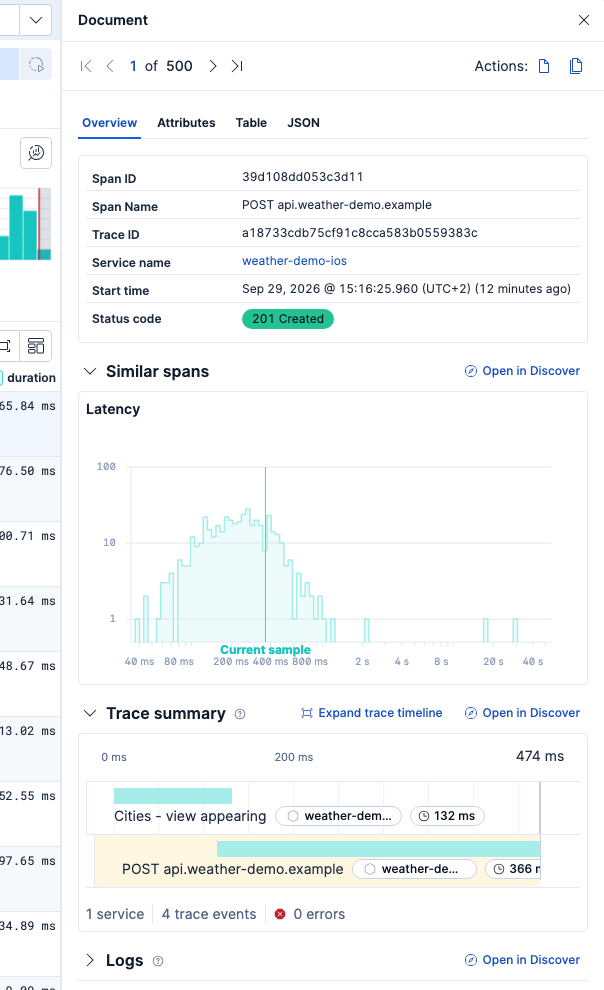
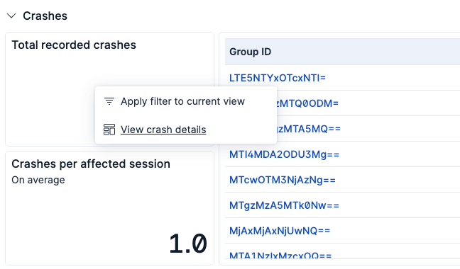

# iOS OpenTelemetry Assets

## Overview

Use this package to get Kibana dashboards for visualizing telemetry data from your iOS applications instrumented with [OpenTelemetry](https://opentelemetry.io/). The dashboards provide visibility into application health, crash analysis, span performance, and session-level insights.

The [Elastic Distribution of OpenTelemetry iOS (EDOT iOS)](https://www.elastic.co/docs/reference/opentelemetry/edot-sdks/ios) is the easiest way to populate these dashboards. It is an APM agent built on top of OpenTelemetry that provides automatic instrumentation, session tracking, crash reporting, and central configuration out of the box. Any other OpenTelemetry-compatible iOS instrumentation will also work, as long as the expected telemetry fields are present.

### Compatibility

This package has been tested with EDOT iOS 2.2.0, EDOT Collector 9.5.4, and OpenTelemetry semantic conventions. The dashboards query data from `logs-generic.otel*` and `traces-generic.otel*` index patterns, and filter on `os.name: "iOS"`.

## What do I need to use this package?

- An iOS application instrumented with an OpenTelemetry SDK (such as [EDOT iOS](https://www.elastic.co/docs/reference/opentelemetry/edot-sdks/ios)) sending data to the Elastic Stack.
- Kibana 8.19.0 or later on the 8.19 release line, or Kibana 9.1.0 or later.
- Telemetry data must include the following fields for full dashboard functionality:
  - `os.name` (set to `"iOS"`)
  - `session.id`
  - `service.name` and `service.version` (which are the OpenTelemetry way to define a telemetry source, in this case your iOS application's name and version)
  - `exception.stacktrace` and `exception.type` (for crash analysis)
  - `os.version` (for OS version breakdown charts)
  - `span.name` and `status.code` (for span analysis)
  - `event_name` (to identify `app.crash` events)
  - `app.installation.id` (for installation counts)
  - `duration` (for span duration averages and percentiles)

EDOT iOS populates all of these fields automatically. If you are using a different OpenTelemetry SDK, ensure they are configured in your instrumentation.

Crash analysis requires EDOT iOS 2.2.0 or later.

### Try it out

Check out the EDOT iOS's [Demo application](https://github.com/elastic/ios-agent-demo) guide to set up a test environment and take a quick look at what its data looks like with the dashboards provided in this content package.

## Dashboards

### Application Overview

The main dashboard provides a high-level view of your iOS application's health and usage. It is organized into four collapsible sections:

**Overview**

- **Installations** — Total number of unique device installations, tracked by an installation ID stored in each device's cache.
- **Sessions** — Number of unique sessions. A session represents a period of user interaction with the application.
- **Installations by OS version** — Donut chart showing the distribution of installations across iOS versions.
- **Applications** — Table of applications with their number of installations, sessions and crashes. Click an application name to filter the whole dashboard by it.
- **Versions** — Table of application versions with their number of installations, sessions and crashes. Select an application first, then click a version to narrow the dashboard down to it.

**Logs & Spans**

- **Total recorded logs / Total recorded spans / Total failed spans** — Metric counters for log, span and errored span counts.
- **All spans** — Table of spans grouped by name with their average duration, which can be further explored by a drilldown into Discover to see more span details with the trace waterfall UI.
- **Failed spans** — Table of spans with an "Error" status, grouped by name and occurrence count, with a similar drilldown into Discover to see span details with the trace waterfall UI.
- **Failed span rate and p95 duration over time** — Line chart with the share of errored spans and the 95th percentile span duration per time bucket.

**Crashes**

- **Total recorded crashes / Crashes per affected session** — Metric counters for the total crash count and the average number of crashes among sessions that recorded at least one crash.
- **Crashes table** — List of crashes grouped by a group ID with their occurrence count. The group ID is computed from the exception type and the first frame of the crash in the app's own binary, so the same crash site in two app builds forms two groups. Clicking a group ID drills down into the Exception Details dashboard. Use that drilldown rather than filtering the dashboard on a group ID: the group ID is computed by Kibana, so a filter on it shows the metric counters and trend charts as empty.
- **Crash rate over time** — Line chart with the percentage of sessions active in each time bucket that recorded at least one crash.

**Event timeline**

- **First 100 events** — Shows a list of logs and spans in chronological order, useful to trace back the steps a user took during a session.

### Exception Details

A drilldown dashboard opened from the Application Overview when selecting a specific crash group. The group ID filter at the top narrows every panel to that exception. It is organized into two collapsible sections:

**Overview**

- **Top affected OS versions** — Donut chart of exception occurrences by iOS version.
- **Total occurrences** — Total count of the selected exception.
- **Affected installations** — Number of distinct device installations that recorded the exception.
- **Occurrences per session** — Average number of times the exception occurs per session.
- **Top affected sessions** — Sessions with the most occurrences of the selected exception. Click a session ID to open the Application Overview filtered by that session.
- **Occurrences over time** — Line chart with the number of occurrences per time bucket.

**Stack trace**

- **Most recent occurrence** — The stack trace of the most recent occurrence of the selected exception.

## Setting it up

1. Instrument your iOS application and start sending data to your Elastic Stack.
2. Install this content package in Kibana and open the **[iOS OTel] Application Overview** dashboard.

For the full setup guide, refer to the [EDOT iOS documentation](https://www.elastic.co/docs/reference/opentelemetry/edot-sdks/ios).

## Visualizing your data

1. In the top search bar in Kibana, search for **Dashboards**. Alternatively, you can find the dashboards in the **Integrations** page under this package's **Assets** tab.
2. In the search bar, type **iOS OTel**.
3. Open the **[iOS OTel] Application Overview** dashboard and verify that data is populated.
4. Select your application by clicking its name in the "Applications" table of the Overview section.
5. (Optional) Click a version in the "Versions" table to narrow down your results.
6. (Recommended) Click on values across the dashboard's panels to create filters and focus the dashboard on the specific data you'd like to inspect.

### Checking trace waterfall details

Within the **[iOS OTel] Application Overview** dashboard, go to a panel that shows a list of spans and click on its "Explore in Discover" button.

Then expand the details for one of the spans in Discover.

You'll see the trace waterfall UI in there. You can expand it to become fullscreen and start drilling down to other details from there.

### Viewing details from a crash

Within the **[iOS OTel] Application Overview** dashboard, scroll down to the "Crashes" section to see the list of crashes by group ID. Click one group ID and select "View crash details" to see that crash's details in a separate dashboard.

## Troubleshooting

If you can't see the trace waterfall UI in Discover, as shown above, make sure that:

- Your Elastic Stack version is supported by this package.
- Your Kibana space's "solution view" is set to "Observability". As explained [here](https://www.elastic.co/blog/elastic-redesigned-navigation-menu-kibana#editing-space-settings-).

If you do not see data in the dashboards, make sure that:

- Your iOS application is sending telemetry to the Elastic Stack. You can verify this in Kibana's Discover by searching for `os.name: "iOS"` in the `logs-generic.otel*` or `traces-generic.otel*` index patterns.
- The `session.id` field is present in the telemetry data. If you are not using EDOT iOS, you may need to configure session tracking manually.
- The `service.name` field is set correctly so the application name filter works as expected.
- No filter on a crash group ID is active. The group ID is computed by Kibana, and the metric counters and trend charts cannot evaluate it, so such a filter shows them as empty while the tables keep their data. Open crash details through the "View crash details" drilldown instead.
- The time range selected in Kibana covers the period when your application was sending telemetry. If the default time range doesn't show any data, try expanding it (for example, to "Last 7 days" or "Last 30 days") to confirm data has been ingested.

For general help with the EDOT iOS SDK, refer to [EDOT iOS troubleshooting](https://www.elastic.co/docs/troubleshoot/ingest/opentelemetry/edot-sdks/ios).
