# Privileged Access Detection
The Privileged Access Detection package contains assets to detect anomalous privilege access activity in the Windows, Linux and Okta system logs. This package requires a Platinum subscription. Please ensure that you have a Trial, Platinum, or Enterprise subscription before proceeding. This package is licensed under [Elastic License 2.0](https://www.elastic.co/licensing/elastic-license).

The package transform supports data from Elastic Endpoint via Elastic Defend and the Okta integration. Prior to using this integration, either the Okta integration should be installed and configured, and/or Elastic Defend should be installed through Elastic Agent and collecting data from hosts, or have equivalent tools/endpoints set up. See [Configure endpoint protection with Elastic Defend](https://www.elastic.co/docs/solutions/security/configure-elastic-defend) and [Okta Integration](https://www.elastic.co/docs/reference/integrations/okta) for more information. The **Transform** and **Anomaly Detection Jobs** sections have detailed platform support.

**Note**: This package ignores data in cold and frozen data tiers to reduce heap memory usage, avoid running on outdated data, and to follow best practices.

## Installation

1. **Add the Integration Package**: Install the package via **Management > Integrations > Add Privileged Access Detection**. Configure the integration name and agent policy. Click **Save and Continue**.
1. **Configure the pipeline**: To configure the pipeline you can use one of the following steps:
    - If using Elastic Defend, add a custom pipeline to the data stream. Go to **Stack Management > Ingest Pipelines**, and check if the pipeline `logs-endpoint.events.process@custom` exists. 
    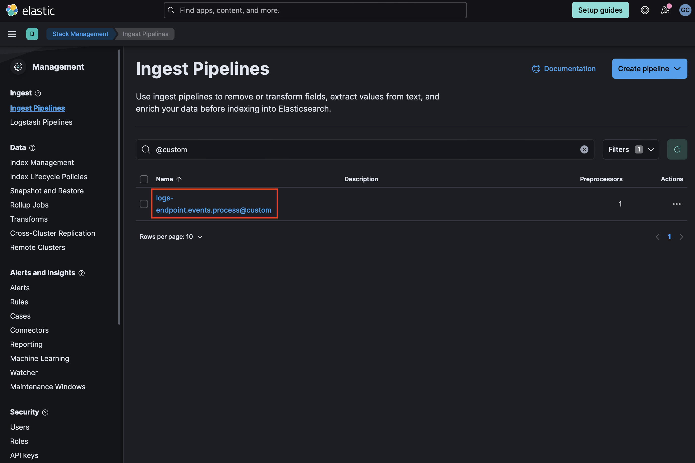
    If it does not exist, you can create it by running the following command in the Dev Console. Be sure to replace `<VERSION>` with the current package version.
      ```
      PUT _ingest/pipeline/logs-endpoint.events.process@custom
      {
        "processors": [
          {
            "pipeline": {
              "name": "<VERSION>-ml_pad_ingest_pipeline",
              "ignore_missing_pipeline": true,
              "ignore_failure": true
            }
          }
        ]
      }
      ```
    - If `logs-endpoint.events.process@custom` already exists, select the three dots next to it and choose **Edit**. Click **Add a processor**. Select **Pipeline** for Processor, enter `<VERSION>-ml_pad_ingest_pipeline` for name (replacing `<VERSION>` with the current package version), and check **Ignore missing pipeline** and **Ignore failures for this processor**. Select **Add Processor**.
1. **Add the required mappings to the component template**: Go to **Stack Management > Index Management > Component Templates**. Templates that can be edited to add custom components will be marked with a `@custom` suffix. For instance, the custom component template for Elastic Defend process events is `logs-endpoint.events.process@custom`. **Note:** Do not attempt to edit the `@package` template.
    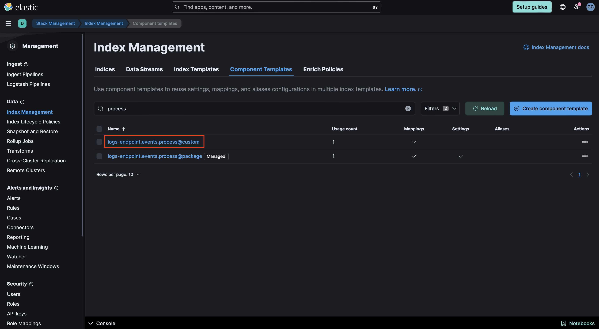
    - If the `@custom` component template does not exist, you can execute the following command in the Dev Console to create it and then continue to the **Rollover** section in these instructions. Be sure to change `<VERSION>` to the current package version.
      ```
      PUT _component_template/{COMPONENT_TEMPLATE_NAME}@custom
      {
        "template": {
          "mappings": {
            "properties": {
              "process": {
                "type": "object",
                "properties": {
                  "command_line_entropy": {
                    "type": "double"
                  }
                }
              }
            }
          }
        }
      }
      ```
    - If the `@custom` component template already exists, you will need to edit it to add mappings for data to be properly enriched. Click the three dots next to it and select **Edit**. 
    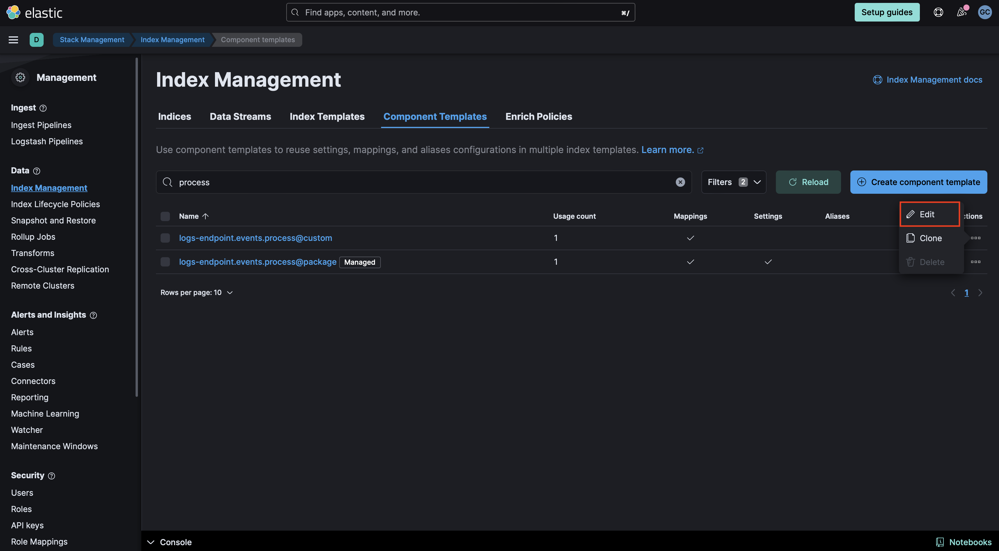
    - Proceed to the mappings step in the UI. Click **Add Field** at the bottom of the page and create an `Object` field for `process`:
    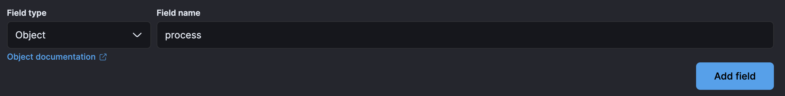
    - Create a property under Process for `command_line_entropy` of type `Double`. 
    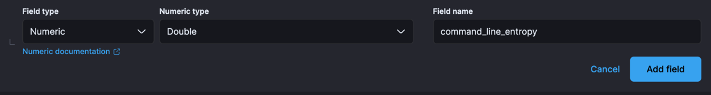
    - Your component mappings should look like the following:
    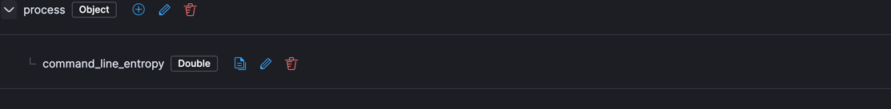
    - Click **Review** then **Save Component Template**.
1. **Rollover** Depending on your environment, you may need to [rollover](https://www.elastic.co/guide/en/elasticsearch/reference/current/indices-rollover-index.html) in order for these mappings to get picked up. The default index pattern for Elastic Defend is `logs-endpoint.events.process-default`.
    ```
    POST INDEX_NAME/_rollover
    ```
1. **Check the health of the transforms**: The transforms are scheduled to run every hour. These transforms create two indices: `ml_windows_privilege_type_pad.all` and `ml_okta_multiple_user_sessions_pad.all`. To check the health of the transforms go to **Management > Stack Management > Data > Transforms** under `logs-pad.pivot_transform_okta_multiple_sessions-default-<FLEET-TRANSFORM-VERSION>` and `logs-pad.pivot_transform_windows_privilege_list-default-<FLEET-TRANSFORM-VERSION>`.
1. **Create data views for anomaly detection jobs**: The anomaly detection jobs under this package rely on three indices. One index contains logs for Windows, Linux, and Okta (logs-*), while the second and third indices store Okta user session information and details about special Windows privileges assigned to a user, respectively, collected through two transforms (`ml_okta_multiple_user_sessions_pad.all` and `ml_windows_privilege_type_pad.all`). Before enabling the anomaly detection jobs, create a data view with both index patterns.
    1. Go to **Stack Management > Kibana > Data Views** and click **Create data view**.
    1. Enter the name of your respective index patterns in the **Index pattern** box, i.e., `logs-*, ml_okta_multiple_user_sessions_pad.all, ml_windows_privilege_type_pad.all`, and copy the same in the **Name** field.
    1. Select `@timestamp` under the **Timestamp** field and click on **Save data view to Kibana**.
    1. Use the new data view (`logs-*, ml_okta_multiple_user_sessions_pad.all, ml_windows_privilege_type_pad.all`) to create anomaly detection jobs for this package.
1. **Add preconfigured anomaly detection jobs**: In **Stack Management -> Anomaly Detection Jobs**, you will see **Select data view or saved search**. Select the data view created in the previous step. Then under `Use preconfigured jobs` you will see **Privileged Access Detection**. When you select the card, you will see pre-configured anomaly detection jobs that you can create depending on what makes the most sense for your environment. 
**_Note_**: In the Machine Learning app, these configurations are available only when data exists that matches the query specified in the [pad-ml file](https://github.com/elastic/integrations/blob/main/packages/pad/kibana/ml_module/pad-ml.json#L10). Additionally, we recommend backdating the datafeed for these anomaly detection jobs to a specific timeframe, as some datafeed queries are resource-intensive and may lead to query delays. We advise you to start the datafeed with 2-3 months' worth of data.
1. **Data view configuration for Dashboards**: For the dashboard to work as expected, the following settings need to be configured in Kibana.
    1. You have started the above anomaly detection jobs.
    1. You have **read** access to `.ml-anomalies-shared` index or are assigned the `machine_learning_user` role. For more information on roles, please refer to [Built-in roles in Elastic](https://www.elastic.co/guide/en/elasticsearch/reference/current/built-in-roles.html). Please be aware that a user who has access to the underlying machine learning results indices can see the results of _all_ jobs in _all_ spaces. Be mindful of granting permissions if you use Kibana spaces to control which users can see which machine learning results. For more information on machine learning privileges, refer to [setup-privileges](https://www.elastic.co/guide/en/machine-learning/current/setup.html#setup-privileges).
    1. After enabling the jobs, go to **Management > Stack Management > Kibana > Data Views**.  Click on **Create data view** with the following settings:
        - Name: `.ml-anomalies-shared`
        - Index pattern : `.ml-anomalies-shared`
        - Select **Show Advanced settings** enable **Allow hidden and system indices**
        - Custom data view ID: `.ml-anomalies-shared`

    _**Warning**_: When creating the data views for the dashboards, ensure that the `Custom data view ID` is set to the value specified above and is not left empty. Omitting or misconfiguring this field may result in broken visualizations, as illustrated by the error message below.
    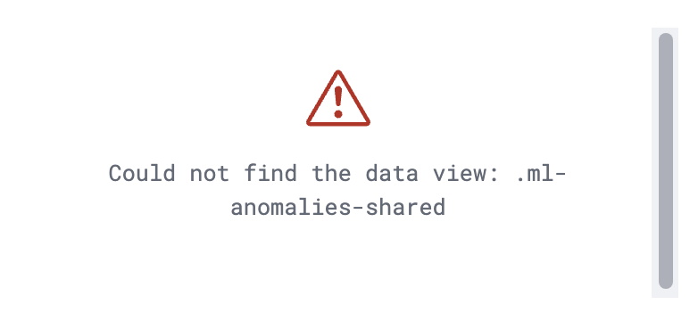
1. **Enabling detection rules**:  You can also enable detection rules to alert on Privileged Access activity in your environment, based on anomalies flagged by the above ML jobs. These rules are available as part of the Detection Engine, and can be found using the tag `Use Case: Privileged Access Detection`. See this [documentation](https://www.elastic.co/guide/en/security/current/prebuilt-rules-management.html#load-prebuilt-rules) for more information on importing and enabling the rules.

## Transform

To inspect the installed assets, you can navigate to **Stack Management > Data > Transforms**.

| Transform name                             | Purpose                                                            | Source index  | Destination index                              | Alias                                  | Supported Platform |
|--------------------------------------------|--------------------------------------------------------------------|---------------|------------------------------------------------|--------------------------------------- | ------------------ |
| pad.pivot_transform_okta_multiple_sessions | 	Collects user session information for Okta events                 | logs-*        | 	ml_okta_multiple_user_sessions_pad-[version] | ml_okta_multiple_user_sessions_pad.all | Okta               |
| pad.pivot_transform_windows_privilege_type | 	Collects special privileges assigned to a user for Windows events | logs-*        | 	ml_windows_privilege_type_pad-[version]      | ml_windows_privilege_type_pad.all      | Windows            |

When querying the destination indices for Okta and Windows logs, we advise using the alias for the destination index (`ml_okta_multiple_user_sessions_pad.all` and `ml_windows_privilege_type_pad.all`). In the event that the underlying package is upgraded, the alias will aid in maintaining the previous findings. 

## Customize Privileged Access Detection Transform

To customize filters in the Privileged Access Detection transform, follow the below steps. You can use these instructions to update basic settings or to update filters for fields such as `process.name`, `@timestamp` and others.
1. To update settings such as retention policy, frequency, or destination configuration, stop the transform, click **Edit** from the **Actions** bar, make the required changes, and start the transform again.

1. To update the query filters, go to **Stack Management > Data > Transforms > `logs-pad.pivot_transform_windows_privilege_list-default-<FLEET-TRANSFORM-VERSION>`**.
1. Click on the **Actions** bar at the far right of the transform and select the **Clone** option.
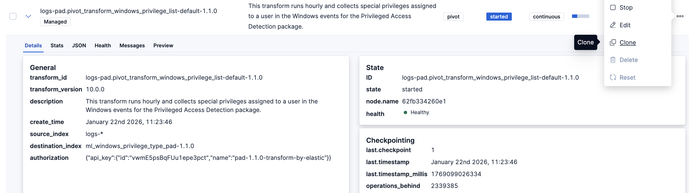
1. In the new **Clone transform** window, go to the **Search filter** and update any field values you want to add or remove. Click on the **Apply changes** button on the right side to save these changes. **Note:** The image below shows an example of filtering a new `process.name` as `explorer.exe`. You can follow a similar example and update the field value list based on your environment to help reduce noise and potential false positives.
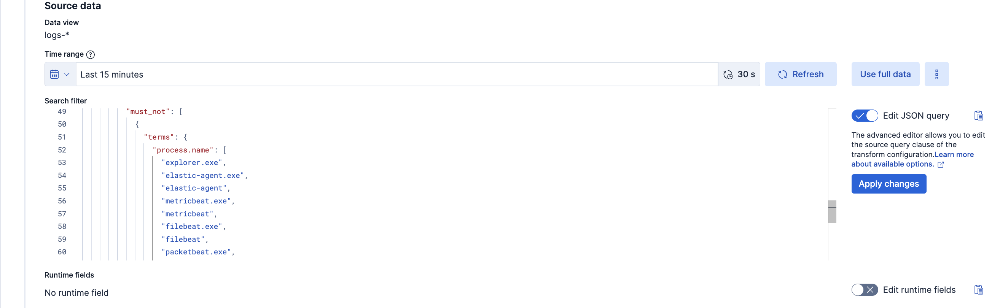
1. Scroll down and select the **Next** button at the bottom right. Under the **Transform details** section, enter a new **Transform ID** and **Destination index** of your choice, then click on the **Next** button.
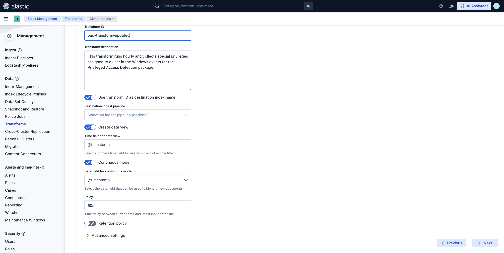
1. Lastly, select the **Create and Start** option. Your updated transform will now start collecting data. **Note:** Do not forget to update your data view based on the new **Destination index** you have just created.
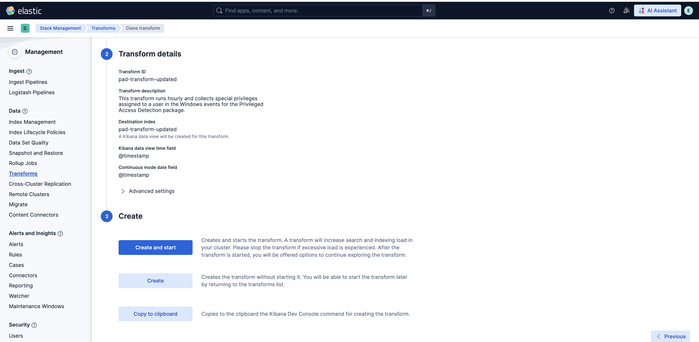

### Anomaly Detection Jobs

| Job                                                        | Description                                                                                    | Supported Platform   |
|------------------------------------------------------------|------------------------------------------------------------------------------------------------|----------------------|
| pad_windows_high_count_special_logon_events                | Detects unusually high special logon events initiated by a user.                               | Windows              |
| pad_windows_high_count_special_privilege_use_events        | Detects unusually high special privilege use events initiated by a user.                       | Windows              |
| pad_windows_high_count_group_management_events             | Detects unusually high security group management events initiated by a user.                   | Windows              |
| pad_windows_high_count_user_account_management_events      | Detects unusually high security user account management events initiated by a user.            | Windows              |
| pad_windows_rare_privilege_assigned_to_user                | Detects an unusual privilege type assigned to a user.                                          | Windows              |
| pad_windows_rare_group_name_by_user                        | Detects an unusual group name accessed by a user.                                              | Windows              |
| pad_windows_rare_device_by_user                            | Detects an unusual device accessed by a user.                                                  | Windows              |
| pad_windows_rare_source_ip_by_user                         | Detects an unusual source IP address accessed by a user.                                       | Windows              |
| pad_windows_rare_region_name_by_user                       | Detects an unusual region name for a user.                                                     | Windows              |
| pad_linux_high_count_privileged_process_events_by_user     | Detects a spike in privileged commands executed by a user.                                     | Linux                |
| pad_linux_rare_process_executed_by_user                    | Detects a rare process executed by a user.                                                     | Linux                |
| pad_linux_high_median_process_command_line_entropy_by_user | Detects process command lines executed by a user with an abnormally high median entropy value. | Okta Integration     |
| pad_okta_spike_in_group_membership_changes                 | Detects spike in group membership change events by a user.                                     | Okta Integration     |
| pad_okta_spike_in_user_lifecycle_management_changes        | Detects spike in user lifecycle management change events by a user.                            | Okta Integration     |
| pad_okta_spike_in_group_privilege_changes                  | Detects spike in group privilege change events by a user.                                      | Okta Integration     |
| pad_okta_spike_in_group_application_assignment_change      | Detects spike in group application assignment change events by a user.                         | Okta Integration     |
| pad_okta_spike_in_group_lifecycle_changes                  | Detects spike in group lifecycle change events by a user.                                      | Okta Integration     |
| pad_okta_high_sum_concurrent_sessions_by_user              | Detects an unusual sum of active sessions started by a user.                                   | Okta Integration     |
| pad_okta_rare_source_ip_by_user                            | Detects an unusual source IP address accessed by a user.                                       | Okta Integration     |
| pad_okta_rare_region_name_by_user                          | Detects an unusual region name for a user.                                                     | Okta Integration     |
| pad_okta_rare_host_name_by_user                            | Detects an unusual host name for a user.                                                       | Okta Integration     |

## Customize ML jobs for Privileged Access Detection

To customize the datafeed query and other settings such as model memory limit, frequency, query delay, bucket span and influencers for the Privileged Access Detection ML jobs, follow the steps below.
1. To update the datafeed query, stop the datafeed and select **Edit job** from the Actions menu.
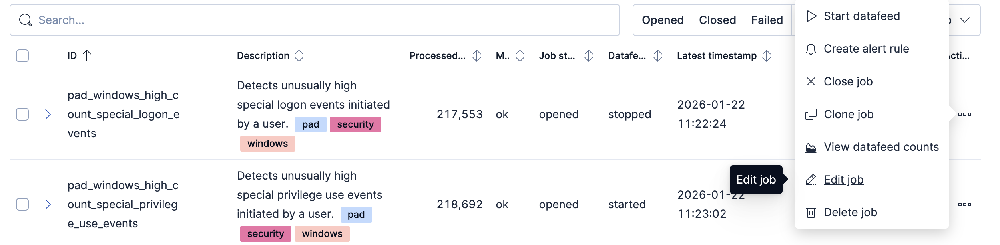
1. In the Edit job window, navigate to the **Datafeed** section and update the query filters. You can add or remove field values to help reduce noise and false positives based on your environment.
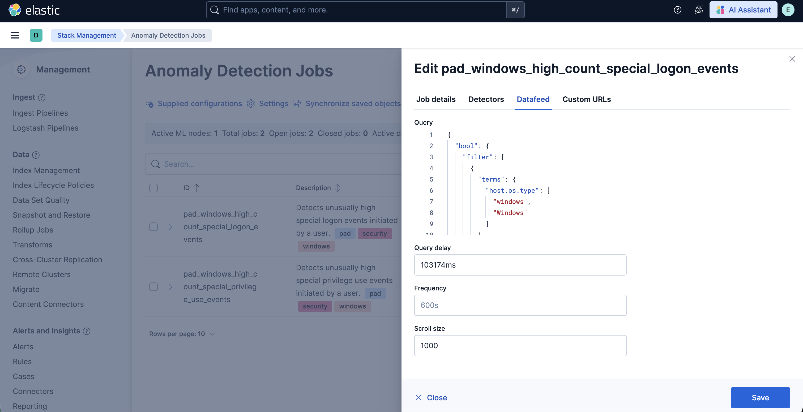
1. You may also update the model memory limit if your environment has high data volume or if the job requires additional resources. Go to the **Job details** section and update the **Model memory limit** and hit **Save**. For more information on resizing ML jobs, refer to the [documentation](https://www.elastic.co/docs/explore-analyze/machine-learning/anomaly-detection/anomaly-detection-scale#set-model-memory-limit).
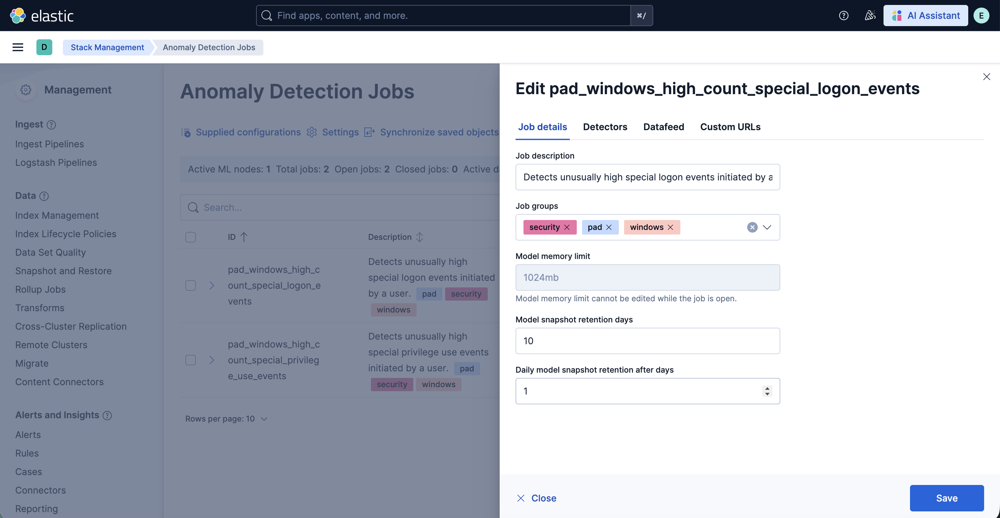
1. In order to do more advanced changes to your job, clone the job by selecting **Clone job** from the **Actions** menu.
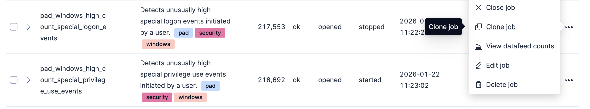
1. In the cloned job, you can update datafeed settings such as **Frequency** and **Query delay**, which help control how often data is analyzed and account for ingestion delays.
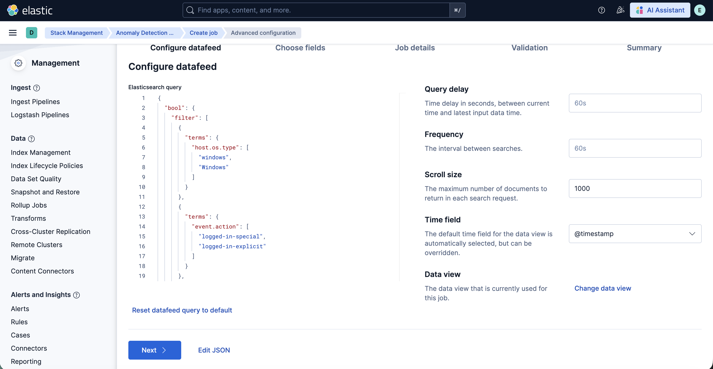
1. You can also modify the job configuration by adjusting the **Bucket span** and by adding or removing **Influencers** to improve anomaly attribution. 
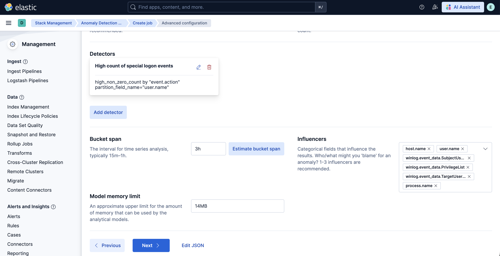
1. Finally, assign a new Job ID, and click on **Create job**, and start the datafeed to apply the updated settings.

## Licensing

Usage in production requires that you have a license key that permits use of machine learning features.