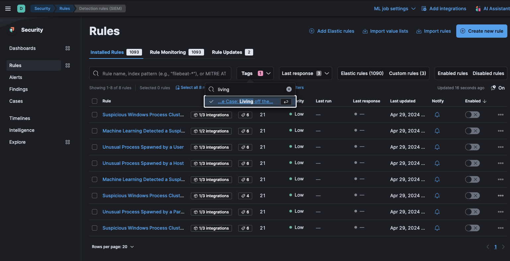

# Living off the Land Attack Detection 

The Living off the Land Attack (LotL) Detection package contains a supervised machine learning model, called [ProblemChild and associated assets](https://www.elastic.co/security-labs/detecting-living-off-the-land-attacks-with-new-elastic-integration), which are used to detect living off the land (LotL) activity in your environment. This package requires a Platinum subscription. Please ensure that you have a Trial or Platinum level subscription installed on your cluster before proceeding. This package is licensed under [Elastic License 2.0](https://www.elastic.co/licensing/elastic-license).

For more detailed information refer to the following blogs and webinar:
- [Detecting Living-off-the-land attacks with new Elastic Integration](https://www.elastic.co/security-labs/detecting-living-off-the-land-attacks-with-new-elastic-integration)
- [ProblemChild: Detecting living-off-the-land attacks using the Elastic Stack](https://www.elastic.co/blog/problemchild-detecting-living-off-the-land-attacks)
- [ProblemChild: Generate alerts to detect living-off-the-land attacks](https://www.elastic.co/blog/problemchild-generate-alerts-to-detect-living-off-the-land-attacks)
- [Webinar: ProblemChild: Detecting living-off-the-land attacks using the Elastic Stack](https://www.elastic.co/webinars/problemchild)

## Installation
1. **Upgrading**: If upgrading from a version below v2.0.0, see the section v2.0.0 and beyond.
1. **Add the Integration Package**: Install the package via **Management > Integrations > Add Living off the Land Detection**. Configure the integration name and agent policy. Click Save and Continue.
1. **Install assets**: Install the assets by clicking **Settings > Install Living off the Land Detection assets**.
1. **Configure the ingest pipeline**: Once you’ve installed the package you can ingest your data using the ingest pipeline via the ingest pipeline. This will enrich your incoming data with its predictions from the machine learning model.  You can use one of the following methods depending on your setup:
    - If using an Elastic Beat such as Winlogbeat, add the ingest pipeline to it by adding a simple configuration [setting](https://www.elastic.co/guide/en/elasticsearch/reference/current/ingest.html#pipelines-for-beats) to `winlogbeat.yml`.
    - If adding the ingest pipeline to an existing pipeline, use a [pipeline processor](https://www.elastic.co/guide/en/elasticsearch/reference/current/pipeline-processor.html). For example, you can check if winlogbeat, default index pattern `winlogbeat-*`, or Elastic Defend, the default index pattern being `logs-endpoint*`, already has an ingest pipeline by navigating to **Stack Management > Data > Index Management**, finding the index (sometimes you need to toggle "Include hidden indices"), and checking the index's settings for a default or final [pipeline](https://www.elastic.co/guide/en/elasticsearch/reference/current/ingest.html#set-default-pipeline).
    - To enable the enrichment policy as the default pipeline on an index, you can use this example and replace `INDEX_NAME` with the desired index:
    ```
    POST INDEX_NAME/_settings
    {
      "index" : {
        "default_pipeline" : "<VERSION>-problem_child_ingest_pipeline"
      }
    }
    ```
1. **Add the required mapping to the index or component template**: Depending on your environment, you may need to [rollover](https://www.elastic.co/guide/en/elasticsearch/reference/current/indices-rollover-index.html) in order for these mappings to get picked up.
   ```
    {
    "properties": {
      "problemchild": {
        "properties": {
          "prediction": {
            "type": "long"
          },
          "prediction_probability": {
            "type": "float"
          }
        }
      },
      "blocklist_label": {
        "type": "long"
        }
      }
    }
   ```
1. **(Optional) [Create a data view](https://www.elastic.co/guide/en/kibana/current/data-views.html) specificially for your windows process logs (index pattern or data stream name)**
1. **Add preconfigured anomaly detection jobs**: In **Machine Learning > Anomaly Detection**, when you create a job, you should see an option to `Use preconfigured jobs` with a card for `Living off the Land Attack Detection`. When you select the card, you will see several pre-configured anomaly detection jobs that you can enable depending on what makes the most sense for your environment. **Warning**: if the ingest pipeline hasn't run for some reason, such as no eligible data has come in yet, or the required mapping has not been added, _you won't be able to see this card yet_. If that is the case, try troubleshooting the ingest pipeline, and if any predictions have been populated yet.
1. **Enable detection rules**: You can also enable detection rules to alert on LotL activity in your environment, based on anomalies flagged by the above ML jobs. As of version 2.0.0 of this package, these rules are available as part of the Detection Engine, and can be found using the tag `Use Case: Living off the Land Attack Detection`. See this [documentation](https://www.elastic.co/guide/en/security/current/prebuilt-rules-management.html#load-prebuilt-rules) for more information on importing and enabling the rules.


*In **Security > Rules**, filtering with the “Use Case: Living off the Land Attack Detection” tag*

## Anomaly Detection Jobs

Detects potential LotL activity by identifying malicious processes.

| Job | Description |
|---|---|
| problem_child_rare_process_by_host | Looks for a process that has been classified as malicious on a host that does not commonly manifest malicious process activity. |
| problem_child_high_sum_by_host | Looks for a set of one or more malicious child processes on a single host. |
| problem_child_rare_process_by_user | Looks for a process that has been classified as malicious where the user context is unusual and does not commonly manifest malicious process activity. |
| problem_child_rare_process_by_parent | Looks for rare malicious child processes spawned by a parent process. |
| problem_child_high_sum_by_user | Looks for a set of one or more malicious processes, started by the same user. |
| problem_child_high_sum_by_parent | Looks for a set of one or more malicious child processes spawned by the same parent process. |

## v2.0.0 and beyond

v2.0.0 of the package introduces breaking changes, namely deprecating detection rules from the package. To continue receiving updates to LotL Detection, we recommend upgrading to v2.0.0 after doing the following:
- Uninstall existing rules associated with this package: Navigate to **Security > Rules** and delete the following rules:
    - Machine Learning Detected a Suspicious Windows Event Predicted to be Malicious Activity
    - Unusual Process Spawned By a Host
    - Suspicious Windows Process Cluster Spawned by a Host
    - Machine Learning Detected a Suspicious Windows Event with a High Malicious Probability Score
    - Suspicious Windows Process Cluster Spawned by a Parent Process
    - Unusual Process Spawned By a User
    - Unusual Process Spawned By a Parent Process
    - Suspicious Windows Process Cluster Spawned by a User

Depending on the version of the package you're using, you might also be able to search for the above rules using the tag `Living off the Land`.
- Upgrade the LotL package to v2.0.0 using the steps [here](https://www.elastic.co/guide/en/fleet/current/upgrade-integration.html)
- Install the new rules as described in the [Enable detection rules](#enable-detection-rules) section below

In version 2.1.1, the package ignores data in cold and frozen data tiers to reduce heap memory usage, avoid running on outdated data, and to follow best practices.

## Licensing

Usage in production requires that you have a license key that permits use of machine learning features.
