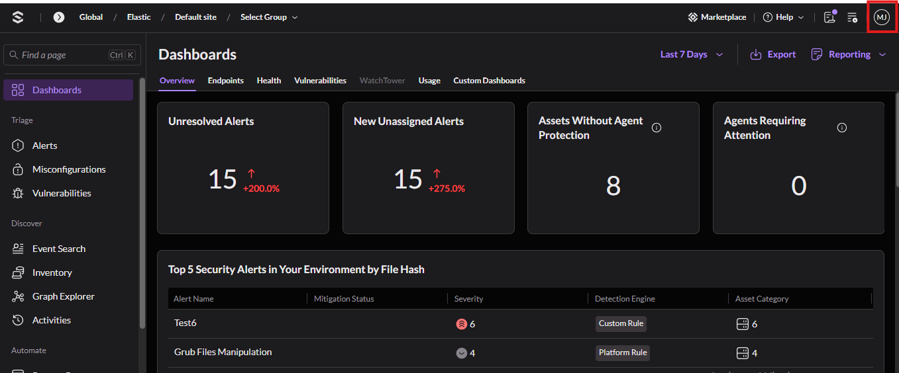
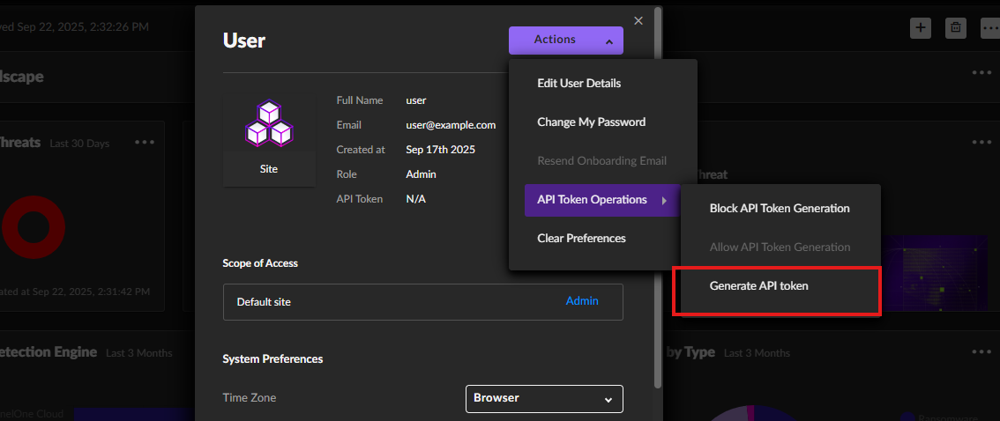

# SentinelOne

The [SentinelOne](https://www.sentinelone.com/) integration collects and parses data from SentinelOne REST APIs. This integration also offers the capability to perform response actions on SentinelOne hosts directly through the Elastic Security interface (introduced with v8.12.0). Additional configuration is required; for detailed guidance, refer to [documentation](https://www.elastic.co/guide/en/security/current/response-actions-config.html).

## Compatibility

This module has been tested against `SentinelOne Management Console API version 2.1`.

## API token

To collect data from SentinelOne APIs, you must have an API token. To create an API token, follow these steps:

  1. Log in to the **SentinelOne Management Console** as an **Admin**.
  
  2. Navigate to **Logged User Account** from top right panel in the navigation bar.
  3. Click **My User**.
  4. In the API token section, click **Generate**.  
  

## Note

The API token generated by the user is time-limited. To rotate a new token, log in with the dedicated admin account.

## Logs

### activity

This is the `activity` dataset.

An example event for `activity` looks as following:

```json
{
    "@timestamp": "2022-04-05T16:01:56.995Z",
    "agent": {
        "ephemeral_id": "630c4de2-59ec-4613-ab7d-261434a79313",
        "id": "d2a14a09-96fc-4f81-94ef-b0cd75ad71e7",
        "name": "docker-fleet-agent",
        "type": "filebeat",
        "version": "8.13.0"
    },
    "data_stream": {
        "dataset": "sentinel_one.activity",
        "namespace": "83396",
        "type": "logs"
    },
    "ecs": {
        "version": "8.11.0"
    },
    "elastic_agent": {
        "id": "d2a14a09-96fc-4f81-94ef-b0cd75ad71e7",
        "snapshot": false,
        "version": "8.13.0"
    },
    "event": {
        "agent_id_status": "verified",
        "category": [
            "configuration"
        ],
        "created": "2024-06-12T03:21:55.005Z",
        "dataset": "sentinel_one.activity",
        "ingested": "2024-06-12T03:22:05Z",
        "kind": "event",
        "original": "{\"accountId\":\"1234567890123456789\",\"accountName\":\"Default\",\"activityType\":1234,\"agentId\":null,\"agentUpdatedVersion\":null,\"comments\":null,\"createdAt\":\"2022-04-05T16:01:56.995120Z\",\"data\":{\"accountId\":1234567890123456800,\"accountName\":\"Default\",\"fullScopeDetails\":\"Account Default\",\"fullScopeDetailsPath\":\"test/path\",\"groupName\":null,\"scopeLevel\":\"Account\",\"scopeName\":\"Default\",\"siteName\":null,\"username\":\"test user\"},\"description\":null,\"groupId\":null,\"groupName\":null,\"hash\":null,\"id\":\"1234567890123456789\",\"osFamily\":null,\"primaryDescription\":\"created Default account.\",\"secondaryDescription\":null,\"siteId\":null,\"siteName\":null,\"threatId\":null,\"updatedAt\":\"2022-04-05T16:01:56.992136Z\",\"userId\":\"1234567890123456789\"}",
        "type": [
            "creation"
        ]
    },
    "input": {
        "type": "httpjson"
    },
    "related": {
        "user": [
            "test user"
        ]
    },
    "sentinel_one": {
        "activity": {
            "account": {
                "id": "1234567890123456789",
                "name": "Default"
            },
            "data": {
                "account": {
                    "id": "1234567890123456800",
                    "name": "Default"
                },
                "fullscope": {
                    "details": "Account Default",
                    "details_path": "test/path"
                },
                "scope": {
                    "level": "Account",
                    "name": "Default"
                }
            },
            "description": {
                "primary": "created Default account."
            },
            "id": "1234567890123456789",
            "type": 1234,
            "updated_at": "2022-04-05T16:01:56.992Z"
        }
    },
    "tags": [
        "preserve_original_event",
        "forwarded",
        "sentinel_one-activity"
    ],
    "user": {
        "full_name": "test user",
        "id": "1234567890123456789"
    }
}
```

**Exported fields**

| Field | Description | Type |
|---|---|---|
| @timestamp | Event timestamp. | date |
| cloud.account.id | The cloud account or organization id used to identify different entities in a multi-tenant environment. Examples: AWS account id, Google Cloud ORG Id, or other unique identifier. | keyword |
| cloud.availability_zone | Availability zone in which this host is running. | keyword |
| cloud.image.id | Image ID for the cloud instance. | keyword |
| cloud.instance.id | Instance ID of the host machine. | keyword |
| cloud.instance.name | Instance name of the host machine. | keyword |
| cloud.machine.type | Machine type of the host machine. | keyword |
| cloud.project.id | Name of the project in Google Cloud. | keyword |
| cloud.provider | Name of the cloud provider. Example values are aws, azure, gcp, or digitalocean. | keyword |
| cloud.region | Region in which this host is running. | keyword |
| container.id | Unique container id. | keyword |
| container.image.name | Name of the image the container was built on. | keyword |
| container.labels | Image labels. | object |
| container.name | Container name. | keyword |
| data_stream.dataset | Data stream dataset. | constant_keyword |
| data_stream.namespace | Data stream namespace. | constant_keyword |
| data_stream.type | Data stream type. | constant_keyword |
| ecs.version | ECS version this event conforms to. `ecs.version` is a required field and must exist in all events. When querying across multiple indices -- which may conform to slightly different ECS versions -- this field lets integrations adjust to the schema version of the events. | keyword |
| event.category | This is one of four ECS Categorization Fields, and indicates the second level in the ECS category hierarchy. `event.category` represents the "big buckets" of ECS categories. For example, filtering on `event.category:process` yields all events relating to process activity. This field is closely related to `event.type`, which is used as a subcategory. This field is an array. This will allow proper categorization of some events that fall in multiple categories. | keyword |
| event.created | `event.created` contains the date/time when the event was first read by an agent, or by your pipeline. This field is distinct from `@timestamp` in that `@timestamp` typically contain the time extracted from the original event. In most situations, these two timestamps will be slightly different. The difference can be used to calculate the delay between your source generating an event, and the time when your agent first processed it. This can be used to monitor your agent's or pipeline's ability to keep up with your event source. In case the two timestamps are identical, `@timestamp` should be used. | date |
| event.dataset | Event dataset. | constant_keyword |
| event.kind | This is one of four ECS Categorization Fields, and indicates the highest level in the ECS category hierarchy. `event.kind` gives high-level information about what type of information the event contains, without being specific to the contents of the event. For example, values of this field distinguish alert events from metric events. The value of this field can be used to inform how these kinds of events should be handled. They may warrant different retention, different access control, it may also help understand whether the data is coming in at a regular interval or not. | keyword |
| event.module | Event module. | constant_keyword |
| event.original | Raw text message of entire event. Used to demonstrate log integrity or where the full log message (before splitting it up in multiple parts) may be required, e.g. for reindex. This field is not indexed and doc_values are disabled. It cannot be searched, but it can be retrieved from `_source`. If users wish to override this and index this field, please see `Field data types` in the `Elasticsearch Reference`. | keyword |
| event.type | This is one of four ECS Categorization Fields, and indicates the third level in the ECS category hierarchy. `event.type` represents a categorization "sub-bucket" that, when used along with the `event.category` field values, enables filtering events down to a level appropriate for single visualization. This field is an array. This will allow proper categorization of some events that fall in multiple event types. | keyword |
| file.hash.sha1 | SHA1 hash. | keyword |
| file.name | Name of the file including the extension, without the directory. | keyword |
| file.path | Full path to the file, including the file name. It should include the drive letter, when appropriate. | keyword |
| file.path.text | Multi-field of `file.path`. | match_only_text |
| host.architecture | Operating system architecture. | keyword |
| host.containerized | If the host is a container. | boolean |
| host.domain | Name of the domain of which the host is a member. For example, on Windows this could be the host's Active Directory domain or NetBIOS domain name. For Linux this could be the domain of the host's LDAP provider. | keyword |
| host.geo.city_name | City name. | keyword |
| host.geo.continent_name | Name of the continent. | keyword |
| host.geo.country_iso_code | Country ISO code. | keyword |
| host.geo.country_name | Country name. | keyword |
| host.geo.location | Longitude and latitude. | geo_point |
| host.geo.region_iso_code | Region ISO code. | keyword |
| host.geo.region_name | Region name. | keyword |
| host.hostname | Hostname of the host. It normally contains what the `hostname` command returns on the host machine. | keyword |
| host.id | Unique host id. As hostname is not always unique, use values that are meaningful in your environment. Example: The current usage of `beat.name`. | keyword |
| host.ip | Host ip addresses. | ip |
| host.mac | Host mac addresses. | keyword |
| host.name | Name of the host. It can contain what `hostname` returns on Unix systems, the fully qualified domain name, or a name specified by the user. The sender decides which value to use. | keyword |
| host.os.build | OS build information. | keyword |
| host.os.codename | OS codename, if any. | keyword |
| host.os.family | OS family (such as redhat, debian, freebsd, windows). | keyword |
| host.os.kernel | Operating system kernel version as a raw string. | keyword |
| host.os.name | Operating system name, without the version. | keyword |
| host.os.name.text | Multi-field of `host.os.name`. | text |
| host.os.platform | Operating system platform (such centos, ubuntu, windows). | keyword |
| host.os.version | Operating system version as a raw string. | keyword |
| host.type | Type of host. For Cloud providers this can be the machine type like `t2.medium`. If vm, this could be the container, for example, or other information meaningful in your environment. | keyword |
| input.type | Input type | keyword |
| log.offset | Log offset | long |
| log.source.address | Source address from which the log event was read / sent from. | keyword |
| message | For log events the message field contains the log message, optimized for viewing in a log viewer. For structured logs without an original message field, other fields can be concatenated to form a human-readable summary of the event. If multiple messages exist, they can be combined into one message. | match_only_text |
| observer.os.family | OS family (such as redhat, debian, freebsd, windows). | keyword |
| observer.version | Observer version. | keyword |
| process.hash.sha1 | SHA1 hash. | keyword |
| related.hash | All the hashes seen on your event. Populating this field, then using it to search for hashes can help in situations where you're unsure what the hash algorithm is (and therefore which key name to search). | keyword |
| related.hosts | All hostnames or other host identifiers seen on your event. Example identifiers include FQDNs, domain names, workstation names, or aliases. | keyword |
| related.ip | All of the IPs seen on your event. | ip |
| related.user | All the user names or other user identifiers seen on the event. | keyword |
| sentinel_one.activity.account.id | Related account ID (if applicable). | keyword |
| sentinel_one.activity.account.name | Related account name (if applicable). | keyword |
| sentinel_one.activity.agent.id | Related agent (if applicable). | keyword |
| sentinel_one.activity.comments | Comments. | keyword |
| sentinel_one.activity.data.account.id | Related account ID (if applicable). | keyword |
| sentinel_one.activity.data.account.name | Related account name (if applicable). | keyword |
| sentinel_one.activity.data.attr | Attribute. | keyword |
| sentinel_one.activity.data.changed_keys | Changed keys. | keyword |
| sentinel_one.activity.data.confidence.level | Confidence level. | keyword |
| sentinel_one.activity.data.created_at | Created time. | date |
| sentinel_one.activity.data.description | Description. | keyword |
| sentinel_one.activity.data.downloaded.url | Downloaded URL. | keyword |
| sentinel_one.activity.data.flattened | Extra activity specific data. | flattened |
| sentinel_one.activity.data.fullscope.details | fullscope details. | keyword |
| sentinel_one.activity.data.fullscope.details_path | fullscope details path. | keyword |
| sentinel_one.activity.data.global.status | Global status. | keyword |
| sentinel_one.activity.data.group | Related group (if applicable). | keyword |
| sentinel_one.activity.data.group_name | Related group name (if applicable). | keyword |
| sentinel_one.activity.data.malicious.process.arguments | Malicious process arguments. | keyword |
| sentinel_one.activity.data.new.confidence_level | New confidence level. | keyword |
| sentinel_one.activity.data.new.status | Status. | keyword |
| sentinel_one.activity.data.new.value | Value. | keyword |
| sentinel_one.activity.data.old.confidence_level | Old confidence level. | keyword |
| sentinel_one.activity.data.optionals_groups | Optionals groups. | keyword |
| sentinel_one.activity.data.original.status | Original status. | keyword |
| sentinel_one.activity.data.policy | Policy. | flattened |
| sentinel_one.activity.data.policy_name | Policy name. | keyword |
| sentinel_one.activity.data.reason | Reason. | keyword |
| sentinel_one.activity.data.role | Role. | keyword |
| sentinel_one.activity.data.role_name | Role name. | keyword |
| sentinel_one.activity.data.scope.level | Scope Level. | keyword |
| sentinel_one.activity.data.scope.name | Scope name. | keyword |
| sentinel_one.activity.data.scope_level.name | Scope level name. | keyword |
| sentinel_one.activity.data.site.name | Related site name (if applicable). | keyword |
| sentinel_one.activity.data.source | Source. | keyword |
| sentinel_one.activity.data.status | Status. | keyword |
| sentinel_one.activity.data.system | System. | boolean |
| sentinel_one.activity.data.threat.classification.name | Threat classification name. | keyword |
| sentinel_one.activity.data.threat.classification.source | Threat classification source. | keyword |
| sentinel_one.activity.data.user.name | User name. | keyword |
| sentinel_one.activity.data.user.scope | User scope. | keyword |
| sentinel_one.activity.data.uuid | UUID. | keyword |
| sentinel_one.activity.description.primary | Primary description. | keyword |
| sentinel_one.activity.description.secondary | Secondary description. | keyword |
| sentinel_one.activity.id | Activity ID. | keyword |
| sentinel_one.activity.site.id | Related site ID (if applicable). | keyword |
| sentinel_one.activity.site.name | Related site name (if applicable). | keyword |
| sentinel_one.activity.threat.id | Related threat ID (if applicable). | keyword |
| sentinel_one.activity.type | Activity type. | long |
| sentinel_one.activity.updated_at | Activity last updated time (UTC). | date |
| tags | List of keywords used to tag each event. | keyword |
| user.email | User email address. | keyword |
| user.full_name | User's full name, if available. | keyword |
| user.full_name.text | Multi-field of `user.full_name`. | match_only_text |
| user.group.id | Unique identifier for the group on the system/platform. | keyword |
| user.group.name | Name of the group. | keyword |
| user.id | Unique identifier of the user. | keyword |


### agent

This is the `agent` dataset.

An example event for `agent` looks as following:

```json
{
    "@timestamp": "2022-04-07T08:31:47.481Z",
    "agent": {
        "ephemeral_id": "bc127c14-939d-445f-ba71-65c2a9cd997e",
        "id": "d2a14a09-96fc-4f81-94ef-b0cd75ad71e7",
        "name": "docker-fleet-agent",
        "type": "filebeat",
        "version": "8.13.0"
    },
    "data_stream": {
        "dataset": "sentinel_one.agent",
        "namespace": "27680",
        "type": "logs"
    },
    "ecs": {
        "version": "8.11.0"
    },
    "elastic_agent": {
        "id": "d2a14a09-96fc-4f81-94ef-b0cd75ad71e7",
        "snapshot": false,
        "version": "8.13.0"
    },
    "event": {
        "agent_id_status": "verified",
        "category": [
            "host"
        ],
        "created": "2024-06-12T03:22:47.058Z",
        "dataset": "sentinel_one.agent",
        "ingested": "2024-06-12T03:22:59Z",
        "kind": "event",
        "original": "{\"accountId\":\"12345123451234512345\",\"accountName\":\"Account Name\",\"activeDirectory\":{\"computerDistinguishedName\":null,\"computerMemberOf\":[],\"lastUserDistinguishedName\":null,\"lastUserMemberOf\":[]},\"activeThreats\":7,\"agentVersion\":\"12.x.x.x\",\"allowRemoteShell\":true,\"appsVulnerabilityStatus\":\"not_applicable\",\"cloudProviders\":{},\"computerName\":\"user-test\",\"consoleMigrationStatus\":\"N/A\",\"coreCount\":2,\"cpuCount\":2,\"cpuId\":\"CPU Name\",\"createdAt\":\"2022-03-18T09:12:00.519500Z\",\"detectionState\":null,\"domain\":\"WORKGROUP\",\"encryptedApplications\":false,\"externalId\":\"\",\"externalIp\":\"81.2.69.143\",\"firewallEnabled\":true,\"firstFullModeTime\":null,\"groupId\":\"1234567890123456789\",\"groupIp\":\"81.2.69.144\",\"groupName\":\"Default Group\",\"id\":\"13491234512345\",\"inRemoteShellSession\":false,\"infected\":true,\"installerType\":\".msi\",\"isActive\":true,\"isDecommissioned\":false,\"isPendingUninstall\":false,\"isUninstalled\":false,\"isUpToDate\":true,\"lastActiveDate\":\"2022-03-17T09:51:28.506000Z\",\"lastIpToMgmt\":\"81.2.69.145\",\"lastLoggedInUserName\":\"\",\"licenseKey\":\"\",\"locationEnabled\":true,\"locationType\":\"not_applicable\",\"locations\":null,\"machineType\":\"server\",\"missingPermissions\":[\"user-action-needed-bluetooth-per\",\"user_action_needed_fda\"],\"mitigationMode\":\"detect\",\"mitigationModeSuspicious\":\"detect\",\"modelName\":\"Compute Engine\",\"networkInterfaces\":[{\"gatewayIp\":\"81.2.69.145\",\"gatewayMacAddress\":\"00-00-5E-00-53-00\",\"id\":\"1234567890123456789\",\"inet\":[\"81.2.69.144\"],\"inet6\":[\"2a02:cf40:add:4002:91f2:a9b2:e09a:6fc6\"],\"name\":\"Ethernet\",\"physical\":\"00-00-5E-00-53-00\"}],\"networkQuarantineEnabled\":false,\"networkStatus\":\"connected\",\"operationalState\":\"na\",\"operationalStateExpiration\":null,\"osArch\":\"64 bit\",\"osName\":\"Linux Server\",\"osRevision\":\"1234\",\"osStartTime\":\"2022-04-06T08:27:14Z\",\"osType\":\"linux\",\"osUsername\":null,\"rangerStatus\":\"Enabled\",\"rangerVersion\":\"21.x.x.x\",\"registeredAt\":\"2022-04-06T08:26:45.515278Z\",\"remoteProfilingState\":\"disabled\",\"remoteProfilingStateExpiration\":null,\"scanAbortedAt\":null,\"scanFinishedAt\":\"2022-04-06T09:18:21.090855Z\",\"scanStartedAt\":\"2022-04-06T08:26:52.838047Z\",\"scanStatus\":\"finished\",\"siteId\":\"1234567890123456789\",\"siteName\":\"Default site\",\"storageName\":null,\"storageType\":null,\"tags\":{\"sentinelone\":[{\"assignedAt\":\"2018-02-27T04:49:26.257525Z\",\"assignedBy\":\"test-user\",\"assignedById\":\"123456789012345678\",\"id\":\"123456789012345678\",\"key\":\"key123\",\"value\":\"value123\"}]},\"threatRebootRequired\":false,\"totalMemory\":1234,\"updatedAt\":\"2022-04-07T08:31:47.481227Z\",\"userActionsNeeded\":[\"reboot_needed\"],\"uuid\":\"XXX35XXX8Xfb4aX0X1X8X12X343X8X30\"}",
        "type": [
            "info"
        ]
    },
    "group": {
        "id": "1234567890123456789",
        "name": "Default Group"
    },
    "host": {
        "domain": "WORKGROUP",
        "geo": {
            "city_name": "London",
            "continent_name": "Europe",
            "country_iso_code": "GB",
            "country_name": "United Kingdom",
            "location": {
                "lat": 51.5142,
                "lon": -0.0931
            },
            "region_iso_code": "GB-ENG",
            "region_name": "England"
        },
        "id": "13491234512345",
        "ip": [
            "81.2.69.143"
        ],
        "mac": [
            "00-00-5E-00-53-00"
        ],
        "name": "user-test",
        "os": {
            "name": "Linux Server",
            "type": "linux",
            "version": "1234"
        }
    },
    "input": {
        "type": "httpjson"
    },
    "observer": {
        "version": "12.x.x.x"
    },
    "related": {
        "hosts": [
            "user-test",
            "WORKGROUP"
        ],
        "ip": [
            "81.2.69.143",
            "81.2.69.145",
            "81.2.69.144",
            "2a02:cf40:add:4002:91f2:a9b2:e09a:6fc6"
        ]
    },
    "sentinel_one": {
        "agent": {
            "account": {
                "id": "12345123451234512345",
                "name": "Account Name"
            },
            "active_threats_count": 7,
            "agent": {
                "id": "13491234512345"
            },
            "allow_remote_shell": true,
            "apps_vulnerability_status": "not_applicable",
            "console_migration_status": "N/A",
            "core": {
                "count": 2
            },
            "cpu": {
                "count": 2,
                "id": "CPU Name"
            },
            "created_at": "2022-03-18T09:12:00.519Z",
            "encrypted_application": false,
            "firewall_enabled": true,
            "group": {
                "ip": "81.2.69.144"
            },
            "in_remote_shell_session": false,
            "infected": true,
            "installer_type": ".msi",
            "is_active": true,
            "is_decommissioned": false,
            "is_pending_uninstall": false,
            "is_uninstalled": false,
            "is_up_to_date": true,
            "last_active_date": "2022-03-17T09:51:28.506Z",
            "last_ip_to_mgmt": "81.2.69.145",
            "location": {
                "enabled": true,
                "type": "not_applicable"
            },
            "machine": {
                "type": "server"
            },
            "missing_permissions": [
                "user-action-needed-bluetooth-per",
                "user_action_needed_fda"
            ],
            "mitigation_mode": "detect",
            "mitigation_mode_suspicious": "detect",
            "model_name": "Compute Engine",
            "network_interfaces": [
                {
                    "gateway": {
                        "ip": "81.2.69.145",
                        "mac": "00-00-5E-00-53-00"
                    },
                    "id": "1234567890123456789",
                    "inet": [
                        "81.2.69.144"
                    ],
                    "inet6": [
                        "2a02:cf40:add:4002:91f2:a9b2:e09a:6fc6"
                    ],
                    "name": "Ethernet"
                }
            ],
            "network_quarantine_enabled": false,
            "network_status": "connected",
            "operational_state": "na",
            "os": {
                "arch": "64 bit",
                "start_time": "2022-04-06T08:27:14.000Z"
            },
            "ranger": {
                "status": "Enabled",
                "version": "21.x.x.x"
            },
            "registered_at": "2022-04-06T08:26:45.515Z",
            "remote_profiling_state": "disabled",
            "scan": {
                "finished_at": "2022-04-06T09:18:21.090Z",
                "started_at": "2022-04-06T08:26:52.838Z",
                "status": "finished"
            },
            "site": {
                "id": "1234567890123456789",
                "name": "Default site"
            },
            "tags": [
                {
                    "assigned_at": "2018-02-27T04:49:26.257Z",
                    "assigned_by": "test-user",
                    "assigned_by_id": "123456789012345678",
                    "id": "123456789012345678",
                    "key": "key123",
                    "value": "value123"
                }
            ],
            "threat_reboot_required": false,
            "total_memory": 1234,
            "user_action_needed": [
                "reboot_needed"
            ],
            "uuid": "XXX35XXX8Xfb4aX0X1X8X12X343X8X30"
        }
    },
    "tags": [
        "preserve_original_event",
        "forwarded",
        "sentinel_one-agent"
    ]
}
```

**Exported fields**

| Field | Description | Type |
|---|---|---|
| @timestamp | Event timestamp. | date |
| cloud.account.id | The cloud account or organization id used to identify different entities in a multi-tenant environment. Examples: AWS account id, Google Cloud ORG Id, or other unique identifier. | keyword |
| cloud.availability_zone | Availability zone in which this host is running. | keyword |
| cloud.image.id | Image ID for the cloud instance. | keyword |
| cloud.instance.id | Instance ID of the host machine. | keyword |
| cloud.instance.name | Instance name of the host machine. | keyword |
| cloud.machine.type | Machine type of the host machine. | keyword |
| cloud.project.id | Name of the project in Google Cloud. | keyword |
| cloud.provider | Name of the cloud provider. Example values are aws, azure, gcp, or digitalocean. | keyword |
| cloud.region | Region in which this host is running. | keyword |
| container.id | Unique container id. | keyword |
| container.image.name | Name of the image the container was built on. | keyword |
| container.labels | Image labels. | object |
| container.name | Container name. | keyword |
| data_stream.dataset | Data stream dataset. | constant_keyword |
| data_stream.namespace | Data stream namespace. | constant_keyword |
| data_stream.type | Data stream type. | constant_keyword |
| ecs.version | ECS version this event conforms to. `ecs.version` is a required field and must exist in all events. When querying across multiple indices -- which may conform to slightly different ECS versions -- this field lets integrations adjust to the schema version of the events. | keyword |
| event.category | This is one of four ECS Categorization Fields, and indicates the second level in the ECS category hierarchy. `event.category` represents the "big buckets" of ECS categories. For example, filtering on `event.category:process` yields all events relating to process activity. This field is closely related to `event.type`, which is used as a subcategory. This field is an array. This will allow proper categorization of some events that fall in multiple categories. | keyword |
| event.created | `event.created` contains the date/time when the event was first read by an agent, or by your pipeline. This field is distinct from `@timestamp` in that `@timestamp` typically contain the time extracted from the original event. In most situations, these two timestamps will be slightly different. The difference can be used to calculate the delay between your source generating an event, and the time when your agent first processed it. This can be used to monitor your agent's or pipeline's ability to keep up with your event source. In case the two timestamps are identical, `@timestamp` should be used. | date |
| event.dataset | Event dataset. | constant_keyword |
| event.kind | This is one of four ECS Categorization Fields, and indicates the highest level in the ECS category hierarchy. `event.kind` gives high-level information about what type of information the event contains, without being specific to the contents of the event. For example, values of this field distinguish alert events from metric events. The value of this field can be used to inform how these kinds of events should be handled. They may warrant different retention, different access control, it may also help understand whether the data is coming in at a regular interval or not. | keyword |
| event.module | Event module. | constant_keyword |
| event.original | Raw text message of entire event. Used to demonstrate log integrity or where the full log message (before splitting it up in multiple parts) may be required, e.g. for reindex. This field is not indexed and doc_values are disabled. It cannot be searched, but it can be retrieved from `_source`. If users wish to override this and index this field, please see `Field data types` in the `Elasticsearch Reference`. | keyword |
| event.type | This is one of four ECS Categorization Fields, and indicates the third level in the ECS category hierarchy. `event.type` represents a categorization "sub-bucket" that, when used along with the `event.category` field values, enables filtering events down to a level appropriate for single visualization. This field is an array. This will allow proper categorization of some events that fall in multiple event types. | keyword |
| group.id | Unique identifier for the group on the system/platform. | keyword |
| group.name | Name of the group. | keyword |
| host.architecture | Operating system architecture. | keyword |
| host.containerized | If the host is a container. | boolean |
| host.domain | Name of the domain of which the host is a member. For example, on Windows this could be the host's Active Directory domain or NetBIOS domain name. For Linux this could be the domain of the host's LDAP provider. | keyword |
| host.geo.city_name | City name. | keyword |
| host.geo.continent_name | Name of the continent. | keyword |
| host.geo.country_iso_code | Country ISO code. | keyword |
| host.geo.country_name | Country name. | keyword |
| host.geo.location | Longitude and latitude. | geo_point |
| host.geo.region_iso_code | Region ISO code. | keyword |
| host.geo.region_name | Region name. | keyword |
| host.hostname | Hostname of the host. It normally contains what the `hostname` command returns on the host machine. | keyword |
| host.id | Unique host id. As hostname is not always unique, use values that are meaningful in your environment. Example: The current usage of `beat.name`. | keyword |
| host.ip | Host ip addresses. | ip |
| host.mac | Host mac addresses. | keyword |
| host.name | Name of the host. It can contain what `hostname` returns on Unix systems, the fully qualified domain name, or a name specified by the user. The sender decides which value to use. | keyword |
| host.os.build | OS build information. | keyword |
| host.os.codename | OS codename, if any. | keyword |
| host.os.family | OS family (such as redhat, debian, freebsd, windows). | keyword |
| host.os.kernel | Operating system kernel version as a raw string. | keyword |
| host.os.name | Operating system name, without the version. | keyword |
| host.os.name.text | Multi-field of `host.os.name`. | text |
| host.os.platform | Operating system platform (such centos, ubuntu, windows). | keyword |
| host.os.type | Use the `os.type` field to categorize the operating system into one of the broad commercial families. If the OS you're dealing with is not listed as an expected value, the field should not be populated. Please let us know by opening an issue with ECS, to propose its addition. | keyword |
| host.os.version | Operating system version as a raw string. | keyword |
| host.type | Type of host. For Cloud providers this can be the machine type like `t2.medium`. If vm, this could be the container, for example, or other information meaningful in your environment. | keyword |
| input.type | Input type | keyword |
| log.offset | Log offset | long |
| observer.version | Observer version. | keyword |
| related.hosts | All hostnames or other host identifiers seen on your event. Example identifiers include FQDNs, domain names, workstation names, or aliases. | keyword |
| related.ip | All of the IPs seen on your event. | ip |
| related.user | All the user names or other user identifiers seen on the event. | keyword |
| sentinel_one.agent.account.id | A reference to the containing account. | keyword |
| sentinel_one.agent.account.name | Name of the containing account. | keyword |
| sentinel_one.agent.active_directory.computer.member_of | Computer member of. | keyword |
| sentinel_one.agent.active_directory.computer.name | Computer distinguished name. | keyword |
| sentinel_one.agent.active_directory.last_user.distinguished_name | Last user distinguished name. | keyword |
| sentinel_one.agent.active_directory.last_user.member_of | Last user member of. | keyword |
| sentinel_one.agent.active_directory.mail | Mail. | keyword |
| sentinel_one.agent.active_directory.user.principal_name | User principal name. | keyword |
| sentinel_one.agent.active_threats_count | Current number of active threats. | long |
| sentinel_one.agent.agent.id | Related agent (if applicable). | keyword |
| sentinel_one.agent.allow_remote_shell | Agent is capable and policy enabled for remote shell. | boolean |
| sentinel_one.agent.apps_vulnerability_status | Apps vulnerability status. | keyword |
| sentinel_one.agent.cloud_provider | Cloud providers for this agent. | flattened |
| sentinel_one.agent.console_migration_status | What step the agent is at in the process of migrating to another console, if any. | keyword |
| sentinel_one.agent.core.count | CPU cores. | long |
| sentinel_one.agent.cpu.count | Number of CPUs. | long |
| sentinel_one.agent.cpu.id | CPU model. | keyword |
| sentinel_one.agent.created_at | Created at. | date |
| sentinel_one.agent.detection_state | Detection State. | keyword |
| sentinel_one.agent.encrypted_application | Disk encryption status. | boolean |
| sentinel_one.agent.external.id | External ID set by customer. | keyword |
| sentinel_one.agent.firewall_enabled | Firewall enabled. | boolean |
| sentinel_one.agent.first_full_mode_time | Date of the first time the Agent moved to full or slim detection modes. | date |
| sentinel_one.agent.group.ip | Group subnet address. | keyword |
| sentinel_one.agent.group.updated_at | Group updated at. | date |
| sentinel_one.agent.in_remote_shell_session | Is the Agent in a remote shell session. | boolean |
| sentinel_one.agent.infected | Indicates if the Agent has active threats. | boolean |
| sentinel_one.agent.installer_type | Installer package type (file extension). | keyword |
| sentinel_one.agent.is_active | Indicates if the agent was recently active. | boolean |
| sentinel_one.agent.is_decommissioned | Is Agent decommissioned. | boolean |
| sentinel_one.agent.is_pending_uninstall | Agent with a pending uninstall request. | boolean |
| sentinel_one.agent.is_uninstalled | Indicates if Agent was removed from the device. | boolean |
| sentinel_one.agent.is_up_to_date | Indicates if the agent version is up to date. | boolean |
| sentinel_one.agent.last_active_date | Last active date. | date |
| sentinel_one.agent.last_ip_to_mgmt | The last IP used to connect to the Management console. | ip |
| sentinel_one.agent.last_logged_in_user_name | Last logged in user name. | keyword |
| sentinel_one.agent.license.key | License key. | keyword |
| sentinel_one.agent.location.enabled | Location enabled. | boolean |
| sentinel_one.agent.location.type | Reported location type. | keyword |
| sentinel_one.agent.locations.id | Location ID. | keyword |
| sentinel_one.agent.locations.name | Location name. | keyword |
| sentinel_one.agent.locations.scope | Location scope. | keyword |
| sentinel_one.agent.machine.type | Machine type. | keyword |
| sentinel_one.agent.missing_permissions |  | keyword |
| sentinel_one.agent.mitigation_mode | Agent mitigation mode policy. | keyword |
| sentinel_one.agent.mitigation_mode_suspicious | Mitigation mode policy for suspicious activity. | keyword |
| sentinel_one.agent.model_name | Device model. | keyword |
| sentinel_one.agent.network_interfaces.gateway.ip | The default gateway ip. | ip |
| sentinel_one.agent.network_interfaces.gateway.mac | The default gateway mac address. | keyword |
| sentinel_one.agent.network_interfaces.id | Id. | keyword |
| sentinel_one.agent.network_interfaces.inet | IPv4 addresses. | ip |
| sentinel_one.agent.network_interfaces.inet6 | IPv6 addresses. | ip |
| sentinel_one.agent.network_interfaces.name | Name. | keyword |
| sentinel_one.agent.network_quarantine_enabled | Network quarantine enabled. | boolean |
| sentinel_one.agent.network_status | Agent's network connectivity status. | keyword |
| sentinel_one.agent.operational_state | Agent operational state. | keyword |
| sentinel_one.agent.operational_state_expiration | Agent operational state expiration. | keyword |
| sentinel_one.agent.os.arch | OS architecture. | keyword |
| sentinel_one.agent.os.start_time | Last boot time. | date |
| sentinel_one.agent.policy.updated_at | Policy updated at. | date |
| sentinel_one.agent.ranger.status | Is Agent disabled as a Ranger. | keyword |
| sentinel_one.agent.ranger.version | The version of Ranger. | keyword |
| sentinel_one.agent.registered_at | Time of first registration to management console (similar to createdAt). | date |
| sentinel_one.agent.remote_profiling_state | Agent remote profiling state. | keyword |
| sentinel_one.agent.remote_profiling_state_expiration | Agent remote profiling state expiration in seconds. | keyword |
| sentinel_one.agent.scan.aborted_at | Abort time of last scan (if applicable). | date |
| sentinel_one.agent.scan.finished_at | Finish time of last scan (if applicable). | date |
| sentinel_one.agent.scan.started_at | Start time of last scan. | date |
| sentinel_one.agent.scan.status | Last scan status. | keyword |
| sentinel_one.agent.site.id | A reference to the containing site. | keyword |
| sentinel_one.agent.site.name | Name of the containing site. | keyword |
| sentinel_one.agent.storage.name | Storage name. | keyword |
| sentinel_one.agent.storage.type | Storage type. | keyword |
| sentinel_one.agent.tags.assigned_at | When tag assigned to the agent. | date |
| sentinel_one.agent.tags.assigned_by | full user name who assigned the tag to the agent. | keyword |
| sentinel_one.agent.tags.assigned_by_id | User ID who assigned the tag to the agent. | keyword |
| sentinel_one.agent.tags.id | Tag ID. | keyword |
| sentinel_one.agent.tags.key | Tag key. | keyword |
| sentinel_one.agent.tags.value | Tag value. | keyword |
| sentinel_one.agent.threat_reboot_required | Flag representing if the Agent has at least one threat with at least one mitigation action that is pending reboot to succeed. | boolean |
| sentinel_one.agent.total_memory | Memory size (MB). | long |
| sentinel_one.agent.user_action_needed | A list of pending user actions. | keyword |
| sentinel_one.agent.uuid | Agent's universally unique identifier. | keyword |
| tags | List of keywords used to tag each event. | keyword |
| user.name | Short name or login of the user. | keyword |
| user.name.text | Multi-field of `user.name`. | match_only_text |


### alert

This is the `alert` dataset.

An example event for `alert` looks as following:

```json
{
    "@timestamp": "2018-02-27T04:49:26.257Z",
    "agent": {
        "ephemeral_id": "5076489f-5b52-4bc8-a887-13206a7b5ebd",
        "id": "d2a14a09-96fc-4f81-94ef-b0cd75ad71e7",
        "name": "docker-fleet-agent",
        "type": "filebeat",
        "version": "8.13.0"
    },
    "container": {
        "id": "string",
        "image": {
            "name": "string"
        },
        "name": "string"
    },
    "data_stream": {
        "dataset": "sentinel_one.alert",
        "namespace": "68976",
        "type": "logs"
    },
    "destination": {
        "ip": "81.2.69.144",
        "port": 1234
    },
    "dll": {
        "hash": {
            "sha1": "aaf4c61ddcc5e8a2dabede0f3b482cd9aea9434d"
        },
        "path": "string"
    },
    "dns": {
        "question": {
            "name": "string"
        }
    },
    "ecs": {
        "version": "8.11.0"
    },
    "elastic_agent": {
        "id": "d2a14a09-96fc-4f81-94ef-b0cd75ad71e7",
        "snapshot": false,
        "version": "8.13.0"
    },
    "event": {
        "agent_id_status": "verified",
        "category": [
            "malware"
        ],
        "created": "2024-06-12T03:23:40.343Z",
        "dataset": "sentinel_one.alert",
        "id": "123456789123456789",
        "ingested": "2024-06-12T03:23:52Z",
        "kind": "event",
        "original": "{\"agentDetectionInfo\":{\"machineType\":\"string\",\"name\":\"string\",\"osFamily\":\"string\",\"osName\":\"string\",\"osRevision\":\"string\",\"siteId\":\"123456789123456789\",\"uuid\":\"string\",\"version\":\"3.x.x.x\"},\"alertInfo\":{\"alertId\":\"123456789123456789\",\"analystVerdict\":\"string\",\"createdAt\":\"2018-02-27T04:49:26.257525Z\",\"dnsRequest\":\"string\",\"dnsResponse\":\"string\",\"dstIp\":\"81.2.69.144\",\"dstPort\":\"1234\",\"dvEventId\":\"string\",\"eventType\":\"info\",\"hitType\":\"Events\",\"incidentStatus\":\"string\",\"indicatorCategory\":\"string\",\"indicatorDescription\":\"string\",\"indicatorName\":\"string\",\"loginAccountDomain\":\"string\",\"loginAccountSid\":\"string\",\"loginIsAdministratorEquivalent\":\"string\",\"loginIsSuccessful\":\"string\",\"loginType\":\"string\",\"loginsUserName\":\"string\",\"modulePath\":\"string\",\"moduleSha1\":\"aaf4c61ddcc5e8a2dabede0f3b482cd9aea9434d\",\"netEventDirection\":\"string\",\"registryKeyPath\":\"string\",\"registryOldValue\":\"string\",\"registryOldValueType\":\"string\",\"registryPath\":\"string\",\"registryValue\":\"string\",\"reportedAt\":\"2018-02-27T04:49:26.257525Z\",\"source\":\"string\",\"srcIp\":\"81.2.69.142\",\"srcMachineIp\":\"81.2.69.142\",\"srcPort\":\"1234\",\"tiIndicatorComparisonMethod\":\"string\",\"tiIndicatorSource\":\"string\",\"tiIndicatorType\":\"string\",\"tiIndicatorValue\":\"string\",\"updatedAt\":\"2018-02-27T04:49:26.257525Z\"},\"containerInfo\":{\"id\":\"string\",\"image\":\"string\",\"labels\":\"string\",\"name\":\"string\"},\"kubernetesInfo\":{\"cluster\":\"string\",\"controllerKind\":\"string\",\"controllerLabels\":\"string\",\"controllerName\":\"string\",\"namespace\":\"string\",\"namespaceLabels\":\"string\",\"node\":\"string\",\"pod\":\"string\",\"podLabels\":\"string\"},\"ruleInfo\":{\"description\":\"string\",\"id\":\"string\",\"name\":\"string\",\"scopeLevel\":\"string\",\"severity\":\"Low\",\"treatAsThreat\":\"UNDEFINED\"},\"sourceParentProcessInfo\":{\"commandline\":\"string\",\"fileHashMd5\":\"5d41402abc4b2a76b9719d911017c592\",\"fileHashSha1\":\"aaf4c61ddcc5e8a2dabede0f3b482cd9aea9434d\",\"fileHashSha256\":\"2cf24dba5fb0a30e26e83b2ac5b9e29e1b161e5c1fa7425e73043362938b9824\",\"filePath\":\"string\",\"fileSignerIdentity\":\"string\",\"integrityLevel\":\"unknown\",\"name\":\"string\",\"pid\":\"12345\",\"pidStarttime\":\"2018-02-27T04:49:26.257525Z\",\"storyline\":\"string\",\"subsystem\":\"unknown\",\"uniqueId\":\"string\",\"user\":\"string\"},\"sourceProcessInfo\":{\"commandline\":\"string\",\"fileHashMd5\":\"5d41402abc4b2a76b9719d911017c592\",\"fileHashSha1\":\"aaf4c61ddcc5e8a2dabede0f3b482cd9aea9434d\",\"fileHashSha256\":\"2cf24dba5fb0a30e26e83b2ac5b9e29e1b161e5c1fa7425e73043362938b9824\",\"filePath\":\"string\",\"fileSignerIdentity\":\"string\",\"integrityLevel\":\"unknown\",\"name\":\"string\",\"pid\":\"12345\",\"pidStarttime\":\"2018-02-27T04:49:26.257525Z\",\"storyline\":\"string\",\"subsystem\":\"unknown\",\"uniqueId\":\"string\",\"user\":\"string\"},\"targetProcessInfo\":{\"tgtFileCreatedAt\":\"2018-02-27T04:49:26.257525Z\",\"tgtFileHashSha1\":\"aaf4c61ddcc5e8a2dabede0f3b482cd9aea9434d\",\"tgtFileHashSha256\":\"2cf24dba5fb0a30e26e83b2ac5b9e29e1b161e5c1fa7425e73043362938b9824\",\"tgtFileId\":\"string\",\"tgtFileIsSigned\":\"string\",\"tgtFileModifiedAt\":\"2018-02-27T04:49:26.257525Z\",\"tgtFileOldPath\":\"string\",\"tgtFilePath\":\"string\",\"tgtProcCmdLine\":\"string\",\"tgtProcImagePath\":\"string\",\"tgtProcIntegrityLevel\":\"unknown\",\"tgtProcName\":\"string\",\"tgtProcPid\":\"12345\",\"tgtProcSignedStatus\":\"string\",\"tgtProcStorylineId\":\"string\",\"tgtProcUid\":\"string\",\"tgtProcessStartTime\":\"2018-02-27T04:49:26.257525Z\"}}",
        "type": [
            "info"
        ]
    },
    "file": {
        "created": "2018-02-27T04:49:26.257Z",
        "mtime": "2018-02-27T04:49:26.257Z"
    },
    "host": {
        "ip": [
            "81.2.69.142"
        ],
        "name": "string",
        "os": {
            "family": "string",
            "name": "string",
            "version": "string"
        },
        "type": "string"
    },
    "input": {
        "type": "httpjson"
    },
    "observer": {
        "serial_number": "string",
        "version": "3.x.x.x"
    },
    "orchestrator": {
        "cluster": {
            "name": "string"
        },
        "namespace": "string"
    },
    "process": {
        "code_signature": {
            "signing_id": "string"
        },
        "command_line": "string",
        "entity_id": "string",
        "executable": "string",
        "hash": {
            "md5": "5d41402abc4b2a76b9719d911017c592",
            "sha1": "aaf4c61ddcc5e8a2dabede0f3b482cd9aea9434d",
            "sha256": "2cf24dba5fb0a30e26e83b2ac5b9e29e1b161e5c1fa7425e73043362938b9824"
        },
        "name": "string",
        "parent": {
            "code_signature": {
                "signing_id": "string"
            },
            "command_line": "string",
            "entity_id": "string",
            "executable": "string",
            "hash": {
                "md5": "5d41402abc4b2a76b9719d911017c592",
                "sha1": "aaf4c61ddcc5e8a2dabede0f3b482cd9aea9434d",
                "sha256": "2cf24dba5fb0a30e26e83b2ac5b9e29e1b161e5c1fa7425e73043362938b9824"
            },
            "name": "string",
            "pid": 12345,
            "start": "2018-02-27T04:49:26.257Z",
            "user": {
                "name": "string"
            }
        },
        "pid": 12345,
        "start": "2018-02-27T04:49:26.257Z",
        "user": {
            "name": "string"
        }
    },
    "registry": {
        "key": "string",
        "path": "string",
        "value": "string"
    },
    "related": {
        "hash": [
            "aaf4c61ddcc5e8a2dabede0f3b482cd9aea9434d",
            "5d41402abc4b2a76b9719d911017c592",
            "2cf24dba5fb0a30e26e83b2ac5b9e29e1b161e5c1fa7425e73043362938b9824"
        ],
        "hosts": [
            "string"
        ],
        "ip": [
            "81.2.69.142",
            "81.2.69.144"
        ],
        "user": [
            "string"
        ]
    },
    "rule": {
        "description": "string",
        "id": "string",
        "name": "string"
    },
    "sentinel_one": {
        "alert": {
            "agent": {
                "site_id": "123456789123456789"
            },
            "analyst_verdict": "string",
            "container": {
                "info": {
                    "labels": "string"
                }
            },
            "dv_event": {
                "id": "string"
            },
            "info": {
                "dns": {
                    "response": "string"
                },
                "event_type": "info",
                "hit": {
                    "type": "Events"
                },
                "indicator": {
                    "category": "string",
                    "description": "string",
                    "name": "string"
                },
                "login": {
                    "account": {
                        "sid": "string"
                    },
                    "is_administrator": "string",
                    "is_successful": "string",
                    "type": "string"
                },
                "registry": {
                    "old_value": "string",
                    "old_value_type": "string"
                },
                "reported_at": "2018-02-27T04:49:26.257Z",
                "source": "string",
                "status": "string",
                "ti_indicator": {
                    "comparison_method": "string",
                    "source": "string",
                    "type": "string",
                    "value": "string"
                },
                "updated_at": "2018-02-27T04:49:26.257Z"
            },
            "kubernetes": {
                "controller": {
                    "kind": "string",
                    "labels": "string",
                    "name": "string"
                },
                "namespace": {
                    "labels": "string"
                },
                "node": "string",
                "pod": {
                    "labels": "string",
                    "name": "string"
                }
            },
            "process": {
                "integrity_level": "unknown",
                "parent": {
                    "integrity_level": "unknown",
                    "storyline": "string",
                    "subsystem": "unknown"
                },
                "storyline": "string",
                "subsystem": "unknown"
            },
            "rule": {
                "scope_level": "string",
                "severity": "Low",
                "treat_as_threat": "UNDEFINED"
            },
            "target": {
                "process": {
                    "file": {
                        "hash": {
                            "sha1": "aaf4c61ddcc5e8a2dabede0f3b482cd9aea9434d",
                            "sha256": "2cf24dba5fb0a30e26e83b2ac5b9e29e1b161e5c1fa7425e73043362938b9824"
                        },
                        "id": "string",
                        "is_signed": "string",
                        "old_path": "string",
                        "path": "string"
                    },
                    "proc": {
                        "cmdline": "string",
                        "image_path": "string",
                        "integrity_level": "unknown",
                        "name": "string",
                        "pid": 12345,
                        "signed_status": "string",
                        "storyline_id": "string",
                        "uid": "string"
                    },
                    "start_time": "2018-02-27T04:49:26.257Z"
                }
            }
        }
    },
    "source": {
        "ip": "81.2.69.142",
        "port": 1234
    },
    "tags": [
        "preserve_original_event",
        "forwarded",
        "sentinel_one-alert"
    ],
    "user": {
        "domain": "string",
        "name": "string"
    }
}
```

**Exported fields**

| Field | Description | Type |
|---|---|---|
| @timestamp | Event timestamp. | date |
| cloud.account.id | The cloud account or organization id used to identify different entities in a multi-tenant environment. Examples: AWS account id, Google Cloud ORG Id, or other unique identifier. | keyword |
| cloud.availability_zone | Availability zone in which this host is running. | keyword |
| cloud.image.id | Image ID for the cloud instance. | keyword |
| cloud.instance.id | Instance ID of the host machine. | keyword |
| cloud.instance.name | Instance name of the host machine. | keyword |
| cloud.machine.type | Machine type of the host machine. | keyword |
| cloud.project.id | Name of the project in Google Cloud. | keyword |
| cloud.provider | Name of the cloud provider. Example values are aws, azure, gcp, or digitalocean. | keyword |
| cloud.region | Region in which this host is running. | keyword |
| container.id | Unique container id. | keyword |
| container.image.name | Name of the image the container was built on. | keyword |
| container.labels | Image labels. | object |
| container.name | Container name. | keyword |
| data_stream.dataset | Data stream dataset. | constant_keyword |
| data_stream.namespace | Data stream namespace. | constant_keyword |
| data_stream.type | Data stream type. | constant_keyword |
| destination.ip | IP address of the destination (IPv4 or IPv6). | ip |
| destination.port | Port of the destination. | long |
| dll.hash.sha1 | SHA1 hash. | keyword |
| dll.path | Full file path of the library. | keyword |
| dns.question.name | The name being queried. If the name field contains non-printable characters (below 32 or above 126), those characters should be represented as escaped base 10 integers (\DDD). Back slashes and quotes should be escaped. Tabs, carriage returns, and line feeds should be converted to \t, \r, and \n respectively. | keyword |
| ecs.version | ECS version this event conforms to. `ecs.version` is a required field and must exist in all events. When querying across multiple indices -- which may conform to slightly different ECS versions -- this field lets integrations adjust to the schema version of the events. | keyword |
| event.category | This is one of four ECS Categorization Fields, and indicates the second level in the ECS category hierarchy. `event.category` represents the "big buckets" of ECS categories. For example, filtering on `event.category:process` yields all events relating to process activity. This field is closely related to `event.type`, which is used as a subcategory. This field is an array. This will allow proper categorization of some events that fall in multiple categories. | keyword |
| event.created | `event.created` contains the date/time when the event was first read by an agent, or by your pipeline. This field is distinct from `@timestamp` in that `@timestamp` typically contain the time extracted from the original event. In most situations, these two timestamps will be slightly different. The difference can be used to calculate the delay between your source generating an event, and the time when your agent first processed it. This can be used to monitor your agent's or pipeline's ability to keep up with your event source. In case the two timestamps are identical, `@timestamp` should be used. | date |
| event.dataset | Event dataset. | constant_keyword |
| event.id | Unique ID to describe the event. | keyword |
| event.kind | This is one of four ECS Categorization Fields, and indicates the highest level in the ECS category hierarchy. `event.kind` gives high-level information about what type of information the event contains, without being specific to the contents of the event. For example, values of this field distinguish alert events from metric events. The value of this field can be used to inform how these kinds of events should be handled. They may warrant different retention, different access control, it may also help understand whether the data is coming in at a regular interval or not. | keyword |
| event.module | Event module. | constant_keyword |
| event.original | Raw text message of entire event. Used to demonstrate log integrity or where the full log message (before splitting it up in multiple parts) may be required, e.g. for reindex. This field is not indexed and doc_values are disabled. It cannot be searched, but it can be retrieved from `_source`. If users wish to override this and index this field, please see `Field data types` in the `Elasticsearch Reference`. | keyword |
| event.type | This is one of four ECS Categorization Fields, and indicates the third level in the ECS category hierarchy. `event.type` represents a categorization "sub-bucket" that, when used along with the `event.category` field values, enables filtering events down to a level appropriate for single visualization. This field is an array. This will allow proper categorization of some events that fall in multiple event types. | keyword |
| file.created | File creation time. Note that not all filesystems store the creation time. | date |
| file.mtime | Last time the file content was modified. | date |
| host.architecture | Operating system architecture. | keyword |
| host.containerized | If the host is a container. | boolean |
| host.domain | Name of the domain of which the host is a member. For example, on Windows this could be the host's Active Directory domain or NetBIOS domain name. For Linux this could be the domain of the host's LDAP provider. | keyword |
| host.hostname | Hostname of the host. It normally contains what the `hostname` command returns on the host machine. | keyword |
| host.id | Unique host id. As hostname is not always unique, use values that are meaningful in your environment. Example: The current usage of `beat.name`. | keyword |
| host.ip | Host ip addresses. | ip |
| host.mac | Host mac addresses. | keyword |
| host.name | Name of the host. It can contain what `hostname` returns on Unix systems, the fully qualified domain name, or a name specified by the user. The sender decides which value to use. | keyword |
| host.os.build | OS build information. | keyword |
| host.os.codename | OS codename, if any. | keyword |
| host.os.family | OS family (such as redhat, debian, freebsd, windows). | keyword |
| host.os.kernel | Operating system kernel version as a raw string. | keyword |
| host.os.name | Operating system name, without the version. | keyword |
| host.os.name.text | Multi-field of `host.os.name`. | text |
| host.os.platform | Operating system platform (such centos, ubuntu, windows). | keyword |
| host.os.version | Operating system version as a raw string. | keyword |
| host.type | Type of host. For Cloud providers this can be the machine type like `t2.medium`. If vm, this could be the container, for example, or other information meaningful in your environment. | keyword |
| input.type | Input type | keyword |
| log.offset | Log offset | long |
| log.source.address | Source address from which the log event was read / sent from. | keyword |
| network.direction | Direction of the network traffic. When mapping events from a host-based monitoring context, populate this field from the host's point of view, using the values "ingress" or "egress". When mapping events from a network or perimeter-based monitoring context, populate this field from the point of view of the network perimeter, using the values "inbound", "outbound", "internal" or "external". Note that "internal" is not crossing perimeter boundaries, and is meant to describe communication between two hosts within the perimeter. Note also that "external" is meant to describe traffic between two hosts that are external to the perimeter. This could for example be useful for ISPs or VPN service providers. | keyword |
| observer.os.name | Operating system name, without the version. | keyword |
| observer.os.name.text | Multi-field of `observer.os.name`. | match_only_text |
| observer.serial_number | Observer serial number. | keyword |
| observer.version | Observer version. | keyword |
| orchestrator.cluster.name | Name of the cluster. | keyword |
| orchestrator.namespace | Namespace in which the action is taking place. | keyword |
| process.code_signature.signing_id | The identifier used to sign the process. This is used to identify the application manufactured by a software vendor. The field is relevant to Apple \*OS only. | keyword |
| process.command_line | Full command line that started the process, including the absolute path to the executable, and all arguments. Some arguments may be filtered to protect sensitive information. | wildcard |
| process.command_line.text | Multi-field of `process.command_line`. | match_only_text |
| process.entity_id | Unique identifier for the process. The implementation of this is specified by the data source, but some examples of what could be used here are a process-generated UUID, Sysmon Process GUIDs, or a hash of some uniquely identifying components of a process. Constructing a globally unique identifier is a common practice to mitigate PID reuse as well as to identify a specific process over time, across multiple monitored hosts. | keyword |
| process.executable | Absolute path to the process executable. | keyword |
| process.executable.text | Multi-field of `process.executable`. | match_only_text |
| process.hash.md5 | MD5 hash. | keyword |
| process.hash.sha1 | SHA1 hash. | keyword |
| process.hash.sha256 | SHA256 hash. | keyword |
| process.name | Process name. Sometimes called program name or similar. | keyword |
| process.name.text | Multi-field of `process.name`. | match_only_text |
| process.parent.code_signature.signing_id | The identifier used to sign the process. This is used to identify the application manufactured by a software vendor. The field is relevant to Apple \*OS only. | keyword |
| process.parent.command_line | Full command line that started the process, including the absolute path to the executable, and all arguments. Some arguments may be filtered to protect sensitive information. | wildcard |
| process.parent.command_line.text | Multi-field of `process.parent.command_line`. | match_only_text |
| process.parent.entity_id | Unique identifier for the process. The implementation of this is specified by the data source, but some examples of what could be used here are a process-generated UUID, Sysmon Process GUIDs, or a hash of some uniquely identifying components of a process. Constructing a globally unique identifier is a common practice to mitigate PID reuse as well as to identify a specific process over time, across multiple monitored hosts. | keyword |
| process.parent.executable | Absolute path to the process executable. | keyword |
| process.parent.executable.text | Multi-field of `process.parent.executable`. | match_only_text |
| process.parent.hash.md5 | MD5 hash. | keyword |
| process.parent.hash.sha1 | SHA1 hash. | keyword |
| process.parent.hash.sha256 | SHA256 hash. | keyword |
| process.parent.name | Process name. Sometimes called program name or similar. | keyword |
| process.parent.name.text | Multi-field of `process.parent.name`. | match_only_text |
| process.parent.pid | Process id. | long |
| process.parent.start | The time the process started. | date |
| process.parent.user.name | Short name or login of the user. | keyword |
| process.parent.user.name.text | Multi-field of `process.parent.user.name`. | match_only_text |
| process.pid | Process id. | long |
| process.start | The time the process started. | date |
| process.user.name | Short name or login of the user. | keyword |
| process.user.name.text | Multi-field of `process.user.name`. | match_only_text |
| registry.key | Hive-relative path of keys. | keyword |
| registry.path | Full path, including hive, key and value | keyword |
| registry.value | Name of the value written. | keyword |
| related.hash | All the hashes seen on your event. Populating this field, then using it to search for hashes can help in situations where you're unsure what the hash algorithm is (and therefore which key name to search). | keyword |
| related.hosts | All hostnames or other host identifiers seen on your event. Example identifiers include FQDNs, domain names, workstation names, or aliases. | keyword |
| related.ip | All of the IPs seen on your event. | ip |
| related.user | All the user names or other user identifiers seen on the event. | keyword |
| rule.category | A categorization value keyword used by the entity using the rule for detection of this event. | keyword |
| rule.description | The description of the rule generating the event. | keyword |
| rule.id | A rule ID that is unique within the scope of an agent, observer, or other entity using the rule for detection of this event. | keyword |
| rule.name | The name of the rule or signature generating the event. | keyword |
| sentinel_one.alert.agent.site_id | Site id. | keyword |
| sentinel_one.alert.analyst_verdict | Analyst verdict. | keyword |
| sentinel_one.alert.container.info.labels | Container info labels. | keyword |
| sentinel_one.alert.dv_event.id | DV event id. | keyword |
| sentinel_one.alert.info.dns.response | IP address, DNS, type, etc. in response. | keyword |
| sentinel_one.alert.info.event_type | Event type. | keyword |
| sentinel_one.alert.info.hit.type | Type of hit reported from agent. | keyword |
| sentinel_one.alert.info.indicator.category | Indicator categories for this process. | keyword |
| sentinel_one.alert.info.indicator.description | Indicator_description. | keyword |
| sentinel_one.alert.info.indicator.name | Indicator names for this process. | keyword |
| sentinel_one.alert.info.login.account.sid | SID of the account that attempted to login. | keyword |
| sentinel_one.alert.info.login.is_administrator | Is the login attempt administrator equivalent. | keyword |
| sentinel_one.alert.info.login.is_successful | Was the login attempt successful. | keyword |
| sentinel_one.alert.info.login.type | Type of login which was performed. | keyword |
| sentinel_one.alert.info.registry.old_value | Registry previous value (in case of modification). | keyword |
| sentinel_one.alert.info.registry.old_value_type | Registry previous value type (in case of modification). | keyword |
| sentinel_one.alert.info.reported_at | Timestamp of alert creation in STAR. | date |
| sentinel_one.alert.info.source | Source reported from agent. | keyword |
| sentinel_one.alert.info.status | Incident status. | keyword |
| sentinel_one.alert.info.ti_indicator.comparison_method | The comparison method used by SentinelOne to trigger the event. | keyword |
| sentinel_one.alert.info.ti_indicator.source | The value of the identified Threat Intelligence indicator. | keyword |
| sentinel_one.alert.info.ti_indicator.type | The type of the identified Threat Intelligence indicator. | keyword |
| sentinel_one.alert.info.ti_indicator.value | The value of the identified Threat Intelligence indicator. | keyword |
| sentinel_one.alert.info.updated_at | Date of alert updated in Star MMS. | date |
| sentinel_one.alert.kubernetes.controller.kind | Controller kind. | keyword |
| sentinel_one.alert.kubernetes.controller.labels | Controller labels. | keyword |
| sentinel_one.alert.kubernetes.controller.name | Controller name. | keyword |
| sentinel_one.alert.kubernetes.namespace.labels | Namespace labels. | keyword |
| sentinel_one.alert.kubernetes.node | Node. | keyword |
| sentinel_one.alert.kubernetes.pod.labels | Pod Labels. | keyword |
| sentinel_one.alert.kubernetes.pod.name | Pod name. | keyword |
| sentinel_one.alert.process.integrity_level | Integrity level. | keyword |
| sentinel_one.alert.process.parent.integrity_level | Integrity level. | keyword |
| sentinel_one.alert.process.parent.storyline | StoryLine. | keyword |
| sentinel_one.alert.process.parent.subsystem | Subsystem. | keyword |
| sentinel_one.alert.process.storyline | StoryLine. | keyword |
| sentinel_one.alert.process.subsystem | Subsystem. | keyword |
| sentinel_one.alert.rule.scope_level | Scope level. | keyword |
| sentinel_one.alert.rule.severity | Rule severity. | keyword |
| sentinel_one.alert.rule.treat_as_threat | Rule treat as threat type. | keyword |
| sentinel_one.alert.target.process.file.hash.sha1 | SHA1 Signature of File. | keyword |
| sentinel_one.alert.target.process.file.hash.sha256 | SHA256 Signature of File. | keyword |
| sentinel_one.alert.target.process.file.id | Unique ID of file. | keyword |
| sentinel_one.alert.target.process.file.is_signed | Is fle signed. | keyword |
| sentinel_one.alert.target.process.file.old_path | Old path before 'Rename'. | keyword |
| sentinel_one.alert.target.process.file.path | Path and filename. | keyword |
| sentinel_one.alert.target.process.proc.cmdline | Target Process Command Line. | keyword |
| sentinel_one.alert.target.process.proc.image_path | Target Process Image path | keyword |
| sentinel_one.alert.target.process.proc.integrity_level | Integrity level of target process. | keyword |
| sentinel_one.alert.target.process.proc.name | Target Process Name. | keyword |
| sentinel_one.alert.target.process.proc.pid | Target Process ID (PID). | long |
| sentinel_one.alert.target.process.proc.signed_status | Target Process Signed Status. | keyword |
| sentinel_one.alert.target.process.proc.storyline_id | Target Process StoryLine ID. | keyword |
| sentinel_one.alert.target.process.proc.uid | Target Process Unique ID. | keyword |
| sentinel_one.alert.target.process.start_time | Target Process Start Time. | date |
| source.ip | IP address of the source (IPv4 or IPv6). | ip |
| source.port | Port of the source. | long |
| tags | List of keywords used to tag each event. | keyword |
| user.domain | Name of the directory the user is a member of. For example, an LDAP or Active Directory domain name. | keyword |
| user.name | Short name or login of the user. | keyword |
| user.name.text | Multi-field of `user.name`. | match_only_text |


### group

This is the `group` dataset.

An example event for `group` looks as following:

```json
{
    "@timestamp": "2022-04-05T16:01:57.564Z",
    "agent": {
        "ephemeral_id": "99777f03-5c73-4831-b833-2489562ef8fb",
        "id": "d2a14a09-96fc-4f81-94ef-b0cd75ad71e7",
        "name": "docker-fleet-agent",
        "type": "filebeat",
        "version": "8.13.0"
    },
    "data_stream": {
        "dataset": "sentinel_one.group",
        "namespace": "81222",
        "type": "logs"
    },
    "ecs": {
        "version": "8.11.0"
    },
    "elastic_agent": {
        "id": "d2a14a09-96fc-4f81-94ef-b0cd75ad71e7",
        "snapshot": false,
        "version": "8.13.0"
    },
    "event": {
        "agent_id_status": "verified",
        "category": [
            "iam"
        ],
        "created": "2024-06-12T03:24:33.387Z",
        "dataset": "sentinel_one.group",
        "ingested": "2024-06-12T03:24:45Z",
        "kind": "event",
        "original": "{\"createdAt\":\"2022-04-05T16:01:56.928383Z\",\"creator\":\"Test User\",\"creatorId\":\"1234567890123456789\",\"filterId\":null,\"filterName\":null,\"id\":\"1234567890123456789\",\"inherits\":true,\"isDefault\":true,\"name\":\"Default Group\",\"rank\":null,\"registrationToken\":\"eyxxxxxxxxxxxxxxxxxxxxkixZxx1xxxxx8xxx2xODA0ZxxxxTIwNjhxxxxxxxxxxxxxxiMWYxx1Ixxnxxxx0=\",\"siteId\":\"1234567890123456789\",\"totalAgents\":1,\"type\":\"static\",\"updatedAt\":\"2022-04-05T16:01:57.564266Z\"}",
        "type": [
            "info"
        ]
    },
    "group": {
        "id": "1234567890123456789",
        "name": "Default Group"
    },
    "input": {
        "type": "httpjson"
    },
    "related": {
        "user": [
            "Test User"
        ]
    },
    "sentinel_one": {
        "group": {
            "agent": {
                "count": 1
            },
            "created_at": "2022-04-05T16:01:56.928Z",
            "creator": {
                "id": "1234567890123456789"
            },
            "inherits": true,
            "is_default": true,
            "registration_token": "eyxxxxxxxxxxxxxxxxxxxxkixZxx1xxxxx8xxx2xODA0ZxxxxTIwNjhxxxxxxxxxxxxxxiMWYxx1Ixxnxxxx0=",
            "site": {
                "id": "1234567890123456789"
            },
            "type": "static"
        }
    },
    "tags": [
        "preserve_original_event",
        "forwarded",
        "sentinel_one-group"
    ],
    "user": {
        "full_name": "Test User"
    }
}
```

**Exported fields**

| Field | Description | Type |
|---|---|---|
| @timestamp | Event timestamp. | date |
| cloud.account.id | The cloud account or organization id used to identify different entities in a multi-tenant environment. Examples: AWS account id, Google Cloud ORG Id, or other unique identifier. | keyword |
| cloud.availability_zone | Availability zone in which this host is running. | keyword |
| cloud.image.id | Image ID for the cloud instance. | keyword |
| cloud.instance.id | Instance ID of the host machine. | keyword |
| cloud.instance.name | Instance name of the host machine. | keyword |
| cloud.machine.type | Machine type of the host machine. | keyword |
| cloud.project.id | Name of the project in Google Cloud. | keyword |
| cloud.provider | Name of the cloud provider. Example values are aws, azure, gcp, or digitalocean. | keyword |
| cloud.region | Region in which this host is running. | keyword |
| container.id | Unique container id. | keyword |
| container.image.name | Name of the image the container was built on. | keyword |
| container.labels | Image labels. | object |
| container.name | Container name. | keyword |
| data_stream.dataset | Data stream dataset. | constant_keyword |
| data_stream.namespace | Data stream namespace. | constant_keyword |
| data_stream.type | Data stream type. | constant_keyword |
| ecs.version | ECS version this event conforms to. `ecs.version` is a required field and must exist in all events. When querying across multiple indices -- which may conform to slightly different ECS versions -- this field lets integrations adjust to the schema version of the events. | keyword |
| event.category | This is one of four ECS Categorization Fields, and indicates the second level in the ECS category hierarchy. `event.category` represents the "big buckets" of ECS categories. For example, filtering on `event.category:process` yields all events relating to process activity. This field is closely related to `event.type`, which is used as a subcategory. This field is an array. This will allow proper categorization of some events that fall in multiple categories. | keyword |
| event.created | `event.created` contains the date/time when the event was first read by an agent, or by your pipeline. This field is distinct from `@timestamp` in that `@timestamp` typically contain the time extracted from the original event. In most situations, these two timestamps will be slightly different. The difference can be used to calculate the delay between your source generating an event, and the time when your agent first processed it. This can be used to monitor your agent's or pipeline's ability to keep up with your event source. In case the two timestamps are identical, `@timestamp` should be used. | date |
| event.dataset | Event dataset. | constant_keyword |
| event.kind | This is one of four ECS Categorization Fields, and indicates the highest level in the ECS category hierarchy. `event.kind` gives high-level information about what type of information the event contains, without being specific to the contents of the event. For example, values of this field distinguish alert events from metric events. The value of this field can be used to inform how these kinds of events should be handled. They may warrant different retention, different access control, it may also help understand whether the data is coming in at a regular interval or not. | keyword |
| event.module | Event module. | constant_keyword |
| event.original | Raw text message of entire event. Used to demonstrate log integrity or where the full log message (before splitting it up in multiple parts) may be required, e.g. for reindex. This field is not indexed and doc_values are disabled. It cannot be searched, but it can be retrieved from `_source`. If users wish to override this and index this field, please see `Field data types` in the `Elasticsearch Reference`. | keyword |
| event.type | This is one of four ECS Categorization Fields, and indicates the third level in the ECS category hierarchy. `event.type` represents a categorization "sub-bucket" that, when used along with the `event.category` field values, enables filtering events down to a level appropriate for single visualization. This field is an array. This will allow proper categorization of some events that fall in multiple event types. | keyword |
| group.id | Unique identifier for the group on the system/platform. | keyword |
| group.name | Name of the group. | keyword |
| host.architecture | Operating system architecture. | keyword |
| host.containerized | If the host is a container. | boolean |
| host.domain | Name of the domain of which the host is a member. For example, on Windows this could be the host's Active Directory domain or NetBIOS domain name. For Linux this could be the domain of the host's LDAP provider. | keyword |
| host.hostname | Hostname of the host. It normally contains what the `hostname` command returns on the host machine. | keyword |
| host.id | Unique host id. As hostname is not always unique, use values that are meaningful in your environment. Example: The current usage of `beat.name`. | keyword |
| host.ip | Host ip addresses. | ip |
| host.mac | Host mac addresses. | keyword |
| host.name | Name of the host. It can contain what `hostname` returns on Unix systems, the fully qualified domain name, or a name specified by the user. The sender decides which value to use. | keyword |
| host.os.build | OS build information. | keyword |
| host.os.codename | OS codename, if any. | keyword |
| host.os.family | OS family (such as redhat, debian, freebsd, windows). | keyword |
| host.os.kernel | Operating system kernel version as a raw string. | keyword |
| host.os.name | Operating system name, without the version. | keyword |
| host.os.name.text | Multi-field of `host.os.name`. | text |
| host.os.platform | Operating system platform (such centos, ubuntu, windows). | keyword |
| host.os.version | Operating system version as a raw string. | keyword |
| host.type | Type of host. For Cloud providers this can be the machine type like `t2.medium`. If vm, this could be the container, for example, or other information meaningful in your environment. | keyword |
| input.type | Input type | keyword |
| log.offset | Log offset | long |
| log.source.address | Source address from which the log event was read / sent from. | keyword |
| related.user | All the user names or other user identifiers seen on the event. | keyword |
| sentinel_one.group.agent.count |  | long |
| sentinel_one.group.created_at |  | date |
| sentinel_one.group.creator.id |  | keyword |
| sentinel_one.group.filter.id |  | keyword |
| sentinel_one.group.filter.name |  | keyword |
| sentinel_one.group.inherits |  | boolean |
| sentinel_one.group.is_default |  | boolean |
| sentinel_one.group.rank |  | long |
| sentinel_one.group.registration_token |  | keyword |
| sentinel_one.group.site.id |  | keyword |
| sentinel_one.group.type |  | keyword |
| tags | List of keywords used to tag each event. | keyword |
| user.full_name | User's full name, if available. | keyword |
| user.full_name.text | Multi-field of `user.full_name`. | match_only_text |
| user.id | Unique identifier of the user. | keyword |


### threat

This is the `threat` dataset.

An example event for `threat` looks as following:

```json
{
    "@timestamp": "2022-04-06T08:54:17.194Z",
    "agent": {
        "ephemeral_id": "a2264e16-9431-4dd9-9e8a-6209c36c3c1e",
        "id": "59bbe264-6d1c-48b7-9f6a-f2172d817ded",
        "name": "docker-fleet-agent",
        "type": "filebeat",
        "version": "8.13.0"
    },
    "data_stream": {
        "dataset": "sentinel_one.threat",
        "namespace": "80468",
        "type": "logs"
    },
    "ecs": {
        "version": "8.11.0"
    },
    "elastic_agent": {
        "id": "59bbe264-6d1c-48b7-9f6a-f2172d817ded",
        "snapshot": false,
        "version": "8.13.0"
    },
    "event": {
        "action": "SentinelOne Cloud",
        "agent_id_status": "verified",
        "category": [
            "malware"
        ],
        "created": "2024-06-18T21:22:32.743Z",
        "dataset": "sentinel_one.threat",
        "id": "1234567890123456789",
        "ingested": "2024-06-18T21:22:44Z",
        "kind": "alert",
        "original": "{\"agentDetectionInfo\":{\"accountId\":\"1234567890123456789\",\"accountName\":\"Default\",\"agentDetectionState\":null,\"agentDomain\":\"WORKGROUP\",\"agentIpV4\":\"10.0.0.1\",\"agentIpV6\":\"2a02:cf40::\",\"agentLastLoggedInUpn\":null,\"agentLastLoggedInUserMail\":null,\"agentLastLoggedInUserName\":\"\",\"agentMitigationMode\":\"protect\",\"agentOsName\":\"linux\",\"agentOsRevision\":\"1234\",\"agentRegisteredAt\":\"2022-04-06T08:26:45.515278Z\",\"agentUuid\":\"fwfbxxxxxxxxxxqcfjfnxxxxxxxxx\",\"agentVersion\":\"21.x.x\",\"cloudProviders\":{},\"externalIp\":\"81.2.69.143\",\"groupId\":\"1234567890123456789\",\"groupName\":\"Default Group\",\"siteId\":\"1234567890123456789\",\"siteName\":\"Default site\"},\"agentRealtimeInfo\":{\"accountId\":\"1234567890123456789\",\"accountName\":\"Default\",\"activeThreats\":7,\"agentComputerName\":\"test-LINUX\",\"agentDecommissionedAt\":null,\"agentDomain\":\"WORKGROUP\",\"agentId\":\"1234567890123456789\",\"agentInfected\":true,\"agentIsActive\":true,\"agentIsDecommissioned\":false,\"agentMachineType\":\"server\",\"agentMitigationMode\":\"detect\",\"agentNetworkStatus\":\"connected\",\"agentOsName\":\"linux\",\"agentOsRevision\":\"1234\",\"agentOsType\":\"linux\",\"agentUuid\":\"fwfbxxxxxxxxxxqcfjfnxxxxxxxxx\",\"agentVersion\":\"21.x.x.1234\",\"groupId\":\"1234567890123456789\",\"groupName\":\"Default Group\",\"networkInterfaces\":[{\"id\":\"1234567890123456789\",\"inet\":[\"10.0.0.1\"],\"inet6\":[\"2a02:cf40:add:4002:91f2:a9b2:e09a:6fc6\"],\"name\":\"Ethernet\",\"physical\":\"DE:AD:00:00:BE:EF\"}],\"operationalState\":\"na\",\"rebootRequired\":false,\"scanAbortedAt\":null,\"scanFinishedAt\":\"2022-04-06T09:18:21.090855Z\",\"scanStartedAt\":\"2022-04-06T08:26:52.838047Z\",\"scanStatus\":\"finished\",\"siteId\":\"1234567890123456789\",\"siteName\":\"Default site\",\"storageName\":null,\"storageType\":null,\"userActionsNeeded\":[]},\"containerInfo\":{\"id\":null,\"image\":null,\"labels\":null,\"name\":null},\"id\":\"1234567890123456789\",\"indicators\":[],\"kubernetesInfo\":{\"cluster\":null,\"controllerKind\":null,\"controllerLabels\":null,\"controllerName\":null,\"namespace\":null,\"namespaceLabels\":null,\"node\":null,\"pod\":null,\"podLabels\":null},\"mitigationStatus\":[{\"action\":\"unquarantine\",\"actionsCounters\":{\"failed\":0,\"notFound\":0,\"pendingReboot\":0,\"success\":1,\"total\":1},\"agentSupportsReport\":true,\"groupNotFound\":false,\"lastUpdate\":\"2022-04-06T08:54:17.198002Z\",\"latestReport\":\"/threats/mitigation-report\",\"mitigationEndedAt\":\"2022-04-06T08:54:17.101000Z\",\"mitigationStartedAt\":\"2022-04-06T08:54:17.101000Z\",\"status\":\"success\"},{\"action\":\"kill\",\"actionsCounters\":null,\"agentSupportsReport\":true,\"groupNotFound\":false,\"lastUpdate\":\"2022-04-06T08:45:55.303355Z\",\"latestReport\":null,\"mitigationEndedAt\":\"2022-04-06T08:45:55.297364Z\",\"mitigationStartedAt\":\"2022-04-06T08:45:55.297363Z\",\"status\":\"success\"}],\"threatInfo\":{\"analystVerdict\":\"undefined\",\"analystVerdictDescription\":\"Undefined\",\"automaticallyResolved\":false,\"browserType\":null,\"certificateId\":\"\",\"classification\":\"Trojan\",\"classificationSource\":\"Cloud\",\"cloudFilesHashVerdict\":\"black\",\"collectionId\":\"1234567890123456789\",\"confidenceLevel\":\"malicious\",\"createdAt\":\"2022-04-06T08:45:54.519988Z\",\"detectionEngines\":[{\"key\":\"sentinelone_cloud\",\"title\":\"SentinelOne Cloud\"}],\"detectionType\":\"static\",\"engines\":[\"SentinelOne Cloud\"],\"externalTicketExists\":false,\"externalTicketId\":null,\"failedActions\":false,\"fileExtension\":\"EXE\",\"fileExtensionType\":\"Executable\",\"filePath\":\"default.exe\",\"fileSize\":1234,\"fileVerificationType\":\"NotSigned\",\"identifiedAt\":\"2022-04-06T08:45:53.968000Z\",\"incidentStatus\":\"unresolved\",\"incidentStatusDescription\":\"Unresolved\",\"initiatedBy\":\"agent_policy\",\"initiatedByDescription\":\"Agent Policy\",\"initiatingUserId\":null,\"initiatingUsername\":null,\"isFileless\":false,\"isValidCertificate\":false,\"maliciousProcessArguments\":null,\"md5\":null,\"mitigatedPreemptively\":false,\"mitigationStatus\":\"not_mitigated\",\"mitigationStatusDescription\":\"Not mitigated\",\"originatorProcess\":\"default.exe\",\"pendingActions\":false,\"processUser\":\"test user\",\"publisherName\":\"\",\"reachedEventsLimit\":false,\"rebootRequired\":false,\"sha1\":\"aaf4c61ddcc5e8a2dabede0f3b482cd9aea9434d\",\"sha256\":null,\"storyline\":\"D0XXXXXXXXXXAF4D\",\"threatId\":\"1234567890123456789\",\"threatName\":\"default.exe\",\"updatedAt\":\"2022-04-06T08:54:17.194122Z\"},\"whiteningOptions\":[\"hash\"]}",
        "type": [
            "info"
        ]
    },
    "host": {
        "domain": "WORKGROUP",
        "geo": {
            "city_name": "London",
            "continent_name": "Europe",
            "country_iso_code": "GB",
            "country_name": "United Kingdom",
            "location": {
                "lat": 51.5142,
                "lon": -0.0931
            },
            "region_iso_code": "GB-ENG",
            "region_name": "England"
        },
        "id": "1234567890123456789",
        "ip": [
            "81.2.69.143"
        ],
        "mac": [
            "DE-AD-00-00-BE-EF"
        ],
        "name": "test-LINUX",
        "os": {
            "name": "linux",
            "type": "linux"
        }
    },
    "input": {
        "type": "httpjson"
    },
    "observer": {
        "version": "21.x.x.1234"
    },
    "process": {
        "name": "default.exe"
    },
    "related": {
        "hash": [
            "aaf4c61ddcc5e8a2dabede0f3b482cd9aea9434d"
        ],
        "hosts": [
            "test-LINUX"
        ],
        "ip": [
            "10.0.0.1",
            "2a02:cf40::",
            "81.2.69.143",
            "2a02:cf40:add:4002:91f2:a9b2:e09a:6fc6"
        ],
        "user": [
            "test user"
        ]
    },
    "sentinel_one": {
        "threat": {
            "agent": {
                "account": {
                    "id": "1234567890123456789",
                    "name": "Default"
                },
                "active_threats": 7,
                "group": {
                    "id": "1234567890123456789",
                    "name": "Default Group"
                },
                "id": "1234567890123456789",
                "infected": true,
                "is_active": true,
                "is_decommissioned": false,
                "machine_type": "server",
                "mitigation_mode": "detect",
                "network_interface": [
                    {
                        "id": "1234567890123456789",
                        "inet": [
                            "10.0.0.1"
                        ],
                        "inet6": [
                            "2a02:cf40:add:4002:91f2:a9b2:e09a:6fc6"
                        ],
                        "name": "Ethernet"
                    }
                ],
                "network_status": "connected",
                "operational_state": "na",
                "os": {
                    "version": "1234"
                },
                "reboot_required": false,
                "scan": {
                    "finished_at": "2022-04-06T09:18:21.090Z",
                    "started_at": "2022-04-06T08:26:52.838Z",
                    "status": "finished"
                },
                "site": {
                    "id": "1234567890123456789",
                    "name": "Default site"
                },
                "uuid": "fwfbxxxxxxxxxxqcfjfnxxxxxxxxx"
            },
            "analysis": {
                "description": "Undefined",
                "verdict": "undefined"
            },
            "automatically_resolved": false,
            "classification": "Trojan",
            "classification_source": "Cloud",
            "cloudfiles_hash_verdict": "black",
            "collection": {
                "id": "1234567890123456789"
            },
            "confidence_level": "malicious",
            "created_at": "2022-04-06T08:45:54.519Z",
            "detection": {
                "account": {
                    "id": "1234567890123456789",
                    "name": "Default"
                },
                "agent": {
                    "domain": "WORKGROUP",
                    "group": {
                        "id": "1234567890123456789",
                        "name": "Default Group"
                    },
                    "ipv4": "10.0.0.1",
                    "ipv6": "2a02:cf40::",
                    "mitigation_mode": "protect",
                    "os": {
                        "name": "linux",
                        "version": "1234"
                    },
                    "registered_at": "2022-04-06T08:26:45.515Z",
                    "site": {
                        "id": "1234567890123456789",
                        "name": "Default site"
                    },
                    "uuid": "fwfbxxxxxxxxxxqcfjfnxxxxxxxxx",
                    "version": "21.x.x"
                },
                "engines": [
                    {
                        "key": "sentinelone_cloud",
                        "title": "SentinelOne Cloud"
                    }
                ],
                "type": "static"
            },
            "engines": [
                "SentinelOne Cloud"
            ],
            "external_ticket": {
                "exist": false
            },
            "failed_actions": false,
            "file": {
                "extension": {
                    "type": "Executable"
                },
                "identified_at": "2022-04-06T08:45:53.968Z",
                "verification_type": "NotSigned"
            },
            "id": "1234567890123456789",
            "incident": {
                "status": "unresolved",
                "status_description": "Unresolved"
            },
            "initiated": {
                "description": "Agent Policy",
                "name": "agent_policy"
            },
            "is_fileless": false,
            "is_valid_certificate": false,
            "mitigated_preemptively": false,
            "mitigation": {
                "description": "Not mitigated",
                "status": "not_mitigated"
            },
            "mitigation_status": [
                {
                    "action": "unquarantine",
                    "action_counters": {
                        "failed": 0,
                        "not_found": 0,
                        "pending_reboot": 0,
                        "success": 1,
                        "total": 1
                    },
                    "agent_supports_report": true,
                    "group_not_found": false,
                    "last_update": "2022-04-06T08:54:17.198Z",
                    "latest_report": "/threats/mitigation-report",
                    "mitigation_ended_at": "2022-04-06T08:54:17.101Z",
                    "mitigation_started_at": "2022-04-06T08:54:17.101Z",
                    "status": "success"
                },
                {
                    "action": "kill",
                    "agent_supports_report": true,
                    "group_not_found": false,
                    "last_update": "2022-04-06T08:45:55.303Z",
                    "mitigation_ended_at": "2022-04-06T08:45:55.297Z",
                    "mitigation_started_at": "2022-04-06T08:45:55.297Z",
                    "status": "success"
                }
            ],
            "name": "default.exe",
            "originator_process": "default.exe",
            "pending_actions": false,
            "process_user": "test user",
            "reached_events_limit": false,
            "reboot_required": false,
            "storyline": "D0XXXXXXXXXXAF4D",
            "threat_id": "1234567890123456789",
            "whitening_option": [
                "hash"
            ]
        }
    },
    "tags": [
        "preserve_original_event",
        "forwarded",
        "sentinel_one-threat"
    ],
    "threat": {
        "indicator": {
            "file": {
                "extension": "EXE",
                "hash": {
                    "sha1": "aaf4c61ddcc5e8a2dabede0f3b482cd9aea9434d"
                },
                "path": "default.exe",
                "size": 1234
            }
        }
    }
}
```

**Exported fields**

| Field | Description | Type |
|---|---|---|
| @timestamp | Event timestamp. | date |
| cloud.account.id | The cloud account or organization id used to identify different entities in a multi-tenant environment. Examples: AWS account id, Google Cloud ORG Id, or other unique identifier. | keyword |
| cloud.availability_zone | Availability zone in which this host is running. | keyword |
| cloud.image.id | Image ID for the cloud instance. | keyword |
| cloud.instance.id | Instance ID of the host machine. | keyword |
| cloud.instance.name | Instance name of the host machine. | keyword |
| cloud.machine.type | Machine type of the host machine. | keyword |
| cloud.project.id | Name of the project in Google Cloud. | keyword |
| cloud.provider | Name of the cloud provider. Example values are aws, azure, gcp, or digitalocean. | keyword |
| cloud.region | Region in which this host is running. | keyword |
| container.id | Unique container id. | keyword |
| container.image.name | Name of the image the container was built on. | keyword |
| container.labels | Image labels. | object |
| container.name | Container name. | keyword |
| data_stream.dataset | Data stream dataset. | constant_keyword |
| data_stream.namespace | Data stream namespace. | constant_keyword |
| data_stream.type | Data stream type. | constant_keyword |
| ecs.version | ECS version this event conforms to. `ecs.version` is a required field and must exist in all events. When querying across multiple indices -- which may conform to slightly different ECS versions -- this field lets integrations adjust to the schema version of the events. | keyword |
| event.category | This is one of four ECS Categorization Fields, and indicates the second level in the ECS category hierarchy. `event.category` represents the "big buckets" of ECS categories. For example, filtering on `event.category:process` yields all events relating to process activity. This field is closely related to `event.type`, which is used as a subcategory. This field is an array. This will allow proper categorization of some events that fall in multiple categories. | keyword |
| event.created | `event.created` contains the date/time when the event was first read by an agent, or by your pipeline. This field is distinct from `@timestamp` in that `@timestamp` typically contain the time extracted from the original event. In most situations, these two timestamps will be slightly different. The difference can be used to calculate the delay between your source generating an event, and the time when your agent first processed it. This can be used to monitor your agent's or pipeline's ability to keep up with your event source. In case the two timestamps are identical, `@timestamp` should be used. | date |
| event.dataset | Event dataset. | constant_keyword |
| event.id | Unique ID to describe the event. | keyword |
| event.kind | This is one of four ECS Categorization Fields, and indicates the highest level in the ECS category hierarchy. `event.kind` gives high-level information about what type of information the event contains, without being specific to the contents of the event. For example, values of this field distinguish alert events from metric events. The value of this field can be used to inform how these kinds of events should be handled. They may warrant different retention, different access control, it may also help understand whether the data is coming in at a regular interval or not. | keyword |
| event.module | Event module. | constant_keyword |
| event.original | Raw text message of entire event. Used to demonstrate log integrity or where the full log message (before splitting it up in multiple parts) may be required, e.g. for reindex. This field is not indexed and doc_values are disabled. It cannot be searched, but it can be retrieved from `_source`. If users wish to override this and index this field, please see `Field data types` in the `Elasticsearch Reference`. | keyword |
| event.type | This is one of four ECS Categorization Fields, and indicates the third level in the ECS category hierarchy. `event.type` represents a categorization "sub-bucket" that, when used along with the `event.category` field values, enables filtering events down to a level appropriate for single visualization. This field is an array. This will allow proper categorization of some events that fall in multiple event types. | keyword |
| host.architecture | Operating system architecture. | keyword |
| host.containerized | If the host is a container. | boolean |
| host.domain | Name of the domain of which the host is a member. For example, on Windows this could be the host's Active Directory domain or NetBIOS domain name. For Linux this could be the domain of the host's LDAP provider. | keyword |
| host.geo.city_name | City name. | keyword |
| host.geo.continent_name | Name of the continent. | keyword |
| host.geo.country_iso_code | Country ISO code. | keyword |
| host.geo.country_name | Country name. | keyword |
| host.geo.location | Longitude and latitude. | geo_point |
| host.geo.region_iso_code | Region ISO code. | keyword |
| host.geo.region_name | Region name. | keyword |
| host.hostname | Hostname of the host. It normally contains what the `hostname` command returns on the host machine. | keyword |
| host.id | Unique host id. As hostname is not always unique, use values that are meaningful in your environment. Example: The current usage of `beat.name`. | keyword |
| host.ip | Host ip addresses. | ip |
| host.mac | Host mac addresses. | keyword |
| host.name | Name of the host. It can contain what `hostname` returns on Unix systems, the fully qualified domain name, or a name specified by the user. The sender decides which value to use. | keyword |
| host.os.build | OS build information. | keyword |
| host.os.codename | OS codename, if any. | keyword |
| host.os.family | OS family (such as redhat, debian, freebsd, windows). | keyword |
| host.os.kernel | Operating system kernel version as a raw string. | keyword |
| host.os.name | Operating system name, without the version. | keyword |
| host.os.name.text | Multi-field of `host.os.name`. | text |
| host.os.platform | Operating system platform (such centos, ubuntu, windows). | keyword |
| host.os.type | Use the `os.type` field to categorize the operating system into one of the broad commercial families. If the OS you're dealing with is not listed as an expected value, the field should not be populated. Please let us know by opening an issue with ECS, to propose its addition. | keyword |
| host.os.version | Operating system version as a raw string. | keyword |
| host.type | Type of host. For Cloud providers this can be the machine type like `t2.medium`. If vm, this could be the container, for example, or other information meaningful in your environment. | keyword |
| input.type | Input type | keyword |
| log.offset | Log offset | long |
| message | For log events the message field contains the log message, optimized for viewing in a log viewer. For structured logs without an original message field, other fields can be concatenated to form a human-readable summary of the event. If multiple messages exist, they can be combined into one message. | match_only_text |
| observer.version | Observer version. | keyword |
| process.name | Process name. Sometimes called program name or similar. | keyword |
| process.name.text | Multi-field of `process.name`. | match_only_text |
| related.hash | All the hashes seen on your event. Populating this field, then using it to search for hashes can help in situations where you're unsure what the hash algorithm is (and therefore which key name to search). | keyword |
| related.hosts | All hostnames or other host identifiers seen on your event. Example identifiers include FQDNs, domain names, workstation names, or aliases. | keyword |
| related.ip | All of the IPs seen on your event. | ip |
| related.user | All the user names or other user identifiers seen on the event. | keyword |
| sentinel_one.threat.agent.account.id | Account id. | keyword |
| sentinel_one.threat.agent.account.name | Account name. | keyword |
| sentinel_one.threat.agent.active_threats | Active threats. | long |
| sentinel_one.threat.agent.decommissioned_at | Decommissioned at. | boolean |
| sentinel_one.threat.agent.group.id | Group id. | keyword |
| sentinel_one.threat.agent.group.name | Group name. | keyword |
| sentinel_one.threat.agent.id | Related agent (if applicable). | keyword |
| sentinel_one.threat.agent.infected | Agent infected. | boolean |
| sentinel_one.threat.agent.is_active | Is active. | boolean |
| sentinel_one.threat.agent.is_decommissioned | Is decommissioned. | boolean |
| sentinel_one.threat.agent.machine_type | Machine type. | keyword |
| sentinel_one.threat.agent.mitigation_mode | Agent mitigation mode policy. | keyword |
| sentinel_one.threat.agent.network_interface.id | Device's network interfaces id. | keyword |
| sentinel_one.threat.agent.network_interface.inet | Device's network interfaces IPv4 addresses. | keyword |
| sentinel_one.threat.agent.network_interface.inet6 | Device's network interfaces IPv6 addresses. | keyword |
| sentinel_one.threat.agent.network_interface.name | Device's network interfaces IPv4 Name. | keyword |
| sentinel_one.threat.agent.network_status | Network status. | keyword |
| sentinel_one.threat.agent.operational_state | Agent operational state. | keyword |
| sentinel_one.threat.agent.os.version | OS revision. | keyword |
| sentinel_one.threat.agent.reboot_required | A reboot is required on the endpoint for at least one acton on the threat. | boolean |
| sentinel_one.threat.agent.scan.aborted_at | Abort time of last scan (if applicable). | keyword |
| sentinel_one.threat.agent.scan.finished_at | Finish time of last scan (if applicable). | keyword |
| sentinel_one.threat.agent.scan.started_at | Start time of last scan. | keyword |
| sentinel_one.threat.agent.scan.status | Scan status. | keyword |
| sentinel_one.threat.agent.site.id | Site id. | keyword |
| sentinel_one.threat.agent.site.name | Site name. | keyword |
| sentinel_one.threat.agent.storage.name | Storage Name. | keyword |
| sentinel_one.threat.agent.storage.type | Storage Type. | keyword |
| sentinel_one.threat.agent.user_action_needed | A list of pending user actions. List items possible values: "none, reboot_needed, user_acton_needed, upgrade_needed, incompatible_os, unprotected, user_acton_needed_fda, user_acton_needed_rs_fda,user_acton_needed_network, rebootless_without_dynamic_detection, extended_exclusions_partially_accepted, user_action_needed_bluetooth_per". | keyword |
| sentinel_one.threat.agent.uuid | UUID. | keyword |
| sentinel_one.threat.analysis.description | Analyst verdict description. | keyword |
| sentinel_one.threat.analysis.verdict | Analyst verdict. | keyword |
| sentinel_one.threat.automatically_resolved | Automatically resolved. | boolean |
| sentinel_one.threat.browser_type | Browser type. | keyword |
| sentinel_one.threat.certificate.id | File Certificate ID. | keyword |
| sentinel_one.threat.classification | Classification of the threat. | keyword |
| sentinel_one.threat.classification_source | Source of the threat Classification. | keyword |
| sentinel_one.threat.cloudfiles_hash_verdict | Cloud files hash verdict. | keyword |
| sentinel_one.threat.collection.id | Collection id. | keyword |
| sentinel_one.threat.confidence_level | SentinelOne threat confidence level. | keyword |
| sentinel_one.threat.container.labels | Container labels. | keyword |
| sentinel_one.threat.created_at | Timestamp of date creation in the Management Console. | date |
| sentinel_one.threat.detection.account.id | Orig account id. | keyword |
| sentinel_one.threat.detection.account.name | Orig account name. | keyword |
| sentinel_one.threat.detection.agent.domain | Network domain. | keyword |
| sentinel_one.threat.detection.agent.group.id | Orig group id. | keyword |
| sentinel_one.threat.detection.agent.group.name | Orig group name. | keyword |
| sentinel_one.threat.detection.agent.ipv4 | Orig agent ipv4. | ip |
| sentinel_one.threat.detection.agent.ipv6 | Orig agent ipv6. | ip |
| sentinel_one.threat.detection.agent.last_logged_in.upn | UPN of last logged in user. | keyword |
| sentinel_one.threat.detection.agent.mitigation_mode | Agent mitigation mode policy. | keyword |
| sentinel_one.threat.detection.agent.os.name | Orig agent OS name. | keyword |
| sentinel_one.threat.detection.agent.os.version | Orig agent OS revision. | keyword |
| sentinel_one.threat.detection.agent.registered_at | Time of first registration to management console. | date |
| sentinel_one.threat.detection.agent.site.id | Orig site id. | keyword |
| sentinel_one.threat.detection.agent.site.name | Orig site name. | keyword |
| sentinel_one.threat.detection.agent.uuid | UUID of the agent. | keyword |
| sentinel_one.threat.detection.agent.version | Orig agent version. | keyword |
| sentinel_one.threat.detection.cloud_providers | Cloud providers for this agent. | flattened |
| sentinel_one.threat.detection.engines.key | List of engines that detected the threat key. | keyword |
| sentinel_one.threat.detection.engines.title | List of engines that detected the threat title. | keyword |
| sentinel_one.threat.detection.state | The Agent's detection state at time of detection. | keyword |
| sentinel_one.threat.detection.type | Detection type. | keyword |
| sentinel_one.threat.engines | List of engines that detected the threat. | keyword |
| sentinel_one.threat.external_ticket.exist | External ticket exists. | boolean |
| sentinel_one.threat.external_ticket.id | External ticket id. | keyword |
| sentinel_one.threat.failed_actions | At least one action failed on the threat. | boolean |
| sentinel_one.threat.file.extension.type | File extension type. | keyword |
| sentinel_one.threat.file.identified_at | Identified at. | keyword |
| sentinel_one.threat.file.verification_type | File verification type. | keyword |
| sentinel_one.threat.id | Threat id. | keyword |
| sentinel_one.threat.incident.status | Incident status. | keyword |
| sentinel_one.threat.incident.status_description | Incident status description. | keyword |
| sentinel_one.threat.indicators.category.id | Indicators Category Id. | long |
| sentinel_one.threat.indicators.category.name | Indicators Category Name. | keyword |
| sentinel_one.threat.indicators.description | Indicators Description. | keyword |
| sentinel_one.threat.initiated.description | Initiated by description. | keyword |
| sentinel_one.threat.initiated.name | Source of threat. | keyword |
| sentinel_one.threat.initiating_user.id | Initiating user id. | keyword |
| sentinel_one.threat.initiating_user.name | Initiating user username. | keyword |
| sentinel_one.threat.is_fileless | Is fileless. | boolean |
| sentinel_one.threat.is_valid_certificate | True if the certificate is valid. | boolean |
| sentinel_one.threat.kubernetes.cluster | Cluster. | keyword |
| sentinel_one.threat.kubernetes.controller.kind | Controller kind. | keyword |
| sentinel_one.threat.kubernetes.controller.labels | Controller labels. | keyword |
| sentinel_one.threat.kubernetes.controller.name | Controller name. | keyword |
| sentinel_one.threat.kubernetes.namespace.labels | Namespace labels. | keyword |
| sentinel_one.threat.kubernetes.namespace.name | Namespace name. | keyword |
| sentinel_one.threat.kubernetes.node | Node. | keyword |
| sentinel_one.threat.kubernetes.pod.labels | Pod labels. | keyword |
| sentinel_one.threat.kubernetes.pod.name | Pod name. | keyword |
| sentinel_one.threat.malicious_process_arguments | Malicious process arguments. | keyword |
| sentinel_one.threat.mitigated_preemptively | True is the threat was blocked before execution. | boolean |
| sentinel_one.threat.mitigation.description | Mitigation status description. | keyword |
| sentinel_one.threat.mitigation.status | Mitigation status. | keyword |
| sentinel_one.threat.mitigation_status.action | Action. | keyword |
| sentinel_one.threat.mitigation_status.action_counters.failed | Actions counters Failed. | long |
| sentinel_one.threat.mitigation_status.action_counters.not_found | Actions counters Not found. | long |
| sentinel_one.threat.mitigation_status.action_counters.pending_reboot | Actions counters Pending reboot. | long |
| sentinel_one.threat.mitigation_status.action_counters.success | Actions counters Success. | long |
| sentinel_one.threat.mitigation_status.action_counters.total | Actions counters Total. | long |
| sentinel_one.threat.mitigation_status.agent_supports_report | The Agent generates a full mitigation report. | boolean |
| sentinel_one.threat.mitigation_status.group_not_found | Agent could not find the threat. | boolean |
| sentinel_one.threat.mitigation_status.last_update | Timestamp of last mitigation status update. | keyword |
| sentinel_one.threat.mitigation_status.latest_report | Report download URL. If None, there is no report. | keyword |
| sentinel_one.threat.mitigation_status.mitigation_ended_at | The time the Agent finished the mitigation. | keyword |
| sentinel_one.threat.mitigation_status.mitigation_started_at | The time the Agent started the mitigation. | keyword |
| sentinel_one.threat.mitigation_status.status | Status. | keyword |
| sentinel_one.threat.name | Threat name. | keyword |
| sentinel_one.threat.originator_process | Originator process. | keyword |
| sentinel_one.threat.pending_actions | At least one action is pending on the threat. | boolean |
| sentinel_one.threat.process_user | Process user. | keyword |
| sentinel_one.threat.publisher.name | Certificate publisher. | keyword |
| sentinel_one.threat.reached_events_limit | Has number of OS events for this threat reached the limit, resulting in a partial attack storyline. | boolean |
| sentinel_one.threat.reboot_required | A reboot is required on the endpoint for at least one threat. | boolean |
| sentinel_one.threat.storyline | Storyline identifier from agent. | keyword |
| sentinel_one.threat.threat_id | Threat id. | keyword |
| sentinel_one.threat.whitening_option | Whitening options. | keyword |
| tags | List of keywords used to tag each event. | keyword |
| threat.framework | Name of the threat framework used to further categorize and classify the tactic and technique of the reported threat. Framework classification can be provided by detecting systems, evaluated at ingest time, or retrospectively tagged to events. | keyword |
| threat.indicator.file.extension | File extension, excluding the leading dot. Note that when the file name has multiple extensions (example.tar.gz), only the last one should be captured ("gz", not "tar.gz"). | keyword |
| threat.indicator.file.hash.md5 | MD5 hash. | keyword |
| threat.indicator.file.hash.sha1 | SHA1 hash. | keyword |
| threat.indicator.file.hash.sha256 | SHA256 hash. | keyword |
| threat.indicator.file.path | Full path to the file, including the file name. It should include the drive letter, when appropriate. | keyword |
| threat.indicator.file.path.text | Multi-field of `threat.indicator.file.path`. | match_only_text |
| threat.indicator.file.size | File size in bytes. Only relevant when `file.type` is "file". | long |
| threat.tactic.id | The id of tactic used by this threat. You can use a MITRE ATT&CK tactic, for example. (ex. https://attack.mitre.org/tactics/TA0002/ ) | keyword |
| threat.tactic.name | Name of the type of tactic used by this threat. You can use a MITRE ATT&CK tactic, for example. (ex. https://attack.mitre.org/tactics/TA0002/) | keyword |
| threat.technique.id | The id of technique used by this threat. You can use a MITRE ATT&CK technique, for example. (ex. https://attack.mitre.org/techniques/T1059/) | keyword |
| threat.technique.reference | The reference url of technique used by this threat. You can use a MITRE ATT&CK technique, for example. (ex. https://attack.mitre.org/techniques/T1059/) | keyword |
| user.email | User email address. | keyword |
| user.name | Short name or login of the user. | keyword |
| user.name.text | Multi-field of `user.name`. | match_only_text |
