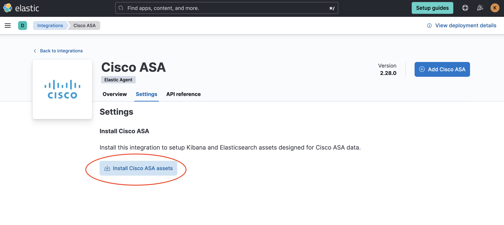

# Syslog Router Integration

The Syslog Router integration can be used on a stream of syslog events to
identify which integrations they belong to and forward to the appropriate
data stream.

## Data streams

Syslog events will be routed to the data stream provided in the pattern
definition. In the event a match cannot be made, an event will be placed
into the `log` data stream. See the **Setup** section in this document for
further explanation on how to configure data streams.

## Requirements

Elasticsearch for storing and searching your data and Kibana for visualizing
and managing it. We recommend using our hosted Elasticsearch Service on
Elastic Cloud, or self-manage the Elastic Stack on your own hardware.
Additionally, to route events to other data streams, the corresponding
Elastic Integration assets will need to be installed.

## Setup

Install the relevant integration assets in Kibana.

1. In order for the forwarded event to be properly handled, the target integration's assets (data stream, ingest pipeline, index template, etc.) need to be installed. In Kibana, navigate to **Management** > **Integrations** in the sidebar.

2. Find the relevant integration(s) by searching or browsing the catalog. For example, the Cisco ASA integration. 


3. Navigate to the **Settings** tab and click **Install Cisco ASA assets**. Confirm by clicking **Install Cisco ASA** in the popup.



## Configuration

### Overview

The integration comes preconfigured with a number of pattern definitions. The
pattern definitions are used in the order given. Care must be taken to ensure
the patterns are executed in the correct order. Regular expressions which are
more relaxed and could potentially match against multiple integrations should be
run last and stricter patterns should be run first. The next priority should be
given to integrations which will see the most traffic.

Pattern definitions may be reordered by moving the entire `if/then` block up or
down in the list. For example, moving **Imperva SecureSphere** above **Cisco ASA**:

**Before:**

```yaml
- if:
    and:
      - not.has_fields: _conf.dataset
      - regexp.message: "%ASA-"
  then:
    - add_fields:
        target: ''
        fields:
          _conf.dataset: "cisco_asa.log"
          _conf.tz_offset: "UTC"
          _temp_.internal_zones: ['trust']
          _temp_.external_zones: ['untrust']
- if:
    and:
      - not.has_fields: _conf.dataset
      - regexp.message: "CEF:0\\|Imperva Inc.\\|SecureSphere"
  then:
    - add_fields:
        target: ''
        fields:
          _conf.dataset: "imperva.securesphere"
    - decode_cef:
        field: message
```

**After:**

```yaml
- if:
    and:
      - not.has_fields: _conf.dataset
      - regexp.message: "CEF:0\\|Imperva Inc.\\|SecureSphere"
  then:
    - add_fields:
        target: ''
        fields:
          _conf.dataset: "imperva.securesphere"
    - decode_cef:
        field: message
- if:
    and:
      - not.has_fields: _conf.dataset
      - regexp.message: "%ASA-"
  then:
    - add_fields:
        target: ''
        fields:
          _conf.dataset: "cisco_asa.log"
          _conf.tz_offset: "UTC"
          _temp_.internal_zones: ['trust']
          _temp_.external_zones: ['untrust']
```

Individual pattern definitions may be disabled by removing the definition
entirely or by inserting comment characters (`#`) in front of the appropriate lines:

```yaml
# - if:
#     and:
#       - not.has_fields: _conf.dataset
#       - regexp.message: "%ASA-"
#   then:
#     - add_fields:
#         target: ''
#         fields:
#           _conf.dataset: "cisco_asa.log"
#           _conf.tz_offset: "UTC"
#           _temp_.internal_zones: ['trust']
#           _temp_.external_zones: ['untrust']
```

### Adding New Patterns

Example configuration:

```yaml
- if:
    and:
      - not.has_fields: _conf.dataset
      - regexp.message: "CEF:0\\|Imperva Inc.\\|SecureSphere"
  then:
    - add_fields:
        target: ''
        fields:
          _conf.dataset: "imperva.securesphere"
    - decode_cef:
        field: message
```

At its core, the Syslog Router integration utilizes the [built-in conditionals and processors](https://www.elastic.co/guide/en/beats/filebeat/current/defining-processors.html)
provided within Beats. While there are certain requirements that need to be
maintained, additional conditions and processors may be added, if required.

The top level of each configuration contains an `if`/`else` condition. In the
`if` statement, an `and` combines two conditions. The first ensures that another
match has not already occurred, while the second condition is a `regex`, or regular
expression, which performs the actual match. If the regular expression
matches the `message` field, then the processors in the `then` statement of the
configuration will run.

If multiple patterns are required, they may be combined with an `or` condition:

```yaml
- if:
    and:
      - not.has_fields: _conf.dataset
      - or:
        - regexp.message: <PATTERN_1>
        - regexp.message: <PATTERN_2>
```

In the `then` statement, a list of processors can be given. At minimum, an 
`add_fields` processor needs to be added with the following fields:

**Required fields:**

- `_conf.dataset`: The dataset (`integration.data_stream`) to forward to. This field is used by the routing rules in the integration to route documents to the correct pipeline.

Additional processors, such as `decode_cef` or `syslog`, may be provided if
additional processing is required.

## Compatibility

Out of the box, the Syslog Router integration supports matching events from a
number of integrations. Assets from these integrations must still be installed
for events to be properly indexed (see **Setup** above).

**DISCLAIMER**: Due to subtle differences in how devices can emit syslog events,
the patterns provided by default with the Syslog Router integration may not work
in all cases. Some integrations may not be listed here, even though they support
syslog events. In these cases, patterns would either be too complex or could
overlap with patterns from other integrations, resulting in negative impacts on
performance or accuracy in matching events to integrations. Custom patterns will
need to be created for these cases.

- Arista NG Firewall
- Check Point
- Cisco ASA
- Cisco FTD
- Cisco ISE
- Cisco Secure Email Gateway
- Citrix WAF (CEF format only)
- Fortinet FortiEDR
- Fortinet FortiGate
- Fortinet FortiMail
- Fortinet FortiManager
- Fortinet FortiProxy
- Imperva SecureSphere (CEF format only)
- Iptables
- Juniper SRX
- Palo Alto Next-Gen Firewall
- QNAP NAS
- Snort
- Sonicwall Firewall
- Sophos XG
- Stormshield
