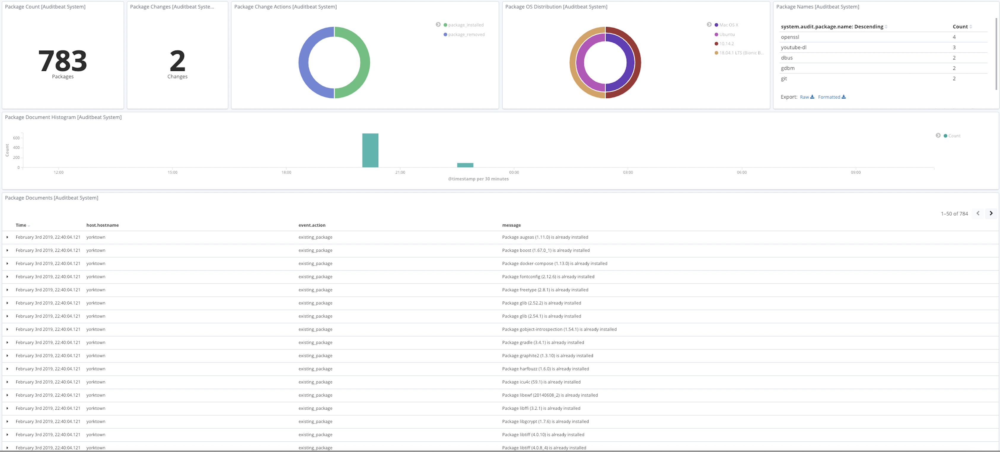
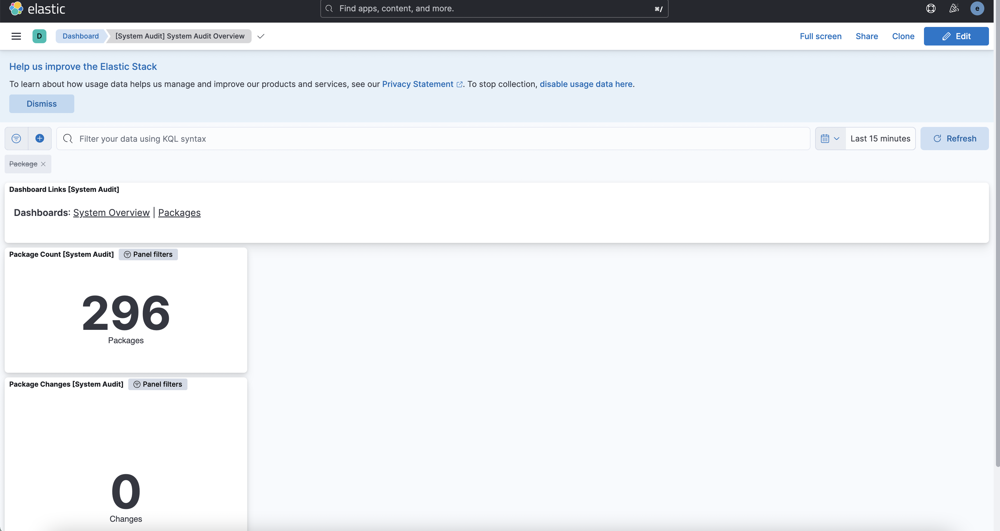

# System Audit Integration [Beta]

## Overview

The `System Audit` integration collects various security-related information about
a system. All data streams send both periodic state information (e.g. all currently
installed packages) and real-time changes (e.g. when a new package is installed/uninstalled
or an existing package is updated). Currently, the only implemented data stream is the
package data stream, which collects various information about system packages. In the future, 
more data streams like (process, socket, hosts .. etc) will be added.

## How it works

Each data stream sends two kinds of information: state and events.

State information is sent periodically. A state update will consist of events
for each package that is installed or has had its state change in the polling period.
All events belonging to the same state update will share the same UUID in `event.id`.

The frequency of state updates can be controlled for all data streams using the
`state.period` configuration option. The default is `12h`.

Event information is sent as the events occur (e.g. a package is installed, uninstalled or updated).
All data streams are currently using a poll model to retrieve their data.
The frequency of these polls is controlled by the `period` configuration parameter.

### Entity IDs

This module populates `entity_id` fields to uniquely identify entities (packages) within a host.
This requires the module to obtain a unique identifier for the host:

- macOS: Uses the value returned by `gethostuuid(2)` system call.
- Linux: Uses the content of one of the following files, created by either
`systemd` or `dbus`:
 * /etc/machine-id
 * /var/lib/dbus/machine-id
 * /var/db/dbus/machine-id

**NOTE:** Under CentOS 6.x, it's possible that none of the files above exist. In that case, running `dbus-uuidgen --ensure` (provided by the `dbus` package)
will generate one for you. One more thing to consider is that at the moment this integration is **not supported on Windows** systems.

## Requirements

You need Elasticsearch for storing and searching your data and Kibana for visualizing and managing it.
You can use our hosted Elasticsearch Service on Elastic Cloud, which is recommended, or self-manage the Elastic Stack on your own hardware.

## Setup

For step-by-step instructions on how to set up an integration, see the [Getting Started](https://www.elastic.co/guide/en/welcome-to-elastic/current/getting-started-observability.html) guide.

**NOTE:** If you want to supress `host` related information, please consider adding the tag: `forwarded`. Adding this tag to the tag list will remove
any host-related data from the output, this will also stop certain dashboards from displaying host/os-related information/charts.
## Data Streams
The data streams which are currently supported are:-
 - package

**Package** helps you keep a record of events and changes happening to different packages on your system. The fields & events associated with the
data stream are as follows:-

**Exported fields**

| Field | Description | Type |
|---|---|---|
| @timestamp | Date/time when the event originated. This is the date/time extracted from the event, typically representing when the event was generated by the source. If the event source has no original timestamp, this value is typically populated by the first time the event was received by the pipeline. Required field for all events. | date |
| data_stream.dataset | The field can contain anything that makes sense to signify the source of the data. Examples include `nginx.access`, `prometheus`, `endpoint` etc. For data streams that otherwise fit, but that do not have dataset set we use the value "generic" for the dataset value. `event.dataset` should have the same value as `data_stream.dataset`. Beyond the Elasticsearch data stream naming criteria noted above, the `dataset` value has additional restrictions:   \* Must not contain `-`   \* No longer than 100 characters | constant_keyword |
| data_stream.namespace | A user defined namespace. Namespaces are useful to allow grouping of data. Many users already organize their indices this way, and the data stream naming scheme now provides this best practice as a default. Many users will populate this field with `default`. If no value is used, it falls back to `default`. Beyond the Elasticsearch index naming criteria noted above, `namespace` value has the additional restrictions:   \* Must not contain `-`   \* No longer than 100 characters | constant_keyword |
| data_stream.type | An overarching type for the data stream. Currently allowed values are "logs" and "metrics". We expect to also add "traces" and "synthetics" in the near future. | constant_keyword |
| ecs.version | ECS version this event conforms to. `ecs.version` is a required field and must exist in all events. When querying across multiple indices -- which may conform to slightly different ECS versions -- this field lets integrations adjust to the schema version of the events. | keyword |
| event.dataset | Event dataset | constant_keyword |
| event.module | Event module | constant_keyword |
| event.original | Raw text message of entire event. Used to demonstrate log integrity or where the full log message (before splitting it up in multiple parts) may be required, e.g. for reindex. This field is not indexed and doc_values are disabled. It cannot be searched, but it can be retrieved from `_source`. If users wish to override this and index this field, please see `Field data types` in the `Elasticsearch Reference`. | keyword |
| host.architecture | Operating system architecture. | keyword |
| host.domain | Name of the domain of which the host is a member. For example, on Windows this could be the host's Active Directory domain or NetBIOS domain name. For Linux this could be the domain of the host's LDAP provider. | keyword |
| host.hostname | Hostname of the host. It normally contains what the `hostname` command returns on the host machine. | keyword |
| host.id | Unique host id. As hostname is not always unique, use values that are meaningful in your environment. Example: The current usage of `beat.name`. | keyword |
| host.ip | Host ip addresses. | ip |
| host.mac | Host MAC addresses. The notation format from RFC 7042 is suggested: Each octet (that is, 8-bit byte) is represented by two [uppercase] hexadecimal digits giving the value of the octet as an unsigned integer. Successive octets are separated by a hyphen. | keyword |
| host.name | Name of the host. It can contain what hostname returns on Unix systems, the fully qualified domain name (FQDN), or a name specified by the user. The recommended value is the lowercase FQDN of the host. | keyword |
| host.os.family | OS family (such as redhat, debian, freebsd, windows). | keyword |
| host.os.kernel | Operating system kernel version as a raw string. | keyword |
| host.os.name | Operating system name, without the version. | keyword |
| host.os.name.text | Multi-field of `host.os.name`. | match_only_text |
| host.os.platform | Operating system platform (such centos, ubuntu, windows). | keyword |
| host.os.version | Operating system version as a raw string. | keyword |
| host.type | Type of host. For Cloud providers this can be the machine type like `t2.medium`. If vm, this could be the container, for example, or other information meaningful in your environment. | keyword |
| input.type | Type of Auditbeat input. | keyword |
| log.level | Original log level of the log event. If the source of the event provides a log level or textual severity, this is the one that goes in `log.level`. If your source doesn't specify one, you may put your event transport's severity here (e.g. Syslog severity). Some examples are `warn`, `err`, `i`, `informational`. | keyword |
| message | For log events the message field contains the log message, optimized for viewing in a log viewer. For structured logs without an original message field, other fields can be concatenated to form a human-readable summary of the event. If multiple messages exist, they can be combined into one message. | match_only_text |
| package.architecture | Package architecture. | keyword |
| package.build_version | Additional information about the build version of the installed package. For example use the commit SHA of a non-released package. | keyword |
| package.checksum | Checksum of the installed package for verification. | keyword |
| package.description | Description of the package. | keyword |
| package.install_scope | Indicating how the package was installed, e.g. user-local, global. | keyword |
| package.installed | Time when package was installed. | date |
| package.license | License under which the package was released. Use a short name, e.g. the license identifier from SPDX License List where possible (https://spdx.org/licenses/). | keyword |
| package.name | Package name | keyword |
| package.path | Path where the package is installed. | keyword |
| package.reference | Home page or reference URL of the software in this package, if available. | keyword |
| package.size | Package size in bytes. | long |
| package.type | Type of package. This should contain the package file type, rather than the package manager name. Examples: rpm, dpkg, brew, npm, gem, nupkg, jar. | keyword |
| package.version | Package version | keyword |
| system_audit.package.arch | Package architecture. | keyword |
| system_audit.package.entity_id | ID uniquely identifying the package. It is computed as a SHA-256 hash of the   host ID, package name, and package version. | keyword |
| system_audit.package.installtime | Package install time. | date |
| system_audit.package.license | Package license. | keyword |
| system_audit.package.name | Package name. | keyword |
| system_audit.package.release | Package release. | keyword |
| system_audit.package.size | Package size. | long |
| system_audit.package.summary | Package summary. |  |
| system_audit.package.url | Package URL. | keyword |
| system_audit.package.version | Package version. | keyword |
| tags | User defined tags | keyword |


An example event for `package` looks as following:

```json
{
    "@timestamp": "2023-01-31T11:44:38.695Z",
    "agent": {
        "ephemeral_id": "c9a6d8c0-780c-4b96-81f2-5a8c850bd0cc",
        "id": "027bc354-85a6-40d6-be9d-7eb4533fbd18",
        "name": "docker-fleet-agent",
        "type": "auditbeat",
        "version": "8.5.1"
    },
    "data_stream": {
        "dataset": "system_audit.package",
        "namespace": "ep",
        "type": "logs"
    },
    "ecs": {
        "version": "8.9.0"
    },
    "elastic_agent": {
        "id": "027bc354-85a6-40d6-be9d-7eb4533fbd18",
        "snapshot": false,
        "version": "8.5.1"
    },
    "event": {
        "action": "existing_package",
        "agent_id_status": "verified",
        "category": [
            "package"
        ],
        "dataset": "system_audit.package",
        "id": "f2b5baf6-fd22-490a-82fd-a044ff7075cb",
        "ingested": "2023-01-31T11:44:40Z",
        "kind": "state",
        "module": "system",
        "type": [
            "info"
        ]
    },
    "host": {
        "architecture": "x86_64",
        "containerized": false,
        "hostname": "docker-fleet-agent",
        "id": "75e38940166b4dbc90b6f5610e8e9c39",
        "ip": [
            "192.168.80.7"
        ],
        "mac": [
            "02-42-C0-A8-50-07"
        ],
        "name": "docker-fleet-agent",
        "os": {
            "codename": "focal",
            "family": "debian",
            "kernel": "5.15.49-linuxkit",
            "name": "Ubuntu",
            "platform": "ubuntu",
            "type": "linux",
            "version": "20.04.5 LTS (Focal Fossa)"
        }
    },
    "input": {
        "type": "audit/system"
    },
    "message": "Package adduser (3.118ubuntu2) is already installed",
    "package": {
        "architecture": "all",
        "description": "add and remove users and groups",
        "name": "adduser",
        "size": 624,
        "type": "dpkg",
        "version": "3.118ubuntu2"
    },
    "system_audit": {
        "package": {
            "arch": "all",
            "entity_id": "OnUSNhuUQkyYgoKf",
            "name": "adduser",
            "size": 624,
            "summary": "add and remove users and groups",
            "version": "3.118ubuntu2"
        }
    },
    "tags": [
        "audit-system-package"
    ]
}
```

### Example dashboard

The integration comes with a package & audit system dashboard for easy identification of events and data overview :

**Package Dashboard:**


**System Audit Dashboard:**


## Reference
For further information, please look at the [Auditbeat System Module](https://www.elastic.co/guide/en/beats/auditbeat/master/auditbeat-module-system.html) documentation.