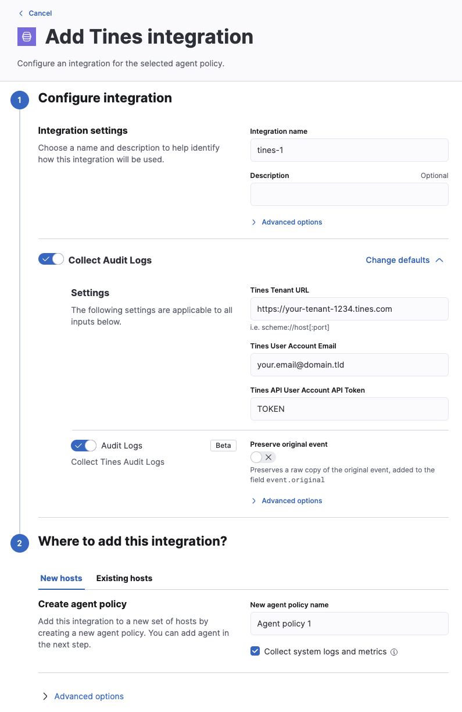
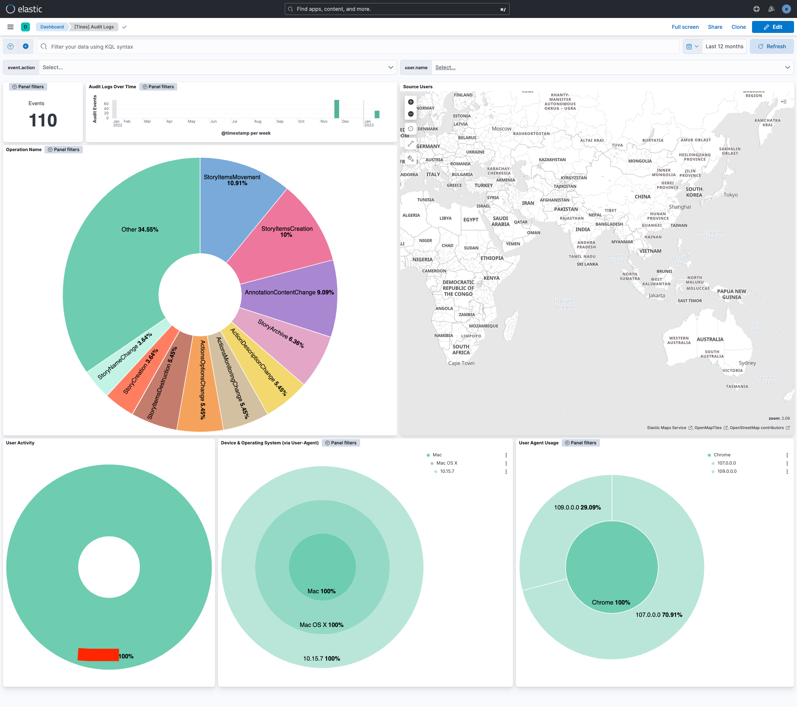
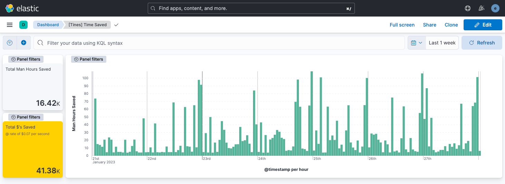

# Tines Integration

Tines makes data, including logs, related to use and configuration of a Tines tenant available via a REST API.

This integration can be used to collect:
1. [audit logs](https://www.tines.com/api/audit-logs)
2. [time saved reports](https://www.tines.com/api/reporting/time_saved)

The Tines API documentation is available via [this page](https://www.tines.com/api/welcome).

## Compatibility

The package collects "audit log" events and "time saved" reports from the Tines API.

At present the only API version available, and hence the version assumed to be polled by this integration, is v1.

The audit logs list endpoint is [documented here](https://www.tines.com/api/audit-logs/list).

The time saved reporting endpoint is [documented here](https://www.tines.com/api/reporting/time_saved).

## Configuration

### Find your Tines tenant URL

This is available within the Tines web interface via the URL bar, e.g. https://your-tenant-1234.tines.com

**NOTE**: the trailing domain may be tines.io for your particular tenant.

### Create a Tines user API key

Refer to [this documentation](https://www.tines.com/api/authentication) from Tines regarding how to create an API key.

The API key can be either a Personal or Tenant API key.

### Enabling the integration in Elastic

1. In Kibana go to **Management > Integrations**
2. In "Search for integrations" search bar type **Tines**
3. Click on "Tines" integration from the search results.
4. Click on **Add Tines** button to add the Tines integration.
5. Modify the Tines Tenant URL as appropriate
6. Insert your Tines API user email address
7. Insert the Tines API key created associated with the API user email address



## Dashboards

There are two dashboards immediately available as part of the integration.

The Tines Audit Logs summary dashboard,



And the Tines Time Saved dashboard,



## Data Stream

### audit_logs

All fields ingested to this data stream are stored under `tines.audit_log` as each audit_log event is stored individually.

**Exported fields**

| Field | Description | Type |
|---|---|---|
| @timestamp | Date/time when the event originated. This is the date/time extracted from the event, typically representing when the event was generated by the source. If the event source has no original timestamp, this value is typically populated by the first time the event was received by the pipeline. Required field for all events. | date |
| data_stream.dataset | The field can contain anything that makes sense to signify the source of the data. Examples include `nginx.access`, `prometheus`, `endpoint` etc. For data streams that otherwise fit, but that do not have dataset set we use the value "generic" for the dataset value. `event.dataset` should have the same value as `data_stream.dataset`. Beyond the Elasticsearch data stream naming criteria noted above, the `dataset` value has additional restrictions:   \* Must not contain `-`   \* No longer than 100 characters | constant_keyword |
| data_stream.namespace | A user defined namespace. Namespaces are useful to allow grouping of data. Many users already organize their indices this way, and the data stream naming scheme now provides this best practice as a default. Many users will populate this field with `default`. If no value is used, it falls back to `default`. Beyond the Elasticsearch index naming criteria noted above, `namespace` value has the additional restrictions:   \* Must not contain `-`   \* No longer than 100 characters | constant_keyword |
| data_stream.type | An overarching type for the data stream. Currently allowed values are "logs" and "metrics". We expect to also add "traces" and "synthetics" in the near future. | constant_keyword |
| input.type |  | keyword |
| tines.audit_log.created_at | The date and time that the audit log event occurred | date |
| tines.audit_log.id | A unique ID for the audit log event | long |
| tines.audit_log.inputs.actionIds |  | long |
| tines.audit_log.inputs.diagramNoteIds |  | long |
| tines.audit_log.inputs.inputs.actionId |  | long |
| tines.audit_log.inputs.inputs.actionIds |  | long |
| tines.audit_log.inputs.inputs.actions.actionId |  | long |
| tines.audit_log.inputs.inputs.actions.options |  | keyword |
| tines.audit_log.inputs.inputs.actions.schedule.cron |  | keyword |
| tines.audit_log.inputs.inputs.actions.schedule.timezone |  | keyword |
| tines.audit_log.inputs.inputs.agents |  | flattened |
| tines.audit_log.inputs.inputs.allowedHosts |  | keyword |
| tines.audit_log.inputs.inputs.authenticationTokenId |  | long |
| tines.audit_log.inputs.inputs.awsAccessKey |  | keyword |
| tines.audit_log.inputs.inputs.awsAssumedRoleArn |  | keyword |
| tines.audit_log.inputs.inputs.awsAssumedRoleExternalId |  | keyword |
| tines.audit_log.inputs.inputs.awsAuthenticationType |  | keyword |
| tines.audit_log.inputs.inputs.awsSecretKey |  | keyword |
| tines.audit_log.inputs.inputs.delta.x |  | long |
| tines.audit_log.inputs.inputs.delta.y |  | long |
| tines.audit_log.inputs.inputs.description |  | keyword |
| tines.audit_log.inputs.inputs.diagramNoteIds |  | long |
| tines.audit_log.inputs.inputs.diagramNotes |  | flattened |
| tines.audit_log.inputs.inputs.editingSource |  | keyword |
| tines.audit_log.inputs.inputs.eventName |  | keyword |
| tines.audit_log.inputs.inputs.httpRequestLocationOfToken |  | keyword |
| tines.audit_log.inputs.inputs.httpRequestOptions |  | keyword |
| tines.audit_log.inputs.inputs.icon |  | keyword |
| tines.audit_log.inputs.inputs.id |  | long |
| tines.audit_log.inputs.inputs.isServiceToken |  | boolean |
| tines.audit_log.inputs.inputs.jwtAlgorithm |  | keyword |
| tines.audit_log.inputs.inputs.jwtAutoGenerateTimeClaims |  | keyword |
| tines.audit_log.inputs.inputs.jwtHs256Secret |  | keyword |
| tines.audit_log.inputs.inputs.jwtPayload |  | keyword |
| tines.audit_log.inputs.inputs.jwtPrivateKey |  | keyword |
| tines.audit_log.inputs.inputs.links |  | flattened |
| tines.audit_log.inputs.inputs.mode |  | keyword |
| tines.audit_log.inputs.inputs.mtlsClientCertificate |  | keyword |
| tines.audit_log.inputs.inputs.mtlsClientPrivateKey |  | keyword |
| tines.audit_log.inputs.inputs.mtlsRootCertificate |  | keyword |
| tines.audit_log.inputs.inputs.name |  | keyword |
| tines.audit_log.inputs.inputs.oauthClientId |  | keyword |
| tines.audit_log.inputs.inputs.oauthClientSecret |  | keyword |
| tines.audit_log.inputs.inputs.oauthGrantType |  | keyword |
| tines.audit_log.inputs.inputs.oauthPkceCodeChallengeMethod |  | keyword |
| tines.audit_log.inputs.inputs.oauthScope |  | keyword |
| tines.audit_log.inputs.inputs.oauthTokenUrl |  | keyword |
| tines.audit_log.inputs.inputs.oauthUrl |  | keyword |
| tines.audit_log.inputs.inputs.options.createFormEmptyState |  | boolean |
| tines.audit_log.inputs.inputs.readAccess |  | keyword |
| tines.audit_log.inputs.inputs.sharedTeamSlugs |  | keyword |
| tines.audit_log.inputs.inputs.source |  | keyword |
| tines.audit_log.inputs.inputs.standardLibVersion |  | keyword |
| tines.audit_log.inputs.inputs.storyId |  | long |
| tines.audit_log.inputs.inputs.teamId |  | long |
| tines.audit_log.inputs.inputs.value |  | keyword |
| tines.audit_log.inputs.linkIds |  | long |
| tines.audit_log.inputs.storyId |  | long |
| tines.audit_log.operation_name | The name of the operation | keyword |
| tines.audit_log.request_ip | The IP Address the operation was triggered from | keyword |
| tines.audit_log.request_user_agent | The user agent that the operation was triggered with | keyword |
| tines.audit_log.tenant_id | The ID of the tenant the operation was triggered on | long |
| tines.audit_log.updated_at | The date and time that the audit log event was updated | date |
| tines.audit_log.user_email | The email of the user who triggered the operation | keyword |
| tines.audit_log.user_id | The ID of the user who triggered the operation | long |
| tines.audit_log.user_name | The name of the user who triggered the operation | keyword |
| tines.tenant_url | The tenant URL associated that provided the event | keyword |


An example event for `audit` looks as following:

```json
{
    "@timestamp": "2023-01-22T11:33:22.000Z",
    "agent": {
        "ephemeral_id": "da7a5bbc-6809-4d23-8733-e47afd05ca88",
        "id": "681e4da0-a57a-4818-b61e-2bb4a9557356",
        "name": "docker-fleet-agent",
        "type": "filebeat",
        "version": "8.5.1"
    },
    "data_stream": {
        "dataset": "tines.audit_logs",
        "namespace": "ep",
        "type": "logs"
    },
    "ecs": {
        "version": "8.11.0"
    },
    "elastic_agent": {
        "id": "681e4da0-a57a-4818-b61e-2bb4a9557356",
        "snapshot": false,
        "version": "8.5.1"
    },
    "event": {
        "action": "StoryItemsCreation",
        "agent_id_status": "verified",
        "category": [
            "configuration"
        ],
        "created": "2023-01-27T15:49:17.946Z",
        "dataset": "tines.audit_logs",
        "id": "3706009",
        "ingested": "2023-01-27T15:49:18Z",
        "original": "{\"created_at\":\"2023-01-22T11:33:22Z\",\"id\":3706009,\"inputs\":{\"inputs\":{\"agents\":[{\"form\":null,\"name\":\"HTTP Request Action\",\"position\":{\"x\":786,\"y\":331},\"timeSavedUnit\":\"minutes\",\"timeSavedValue\":0,\"type\":\"httpRequest\"}],\"diagramNotes\":[],\"links\":[],\"options\":{\"createFormEmptyState\":true},\"storyId\":146411},\"liveEvents\":null},\"operation_name\":\"StoryItemsCreation\",\"request_ip\":\"216.160.83.56\",\"request_user_agent\":\"Mozilla/5.0 (Macintosh; Intel Mac OS X 10_15_7) AppleWebKit/537.36 (KHTML, like Gecko) Chrome/109.0.0.0 Safari/537.36\",\"tenant_id\":1234,\"updated_at\":\"2023-01-22T11:33:22Z\",\"user_email\":\"example.user@your.domain.tld\",\"user_id\":1234,\"user_name\":\"Example User\"}",
        "type": [
            "info"
        ]
    },
    "input": {
        "type": "httpjson"
    },
    "related": {
        "ip": [
            "216.160.83.56"
        ],
        "user": [
            "Example User"
        ]
    },
    "source": {
        "as": {
            "number": 209
        },
        "geo": {
            "city_name": "Milton",
            "continent_name": "North America",
            "country_iso_code": "US",
            "country_name": "United States",
            "location": {
                "lat": 47.2513,
                "lon": -122.3149
            },
            "region_iso_code": "US-WA",
            "region_name": "Washington"
        },
        "ip": "216.160.83.56"
    },
    "tags": [
        "preserve_original_event",
        "preserve_duplicate_custom_fields",
        "forwarded"
    ],
    "tines": {
        "audit_log": {
            "created_at": "2023-01-22T11:33:22Z",
            "id": 3706009,
            "inputs": {
                "inputs": {
                    "agents": [
                        {
                            "name": "HTTP Request Action",
                            "position": {
                                "x": 786,
                                "y": 331
                            },
                            "timeSavedUnit": "minutes",
                            "timeSavedValue": 0,
                            "type": "httpRequest"
                        }
                    ],
                    "options": {
                        "createFormEmptyState": true
                    },
                    "storyId": 146411
                }
            },
            "operation_name": "StoryItemsCreation",
            "request_ip": "216.160.83.56",
            "request_user_agent": "Mozilla/5.0 (Macintosh; Intel Mac OS X 10_15_7) AppleWebKit/537.36 (KHTML, like Gecko) Chrome/109.0.0.0 Safari/537.36",
            "tenant_id": 1234,
            "updated_at": "2023-01-22T11:33:22Z",
            "user_email": "example.user@your.domain.tld",
            "user_id": 1234,
            "user_name": "Example User"
        },
        "tenant_url": "http://elastic-package-service-tines_api_mock-1:8080"
    },
    "user": {
        "email": "example.user@your.domain.tld",
        "id": "1234",
        "name": "Example User"
    },
    "user_agent": {
        "device": {
            "name": "Mac"
        },
        "name": "Chrome",
        "original": "Mozilla/5.0 (Macintosh; Intel Mac OS X 10_15_7) AppleWebKit/537.36 (KHTML, like Gecko) Chrome/109.0.0.0 Safari/537.36",
        "os": {
            "full": "Mac OS X 10.15.7",
            "name": "Mac OS X",
            "version": "10.15.7"
        },
        "version": "109.0.0.0"
    }
}

```

### time_saved

All fields ingested to this data stream are stored under `tines.time_saved` as each time saved report event is stored individually.

**Exported fields**

| Field | Description | Type |
|---|---|---|
| @timestamp | Date/time when the event originated. This is the date/time extracted from the event, typically representing when the event was generated by the source. If the event source has no original timestamp, this value is typically populated by the first time the event was received by the pipeline. Required field for all events. | date |
| data_stream.dataset | The field can contain anything that makes sense to signify the source of the data. Examples include `nginx.access`, `prometheus`, `endpoint` etc. For data streams that otherwise fit, but that do not have dataset set we use the value "generic" for the dataset value. `event.dataset` should have the same value as `data_stream.dataset`. Beyond the Elasticsearch data stream naming criteria noted above, the `dataset` value has additional restrictions:   \* Must not contain `-`   \* No longer than 100 characters | constant_keyword |
| data_stream.namespace | A user defined namespace. Namespaces are useful to allow grouping of data. Many users already organize their indices this way, and the data stream naming scheme now provides this best practice as a default. Many users will populate this field with `default`. If no value is used, it falls back to `default`. Beyond the Elasticsearch index naming criteria noted above, `namespace` value has the additional restrictions:   \* Must not contain `-`   \* No longer than 100 characters | constant_keyword |
| data_stream.type | An overarching type for the data stream. Currently allowed values are "logs" and "metrics". We expect to also add "traces" and "synthetics" in the near future. | constant_keyword |
| input.type |  | keyword |
| tines.tenant_url | The tenant URL associated that provided the event | keyword |
| tines.time_saved.date | The date and time for the time saved period | date |
| tines.time_saved.story_id | Story ID for time saved | long |
| tines.time_saved.team_id | Team ID for time saved | long |
| tines.time_saved.value | Time saved in seconds | long |


An example event for `time_saved` looks as following:

```json
{
    "@timestamp": "2022-06-01T00:00:00.000Z",
    "agent": {
        "ephemeral_id": "da7a5bbc-6809-4d23-8733-e47afd05ca88",
        "id": "681e4da0-a57a-4818-b61e-2bb4a9557356",
        "name": "docker-fleet-agent",
        "type": "filebeat",
        "version": "8.5.1"
    },
    "data_stream": {
        "dataset": "tines.time_saved",
        "namespace": "ep",
        "type": "logs"
    },
    "ecs": {
        "version": "8.11.0"
    },
    "elastic_agent": {
        "id": "681e4da0-a57a-4818-b61e-2bb4a9557356",
        "snapshot": false,
        "version": "8.5.1"
    },
    "event": {
        "agent_id_status": "verified",
        "created": "2023-01-27T15:49:53.023Z",
        "dataset": "tines.time_saved",
        "ingested": "2023-01-27T15:49:54Z",
        "original": "{\"date\":\"2022-06-01T00:00:00Z\",\"value\":35910}"
    },
    "input": {
        "type": "httpjson"
    },
    "tags": [
        "preserve_original_event",
        "preserve_duplicate_custom_fields",
        "forwarded"
    ],
    "tines": {
        "tenant_url": "http://elastic-package-service-tines_api_mock-1:8080",
        "time_saved": {
            "date": "2022-06-01T00:00:00Z",
            "value": 35910
        }
    }
}

```
