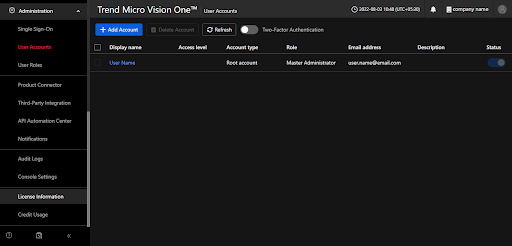
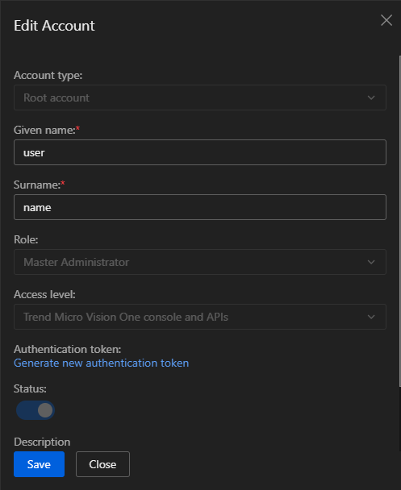

# Trend Micro Vision One

## Overview

The [Trend Micro Vision One](https://www.trendmicro.com/en_in/business/products/detection-response.html) integration allows you to monitor Alert, Audit, and Detection activity. Trend Micro Vision One refers to the ability to do detection and response across email, endpoints, servers, cloud workloads, and networks via a single Trend Micro Vision One platform or the managed Trend Micro Vision One service.

Use the Trend Micro Vision One integration to collects and parses data from the REST APIs. Then visualize that data in Kibana.

## Data streams

The Trend Micro Vision One integration collects logs for three types of events: Alert, Audit, and Detection.

**Alert** Displays information about workbench alerts. See more details in the doc [here](https://automation.trendmicro.com/xdr/api-v3#tag/Workbench/paths/~1v3.0~1workbench~1alerts/get).

**Audit** Displays log entries that match the specified search criteria. See more details in the doc [here](https://automation.trendmicro.com/xdr/api-v3#tag/Audit-Logs).

**Detection** Displays search results from the Detection Data source. See more details in the doc [here](https://automation.trendmicro.com/xdr/api-v3#tag/Search/paths/~1v3.0~1search~1detections/get).

## Requirements

You need Elasticsearch for storing and searching your data and Kibana for visualizing and managing it. You can use our hosted Elasticsearch Service on Elastic Cloud, which is recommended, or self-manage the Elastic Stack on your hardware.

This module has been tested against `Trend Micro Vision One API version 3.0`.

**Note:** The authentication token generated by a user expires one year after being generated.

## Setup

### To collect data from Trend Micro Vision One APIs, the user must have API Token. To create an API token follow the below steps:

1. Log on to the Trend Micro Vision One console.
2. Go to **Administration -> User Accounts**.

3. Click on the account name having appropriate API access permission to generate an API token.

4. Copy the Authentication token.

## Logs Reference

### alert

This is the `alert` dataset.

#### Example

An example event for `alert` looks as following:

```json
{
    "@timestamp": "2023-04-30T00:01:16.000Z",
    "agent": {
        "ephemeral_id": "0d7a0409-56a0-4b49-9a61-d020f4466176",
        "id": "633dac72-aecd-41d9-88df-dd066a3b83ea",
        "name": "docker-fleet-agent",
        "type": "filebeat",
        "version": "8.13.0"
    },
    "data_stream": {
        "dataset": "trend_micro_vision_one.alert",
        "namespace": "ep",
        "type": "logs"
    },
    "ecs": {
        "version": "8.11.0"
    },
    "elastic_agent": {
        "id": "633dac72-aecd-41d9-88df-dd066a3b83ea",
        "snapshot": false,
        "version": "8.13.0"
    },
    "event": {
        "agent_id_status": "verified",
        "category": [
            "email"
        ],
        "created": "2024-04-03T23:51:51.124Z",
        "dataset": "trend_micro_vision_one.alert",
        "id": "WB-9002-20200427-0002",
        "ingested": "2024-04-03T23:52:03Z",
        "kind": "alert",
        "original": "{\"alertProvider\":\"SAE\",\"createdDateTime\":\"2020-04-30T00:01:15Z\",\"description\":\"A backdoor was possibly implanted after a user received a possible spear phishing email message.\",\"id\":\"WB-9002-20200427-0002\",\"impactScope\":{\"accountCount\":0,\"desktopCount\":0,\"emailAddressCount\":0,\"entities\":[{\"entityId\":\"5257b401-2fd7-469c-94fa-39a4f11eb925\",\"entityType\":\"host\",\"entityValue\":\"user@email.com\",\"provenance\":[\"Alert\"],\"relatedEntities\":[\"CODERED\\\\\\\\user\"],\"relatedIndicatorIds\":[1]}],\"serverCount\":0},\"indicators\":[{\"field\":\"request url\",\"filterIds\":[\"f862df72-7f5e-4b2b-9f7f-9148e875f908\"],\"id\":1,\"provenance\":[\"Alert\"],\"relatedEntities\":[\"user@example.com\"],\"type\":\"url\",\"value\":\"http://www.example.com/ab001.zip\"}],\"investigationStatus\":\"New\",\"matchedRules\":[{\"id\":\"5f52d1f1-53e7-411a-b74f-745ee81fa30b\",\"matchedFilters\":[{\"id\":\"ccf86fc1-688f-4131-a46f-1d7a6ee2f88e\",\"matchedDateTime\":\"2019-08-02T04:00:01Z\",\"matchedEvents\":[{\"matchedDateTime\":\"2019-08-02T04:00:01Z\",\"type\":\"TELEMETRY_REGISTRY\",\"uuid\":\"fa9ff47c-e1b8-459e-a3d0-a5b104b854a5\"}],\"mitreTechniqueIds\":[\"T1192\"],\"name\":\"(T1192) Spearphishing Link\"}],\"name\":\"Possible SpearPhishing Email\"}],\"model\":\"Possible APT Attack\",\"schemaVersion\":\"1.0\",\"score\":63,\"severity\":\"critical\",\"updatedDateTime\":\"2023-04-30T00:01:16Z\",\"workbenchLink\":\"https://THE_WORKBENCH_URL\"}",
        "severity": 63,
        "type": [
            "info"
        ]
    },
    "input": {
        "type": "httpjson"
    },
    "log": {
        "level": "critical"
    },
    "tags": [
        "preserve_original_event",
        "preserve_duplicate_custom_fields",
        "forwarded",
        "trend_micro_vision_one-alert"
    ],
    "trend_micro_vision_one": {
        "alert": {
            "alert_provider": "SAE",
            "created_date": "2020-04-30T00:01:15.000Z",
            "description": "A backdoor was possibly implanted after a user received a possible spear phishing email message.",
            "id": "WB-9002-20200427-0002",
            "impact_scope": {
                "account_count": 0,
                "desktop_count": 0,
                "email_address_count": 0,
                "entities": [
                    {
                        "id": "5257b401-2fd7-469c-94fa-39a4f11eb925",
                        "provenance": [
                            "Alert"
                        ],
                        "related_entities": [
                            "CODERED\\\\user"
                        ],
                        "related_indicator_id": [
                            1
                        ],
                        "type": "host",
                        "value": {
                            "account_value": "user@email.com"
                        }
                    }
                ],
                "server_count": 0
            },
            "indicators": [
                {
                    "field": "request url",
                    "filter_id": [
                        "f862df72-7f5e-4b2b-9f7f-9148e875f908"
                    ],
                    "id": 1,
                    "provenance": [
                        "Alert"
                    ],
                    "related_entities": [
                        "user@example.com"
                    ],
                    "type": "url",
                    "value": "http://www.example.com/ab001.zip"
                }
            ],
            "investigation_status": "New",
            "matched_rule": [
                {
                    "filter": [
                        {
                            "date": "2019-08-02T04:00:01.000Z",
                            "events": [
                                {
                                    "date": "2019-08-02T04:00:01.000Z",
                                    "type": "TELEMETRY_REGISTRY",
                                    "uuid": "fa9ff47c-e1b8-459e-a3d0-a5b104b854a5"
                                }
                            ],
                            "id": "ccf86fc1-688f-4131-a46f-1d7a6ee2f88e",
                            "mitre_technique_id": [
                                "T1192"
                            ],
                            "name": "(T1192) Spearphishing Link"
                        }
                    ],
                    "id": "5f52d1f1-53e7-411a-b74f-745ee81fa30b",
                    "name": "Possible SpearPhishing Email"
                }
            ],
            "model": "Possible APT Attack",
            "schema_version": "1.0",
            "score": 63,
            "severity": "critical",
            "workbench_link": "https://THE_WORKBENCH_URL"
        }
    },
    "url": {
        "original": "https://THE_WORKBENCH_URL",
        "scheme": "https"
    }
}
```

**Exported fields**

| Field | Description | Type |
|---|---|---|
| @timestamp | Event timestamp. | date |
| cloud.account.id | The cloud account or organization id used to identify different entities in a multi-tenant environment. Examples: AWS account id, Google Cloud ORG Id, or other unique identifier. | keyword |
| cloud.availability_zone | Availability zone in which this host is running. | keyword |
| cloud.image.id | Image ID for the cloud instance. | keyword |
| cloud.instance.id | Instance ID of the host machine. | keyword |
| cloud.instance.name | Instance name of the host machine. | keyword |
| cloud.machine.type | Machine type of the host machine. | keyword |
| cloud.project.id | Name of the project in Google Cloud. | keyword |
| cloud.provider | Name of the cloud provider. Example values are aws, azure, gcp, or digitalocean. | keyword |
| cloud.region | Region in which this host is running. | keyword |
| container.id | Unique container id. | keyword |
| container.image.name | Name of the image the container was built on. | keyword |
| container.labels | Image labels. | object |
| container.name | Container name. | keyword |
| data_stream.dataset | Data stream dataset. | constant_keyword |
| data_stream.namespace | Data stream namespace. | constant_keyword |
| data_stream.type | Data stream type. | constant_keyword |
| ecs.version | ECS version this event conforms to. `ecs.version` is a required field and must exist in all events. When querying across multiple indices -- which may conform to slightly different ECS versions -- this field lets integrations adjust to the schema version of the events. | keyword |
| event.category | This is one of four ECS Categorization Fields, and indicates the second level in the ECS category hierarchy. `event.category` represents the "big buckets" of ECS categories. For example, filtering on `event.category:process` yields all events relating to process activity. This field is closely related to `event.type`, which is used as a subcategory. This field is an array. This will allow proper categorization of some events that fall in multiple categories. | keyword |
| event.created | `event.created` contains the date/time when the event was first read by an agent, or by your pipeline. This field is distinct from `@timestamp` in that `@timestamp` typically contain the time extracted from the original event. In most situations, these two timestamps will be slightly different. The difference can be used to calculate the delay between your source generating an event, and the time when your agent first processed it. This can be used to monitor your agent's or pipeline's ability to keep up with your event source. In case the two timestamps are identical, `@timestamp` should be used. | date |
| event.dataset | Event dataset. | constant_keyword |
| event.id | Unique ID to describe the event. | keyword |
| event.kind | This is one of four ECS Categorization Fields, and indicates the highest level in the ECS category hierarchy. `event.kind` gives high-level information about what type of information the event contains, without being specific to the contents of the event. For example, values of this field distinguish alert events from metric events. The value of this field can be used to inform how these kinds of events should be handled. They may warrant different retention, different access control, it may also help understand whether the data is coming in at a regular interval or not. | keyword |
| event.module | Event module. | constant_keyword |
| event.original | Raw text message of entire event. Used to demonstrate log integrity or where the full log message (before splitting it up in multiple parts) may be required, e.g. for reindex. This field is not indexed and doc_values are disabled. It cannot be searched, but it can be retrieved from `_source`. If users wish to override this and index this field, please see `Field data types` in the `Elasticsearch Reference`. | keyword |
| event.severity | The numeric severity of the event according to your event source. What the different severity values mean can be different between sources and use cases. It's up to the implementer to make sure severities are consistent across events from the same source. The Syslog severity belongs in `log.syslog.severity.code`. `event.severity` is meant to represent the severity according to the event source (e.g. firewall, IDS). If the event source does not publish its own severity, you may optionally copy the `log.syslog.severity.code` to `event.severity`. | long |
| event.type | This is one of four ECS Categorization Fields, and indicates the third level in the ECS category hierarchy. `event.type` represents a categorization "sub-bucket" that, when used along with the `event.category` field values, enables filtering events down to a level appropriate for single visualization. This field is an array. This will allow proper categorization of some events that fall in multiple event types. | keyword |
| host.architecture | Operating system architecture. | keyword |
| host.containerized | If the host is a container. | boolean |
| host.domain | Name of the domain of which the host is a member. For example, on Windows this could be the host's Active Directory domain or NetBIOS domain name. For Linux this could be the domain of the host's LDAP provider. | keyword |
| host.hostname | Hostname of the host. It normally contains what the `hostname` command returns on the host machine. | keyword |
| host.id | Unique host id. As hostname is not always unique, use values that are meaningful in your environment. Example: The current usage of `beat.name`. | keyword |
| host.ip | Host ip addresses. | ip |
| host.mac | Host mac addresses. | keyword |
| host.name | Name of the host. It can contain what `hostname` returns on Unix systems, the fully qualified domain name, or a name specified by the user. The sender decides which value to use. | keyword |
| host.os.build | OS build information. | keyword |
| host.os.codename | OS codename, if any. | keyword |
| host.os.family | OS family (such as redhat, debian, freebsd, windows). | keyword |
| host.os.kernel | Operating system kernel version as a raw string. | keyword |
| host.os.name | Operating system name, without the version. | keyword |
| host.os.name.text | Multi-field of `host.os.name`. | text |
| host.os.platform | Operating system platform (such centos, ubuntu, windows). | keyword |
| host.os.version | Operating system version as a raw string. | keyword |
| host.type | Type of host. For Cloud providers this can be the machine type like `t2.medium`. If vm, this could be the container, for example, or other information meaningful in your environment. | keyword |
| input.type | Input type | keyword |
| log.level | Original log level of the log event. If the source of the event provides a log level or textual severity, this is the one that goes in `log.level`. If your source doesn't specify one, you may put your event transport's severity here (e.g. Syslog severity). Some examples are `warn`, `err`, `i`, `informational`. | keyword |
| log.offset | Log offset | long |
| related.ip | All of the IPs seen on your event. | ip |
| tags | List of keywords used to tag each event. | keyword |
| trend_micro_vision_one.alert.alert_provider | Alert provider. | keyword |
| trend_micro_vision_one.alert.campaign | An object-ref to a campaign object. | keyword |
| trend_micro_vision_one.alert.created_by | Created by. | keyword |
| trend_micro_vision_one.alert.created_date | Datetime in ISO 8601 format (yyyy-MM-ddThh:mm:ssZ in UTC) that indicates the created date time of the alert. | date |
| trend_micro_vision_one.alert.description | Description of the detection model that triggered the alert. | keyword |
| trend_micro_vision_one.alert.id | Workbench ID. | keyword |
| trend_micro_vision_one.alert.impact_scope.account_count | Count of affected account. | long |
| trend_micro_vision_one.alert.impact_scope.desktop_count | Count of affected desktop. | long |
| trend_micro_vision_one.alert.impact_scope.email_address_count | Count of affected email address. | long |
| trend_micro_vision_one.alert.impact_scope.entities.id |  | keyword |
| trend_micro_vision_one.alert.impact_scope.entities.provenance |  | keyword |
| trend_micro_vision_one.alert.impact_scope.entities.related_entities |  | keyword |
| trend_micro_vision_one.alert.impact_scope.entities.related_indicator_id |  | keyword |
| trend_micro_vision_one.alert.impact_scope.entities.type |  | keyword |
| trend_micro_vision_one.alert.impact_scope.entities.value.account_value | Account or emailAddress. | keyword |
| trend_micro_vision_one.alert.impact_scope.entities.value.guid | GUID. | keyword |
| trend_micro_vision_one.alert.impact_scope.entities.value.id | Impact scope entity id. | keyword |
| trend_micro_vision_one.alert.impact_scope.entities.value.ips | Set of IPs. | ip |
| trend_micro_vision_one.alert.impact_scope.entities.value.name | Host name. | keyword |
| trend_micro_vision_one.alert.impact_scope.entities.value.related_entities | Related entities. | keyword |
| trend_micro_vision_one.alert.impact_scope.entities.value.related_indicator_id | Related indicator ids. | long |
| trend_micro_vision_one.alert.impact_scope.entities.value.type | Impact scope entity type. | keyword |
| trend_micro_vision_one.alert.impact_scope.server_count | Count of affected server. | long |
| trend_micro_vision_one.alert.indicators.field | Detailed description of the indicator. | keyword |
| trend_micro_vision_one.alert.indicators.fields | Detailed description of the indicator. | keyword |
| trend_micro_vision_one.alert.indicators.filter_id | Related matched filter ids. | keyword |
| trend_micro_vision_one.alert.indicators.first_seen_date | First seen date times from related entities, datetime in ISO 8601 format (yyyy-MM-ddThh:mm:ssZ in UTC). | date |
| trend_micro_vision_one.alert.indicators.id | Indicator ID. | keyword |
| trend_micro_vision_one.alert.indicators.last_seen_date | Last seen date times from related entities, datetime in ISO 8601 format (yyyy-MM-ddThh:mm:ssZ in UTC). | date |
| trend_micro_vision_one.alert.indicators.matched_indicator.pattern_id | Matched indicator pattern ids. | keyword |
| trend_micro_vision_one.alert.indicators.provenance | Provenance. | keyword |
| trend_micro_vision_one.alert.indicators.related_entities | Related entities. | keyword |
| trend_micro_vision_one.alert.indicators.type | Indicator type. | keyword |
| trend_micro_vision_one.alert.indicators.value | Indicator value. | keyword |
| trend_micro_vision_one.alert.industry | Industry. | keyword |
| trend_micro_vision_one.alert.investigation_status | Workbench alert status. | keyword |
| trend_micro_vision_one.alert.matched_indicator_count | Matched indicator pattern count. | long |
| trend_micro_vision_one.alert.matched_indicators_pattern.id | Pattern ID. | keyword |
| trend_micro_vision_one.alert.matched_indicators_pattern.matched_log | Pattern matched log. | keyword |
| trend_micro_vision_one.alert.matched_indicators_pattern.pattern | STIX indicator will be a pattern. | keyword |
| trend_micro_vision_one.alert.matched_indicators_pattern.tags | Tags defined by STIX. | keyword |
| trend_micro_vision_one.alert.matched_rule.filter.date | Datetime in ISO 8601 format (yyyy-MM-ddThh:mm:ssZ in UTC). | date |
| trend_micro_vision_one.alert.matched_rule.filter.events.date | Matched event date. | date |
| trend_micro_vision_one.alert.matched_rule.filter.events.type | Matched event type. | keyword |
| trend_micro_vision_one.alert.matched_rule.filter.events.uuid | Matched event uuid. | keyword |
| trend_micro_vision_one.alert.matched_rule.filter.id | Matched filter id. | keyword |
| trend_micro_vision_one.alert.matched_rule.filter.mitre_technique_id | Mitre technique id. | keyword |
| trend_micro_vision_one.alert.matched_rule.filter.name | Filter name. | keyword |
| trend_micro_vision_one.alert.matched_rule.id | The rules are triggered. | keyword |
| trend_micro_vision_one.alert.matched_rule.name | Matched rule name. | keyword |
| trend_micro_vision_one.alert.model | Name of the detection model that triggered the alert. | keyword |
| trend_micro_vision_one.alert.region_and_country | region/country. | keyword |
| trend_micro_vision_one.alert.report_link | A refrerence url which links to the report details analysis. For TrendMico research report, the link would link to trend blog. | keyword |
| trend_micro_vision_one.alert.schema_version | The version of the JSON schema, not the version of alert trigger content. | keyword |
| trend_micro_vision_one.alert.score | Overall severity assigned to the alert based on the severity of the matched detection model and the impact scope. | long |
| trend_micro_vision_one.alert.severity | Workbench alert severity. | keyword |
| trend_micro_vision_one.alert.total_indicator_count | Total indicator pattern count. | long |
| trend_micro_vision_one.alert.workbench_link | Workbench URL. | keyword |
| url.domain | Domain of the url, such as "www.elastic.co". In some cases a URL may refer to an IP and/or port directly, without a domain name. In this case, the IP address would go to the `domain` field. If the URL contains a literal IPv6 address enclosed by `[` and `]` (IETF RFC 2732), the `[` and `]` characters should also be captured in the `domain` field. | keyword |
| url.extension | The field contains the file extension from the original request url, excluding the leading dot. The file extension is only set if it exists, as not every url has a file extension. The leading period must not be included. For example, the value must be "png", not ".png". Note that when the file name has multiple extensions (example.tar.gz), only the last one should be captured ("gz", not "tar.gz"). | keyword |
| url.fragment | Portion of the url after the `#`, such as "top". The `#` is not part of the fragment. | keyword |
| url.original | Unmodified original url as seen in the event source. Note that in network monitoring, the observed URL may be a full URL, whereas in access logs, the URL is often just represented as a path. This field is meant to represent the URL as it was observed, complete or not. | wildcard |
| url.original.text | Multi-field of `url.original`. | match_only_text |
| url.path | Path of the request, such as "/search". | wildcard |
| url.scheme | Scheme of the request, such as "https". Note: The `:` is not part of the scheme. | keyword |


### audit

This is the `audit` dataset.

#### Example

An example event for `audit` looks as following:

```json
{
    "@timestamp": "2022-02-24T07:29:48.000Z",
    "agent": {
        "ephemeral_id": "d3c3e470-8bcc-4e5a-b8b6-e1b25f54c763",
        "id": "f86f831a-cae2-454f-a985-4f579b0ee515",
        "name": "docker-fleet-agent",
        "type": "filebeat",
        "version": "8.7.1"
    },
    "data_stream": {
        "dataset": "trend_micro_vision_one.audit",
        "namespace": "ep",
        "type": "logs"
    },
    "ecs": {
        "version": "8.11.0"
    },
    "elastic_agent": {
        "id": "f86f831a-cae2-454f-a985-4f579b0ee515",
        "snapshot": false,
        "version": "8.7.1"
    },
    "event": {
        "agent_id_status": "verified",
        "category": [
            "authentication"
        ],
        "created": "2023-09-27T08:39:38.449Z",
        "dataset": "trend_micro_vision_one.audit",
        "ingested": "2023-09-27T08:39:39Z",
        "kind": "event",
        "original": "{\"accessType\":\"Console\",\"activity\":\"string\",\"category\":\"Logon and Logoff\",\"details\":{\"property1\":\"string\",\"property2\":\"string\"},\"loggedDateTime\":\"2022-02-24T07:29:48Z\",\"loggedRole\":\"Master Administrator\",\"loggedUser\":\"Root Account\",\"result\":\"Unsuccessful\"}",
        "outcome": "failure",
        "type": [
            "info"
        ]
    },
    "input": {
        "type": "httpjson"
    },
    "related": {
        "user": [
            "Root Account"
        ]
    },
    "source": {
        "user": {
            "name": "Root Account",
            "roles": [
                "Master Administrator"
            ]
        }
    },
    "tags": [
        "preserve_original_event",
        "preserve_duplicate_custom_fields",
        "forwarded",
        "trend_micro_vision_one-audit"
    ],
    "trend_micro_vision_one": {
        "audit": {
            "access_type": "Console",
            "activity": "string",
            "category": "Logon and Logoff",
            "details": {
                "property1": "string",
                "property2": "string"
            },
            "logged_role": "Master Administrator",
            "logged_user": "Root Account",
            "result": "Unsuccessful"
        }
    }
}

```

**Exported fields**

| Field | Description | Type |
|---|---|---|
| @timestamp | Event timestamp. | date |
| cloud.account.id | The cloud account or organization id used to identify different entities in a multi-tenant environment. Examples: AWS account id, Google Cloud ORG Id, or other unique identifier. | keyword |
| cloud.availability_zone | Availability zone in which this host is running. | keyword |
| cloud.image.id | Image ID for the cloud instance. | keyword |
| cloud.instance.id | Instance ID of the host machine. | keyword |
| cloud.instance.name | Instance name of the host machine. | keyword |
| cloud.machine.type | Machine type of the host machine. | keyword |
| cloud.project.id | Name of the project in Google Cloud. | keyword |
| cloud.provider | Name of the cloud provider. Example values are aws, azure, gcp, or digitalocean. | keyword |
| cloud.region | Region in which this host is running. | keyword |
| container.id | Unique container id. | keyword |
| container.image.name | Name of the image the container was built on. | keyword |
| container.labels | Image labels. | object |
| container.name | Container name. | keyword |
| data_stream.dataset | Data stream dataset. | constant_keyword |
| data_stream.namespace | Data stream namespace. | constant_keyword |
| data_stream.type | Data stream type. | constant_keyword |
| ecs.version | ECS version this event conforms to. `ecs.version` is a required field and must exist in all events. When querying across multiple indices -- which may conform to slightly different ECS versions -- this field lets integrations adjust to the schema version of the events. | keyword |
| event.category | This is one of four ECS Categorization Fields, and indicates the second level in the ECS category hierarchy. `event.category` represents the "big buckets" of ECS categories. For example, filtering on `event.category:process` yields all events relating to process activity. This field is closely related to `event.type`, which is used as a subcategory. This field is an array. This will allow proper categorization of some events that fall in multiple categories. | keyword |
| event.created | `event.created` contains the date/time when the event was first read by an agent, or by your pipeline. This field is distinct from `@timestamp` in that `@timestamp` typically contain the time extracted from the original event. In most situations, these two timestamps will be slightly different. The difference can be used to calculate the delay between your source generating an event, and the time when your agent first processed it. This can be used to monitor your agent's or pipeline's ability to keep up with your event source. In case the two timestamps are identical, `@timestamp` should be used. | date |
| event.dataset | Event dataset. | constant_keyword |
| event.kind | This is one of four ECS Categorization Fields, and indicates the highest level in the ECS category hierarchy. `event.kind` gives high-level information about what type of information the event contains, without being specific to the contents of the event. For example, values of this field distinguish alert events from metric events. The value of this field can be used to inform how these kinds of events should be handled. They may warrant different retention, different access control, it may also help understand whether the data is coming in at a regular interval or not. | keyword |
| event.module | Event module. | constant_keyword |
| event.original | Raw text message of entire event. Used to demonstrate log integrity or where the full log message (before splitting it up in multiple parts) may be required, e.g. for reindex. This field is not indexed and doc_values are disabled. It cannot be searched, but it can be retrieved from `_source`. If users wish to override this and index this field, please see `Field data types` in the `Elasticsearch Reference`. | keyword |
| event.type | This is one of four ECS Categorization Fields, and indicates the third level in the ECS category hierarchy. `event.type` represents a categorization "sub-bucket" that, when used along with the `event.category` field values, enables filtering events down to a level appropriate for single visualization. This field is an array. This will allow proper categorization of some events that fall in multiple event types. | keyword |
| host.architecture | Operating system architecture. | keyword |
| host.containerized | If the host is a container. | boolean |
| host.domain | Name of the domain of which the host is a member. For example, on Windows this could be the host's Active Directory domain or NetBIOS domain name. For Linux this could be the domain of the host's LDAP provider. | keyword |
| host.hostname | Hostname of the host. It normally contains what the `hostname` command returns on the host machine. | keyword |
| host.id | Unique host id. As hostname is not always unique, use values that are meaningful in your environment. Example: The current usage of `beat.name`. | keyword |
| host.ip | Host ip addresses. | ip |
| host.mac | Host mac addresses. | keyword |
| host.name | Name of the host. It can contain what `hostname` returns on Unix systems, the fully qualified domain name, or a name specified by the user. The sender decides which value to use. | keyword |
| host.os.build | OS build information. | keyword |
| host.os.codename | OS codename, if any. | keyword |
| host.os.family | OS family (such as redhat, debian, freebsd, windows). | keyword |
| host.os.kernel | Operating system kernel version as a raw string. | keyword |
| host.os.name | Operating system name, without the version. | keyword |
| host.os.name.text | Multi-field of `host.os.name`. | text |
| host.os.platform | Operating system platform (such centos, ubuntu, windows). | keyword |
| host.os.version | Operating system version as a raw string. | keyword |
| host.type | Type of host. For Cloud providers this can be the machine type like `t2.medium`. If vm, this could be the container, for example, or other information meaningful in your environment. | keyword |
| input.type | Input type | keyword |
| log.offset | Log offset | long |
| related.user | All the user names or other user identifiers seen on the event. | keyword |
| source.user.name | Short name or login of the user. | keyword |
| source.user.name.text | Multi-field of `source.user.name`. | match_only_text |
| source.user.roles | Array of user roles at the time of the event. | keyword |
| tags | List of keywords used to tag each event. | keyword |
| trend_micro_vision_one.audit.access_type | Source of the activity. | keyword |
| trend_micro_vision_one.audit.activity | The activity that was performed. | keyword |
| trend_micro_vision_one.audit.category | Category. | keyword |
| trend_micro_vision_one.audit.details | Object that contains a list of elements to be retrieved from the "details" field. | flattened |
| trend_micro_vision_one.audit.logged_role | Role of the account. | keyword |
| trend_micro_vision_one.audit.logged_user | The account that was used to perform the activity. | keyword |
| trend_micro_vision_one.audit.result | Result. | keyword |


### detection

This is the `detection` dataset.

#### Example

An example event for `detection` looks as following:

```json
{
    "@timestamp": "2020-10-15T01:16:32.000Z",
    "agent": {
        "ephemeral_id": "041ba589-51ca-4422-a895-36a10f4568a8",
        "id": "94a80c96-489d-4fc8-aeab-bdef580d21f8",
        "name": "docker-fleet-agent",
        "type": "filebeat",
        "version": "8.11.0"
    },
    "data_stream": {
        "dataset": "trend_micro_vision_one.detection",
        "namespace": "ep",
        "type": "logs"
    },
    "destination": {
        "domain": "Workgroup",
        "ip": [
            "81.2.69.142"
        ],
        "port": 53
    },
    "ecs": {
        "version": "8.11.0"
    },
    "elastic_agent": {
        "id": "94a80c96-489d-4fc8-aeab-bdef580d21f8",
        "snapshot": true,
        "version": "8.11.0"
    },
    "event": {
        "action": "clean",
        "agent_id_status": "verified",
        "category": [
            "intrusion_detection"
        ],
        "created": "2023-10-06T09:10:41.685Z",
        "dataset": "trend_micro_vision_one.detection",
        "id": "100117",
        "ingested": "2023-10-06T09:10:44Z",
        "kind": "event",
        "original": "{\"act\":\"Clean\",\"actResult\":\"Quarantined successfully\",\"app\":\"HTTP\",\"appGroup\":\"HTTP\",\"aptRelated\":\"0\",\"behaviorCat\":\"Grey-Detection\",\"blocking\":\"Web reputation\",\"cat\":50,\"cccaDetection\":\"Yes\",\"cccaDetectionSource\":\"GLOBAL_INTELLIGENCE\",\"cccaRiskLevel\":3,\"clientFlag\":\"dst\",\"cnt\":\"1\",\"component\":[\"PATTERN_VSAPI 17.101.92 2021-09-30 04:23:27-07:00\"],\"compressedFileSize\":\"0\",\"detectionType\":\"File\",\"deviceDirection\":\"outbound\",\"deviceGUID\":\"xxxxxxxx-xxxx-xxxx-xxxx-xxxxxxxxxxxx\",\"deviceMacAddress\":\"00-00-5E-00-53-23\",\"deviceProcessName\":\"/snap/core/10126/usr/lib/snapd/snapd\",\"dhost\":\"samplehost\",\"domainName\":\"Workgroup\",\"dpt\":53,\"dst\":[\"81.2.69.142\"],\"dstGroup\":\"Default\",\"end\":\"2021-09-30T09:40:04-08:00\",\"endpointGUID\":\"1234-1234-1234\",\"endpointHostName\":\"abc-docker\",\"endpointIp\":[\"81.2.69.142\"],\"endpointMacAddress\":\"00-00-5E-00-53-23\",\"engType\":\"Virus Scan Engine (OS 2003, x64)\",\"engVer\":\"12.500.1004\",\"eventId\":\"100117\",\"eventName\":\"INTEGRITY_MONITORING_EVENT\",\"eventSubName\":\"Attack Discovery\",\"eventTime\":1602724592000,\"eventTimeDT\":\"2021-06-10T01:38:38+00:00\",\"fileHash\":\"3395856ce81f2b7382dee72602f798b642f14140\",\"fileName\":[\"Unconfirmed 145081.crdownload\"],\"fileOperation\":\"Deleted\",\"filePath\":\"/etc/systemd/system\",\"filePathName\":\"/etc/systemd/system/snap-xxxx-1246.xxxx\",\"fileSize\":\"0\",\"firstAct\":\"Clean\",\"firstActResult\":\"Unable to clean file\",\"fullPath\":\"C:\\\\\\\\Users\\\\\\\\user1\\\\\\\\Downloads\\\\\\\\Unconfirmed 145081.crdownload\",\"hostName\":\"samplehost\",\"httpReferer\":\"http://www.example.com/\",\"interestedHost\":\"abc-docker\",\"interestedIp\":[\"81.2.69.192\"],\"interestedMacAddress\":\"00-00-5E-00-53-23\",\"mDevice\":[\"81.2.69.192\"],\"mDeviceGUID\":\"C5B09EDD-C725-907F-29D9-B8C30D18C48F\",\"malName\":\"Eicar_test_1\",\"malType\":\"Virus/Malware\",\"mitreMapping\":[\"T1090 (TA0005)\"],\"mitreVersion\":\"v6\",\"mpname\":\"Cloud One - Workload Security\",\"mpver\":\"Deep Security/20.0.222\",\"objectCmd\":[\"C:\\\\\\\\Program Files (x86)\\\\\\\\Microsoft\\\\\\\\Edge\\\\\\\\Application\\\\\\\\msedge.exe --profile-directory=Default\"],\"objectFileHashMd5\":\"761AEFF7E6B110970285B9C20C9E1DCA\",\"objectFileHashSha1\":\"00496B4D53CEFE031B9702B3385C9F4430999932\",\"objectFileHashSha256\":\"7778ED68F4646BAA38C4F36B16A1AE393ACECD694948102B5CF0773AB08237D7\",\"objectFileName\":\"Unconfirmed 142899.crdownload:SmartScreen\",\"objectFilePath\":\"C:\\\\\\\\Users\\\\\\\\user1\\\\\\\\Downloads\\\\\\\\Unconfirmed 142899.crdownload:SmartScreen\",\"objectName\":\"CloudEndpointService.exe\",\"objectPid\":7660,\"objectSigner\":[\"OS\"],\"parentCmd\":\"C:\\\\\\\\os\\\\\\\\system32\\\\\\\\svchost.exe -k DcomLaunch -p\",\"parentFileHashSha1\":\"00496B4D53CEFE031B9702B3385C9F4430999932\",\"parentFileHashSha256\":\"7778ED68F4646BAA38C4F36B16A1AE393ACECD694948102B5CF0773AB08237D7\",\"parentFilePath\":\"C:\\\\\\\\os\\\\\\\\System32\\\\\\\\svchost.exe\",\"peerHost\":\"samplehost\",\"peerIp\":[\"81.2.69.192\"],\"pname\":\"Apex One\",\"processCmd\":\"-ServerName:App.AppX9yct9q388jvt4h7y0gn06smzkxcsnt8m.mca\",\"processFileHashMd5\":\"761AEFF7E6B110970285B9C20C9E1DCA\",\"processFileHashSha1\":\"00496B4D53CEFE031B9702B3385C9F4430999932\",\"processFileHashSha256\":\"7778ED68F4646BAA38C4F36B16A1AE393ACECD694948102B5CF0773AB08237D7\",\"processFilePath\":\"C:\\\\\\\\Program Files (x86)\\\\\\\\os\\\\\\\\Application\\\\\\\\msedge.exe\",\"processName\":\"string\",\"processPid\":0,\"processSigner\":\"OS Publisher\",\"productCode\":\"sao\",\"pver\":\"20.0.0.877\",\"request\":\"https://example.com\",\"requestClientApplication\":\"Mozilla/5.0 (iPhone; CPU iPhone OS 12_1 like Mac OS X) AppleWebKit/605.1.15 (KHTML, like Gecko) Version/12.0 Mobile/15E148 Safari/604.1\",\"rt\":\"2020-10-15T01:16:32.000Z\",\"rt_utc\":\"2020-10-15T01:16:32.000Z\",\"searchDL\":\"DDL\",\"spt\":58871,\"src\":\"81.2.69.192\",\"srcGroup\":\"Default\",\"tacticId\":[\"TA0005\"],\"tags\":[\"XSAE.F2140\",\"XSAE.F3066\"],\"threatName\":\"Malicious_identified_CnC_querying_on_UDP_detected\",\"uuid\":\"1234-1234-1234\"}",
        "severity": 50,
        "type": [
            "info"
        ]
    },
    "file": {
        "hash": {
            "md5": "761AEFF7E6B110970285B9C20C9E1DCA",
            "sha1": "00496B4D53CEFE031B9702B3385C9F4430999932",
            "sha256": "7778ED68F4646BAA38C4F36B16A1AE393ACECD694948102B5CF0773AB08237D7"
        },
        "name": [
            "Unconfirmed 145081.crdownload"
        ],
        "path": "/etc/systemd/system/snap-xxxx-1246.xxxx",
        "size": 0
    },
    "host": {
        "hostname": "samplehost",
        "id": "1234-1234-1234",
        "ip": [
            "81.2.69.142"
        ],
        "mac": "00-00-5E-00-53-23",
        "name": "abc-docker"
    },
    "http": {
        "request": {
            "referrer": "http://www.example.com/"
        }
    },
    "input": {
        "type": "httpjson"
    },
    "network": {
        "direction": "outbound",
        "protocol": "http"
    },
    "observer": {
        "hostname": "samplehost",
        "mac": [
            "00-00-5E-00-53-23"
        ]
    },
    "process": {
        "command_line": "-ServerName:App.AppX9yct9q388jvt4h7y0gn06smzkxcsnt8m.mca",
        "name": "string",
        "pid": 0
    },
    "related": {
        "hash": [
            "761AEFF7E6B110970285B9C20C9E1DCA",
            "00496B4D53CEFE031B9702B3385C9F4430999932",
            "7778ED68F4646BAA38C4F36B16A1AE393ACECD694948102B5CF0773AB08237D7",
            "3395856ce81f2b7382dee72602f798b642f14140"
        ],
        "hosts": [
            "samplehost",
            "abc-docker"
        ],
        "ip": [
            "81.2.69.142",
            "81.2.69.192"
        ]
    },
    "source": {
        "ip": "81.2.69.192",
        "port": 58871
    },
    "tags": [
        "preserve_original_event",
        "preserve_duplicate_custom_fields",
        "forwarded",
        "trend_micro_vision_one-detection"
    ],
    "threat": {
        "tactic": {
            "id": [
                "TA0005"
            ]
        }
    },
    "trend_micro_vision_one": {
        "detection": {
            "action": "Clean",
            "action_result": "Quarantined successfully",
            "behavior_category": "Grey-Detection",
            "block": "Web reputation",
            "client_flag": "dst",
            "component_version": [
                "PATTERN_VSAPI 17.101.92 2021-09-30 04:23:27-07:00"
            ],
            "compressed_file_size": 0,
            "destination": {
                "ip": [
                    "81.2.69.142"
                ],
                "ip_group": "Default",
                "port": 53
            },
            "detection": "Yes",
            "detection_source": "GLOBAL_INTELLIGENCE",
            "detection_type": "File",
            "device": {
                "direction": "outbound",
                "guid": "C5B09EDD-C725-907F-29D9-B8C30D18C48F",
                "host": "samplehost",
                "id": "xxxxxxxx-xxxx-xxxx-xxxx-xxxxxxxxxxxx",
                "ip": [
                    "81.2.69.192"
                ],
                "mac": "00-00-5E-00-53-23",
                "process_name": "/snap/core/10126/usr/lib/snapd/snapd"
            },
            "domain": {
                "name": "Workgroup"
            },
            "end_time": "2021-09-30T17:40:04.000Z",
            "endpoint": {
                "guid": "1234-1234-1234",
                "hostname": "abc-docker",
                "ip": [
                    "81.2.69.142"
                ],
                "mac": "00-00-5E-00-53-23"
            },
            "engine_type": "Virus Scan Engine (OS 2003, x64)",
            "engine_version": "12.500.1004",
            "event_id": "100117",
            "event_name": "INTEGRITY_MONITORING_EVENT",
            "event_time_dt": "2021-06-10T01:38:38.000Z",
            "file_hash": "3395856ce81f2b7382dee72602f798b642f14140",
            "file_name": [
                "Unconfirmed 145081.crdownload"
            ],
            "file_operation": "Deleted",
            "file_path": "/etc/systemd/system",
            "file_path_name": "/etc/systemd/system/snap-xxxx-1246.xxxx",
            "file_size": 0,
            "first_action": "Clean",
            "first_action_result": "Unable to clean file",
            "full_path": "C:\\\\Users\\\\user1\\\\Downloads\\\\Unconfirmed 145081.crdownload",
            "hostname": "samplehost",
            "http_referer": "http://www.example.com/",
            "interested": {
                "host": "abc-docker",
                "ip": [
                    "81.2.69.192"
                ],
                "mac": "00-00-5E-00-53-23"
            },
            "malware_name": "Eicar_test_1",
            "malware_type": "Virus/Malware",
            "mproduct": {
                "name": "Cloud One - Workload Security",
                "version": "Deep Security/20.0.222"
            },
            "object": {
                "cmd": [
                    "C:\\\\Program Files (x86)\\\\Microsoft\\\\Edge\\\\Application\\\\msedge.exe --profile-directory=Default"
                ],
                "file": {
                    "hash": {
                        "md5": "761AEFF7E6B110970285B9C20C9E1DCA",
                        "sha1": "00496B4D53CEFE031B9702B3385C9F4430999932",
                        "sha256": "7778ED68F4646BAA38C4F36B16A1AE393ACECD694948102B5CF0773AB08237D7"
                    },
                    "name": "Unconfirmed 142899.crdownload:SmartScreen",
                    "path": "C:\\\\Users\\\\user1\\\\Downloads\\\\Unconfirmed 142899.crdownload:SmartScreen"
                },
                "name": "CloudEndpointService.exe",
                "pid": 7660,
                "signer": [
                    "OS"
                ]
            },
            "parent": {
                "cmd": "C:\\\\os\\\\system32\\\\svchost.exe -k DcomLaunch -p",
                "file": {
                    "hash": {
                        "sha1": "00496B4D53CEFE031B9702B3385C9F4430999932",
                        "sha256": "7778ED68F4646BAA38C4F36B16A1AE393ACECD694948102B5CF0773AB08237D7"
                    },
                    "path": "C:\\\\os\\\\System32\\\\svchost.exe"
                }
            },
            "peer": {
                "host": "samplehost",
                "ip": [
                    "81.2.69.192"
                ]
            },
            "process": {
                "cmd": "-ServerName:App.AppX9yct9q388jvt4h7y0gn06smzkxcsnt8m.mca",
                "file": {
                    "hash": {
                        "md5": "761AEFF7E6B110970285B9C20C9E1DCA",
                        "sha1": "00496B4D53CEFE031B9702B3385C9F4430999932",
                        "sha256": "7778ED68F4646BAA38C4F36B16A1AE393ACECD694948102B5CF0773AB08237D7"
                    },
                    "path": "C:\\\\Program Files (x86)\\\\os\\\\Application\\\\msedge.exe"
                },
                "name": "string",
                "pid": 0,
                "signer": "OS Publisher"
            },
            "product": {
                "code": "sao",
                "name": "Apex One",
                "version": "20.0.0.877"
            },
            "protocol": "HTTP",
            "protocol_group": "HTTP",
            "related_apt": false,
            "request": "https://example.com",
            "request_client_application": "Mozilla/5.0 (iPhone; CPU iPhone OS 12_1 like Mac OS X) AppleWebKit/605.1.15 (KHTML, like Gecko) Version/12.0 Mobile/15E148 Safari/604.1",
            "risk_level": 3,
            "rt": "2020-10-15T01:16:32.000Z",
            "rt_utc": "2020-10-15T01:16:32.000Z",
            "search_data_lake": "DDL",
            "security_analytics": {
                "engine": {
                    "name": [
                        "T1090 (TA0005)"
                    ],
                    "version": "v6"
                }
            },
            "severity_level": 50,
            "source": {
                "group": "Default",
                "ip": "81.2.69.192",
                "port": 58871
            },
            "sub_name": "Attack Discovery",
            "tactic_id": [
                "TA0005"
            ],
            "tags": [
                "XSAE.F2140",
                "XSAE.F3066"
            ],
            "threat_name": "Malicious_identified_CnC_querying_on_UDP_detected",
            "total_count": 1,
            "uuid": "1234-1234-1234"
        }
    },
    "url": {
        "domain": "example.com",
        "original": "https://example.com",
        "scheme": "https"
    },
    "user_agent": {
        "device": {
            "name": "iPhone"
        },
        "name": "Mobile Safari",
        "original": "Mozilla/5.0 (iPhone; CPU iPhone OS 12_1 like Mac OS X) AppleWebKit/605.1.15 (KHTML, like Gecko) Version/12.0 Mobile/15E148 Safari/604.1",
        "os": {
            "full": "iOS 12.1",
            "name": "iOS",
            "version": "12.1"
        },
        "version": "12.0"
    }
}

```

**Exported fields**

| Field | Description | Type |
|---|---|---|
| @timestamp | Event timestamp. | date |
| client.ip | IP address of the client (IPv4 or IPv6). | ip |
| cloud.account.id | The cloud account or organization id used to identify different entities in a multi-tenant environment. Examples: AWS account id, Google Cloud ORG Id, or other unique identifier. | keyword |
| cloud.availability_zone | Availability zone in which this host is running. | keyword |
| cloud.image.id | Image ID for the cloud instance. | keyword |
| cloud.instance.id | Instance ID of the host machine. | keyword |
| cloud.instance.name | Instance name of the host machine. | keyword |
| cloud.machine.type | Machine type of the host machine. | keyword |
| cloud.project.id | Name of the project in Google Cloud. | keyword |
| cloud.provider | Name of the cloud provider. Example values are aws, azure, gcp, or digitalocean. | keyword |
| cloud.region | Region in which this host is running. | keyword |
| container.id | Unique container id. | keyword |
| container.image.name | Name of the image the container was built on. | keyword |
| container.labels | Image labels. | object |
| container.name | Container name. | keyword |
| data_stream.dataset | Data stream dataset. | constant_keyword |
| data_stream.namespace | Data stream namespace. | constant_keyword |
| data_stream.type | Data stream type. | constant_keyword |
| destination.domain | The domain name of the destination system. This value may be a host name, a fully qualified domain name, or another host naming format. The value may derive from the original event or be added from enrichment. | keyword |
| destination.ip | IP address of the destination (IPv4 or IPv6). | ip |
| destination.port | Port of the destination. | long |
| ecs.version | ECS version this event conforms to. `ecs.version` is a required field and must exist in all events. When querying across multiple indices -- which may conform to slightly different ECS versions -- this field lets integrations adjust to the schema version of the events. | keyword |
| event.category | This is one of four ECS Categorization Fields, and indicates the second level in the ECS category hierarchy. `event.category` represents the "big buckets" of ECS categories. For example, filtering on `event.category:process` yields all events relating to process activity. This field is closely related to `event.type`, which is used as a subcategory. This field is an array. This will allow proper categorization of some events that fall in multiple categories. | keyword |
| event.created | `event.created` contains the date/time when the event was first read by an agent, or by your pipeline. This field is distinct from `@timestamp` in that `@timestamp` typically contain the time extracted from the original event. In most situations, these two timestamps will be slightly different. The difference can be used to calculate the delay between your source generating an event, and the time when your agent first processed it. This can be used to monitor your agent's or pipeline's ability to keep up with your event source. In case the two timestamps are identical, `@timestamp` should be used. | date |
| event.dataset | Event dataset. | constant_keyword |
| event.kind | This is one of four ECS Categorization Fields, and indicates the highest level in the ECS category hierarchy. `event.kind` gives high-level information about what type of information the event contains, without being specific to the contents of the event. For example, values of this field distinguish alert events from metric events. The value of this field can be used to inform how these kinds of events should be handled. They may warrant different retention, different access control, it may also help understand whether the data is coming in at a regular interval or not. | keyword |
| event.module | Event module. | constant_keyword |
| event.original | Raw text message of entire event. Used to demonstrate log integrity or where the full log message (before splitting it up in multiple parts) may be required, e.g. for reindex. This field is not indexed and doc_values are disabled. It cannot be searched, but it can be retrieved from `_source`. If users wish to override this and index this field, please see `Field data types` in the `Elasticsearch Reference`. | keyword |
| event.severity | The numeric severity of the event according to your event source. What the different severity values mean can be different between sources and use cases. It's up to the implementer to make sure severities are consistent across events from the same source. The Syslog severity belongs in `log.syslog.severity.code`. `event.severity` is meant to represent the severity according to the event source (e.g. firewall, IDS). If the event source does not publish its own severity, you may optionally copy the `log.syslog.severity.code` to `event.severity`. | long |
| event.type | This is one of four ECS Categorization Fields, and indicates the third level in the ECS category hierarchy. `event.type` represents a categorization "sub-bucket" that, when used along with the `event.category` field values, enables filtering events down to a level appropriate for single visualization. This field is an array. This will allow proper categorization of some events that fall in multiple event types. | keyword |
| file.hash.md5 | MD5 hash. | keyword |
| file.hash.sha1 | SHA1 hash. | keyword |
| file.hash.sha256 | SHA256 hash. | keyword |
| file.name | Name of the file including the extension, without the directory. | keyword |
| file.path | Full path to the file, including the file name. It should include the drive letter, when appropriate. | keyword |
| file.path.text | Multi-field of `file.path`. | match_only_text |
| file.size | File size in bytes. Only relevant when `file.type` is "file". | long |
| file.type | File type (file, dir, or symlink). | keyword |
| host.architecture | Operating system architecture. | keyword |
| host.containerized | If the host is a container. | boolean |
| host.domain | Name of the domain of which the host is a member. For example, on Windows this could be the host's Active Directory domain or NetBIOS domain name. For Linux this could be the domain of the host's LDAP provider. | keyword |
| host.hostname | Hostname of the host. It normally contains what the `hostname` command returns on the host machine. | keyword |
| host.id | Unique host id. As hostname is not always unique, use values that are meaningful in your environment. Example: The current usage of `beat.name`. | keyword |
| host.ip | Host ip addresses. | ip |
| host.mac | Host mac addresses. | keyword |
| host.name | Name of the host. It can contain what `hostname` returns on Unix systems, the fully qualified domain name, or a name specified by the user. The sender decides which value to use. | keyword |
| host.os.build | OS build information. | keyword |
| host.os.codename | OS codename, if any. | keyword |
| host.os.family | OS family (such as redhat, debian, freebsd, windows). | keyword |
| host.os.kernel | Operating system kernel version as a raw string. | keyword |
| host.os.name | Operating system name, without the version. | keyword |
| host.os.name.text | Multi-field of `host.os.name`. | text |
| host.os.platform | Operating system platform (such centos, ubuntu, windows). | keyword |
| host.os.version | Operating system version as a raw string. | keyword |
| host.type | Type of host. For Cloud providers this can be the machine type like `t2.medium`. If vm, this could be the container, for example, or other information meaningful in your environment. | keyword |
| http.request.referrer | Referrer for this HTTP request. | keyword |
| input.type | Input type | keyword |
| log.offset | Log offset | long |
| network.direction | Direction of the network traffic. When mapping events from a host-based monitoring context, populate this field from the host's point of view, using the values "ingress" or "egress". When mapping events from a network or perimeter-based monitoring context, populate this field from the point of view of the network perimeter, using the values "inbound", "outbound", "internal" or "external". Note that "internal" is not crossing perimeter boundaries, and is meant to describe communication between two hosts within the perimeter. Note also that "external" is meant to describe traffic between two hosts that are external to the perimeter. This could for example be useful for ISPs or VPN service providers. | keyword |
| network.protocol | In the OSI Model this would be the Application Layer protocol. For example, `http`, `dns`, or `ssh`. The field value must be normalized to lowercase for querying. | keyword |
| observer.hostname | Hostname of the observer. | keyword |
| observer.mac | MAC addresses of the observer. The notation format from RFC 7042 is suggested: Each octet (that is, 8-bit byte) is represented by two [uppercase] hexadecimal digits giving the value of the octet as an unsigned integer. Successive octets are separated by a hyphen. | keyword |
| process.command_line | Full command line that started the process, including the absolute path to the executable, and all arguments. Some arguments may be filtered to protect sensitive information. | wildcard |
| process.command_line.text | Multi-field of `process.command_line`. | match_only_text |
| process.name | Process name. Sometimes called program name or similar. | keyword |
| process.name.text | Multi-field of `process.name`. | match_only_text |
| process.pid | Process id. | long |
| related.hash | All the hashes seen on your event. Populating this field, then using it to search for hashes can help in situations where you're unsure what the hash algorithm is (and therefore which key name to search). | keyword |
| related.hosts | All hostnames or other host identifiers seen on your event. Example identifiers include FQDNs, domain names, workstation names, or aliases. | keyword |
| related.ip | All of the IPs seen on your event. | ip |
| source.ip | IP address of the source (IPv4 or IPv6). | ip |
| source.port | Port of the source. | long |
| tags | List of keywords used to tag each event. | keyword |
| threat.tactic.id | The id of tactic used by this threat. You can use a MITRE ATT&CK® tactic, for example. (ex. https://attack.mitre.org/tactics/TA0002/ ) | keyword |
| trend_micro_vision_one.detection.action | Action by detect product. | keyword |
| trend_micro_vision_one.detection.action_result | Action result by detect product. | keyword |
| trend_micro_vision_one.detection.aggregated_count | Aggregated count. | long |
| trend_micro_vision_one.detection.behavior_category | The matched policy category (policy section) in the BM patterns, which will always Grey-Detection here. | keyword |
| trend_micro_vision_one.detection.block | blocking Reason. | keyword |
| trend_micro_vision_one.detection.client_flag | 0:Unknown 1:src 2:dst. | keyword |
| trend_micro_vision_one.detection.client_ip | Client IP. | ip |
| trend_micro_vision_one.detection.component_version | Product component version. | keyword |
| trend_micro_vision_one.detection.compressed_file_size | File size after compressed. | long |
| trend_micro_vision_one.detection.destination.ip | Destination IP address. | ip |
| trend_micro_vision_one.detection.destination.ip_group | Destination IP address group. | keyword |
| trend_micro_vision_one.detection.destination.port | Destination port. | long |
| trend_micro_vision_one.detection.detection | Yes (Tag it when it appears and the value is 1). | keyword |
| trend_micro_vision_one.detection.detection_source | Detection source use by Deep Discovery Inspector. | keyword |
| trend_micro_vision_one.detection.detection_type | Product detection type. | keyword |
| trend_micro_vision_one.detection.device.direction | 0: inbound 1: outbound 2: unknown (If cannot be parsed correctly, 2 is assigned). | keyword |
| trend_micro_vision_one.detection.device.guid | Device GUID. | keyword |
| trend_micro_vision_one.detection.device.host | device host. | keyword |
| trend_micro_vision_one.detection.device.id | Device identity. | keyword |
| trend_micro_vision_one.detection.device.ip | Devices ip list. | ip |
| trend_micro_vision_one.detection.device.mac | Mac address. | keyword |
| trend_micro_vision_one.detection.device.process_name | Process name in device. | keyword |
| trend_micro_vision_one.detection.domain.name | Domain name. | keyword |
| trend_micro_vision_one.detection.end_time | End time. | date |
| trend_micro_vision_one.detection.endpoint.guid | endpoint GUID for identity. | keyword |
| trend_micro_vision_one.detection.endpoint.hostname | Hostname of the endpoint on which the event was generated. | keyword |
| trend_micro_vision_one.detection.endpoint.ip | Endpoint IP address list. | ip |
| trend_micro_vision_one.detection.endpoint.mac | Endpoint Mac address. | keyword |
| trend_micro_vision_one.detection.engine_type | Product scan engine type. | keyword |
| trend_micro_vision_one.detection.engine_version | Product scan engine version. | keyword |
| trend_micro_vision_one.detection.event_id | Event ID. | keyword |
| trend_micro_vision_one.detection.event_name | Predefined event enumerator. | keyword |
| trend_micro_vision_one.detection.event_time_dt | Detect time. | date |
| trend_micro_vision_one.detection.file_hash | Detect file hash value. | keyword |
| trend_micro_vision_one.detection.file_name | Detect file name. | keyword |
| trend_micro_vision_one.detection.file_operation | Operation for detect file. | keyword |
| trend_micro_vision_one.detection.file_path | Full file path without file name. | keyword |
| trend_micro_vision_one.detection.file_path_name | Full file path. | keyword |
| trend_micro_vision_one.detection.file_size | Detect file size. | long |
| trend_micro_vision_one.detection.file_type | Detect file type. | keyword |
| trend_micro_vision_one.detection.first_action | First action. | keyword |
| trend_micro_vision_one.detection.first_action_result | First action result. | keyword |
| trend_micro_vision_one.detection.full_path | File full path. | keyword |
| trend_micro_vision_one.detection.hostname | host name. | keyword |
| trend_micro_vision_one.detection.http_referer | http referer url. | keyword |
| trend_micro_vision_one.detection.interested.host | Highlighted indicator for incident response members. | keyword |
| trend_micro_vision_one.detection.interested.ip | Highlighted indicator for incident response members. | ip |
| trend_micro_vision_one.detection.interested.mac | Highlighted indicator for incident response members. | keyword |
| trend_micro_vision_one.detection.malware_name | Malware name. | keyword |
| trend_micro_vision_one.detection.malware_type | Malware type. | keyword |
| trend_micro_vision_one.detection.mime_type | Mime type. | keyword |
| trend_micro_vision_one.detection.mproduct.name | Product name. | keyword |
| trend_micro_vision_one.detection.mproduct.version | Product Version. | keyword |
| trend_micro_vision_one.detection.object.cmd | The command line that a process detected by Attack Discovery uses to execute other processes. | keyword |
| trend_micro_vision_one.detection.object.file.hash.md5 | File Hash Md5 value. | keyword |
| trend_micro_vision_one.detection.object.file.hash.sha1 | File Hash Sha1 value. | keyword |
| trend_micro_vision_one.detection.object.file.hash.sha256 | File Hash Sha256 value. | keyword |
| trend_micro_vision_one.detection.object.file.name | File name. | keyword |
| trend_micro_vision_one.detection.object.file.path | File path. | keyword |
| trend_micro_vision_one.detection.object.name | Detect object name. | keyword |
| trend_micro_vision_one.detection.object.pid | Detect object Pid. | long |
| trend_micro_vision_one.detection.object.signer | Signer. | keyword |
| trend_micro_vision_one.detection.os.name | Supported values: Linux, Windows, macOS, macOSX. | keyword |
| trend_micro_vision_one.detection.parent.cmd | The command line that parent process. | keyword |
| trend_micro_vision_one.detection.parent.file.hash.sha1 | Parent file sha1. | keyword |
| trend_micro_vision_one.detection.parent.file.hash.sha256 | Parent file sha256. | keyword |
| trend_micro_vision_one.detection.parent.file.path | Parent file path. | keyword |
| trend_micro_vision_one.detection.peer.host | Peer host name. | keyword |
| trend_micro_vision_one.detection.peer.ip | Peer ip list. | ip |
| trend_micro_vision_one.detection.policy.logkey | Policy logkey. | keyword |
| trend_micro_vision_one.detection.policy.name | Policy name. | keyword |
| trend_micro_vision_one.detection.policy.uuid | Policy uuid. | keyword |
| trend_micro_vision_one.detection.principal_name | Principal name. | keyword |
| trend_micro_vision_one.detection.process.cmd | The command line used to launch this process. | keyword |
| trend_micro_vision_one.detection.process.file.hash.md5 | Process file hash MD5 value. | keyword |
| trend_micro_vision_one.detection.process.file.hash.sha1 | Process file hash Sha1 value. | keyword |
| trend_micro_vision_one.detection.process.file.hash.sha256 | Process file hash Sha256 value. | keyword |
| trend_micro_vision_one.detection.process.file.path | The process file path. | keyword |
| trend_micro_vision_one.detection.process.name | Process name. | keyword |
| trend_micro_vision_one.detection.process.pid | Process Pid. | long |
| trend_micro_vision_one.detection.process.signer | Process signer. | keyword |
| trend_micro_vision_one.detection.product.code | Product code name. | keyword |
| trend_micro_vision_one.detection.product.name | product name. | keyword |
| trend_micro_vision_one.detection.product.version | Product version. | keyword |
| trend_micro_vision_one.detection.profile | Profile | keyword |
| trend_micro_vision_one.detection.protocol | Protocol detect by Deep Discovery Inspector. | keyword |
| trend_micro_vision_one.detection.protocol_group | Protocol group detect by Deep Discovery Inspector. | keyword |
| trend_micro_vision_one.detection.related_apt | 0:False, 1:True. | boolean |
| trend_micro_vision_one.detection.request | URL. | keyword |
| trend_micro_vision_one.detection.request_base | Request base. | keyword |
| trend_micro_vision_one.detection.request_client_application | Browser user agent. | keyword |
| trend_micro_vision_one.detection.risk_level | SLF_CCCA_RISKLEVEL_UNKNOWN (0) SLF_CCCA_RISKLEVEL_LOW (1) SLF_CCCA_RISKLEVEL_MEDIUM (2) SLF_CCCA_RISKLEVEL_HIGH (3). | long |
| trend_micro_vision_one.detection.rt | Detect time. | date |
| trend_micro_vision_one.detection.rt_utc | Detect utc time. | date |
| trend_micro_vision_one.detection.search_data_lake | Datalake name. | keyword |
| trend_micro_vision_one.detection.security_analytics.engine.name | Security Analytics Engine. | keyword |
| trend_micro_vision_one.detection.security_analytics.engine.version | Security Analytics Engine version. | keyword |
| trend_micro_vision_one.detection.sender | Sender. | keyword |
| trend_micro_vision_one.detection.severity_level | severity score. | long |
| trend_micro_vision_one.detection.source.group | Source IP address group. | keyword |
| trend_micro_vision_one.detection.source.ip | Source IP address. | ip |
| trend_micro_vision_one.detection.source.port | Source port. | long |
| trend_micro_vision_one.detection.sub_name | Detect event subscribe name. | keyword |
| trend_micro_vision_one.detection.suid | Suid. | keyword |
| trend_micro_vision_one.detection.tactic_id | Security Agent or product policy. | keyword |
| trend_micro_vision_one.detection.tags | Detected by Security Analytics Engine filters. | keyword |
| trend_micro_vision_one.detection.threat_name | Threat name. | keyword |
| trend_micro_vision_one.detection.total_count | total count. | long |
| trend_micro_vision_one.detection.url_cat | URL cat. | keyword |
| trend_micro_vision_one.detection.user.domain | User domain. | keyword |
| trend_micro_vision_one.detection.uuid | Log unique id. | keyword |
| url.domain | Domain of the url, such as "www.elastic.co". In some cases a URL may refer to an IP and/or port directly, without a domain name. In this case, the IP address would go to the `domain` field. If the URL contains a literal IPv6 address enclosed by `[` and `]` (IETF RFC 2732), the `[` and `]` characters should also be captured in the `domain` field. | keyword |
| url.original | Unmodified original url as seen in the event source. Note that in network monitoring, the observed URL may be a full URL, whereas in access logs, the URL is often just represented as a path. This field is meant to represent the URL as it was observed, complete or not. | wildcard |
| url.original.text | Multi-field of `url.original`. | match_only_text |
| url.path | Path of the request, such as "/search". | wildcard |
| url.scheme | Scheme of the request, such as "https". Note: The `:` is not part of the scheme. | keyword |
| user.domain | Name of the directory the user is a member of. For example, an LDAP or Active Directory domain name. | keyword |
| user_agent.device.name | Name of the device. | keyword |
| user_agent.name | Name of the user agent. | keyword |
| user_agent.original | Unparsed user_agent string. | keyword |
| user_agent.original.text | Multi-field of `user_agent.original`. | match_only_text |
| user_agent.os.full | Operating system name, including the version or code name. | keyword |
| user_agent.os.full.text | Multi-field of `user_agent.os.full`. | match_only_text |
| user_agent.os.name | Operating system name, without the version. | keyword |
| user_agent.os.name.text | Multi-field of `user_agent.os.name`. | match_only_text |
| user_agent.os.version | Operating system version as a raw string. | keyword |
| user_agent.version | Version of the user agent. | keyword |

