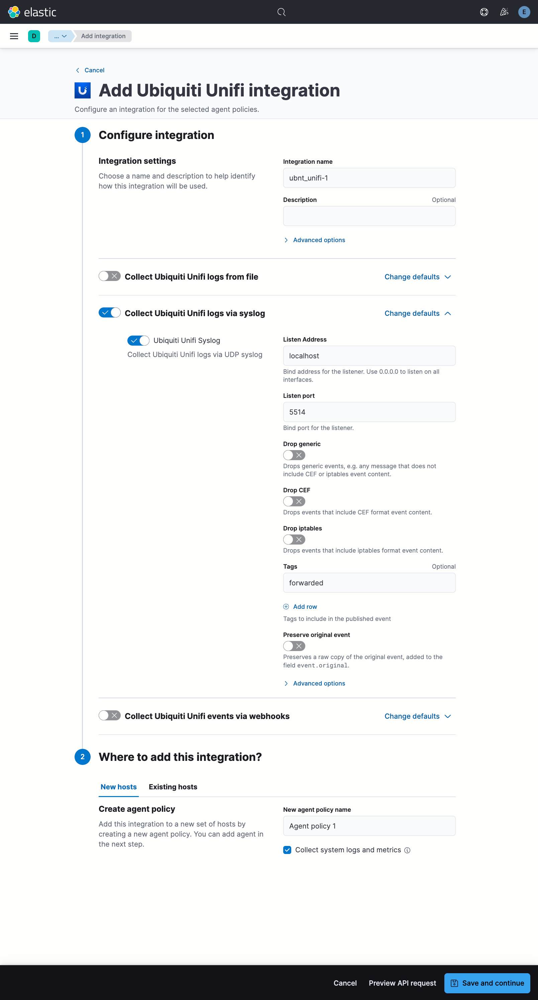
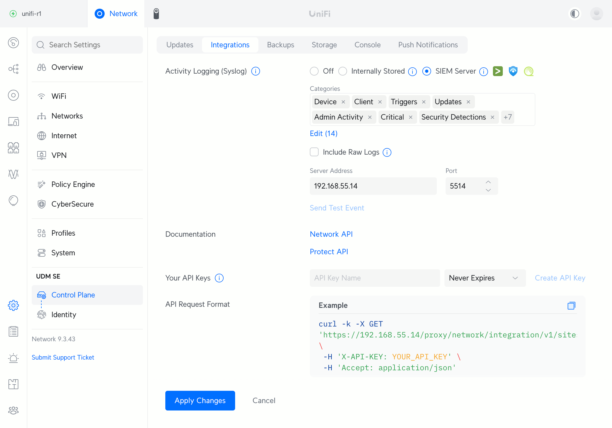

# Ubiquiti UniFi

This integration is for [Ubiquiti UniFi](https://ui.com) equipment event logs. The package processes events collected from Ubiquiti Unifi devices.

## Data Streams

The Ubiquiti UniFi integration collects the following event types:

- **logs**, Logs produced via UDP syslog from a Unifi controller, application or device.

This includes CEF logs, iptables firewall logs, and other Unix/Linux style syslog messages that may be produced.

You can use Elastic Agent to read files of logs if you already have a syslog aggregation system that is already collecting UniFi syslog output. Or alternatively you can configure your UniFi systems to log directly to a UDP listener on an Elastic Agent.

- **webhooks**, Events produced by Unifi Alarm Manager as webhooks, aka. HTTP POST's with a JSON body.

The Ubiquiti UniFi Alarm Manager and webhook based alarms are very new features and the content currently included in the body of a webhook is highly variable in terms of quality and field completeness.

## Related Integrations

**NOTE**: Ubiquiti UniFi now supports NetFlow based traffic logging. If network flow visibility is desired you can and should utilise the existing Elastic [Netflow](https://www.elastic.co/docs/reference/integrations/netflow) integration using NetFlow Version 9 to collect flow records from your Ubiquiti UniFi equipment. Refer to [https://community.ui.com/releases](https://community.ui.com/releases) for further documentation regarding NetFlow support and configuration instructions.

**NOTE**: Ubiquiti UniFi produces iptables "style" firewall logs with a slightly different format to the firewall logs previously produced by other Ubiquiti systems. You do not need to, and should not, install or utilise existing Ubiquiti support within the [iptables](https://www.elastic.co/docs/reference/integrations/iptables) integration as it will not work for firewall logs produced by UniFi systems. You should utilise this integration to collect Ubiquiti UniFi firewall logs independently of other non-UniFi Ubiquiti equipment.

**NOTE**: Ubiquiti UniFi components produce iptables style firewall logs, *some* CEF format logs for configuration activity and events on UniFi consoles and within applications, as well as some common *nix style logs. While at times these are sent with a syslog prefix at other times they are not sent with a syslog prefix. At present not all CEF logs produced by UniFi components are conformant to the Common Event Format (CEF) specification. You do not need to, and should not, attempt to utilise the existing Elastic [CEF](https://www.elastic.co/docs/reference/integrations/cef) integration to process Ubiquiti UniFi logs in any way. This Ubiquiti UniFi integration includes Elastic Agent beat level content fixes for the format problems that are often produced by Ubiquiti UniFi components at present.

## Requirements

For `logs` based event collection Elastic Agent *MUST* be utilised due to the pre-processing and filtering that occurs at the agent level. For example CEF parsing is completed by the Elastic Agent, as this is the only component that natively supports CEF parsing, when logs are first received from the network or read from file. A number of content fixes are applied. 

If `logs` are received/aggregated or otherwise handled by something else and delivered to Elasticsearch for indexing, without passing thru an Elastic Agent, you should replicate the Elastic Agent behaviour, including content fixes, CEF parsing, as well as appropriate tagging.

`webhooks` events from the Ubiquiti UniFi Alarm Manager feature/s require no special Elastic Agent based pre-processing and can be delivered to Elasticsearch for indexing via any method that is suitable for your environment; provided you tag the events appropriately.

For more details and installation instructions, please refer to the [Elastic Agent Installation Guide](https://www.elastic.co/guide/en/fleet/current/elastic-agent-installation.html).

Your Ubiquiti UniFi infrastructure should consist of:
- Ubiquiti UniFi OS `4.0.0` or higher, if running a Ubquiti Unifi Cloud Gateway or similar appliance.
- Ubiquiti UniFi Applications, e.g. Network, `9.0.0` or higher, either on a Ubquiti Unifi Cloud Gateway or self hosted.

Refer to [https://community.ui.com/releases](https://community.ui.com/releases) for current release information, upgrade instructions and further documentation.

**NOTE**: This integration has been tested with Ubiquiti UniFi Cloud Gateways only, self-hosted versions of UniFi applications should work but have not been tested.

**NOTE**: This integration has only been tested with Ubiquiti UniFi Network and Protect applications at this time.

### Installing and managing an Elastic Agent:

There are several options for installing and managing Elastic Agent:

### Install a Fleet-managed Elastic Agent (recommended):

With this approach, you install Elastic Agent and use Fleet in Kibana to define, configure, and manage your agents in a central location. We recommend using Fleet management because it makes the management and upgrade of your agents considerably easier.

### Install Elastic Agent in standalone mode (advanced users):

With this approach, you install Elastic Agent and manually configure the agent locally on the system where it’s installed. You are responsible for managing and upgrading the agents. This approach is reserved for advanced users only.

### Install Elastic Agent in a containerized environment:

You can run Elastic Agent inside a container, either with Fleet Server or standalone. Docker images for all versions of Elastic Agent are available from the Elastic Docker registry, and we provide deployment manifests for running on Kubernetes.

Please note, there are minimum requirements for running Elastic Agent. For more information, refer to the  [Elastic Agent Minimum Requirements](https://www.elastic.co/guide/en/fleet/current/elastic-agent-installation.html#elastic-agent-installation-minimum-requirements).


### Enabling the integration in Elastic:

1. In Kibana navigate to Management > Integrations.
2. In "Search for integrations" top bar, search for `Ubiquiti UniFi`.
3. Select the "Ubiquiti UniFinary" integration from the search results.
4. Select "Add Ubiquiti UniFi" to add the integration.
5. Add all the required integration configuration parameters.
6. Select "Save and continue" to save the integration.

The default syslog based log collection configuration is likely suitable for most environments, e.g.



### Enabling SIEM integration in Ubiquiti UniFi:

Logging for UnifiOS and Unifi applications can be configured via,

1. Login to your Unifi system, navigate to Settings, typically found via the gear icon in the menu bar to the left
2. Click on "Control Plane" in the second level menu to the left of the screen
3. Click on "Integrations" in the third level menu near the top of the screen
4. Select "SIEM Server" next to "Activity Logging (Syslog)"
5. Select Activity Log Categories as appropriate, note that "UniFi OS" categories will be for admin activity and other system events, while "Network" categories can be used to enable traffic logging including logging of traffic that matches the default firewally policy.
6. Enter the IP address and port that your Elastic Agent Ubiquiti UniFi syslog integration listener has been configured to use
7. Optionally click "Send Test Event" and ensure ingest to Elastic is occurring
8. Click "Save" to save the configuration

Additional logging options may be available via other screens.



## Logs

### Ubiquiti UniFi Logs

The `logs` dataset collects Ubiquiti Unifi logs sent via syslog.

An example event for `logs` looks as following:

```json
{
    "@timestamp": "2025-07-05T04:29:36.878Z",
    "agent": {
        "ephemeral_id": "11a9cafc-a45e-4ec2-b38f-e99536291b74",
        "id": "131ef900-601b-4f5d-a1b8-6ed60bda2132",
        "name": "ubnt-unifi-logs",
        "type": "filebeat",
        "version": "9.0.3"
    },
    "cef": {
        "device": {
            "event_class_id": "201",
            "product": "UniFi Network",
            "vendor": "Ubiquiti",
            "version": "9.3.33"
        },
        "extensions": {
            "UNIFIcategory": "Security",
            "UNIFIdeviceIp": "192.168.0.1",
            "UNIFIdeviceMac": "01:23:45:67:89:0a",
            "UNIFIdeviceModel": "UniFi Dream Machine PRO SE",
            "UNIFIdeviceName": "udm-pro-se",
            "UNIFIdeviceVersion": "4.3.5",
            "UNIFIhost": "udm-pro-se",
            "UNIFIipsSessionId": "255132502100797",
            "UNIFIipsSignature": "ET SCAN Possible Nmap User-Agent Observed",
            "UNIFIipsSignatureId": "2024364",
            "UNIFIrisk": "high",
            "UNIFIsubCategory": "Intrusion Prevention",
            "destinationAddress": "192.168.0.2",
            "destinationPort": 8000,
            "message": "A network intrusion attempt from 192.168.0.16 to 192.168.0.2 has been detected and blocked.",
            "sourceAddress": "192.168.0.16",
            "sourcePort": 60700,
            "transportProtocol": "TCP"
        },
        "name": "Threat Detected and Blocked",
        "severity": "9",
        "version": "0"
    },
    "destination": {
        "ip": "192.168.0.2",
        "port": 8000
    },
    "ecs": {
        "version": "8.17.0"
    },
    "event": {
        "action": "Threat Detected and Blocked",
        "category": [
            "network",
            "intrusion_detection"
        ],
        "code": "201",
        "kind": "alert",
        "original": "Jul  5 04:29:36 udm-pro-se.localnet 2025-07-05T04: 29:36.878Z udm-pro-se CEF:0|Ubiquiti|UniFi Network|9.3.33|201|Threat Detected and Blocked|9|proto=TCP src=192.168.0.16 spt=60700 dst=192.168.0.2 dpt=8000 UNIFIcategory=Security UNIFIsubCategory=Intrusion Prevention UNIFIhost=udm-pro-se UNIFIdeviceMac=01:23:45:67:89:0a UNIFIdeviceName=udm-pro-se UNIFIdeviceModel=UniFi Dream Machine PRO SE UNIFIdeviceIp=192.168.0.1 UNIFIdeviceVersion=4.3.5 UNIFIrisk=high UNIFIipsSessionId=255132502100797 UNIFIipsSignature=ET SCAN Possible Nmap User-Agent Observed UNIFIipsSignatureId=2024364 msg=A network intrusion attempt from 192.168.0.16 to 192.168.0.2 has been detected and blocked.",
        "reason": "A network intrusion attempt from 192.168.0.16 to 192.168.0.2 has been detected and blocked.",
        "severity": 9,
        "type": [
            "info"
        ]
    },
    "host": {
        "hostname": "udm-pro-se"
    },
    "input": {
        "type": "filestream"
    },
    "log": {
        "file": {
            "device_id": "64773",
            "fingerprint": "4971336f945694d052c56620d03d45fc31bdbba970ed13f50e2e10bfc2f46eeb",
            "inode": "25962857",
            "path": "/var/log/remote/udm-pro-se.log"
        },
        "level": "9",
        "offset": 298711,
        "syslog": {
            "hostname": "udm-pro-se"
        }
    },
    "message": "A network intrusion attempt from 192.168.0.16 to 192.168.0.2 has been detected and blocked.",
    "network": {
        "transport": "tcp"
    },
    "observer": {
        "hostname": "udm-pro-se.localnet",
        "name": "udm-pro-se",
        "product": "UniFi Network",
        "vendor": "Ubiquiti",
        "version": "9.3.33"
    },
    "related": {
        "ip": [
            "192.168.0.16",
            "192.168.0.2"
        ]
    },
    "source": {
        "ip": "192.168.0.16",
        "port": 60700
    },
    "tags": [
        "preserve_original_event",
        "preserve_duplicate_custom_fields",
        "forwarded",
        "ubnt-unifi-cef"
    ]
}
```

**Exported fields**

| Field | Description | Type |
|---|---|---|
| @timestamp | Event timestamp. | date |
| cef.device.event_class_id |  | keyword |
| cef.device.product |  | keyword |
| cef.device.vendor |  | keyword |
| cef.device.version |  | keyword |
| cef.extensions.UNIFIWiFiRssi |  | keyword |
| cef.extensions.UNIFIaccessMethod |  | keyword |
| cef.extensions.UNIFIadmin |  | keyword |
| cef.extensions.UNIFIauthMethod |  | keyword |
| cef.extensions.UNIFIcategory |  | keyword |
| cef.extensions.UNIFIclientAlias |  | keyword |
| cef.extensions.UNIFIclientHostname |  | keyword |
| cef.extensions.UNIFIclientIp |  | keyword |
| cef.extensions.UNIFIclientMac |  | keyword |
| cef.extensions.UNIFIconnectedToDeviceIp |  | keyword |
| cef.extensions.UNIFIconnectedToDeviceMac |  | keyword |
| cef.extensions.UNIFIconnectedToDeviceModel |  | keyword |
| cef.extensions.UNIFIconnectedToDeviceName |  | keyword |
| cef.extensions.UNIFIconnectedToDevicePort |  | keyword |
| cef.extensions.UNIFIconnectedToDeviceVersion |  | keyword |
| cef.extensions.UNIFIdeviceIp |  | keyword |
| cef.extensions.UNIFIdeviceMac |  | keyword |
| cef.extensions.UNIFIdeviceModel |  | keyword |
| cef.extensions.UNIFIdeviceName |  | keyword |
| cef.extensions.UNIFIdeviceVersion |  | keyword |
| cef.extensions.UNIFIduration |  | keyword |
| cef.extensions.UNIFIhost |  | keyword |
| cef.extensions.UNIFIipsSessionId |  | keyword |
| cef.extensions.UNIFIipsSignature |  | keyword |
| cef.extensions.UNIFIipsSignatureId |  | keyword |
| cef.extensions.UNIFIlastConnectedToDeviceIp |  | keyword |
| cef.extensions.UNIFIlastConnectedToDeviceMac |  | keyword |
| cef.extensions.UNIFIlastConnectedToDeviceModel |  | keyword |
| cef.extensions.UNIFIlastConnectedToDeviceName |  | keyword |
| cef.extensions.UNIFIlastConnectedToDeviceVersion |  | keyword |
| cef.extensions.UNIFIlastConnectedToWiFiRssi |  | keyword |
| cef.extensions.UNIFInetworkName |  | keyword |
| cef.extensions.UNIFInetworkSubnet |  | keyword |
| cef.extensions.UNIFInetworkVlan |  | keyword |
| cef.extensions.UNIFIreference |  | keyword |
| cef.extensions.UNIFIrisk |  | keyword |
| cef.extensions.UNIFIsettingsChanges |  | text |
| cef.extensions.UNIFIsettingsEntry |  | keyword |
| cef.extensions.UNIFIsettingsSection |  | keyword |
| cef.extensions.UNIFIsubCategory |  | keyword |
| cef.extensions.UNIFIusageDown |  | keyword |
| cef.extensions.UNIFIusageUp |  | keyword |
| cef.extensions.UNIFIwifiAirtimeUtilization |  | keyword |
| cef.extensions.UNIFIwifiBand |  | keyword |
| cef.extensions.UNIFIwifiChannel |  | keyword |
| cef.extensions.UNIFIwifiChannelWidth |  | keyword |
| cef.extensions.UNIFIwifiInterference |  | keyword |
| cef.extensions.UNIFIwifiName |  | keyword |
| cef.extensions.baseEventCount |  | long |
| cef.extensions.destinationAddress |  | keyword |
| cef.extensions.destinationPort |  | integer |
| cef.extensions.fixed_ap_enabled |  | keyword |
| cef.extensions.fixed_ip |  | keyword |
| cef.extensions.local_dns_record_enabled |  | keyword |
| cef.extensions.message |  | keyword |
| cef.extensions.name |  | keyword |
| cef.extensions.note |  | keyword |
| cef.extensions.sourceAddress |  | keyword |
| cef.extensions.sourcePort |  | integer |
| cef.extensions.sourceUserName |  | keyword |
| cef.extensions.transportProtocol |  | keyword |
| cef.extensions.use_fixedip |  | keyword |
| cef.extensions.virtual_network_override_enabled |  | keyword |
| cef.name |  | keyword |
| cef.severity |  | keyword |
| cef.version |  | keyword |
| data_stream.dataset | Data stream dataset. | constant_keyword |
| data_stream.namespace | Data stream namespace. | constant_keyword |
| data_stream.type | Data stream type. | constant_keyword |
| input.type | Input type. | keyword |
| iptables.ether_type | Value of the ethernet type field identifying the network layer protocol. | long |
| iptables.flow_label | IPv6 flow label. | integer |
| iptables.fragment_flags | IP fragment flags. A combination of CE, DF and MF. | keyword |
| iptables.fragment_offset | Offset of the current IP fragment. | long |
| iptables.gid | GID associated with the packet. | keyword |
| iptables.icmp.code | ICMP code. | long |
| iptables.icmp.id | ICMP ID. | long |
| iptables.icmp.parameter | ICMP parameter. | long |
| iptables.icmp.redirect | ICMP redirect address. | ip |
| iptables.icmp.seq | ICMP sequence number. | long |
| iptables.icmp.type | ICMP type. | long |
| iptables.id | Packet identifier. | long |
| iptables.incomplete_bytes | Number of incomplete bytes. | long |
| iptables.input_device | Device that received the packet. | keyword |
| iptables.length | Packet length. | long |
| iptables.mark | MARK= | keyword |
| iptables.output_device | Device that output the packet. | keyword |
| iptables.precedence_bits | IP precedence bits. | short |
| iptables.tcp.ack | TCP Acknowledgment number. | long |
| iptables.tcp.flags | TCP flags. | keyword |
| iptables.tcp.reserved_bits | TCP reserved bits. | short |
| iptables.tcp.seq | TCP sequence number. | long |
| iptables.tcp.urgp | URGP= | keyword |
| iptables.tcp.window | Advertised TCP window size. | long |
| iptables.tos | IP Type of Service field. | long |
| iptables.ttl | Time To Live field. | integer |
| iptables.ubiquiti.input_zone | Input zone. | keyword |
| iptables.ubiquiti.output_zone | Output zone. | keyword |
| iptables.ubiquiti.rule_description | Description of the rule. | keyword |
| iptables.ubiquiti.rule_name | Name of the rule. | keyword |
| iptables.ubiquiti.rule_number | The rule number within the rule set. | keyword |
| iptables.ubiquiti.rule_set | The rule set name. | keyword |
| iptables.udp.length | Length of the UDP header and payload. | long |
| iptables.uid | UID associated with the packet. | keyword |
| log.file.device_id | ID of the device containing the filesystem where the file resides. | keyword |
| log.file.fingerprint | The sha256 fingerprint identity of the file when fingerprinting is enabled. | keyword |
| log.file.inode | Inode number of the log file. | keyword |
| log.offset | Offset of the entry in the log file. | long |
| log.source.address |  | keyword |
| ubnt.unifi.stahtd.dump.arp_reply_gw_seen |  | keyword |
| ubnt.unifi.stahtd.dump.assoc_delta |  | keyword |
| ubnt.unifi.stahtd.dump.assoc_status |  | keyword |
| ubnt.unifi.stahtd.dump.auth_delta |  | keyword |
| ubnt.unifi.stahtd.dump.auth_failures |  | keyword |
| ubnt.unifi.stahtd.dump.auth_ts |  | keyword |
| ubnt.unifi.stahtd.dump.avg_rssi |  | keyword |
| ubnt.unifi.stahtd.dump.disassoc_reason |  | keyword |
| ubnt.unifi.stahtd.dump.dns_resp_seen |  | keyword |
| ubnt.unifi.stahtd.dump.dns_responses |  | keyword |
| ubnt.unifi.stahtd.dump.dns_timeouts |  | keyword |
| ubnt.unifi.stahtd.dump.event_id |  | keyword |
| ubnt.unifi.stahtd.dump.event_type |  | keyword |
| ubnt.unifi.stahtd.dump.ip_assign_type |  | keyword |
| ubnt.unifi.stahtd.dump.ip_delta |  | keyword |
| ubnt.unifi.stahtd.dump.mac |  | keyword |
| ubnt.unifi.stahtd.dump.message_type |  | keyword |
| ubnt.unifi.stahtd.dump.query_\* |  | keyword |
| ubnt.unifi.stahtd.dump.sta_dc_reason |  | keyword |
| ubnt.unifi.stahtd.dump.traffic_delta |  | keyword |
| ubnt.unifi.stahtd.dump.vap |  | keyword |
| ubnt.unifi.stahtd.dump.wpa_auth_delta |  | keyword |


### Ubiquiti UniFi Webhooks

The `webhooks` dataset collects Ubiquiti Unifi events producted by Alarm Manager configurations which send alarms as HTTP POST requests with a JSON body.

An example event for `webhooks` looks as following:

```json
{
    "@timestamp": "2025-07-03T05:50:30.055Z",
    "agent": {
        "ephemeral_id": "87edeb32-f8de-4062-9375-1a1df8ca8c2f",
        "id": "af27c668-8f78-4a24-b180-745789969744",
        "name": "elastic-agent-30728",
        "type": "filebeat",
        "version": "8.18.2"
    },
    "data_stream": {
        "dataset": "ubnt_unifi.webhooks",
        "namespace": "29060",
        "type": "logs"
    },
    "ecs": {
        "version": "8.17.0"
    },
    "elastic_agent": {
        "id": "af27c668-8f78-4a24-b180-745789969744",
        "snapshot": false,
        "version": "8.18.2"
    },
    "event": {
        "agent_id_status": "verified",
        "dataset": "ubnt_unifi.webhooks",
        "ingested": "2025-07-03T05:50:31Z",
        "kind": "event",
        "original": "{\"alarm\":{\"conditions\":[{\"condition\":{\"source\":\"device_issue\",\"type\":\"is\"}},{\"condition\":{\"source\":\"device_adoption_state_changed\",\"type\":\"is\"}},{\"condition\":{\"source\":\"device_discovery\",\"type\":\"is\"}},{\"condition\":{\"source\":\"admin_access\",\"type\":\"is\"}},{\"condition\":{\"source\":\"admin_recording_clips_manipulations\",\"type\":\"is\"}},{\"condition\":{\"source\":\"admin_geolocation\",\"type\":\"is\"}},{\"condition\":{\"source\":\"admin_settings_change\",\"type\":\"is\"}},{\"condition\":{\"source\":\"device_update_status_change\",\"type\":\"is\"}},{\"condition\":{\"source\":\"camera_utilization_limit\",\"type\":\"is\"}},{\"condition\":{\"source\":\"application_issue\",\"type\":\"is\"}}],\"name\":\"Elastic - System - All\",\"sources\":[],\"triggers\":[{\"device\":\"nvr\",\"eventId\":\"6865498302c5a803e4234efe\",\"key\":\"admin_access\",\"timestamp\":1751468419711}]},\"timestamp\":1751468420734}",
        "type": [
            "info"
        ]
    },
    "input": {
        "type": "http_endpoint"
    },
    "observer": {
        "product": "Unifi",
        "vendor": "Ubiquiti"
    },
    "tags": [
        "preserve_original_event",
        "preserve_duplicate_custom_fields",
        "forwarded",
        "ubnt-unifi-webhook"
    ],
    "ubnt": {
        "unifi": {
            "webhook": {
                "alarm": {
                    "conditions": [
                        {
                            "condition": {
                                "source": "device_issue",
                                "type": "is"
                            }
                        },
                        {
                            "condition": {
                                "source": "device_adoption_state_changed",
                                "type": "is"
                            }
                        },
                        {
                            "condition": {
                                "source": "device_discovery",
                                "type": "is"
                            }
                        },
                        {
                            "condition": {
                                "source": "admin_access",
                                "type": "is"
                            }
                        },
                        {
                            "condition": {
                                "source": "admin_recording_clips_manipulations",
                                "type": "is"
                            }
                        },
                        {
                            "condition": {
                                "source": "admin_geolocation",
                                "type": "is"
                            }
                        },
                        {
                            "condition": {
                                "source": "admin_settings_change",
                                "type": "is"
                            }
                        },
                        {
                            "condition": {
                                "source": "device_update_status_change",
                                "type": "is"
                            }
                        },
                        {
                            "condition": {
                                "source": "camera_utilization_limit",
                                "type": "is"
                            }
                        },
                        {
                            "condition": {
                                "source": "application_issue",
                                "type": "is"
                            }
                        }
                    ],
                    "name": "Elastic - System - All",
                    "triggers": [
                        {
                            "device": "nvr",
                            "eventId": "6865498302c5a803e4234efe",
                            "key": "admin_access",
                            "timestamp": 1751468419711
                        }
                    ]
                },
                "timestamp": 1751468420734
            }
        }
    }
}
```

**Exported fields**

| Field | Description | Type |
|---|---|---|
| @timestamp | Event timestamp. | date |
| data_stream.dataset | Data stream dataset. | constant_keyword |
| data_stream.namespace | Data stream namespace. | constant_keyword |
| data_stream.type | Data stream type. | constant_keyword |
| input.type | Input type. | keyword |
| ubnt.unifi.webhook.alarm.conditions.condition.source |  | keyword |
| ubnt.unifi.webhook.alarm.conditions.condition.type |  | keyword |
| ubnt.unifi.webhook.alarm.conditions.condition.value |  | keyword |
| ubnt.unifi.webhook.alarm.eventLocalLink |  | keyword |
| ubnt.unifi.webhook.alarm.eventPath |  | keyword |
| ubnt.unifi.webhook.alarm.name |  | keyword |
| ubnt.unifi.webhook.alarm.sources.device |  | keyword |
| ubnt.unifi.webhook.alarm.sources.type |  | keyword |
| ubnt.unifi.webhook.alarm.triggers.device |  | keyword |
| ubnt.unifi.webhook.alarm.triggers.eventId |  | keyword |
| ubnt.unifi.webhook.alarm.triggers.key |  | keyword |
| ubnt.unifi.webhook.alarm.triggers.timestamp |  | date |
| ubnt.unifi.webhook.alarm.triggers.zones.zone |  | float |
| ubnt.unifi.webhook.events.alert_id |  | keyword |
| ubnt.unifi.webhook.events.alert_key |  | keyword |
| ubnt.unifi.webhook.events.id |  | keyword |
| ubnt.unifi.webhook.events.scope.client_device_id |  | keyword |
| ubnt.unifi.webhook.events.scope.site_id |  | keyword |
| ubnt.unifi.webhook.timestamp |  | date |
