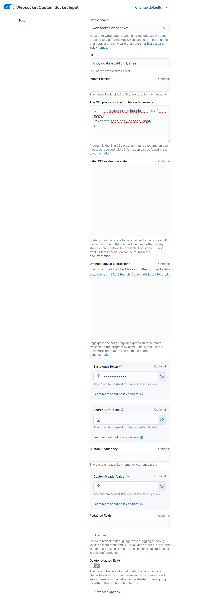

# Custom WebSocket Input

The WebSocket input integration enables ingestion of real-time data from WebSocket servers. WebSockets provide a full-duplex communication channel over a single, long-lived connection, which makes it suitable for scenarios where low latency data transmission is required.

This input type connects to a WebSocket URL, listens for messages sent by the server, and processes these messages as they arrive. The data is then published to Elasticsearch, making it searchable and analyzable in near real-time.

## Configuration

The full documentation for configuring the WebSocket input can be found [here](https://www.elastic.co/guide/en/beats/filebeat/current/filebeat-input-websocket.html).

To configure the WebSocket input, specify the connection URL and other optional parameters such as headers for authentication or protocol versions. Advanced options for connection handling, such as timeouts and subprotocols, can be configured in the "Advanced options" section.

### Example Configuration

Here is a basic example of how to configure the WebSocket input:

This configuration establishes a WebSocket connection to ws://localhost:443/v1/stream and uses basic authentication.

## Data Processing

The WebSocket input will consume messages from the server as they are transmitted. These messages are expected to be in a format that Filebeat can process, such as JSON. If the message format is different, you may need to define a processor to parse and structure the data before it is sent to Elasticsearch.

**NOTE**: The websocket input as of now does not support XML messages.

## Connection Management

The WebSocket input manages the connection to the WebSocket server, including automatically reconnecting if the connection is lost. The input does not maintain any state between restarts, so if the server sends historical data, it will be re-ingested upon reconnection.