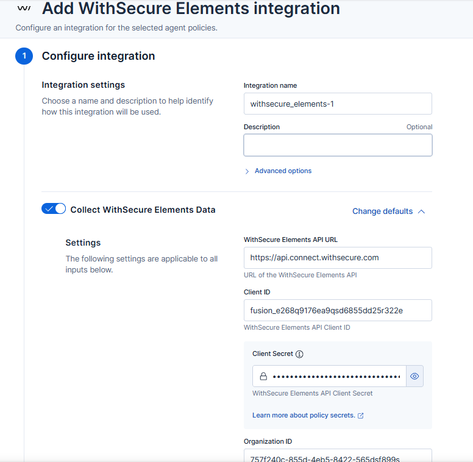
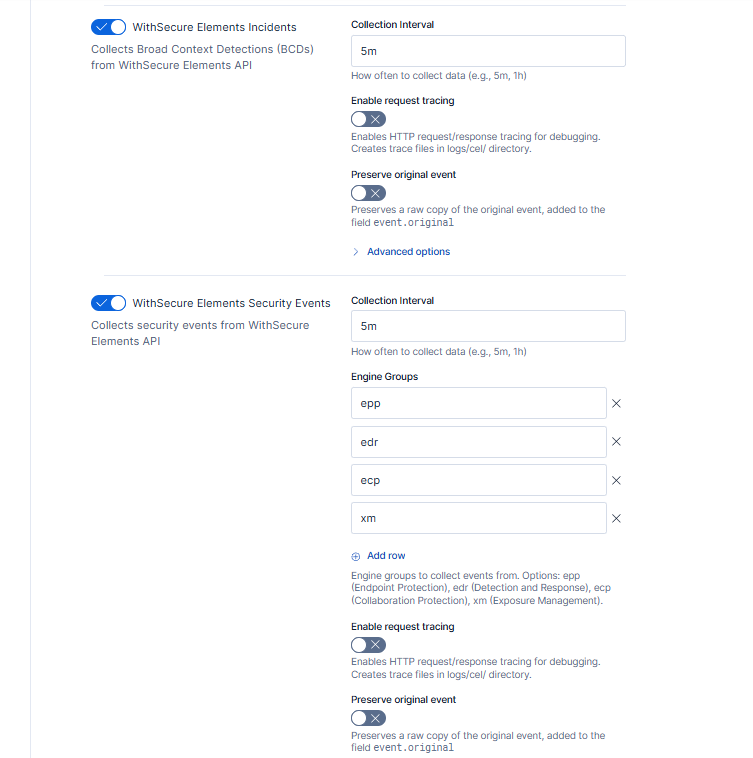
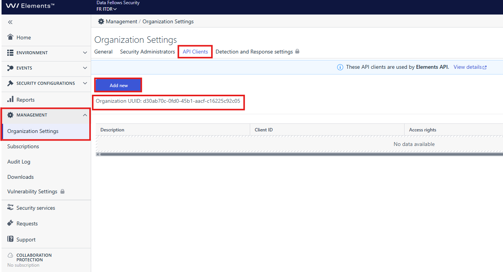
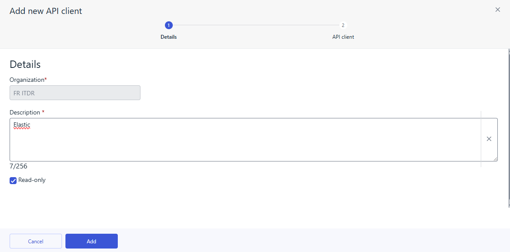
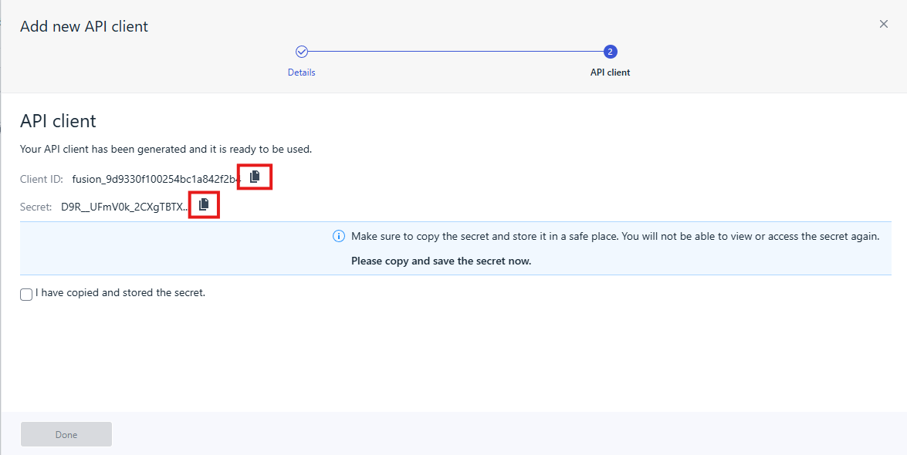
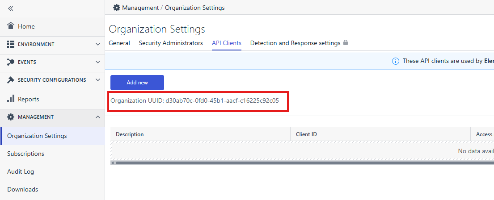

# WithSecure Elements

## Overview

[WithSecure Elements](https://www.withsecure.com/en/solutions/elements) is a comprehensive security platform that provides endpoint protection, detection and response capabilities. This integration allows you to collect security data from the WithSecure Elements API, including incidents (Broad Context Detections - BCDs) and security events from various security engines.

This integration provides:

1. Collection of security incidents (Broad Context Detections) via API polling, which includes comprehensive threat information, status, severity, risk levels, and resolution details.
2. Collection of security events via API polling from multiple engine groups including EPP (Endpoint Protection Platform), EDR (Endpoint Detection and Response, which includes XDR - Extended Detection and Response), ECP (Collaboration Protection), and XM (Exposure Management).
3. Support for multiple instances of the integration, which may be needed for MSP/MSSP scenarios where multiple WithSecure Elements organizations exist.
4. Real-time security event collection with detailed information about actions taken, devices, users, and threat details.

This allows you to search, observe and visualize the WithSecure Elements security data through Elastic, trigger alerts, and monitor security posture across your organization.

For more information about WithSecure Elements, refer to [WithSecure Elements](https://www.withsecure.com/en/solutions/elements) and the [WithSecure Elements API documentation](https://elements.withsecure.com/api-docs/).

### Compatibility

This integration supports WithSecure Elements, which is the business-oriented security platform sold by WithSecure.

The package collects WithSecure Elements incidents and security events via API polling using OAuth2 client credentials authentication.

The integration supports collection from multiple engine groups:
- **EPP** (Endpoint Protection Platform): Real-time protection events including file scanning, application control, browsing protection, and more.
- **EDR** (Endpoint Detection and Response, which includes XDR - Extended Detection and Response): Advanced detection and response events including behavioral analysis, threat hunting, and cross-domain security correlation.
- **ECP** (Collaboration Protection): Email and collaboration security events.
- **XM** (Exposure Management): Vulnerability and exposure management events.

## How do I deploy this integration?

### Enabling the integration in Elastic

1. In Kibana go to **Management > Integrations**.
2. In "Search for integrations" search bar type **WithSecure Elements**.
3. Click on "WithSecure Elements" integration from the search results.
4. Click on **Add WithSecure Elements** button to add WithSecure Elements integration.




### Creating WithSecure Elements API credentials

To use this integration, you need to create OAuth2 credentials (Client ID and Client Secret) in your WithSecure Elements organization.

The API credentials are typically configured within the WithSecure Elements portal. Navigate to your organization settings and create a new API client application.

**Prerequisites:**
- Access to WithSecure Elements portal with administrative privileges
- Organization ID from your WithSecure Elements account

**Steps to create API credentials:**

1. Log in to the WithSecure Elements portal.
2. Navigate to **Management > Organisation Settings > API clients**.
3. Click **Add new**.



4. Provide a descriptive name for the API client (e.g., "Elastic Integration").
5. Check the **read-only** option to limit permissions to read-only access for incidents and security events.



6. Save the configuration and copy the **Client ID** and **Client Secret**.



7. Note your **Organization ID** from the organization settings.



**Important Security Notes:**
- Store the Client Secret securely and never share it publicly.
- Regularly rotate API credentials as per your security policy.
- The Client Secret will only be displayed once during creation - ensure you save it securely.

### Configuring the integration

After adding the integration, configure the following required settings:

- **WithSecure Elements API URL**: The API endpoint URL (default: `https://api.connect.withsecure.com`)
- **Client ID**: Your WithSecure Elements API Client ID
- **Client Secret**: Your WithSecure Elements API Client Secret
- **Organization ID**: Your WithSecure Elements Organization ID

You can then enable and configure each data stream individually:

#### Incidents (BCDs) Data Stream
- **Collection Interval**: How often to collect incidents (default: 5m)
- **Batch Size**: Number of incidents per request (default: 50, max: 50)

#### Security Events Data Stream
- **Collection Interval**: How often to collect security events (default: 5m)
- **Batch Size**: Number of events per request (default: 200, max: 200)
- **Engine Groups**: Select which engine groups to collect from (EPP, EDR, ECP, XM)

## Data stream

### Log stream incidents

The WithSecure Elements incidents dataset provides Broad Context Detections (BCDs) collected from the WithSecure Elements API.

BCDs are high-level security incidents that aggregate multiple related security events and detections. They provide a comprehensive view of security threats with risk scoring, categorization, and resolution tracking.

All WithSecure Elements incident data is available in the `withsecure_elements.incidents` field group.

**Exported fields**

| Field | Description | Type |
|---|---|---|
| @timestamp | Date/time when the event originated. This is the date/time extracted from the event, typically representing when the event was generated by the source. If the event source has no original timestamp, this value is typically populated by the first time the event was received by the pipeline. Required field for all events. | date |
| withsecure_elements.incidents.incidentId | Unique identifier of the incident | keyword |
| withsecure_elements.incidents.incidentPublicId | Public ID of the incident visible in the portal | keyword |
| withsecure_elements.incidents.organizationId | Organization ID | keyword |
| withsecure_elements.incidents.name | Name of the incident | text |
| withsecure_elements.incidents.status | Status of the incident | keyword |
| withsecure_elements.incidents.severity | Severity level of the incident | keyword |
| withsecure_elements.incidents.riskLevel | Risk level of the incident | keyword |
| withsecure_elements.incidents.riskScore | Risk score of the incident | float |
| withsecure_elements.incidents.resolution | Resolution of the incident | keyword |
| withsecure_elements.incidents.createdTimestamp | Timestamp when the incident was created | date |
| withsecure_elements.incidents.updatedTimestamp | Timestamp when the incident was last updated | date |
| withsecure_elements.incidents.initialReceivedTimestamp | Timestamp when the first action related to the incident was received | date |
| withsecure_elements.incidents.categories | List of incident categories | keyword |
| withsecure_elements.incidents.sources | List of incident sources | keyword |
| withsecure_elements.incidents.description | Description of the BCD. User can change it in EDR portal | text |
| withsecure_elements.incidents.assignee.id | Assignee ID | keyword |
| withsecure_elements.incidents.assignee.name | Assignee name | keyword |
| withsecure_elements.incidents.comments.id | Comment ID | keyword |
| withsecure_elements.incidents.comments.text | Comment text | text |
| withsecure_elements.incidents.comments.author | Comment author | keyword |
| withsecure_elements.incidents.comments.timestamp | Comment timestamp | date |


An example event for `incidents` looks as following:

```json
{
    "@timestamp": "2023-08-09T12:10:43.537Z",
    "agent": {
        "ephemeral_id": "e80bc3a4-2ee1-435a-8ff1-cf18df9f0fe8",
        "id": "0eb83218-5f40-45bd-8fb3-9423008f7b6f",
        "name": "docker-fleet-agent",
        "type": "filebeat",
        "version": "8.14.3"
    },
    "data_stream": {
        "dataset": "withsecure_elements.incidents",
        "namespace": "default",
        "type": "logs"
    },
    "ecs": {
        "version": "8.11.0"
    },
    "elastic_agent": {
        "id": "0eb83218-5f40-45bd-8fb3-9423008f7b6f",
        "snapshot": false,
        "version": "8.14.3"
    },
    "event": {
        "action": "detected",
        "agent_id_status": "verified",
        "category": [
            "threat"
        ],
        "created": "2023-08-09T12:10:43.537Z",
        "dataset": "withsecure_elements.incidents",
        "end": "2023-08-09T12:10:43.537Z",
        "id": "2c902c73-e2a6-40fd-9532-257ee102e1c1",
        "ingested": "2023-08-09T12:11:03Z",
        "kind": "alert",
        "module": "withsecure_elements",
        "original": "{\"incidentId\":\"2c902c73-e2a6-40fd-9532-257ee102e1c1\",\"incidentPublicId\":\"INC-12345\",\"organizationId\":\"222298dc-3785-4d2d-a957-f7399c2cd084\",\"name\":\"Malware Detection\",\"status\":\"new\",\"severity\":\"high\",\"riskLevel\":\"high\",\"riskScore\":85.5,\"resolution\":\"unconfirmed\",\"createdTimestamp\":\"2023-08-09T12:10:43.537Z\",\"updatedTimestamp\":\"2023-08-09T12:10:43.537Z\",\"initialReceivedTimestamp\":\"2023-08-09T12:10:43.537Z\",\"categories\":[\"MALWARE\"],\"sources\":[\"endpoint\"]}",
        "outcome": "success",
        "provider": "withsecure_elements",
        "risk_score": 85.5,
        "severity": 73,
        "start": "2023-08-09T12:10:43.537Z",
        "type": [
            "incident"
        ]
    },
    "input": {
        "type": "cel"
    },
    "tags": [
        "preserve_original_event",
        "forwarded"
    ],
    "withsecure_elements": {
        "incidents": {
            "categories": [
                "MALWARE"
            ],
            "createdTimestamp": "2023-08-09T12:10:43.537Z",
            "incidentId": "2c902c73-e2a6-40fd-9532-257ee102e1c1",
            "incidentPublicId": "INC-12345",
            "initialReceivedTimestamp": "2023-08-09T12:10:43.537Z",
            "name": "Malware Detection",
            "organizationId": "222298dc-3785-4d2d-a957-f7399c2cd084",
            "resolution": "unconfirmed",
            "riskLevel": "high",
            "riskScore": 85.5,
            "severity": "high",
            "sources": [
                "endpoint"
            ],
            "status": "new",
            "updatedTimestamp": "2023-08-09T12:10:43.537Z"
        }
    }
}
```

### Log stream security events

The WithSecure Elements security events dataset provides real-time security events collected from the WithSecure Elements API.

Security events are generated by various security engines (EPP, EDR which includes XDR capabilities, ECP, XM) and provide detailed information about security-related activities including file scanning, application control, browsing protection, connection control, data protection, and more.

All WithSecure Elements security event data is available in the `withsecure_elements.security_events` field group.

**Exported fields**

| Field | Description | Type |
|---|---|---|
| @timestamp | Date/time when the event originated. This is the date/time extracted from the event, typically representing when the event was generated by the source. If the event source has no original timestamp, this value is typically populated by the first time the event was received by the pipeline. Required field for all events. | date |
| withsecure_elements.security_events.id | Unique identifier of the security event | keyword |
| withsecure_elements.security_events.action | Action taken on the security event | keyword |
| withsecure_elements.security_events.engine | Engine that generated the security event | keyword |
| withsecure_elements.security_events.severity | Severity level of the security event | keyword |
| withsecure_elements.security_events.message | Human-readable message describing the event | text |
| withsecure_elements.security_events.description | Detailed description of the event type | text |
| withsecure_elements.security_events.server_timestamp | Date and time of event being received by backend server. UTC+00:00 | date |
| withsecure_elements.security_events.persistence_timestamp | Timestamp when the event was persisted | date |
| withsecure_elements.security_events.client_timestamp | Timestamp when the event was generated on the client | date |
| withsecure_elements.security_events.eventTransactionId | Transaction ID for the event | keyword |
| withsecure_elements.security_events.acknowledged | Whether the event has been acknowledged | boolean |
| withsecure_elements.security_events.acknowledgedBy | User who acknowledged the event | keyword |
| withsecure_elements.security_events.ackTimestamp | Timestamp when the event was acknowledged | date |
| withsecure_elements.security_events.organization.id | Organization ID | keyword |
| withsecure_elements.security_events.organization.name | Organization name | keyword |
| withsecure_elements.security_events.target.id | Target ID | keyword |
| withsecure_elements.security_events.target.name | Target name | keyword |
| withsecure_elements.security_events.device.id | Device ID | keyword |
| withsecure_elements.security_events.device.name | Device name | keyword |
| withsecure_elements.security_events.device.labels | Device labels | keyword |
| withsecure_elements.security_events.device.winsAddress | WINS address | keyword |
| withsecure_elements.security_events.device.winsName | Device WINS name | keyword |
| withsecure_elements.security_events.device.clientType | Client type | keyword |
| withsecure_elements.security_events.userName | User name associated with the event | keyword |
| withsecure_elements.security_events.xmRecommendationKey | Key for the kind of XM recommendation (XM events) | keyword |
| withsecure_elements.security_events.details.profileName | Name of the security profile | keyword |
| withsecure_elements.security_events.details.path | Path related to the event | keyword |
| withsecure_elements.security_events.details.alertType | Alert type reported by WithSecure | keyword |
| withsecure_elements.security_events.details.throttledCount | Number of throttled events | keyword |
| withsecure_elements.security_events.details.profileId | Profile identifier | keyword |
| withsecure_elements.security_events.details.profileVersion | Version of the profile | keyword |
| withsecure_elements.security_events.details.hostIpAddress | Host IP address associated with the event | keyword |
| withsecure_elements.security_events.details.userName | User name specified in the event details | keyword |
| withsecure_elements.security_events.details.clientTimestamp | Original client timestamp included in the event details | keyword |
| withsecure_elements.security_events.details.incidentId | Incident ID associated with the event | keyword |
| withsecure_elements.security_events.details.incidentPublicId | Public incident ID associated with the event | keyword |
| withsecure_elements.security_events.details.categories | Event categories | keyword |
| withsecure_elements.security_events.details.risk | Risk level associated with the event | keyword |
| withsecure_elements.security_events.details.resolution | Resolution status of the event | keyword |
| withsecure_elements.security_events.details.fingerprint | Event fingerprint | keyword |
| withsecure_elements.security_events.details.initialDetectionTimestamp | Initial detection timestamp | keyword |
| withsecure_elements.security_events.details.filePath | File path related to the event (DataGuard events) | keyword |
| withsecure_elements.security_events.details.initiatorHash | Hash of the initiator process (DataGuard events) | keyword |
| withsecure_elements.security_events.details.targetData | Target data path (DataGuard events) | keyword |
| withsecure_elements.security_events.details.vaultId | Vault ID associated with the event (DataGuard events) | keyword |
| withsecure_elements.security_events.details.alertSource | Alert source identifier (fileScanning events) | keyword |
| withsecure_elements.security_events.details.fileScanningType | Type of file scanning event (fileScanning events) | keyword |
| withsecure_elements.security_events.details.name | Threat or detection name (fileScanning events) | keyword |
| withsecure_elements.security_events.details.sha1 | SHA1 hash of the file (fileScanning events) | keyword |
| withsecure_elements.security_events.details.infectionType | Type of infection detected (fileScanning/manualScanning events) | keyword |
| withsecure_elements.security_events.details.infectionName | Name of the infection detected (fileScanning/manualScanning events) | keyword |
| withsecure_elements.security_events.details.quarantineId | Quarantine ID to release object from quarantine (fileScanning events) | keyword |
| withsecure_elements.security_events.details.created | File creation timestamp (fileScanning events) | keyword |
| withsecure_elements.security_events.details.modified | File modification timestamp (fileScanning events) | keyword |
| withsecure_elements.security_events.details.size | File size (fileScanning events) | keyword |
| withsecure_elements.security_events.details.prevalence | Prevalence rating of the file (fileScanning events) | keyword |
| withsecure_elements.security_events.details.reputation | Reputation rating of the file (fileScanning events) | keyword |
| withsecure_elements.security_events.details.url | URL where a file was downloaded from (fileScanning/browsingProtection events) | keyword |
| withsecure_elements.security_events.details.creator | Process that created the file (fileScanning events) | keyword |
| withsecure_elements.security_events.details.creatorSha1 | SHA1 hash of the process that created the file (fileScanning events) | keyword |
| withsecure_elements.security_events.details.container | Path to top-level archive for infections found inside archive (fileScanning events) | keyword |
| withsecure_elements.security_events.details.containerSha1 | SHA1 of the archive (fileScanning events) | keyword |
| withsecure_elements.security_events.details.process | Process name (browsingProtection/connectionControl events) | keyword |
| withsecure_elements.security_events.details.reason | Reason for the action (browsingProtection events) | keyword |
| withsecure_elements.security_events.details.ruleId | Rule ID from settings (applicationControl events) | keyword |
| withsecure_elements.security_events.details.ruleName | Rule name from settings (applicationControl events) | keyword |
| withsecure_elements.security_events.details.ruleEvent | Rule event type (applicationControl events) | keyword |
| withsecure_elements.security_events.details.targetPath | Path to the target file (applicationControl events) | keyword |
| withsecure_elements.security_events.details.targetSha1 | SHA1 of the target file (applicationControl events) | keyword |
| withsecure_elements.security_events.details.targetSha256 | SHA256 of the target file (applicationControl events) | keyword |
| withsecure_elements.security_events.details.parentPath | Path to the parent file (applicationControl events) | keyword |
| withsecure_elements.security_events.details.parentCommandLine | Parent command line (applicationControl events) | keyword |
| withsecure_elements.security_events.details.targetCommandLine | Command line used to start the target file (applicationControl events) | keyword |
| withsecure_elements.security_events.details.direction | Connection direction (connectionControl events) | keyword |
| withsecure_elements.security_events.details.remoteAddress | Remote IP address (connectionControl events) | keyword |
| withsecure_elements.security_events.details.remotePort | Remote port number (connectionControl events) | keyword |
| withsecure_elements.security_events.details.localAddress | Local IP address (connectionControl events) | keyword |
| withsecure_elements.security_events.details.localPort | Local port number (connectionControl events) | keyword |
| withsecure_elements.security_events.details.protocol | Network protocol (connectionControl events) | keyword |
| withsecure_elements.security_events.details.affectedFiles | List of affected files (activityMonitor events) | keyword |
| withsecure_elements.security_events.details.userSid | SID of the user (activityMonitor events) | keyword |
| withsecure_elements.security_events.details.fullUsername | Full username (activityMonitor events) | keyword |
| withsecure_elements.security_events.details.affectedSharedFolders | Shared folders affected by the activity (activityMonitor events) | keyword |
| withsecure_elements.security_events.details.readableIncidentId | Incident ID used in Elements portal UI (EDR events) | keyword |
| withsecure_elements.security_events.details.mergedTo | ID of an incident to what the current incident was merged to (EDR events) | keyword |
| withsecure_elements.security_events.details.systemWide | Infection is system wide (fileScanning/manualScanning events) | keyword |
| withsecure_elements.security_events.details.readOnly | The infected file cannot be modified (fileScanning/manualScanning events) | keyword |
| withsecure_elements.security_events.details.rebootRequiredToDelete | Reboot is required to remove the infection (fileScanning/manualScanning events) | keyword |
| withsecure_elements.security_events.details.availableActions | Suggested actions in response to infection. Options are block,disinfect,delete,rename,quarantine (fileScanning/manualScanning events) | keyword |
| withsecure_elements.security_events.details.recommendedAction | Recommended action (fileScanning/manualScanning events) | keyword |
| withsecure_elements.security_events.details.containerSize | Size of an archive (fileScanning events) | keyword |
| withsecure_elements.security_events.details.containerMailbox | True if a container of file is a mailbox (fileScanning events) | keyword |
| withsecure_elements.security_events.details.subItem | Path to an infected file in an archive in case action was performed on whole archive (fileScanning events) | keyword |
| withsecure_elements.security_events.details.accessOperation | For real-time scanning, attempted operation (fileScanning events) | keyword |
| withsecure_elements.security_events.details.accessFlags | For real-time scanning, separated by comma WIN API flags used in accessing the file (fileScanning events) | keyword |
| withsecure_elements.security_events.details.accessorHash | For real-time scanning, sha1 hash of the accessing process (fileScanning events) | keyword |
| withsecure_elements.security_events.details.accessorPath | For real-time scanning, process used to access the file (fileScanning events) | keyword |
| withsecure_elements.security_events.details.appliedRule | Applied rule name (various events) | keyword |
| withsecure_elements.security_events.details.cloudProvider | Name of cloud provider (cloud events) | keyword |
| withsecure_elements.security_events.details.cloudProviderTenantId | Cloud provider tenant ID (cloud events) | keyword |
| withsecure_elements.security_events.details.serviceType | Service type (ECP events - o365-exchange, o365-teams, etc.) | keyword |
| withsecure_elements.security_events.details.eventId | Event ID (ECP events) | keyword |
| withsecure_elements.security_events.details.itemType | Item type (ECP events - EmailMessage, TeamsChannelItem, etc.) | keyword |
| withsecure_elements.security_events.details.itemDateTimeReceived | Date and time when item was received (ECP events) | keyword |
| withsecure_elements.security_events.details.itemSender | Sender of the item (ECP events) | keyword |
| withsecure_elements.security_events.details.itemSubject | Subject of the item (ECP events) | keyword |
| withsecure_elements.security_events.details.internetMessageId | Internet message ID (ECP events) | keyword |
| withsecure_elements.security_events.details.itemParentFolderName | Parent folder name (ECP events) | keyword |
| withsecure_elements.security_events.details.itemSize | Item size (ECP events) | keyword |
| withsecure_elements.security_events.details.unsafeAttachmentCount | Count of unsafe attachments (ECP events) | keyword |
| withsecure_elements.security_events.details.unsafeUrlCount | Count of unsafe URLs (ECP events) | keyword |
| withsecure_elements.security_events.details.userPrincipalName | User principal name (ECP events) | keyword |
| withsecure_elements.security_events.details.urls | URLs found in the item (ECP events) | keyword |
| withsecure_elements.security_events.details.detonation | Whether detonation was performed (ECP events) | boolean |
| withsecure_elements.security_events.details.reputationScore | Reputation score (ECP events) | keyword |
| withsecure_elements.security_events.details.verdict | Verdict (ECP events - Safe, Unsafe, etc.) | keyword |
| withsecure_elements.security_events.details.location | Location/URL of the item (ECP events) | keyword |
| withsecure_elements.security_events.details.fileName | File name (ECP events) | keyword |
| withsecure_elements.security_events.details.items | List of items that are restored from quarantine (Server Share Protection/Rollback events) | keyword |
| withsecure_elements.security_events.details.backupFolder | Path to affected backup folder (Server Share Protection/Rollback events) | keyword |
| withsecure_elements.security_events.details.isQuarantineAllowed | Are reverted files stored in quarantine or not (Server Share Protection/Rollback events) | keyword |
| withsecure_elements.security_events.details.processOperations | List of process operations. JSON object wrapped into a string (Rollback events) | keyword |
| withsecure_elements.security_events.details.registryOperations | List of registry operations. JSON object wrapped into a string (Rollback events) | keyword |
| withsecure_elements.security_events.details.targetFileVersion | Version of the target file (Application Control events) | keyword |
| withsecure_elements.security_events.details.targetPrevalence | Prevalence rating of the target file (Application Control events) | keyword |
| withsecure_elements.security_events.details.targetProductName | Product name of the target file (Application Control events) | keyword |
| withsecure_elements.security_events.details.targetProductVersion | Product version of the target file (Application Control events) | keyword |
| withsecure_elements.security_events.details.targetSignatureSignerName | Signature signer name of the target file (Application Control events) | keyword |
| withsecure_elements.security_events.details.targetVersionCompanyName | Version company name of the target file (Application Control events) | keyword |
| withsecure_elements.security_events.details.errorMessage | Text message describing the error (Application Control error events) | text |
| withsecure_elements.security_events.details.contentType | Content type of a blocked request (Web Traffic Scanning events) | keyword |
| withsecure_elements.security_events.details.websiteUrl | URL of the website that triggered the event (Web Traffic Scanning events) | keyword |
| withsecure_elements.security_events.details.computerName | Name of the computer (Web Traffic Scanning events) | keyword |
| withsecure_elements.security_events.details.operation | Operation type (XFence events - read, write, etc.) | keyword |
| withsecure_elements.security_events.details.processHash | Hash of the process (XFence events) | keyword |
| withsecure_elements.security_events.details.processPath | Path to the process (XFence events) | keyword |
| withsecure_elements.security_events.details.processTeamId | Process team ID (XFence events) | keyword |
| withsecure_elements.security_events.details.serviceId | Service ID (Collaboration Protection events) | keyword |
| withsecure_elements.security_events.details.inboxRuleName | Rule name for inbox (Collaboration Protection inbox rule scan events) | keyword |
| withsecure_elements.security_events.details.appName | Name, version, or GUID string of the blocked application (AMSI events) | keyword |
| withsecure_elements.security_events.details.contentName | Filename, URL, unique script ID, or similar of the content (AMSI events) | keyword |
| withsecure_elements.security_events.details.prevalenceScore | Prevalence score (Collaboration Protection events) | keyword |
| withsecure_elements.security_events.details.filename | File name (Collaboration Protection events - alternative to fileName) | keyword |
| withsecure_elements.security_events.details.recommendationDetails | Details of the recommendation (XM events) | text |
| withsecure_elements.security_events.details.recommendationId | Unique ID of the recommendation (XM events) | keyword |
| withsecure_elements.security_events.details.recommendationName | Name of the recommendation (XM events) | keyword |
| withsecure_elements.security_events.details.recommendationStatus | Status of the recommendation (XM events - open, closed, acceptedRisk) | keyword |
| withsecure_elements.security_events.details.remediationEffort | Estimated effort to remediate (XM events) | keyword |
| withsecure_elements.security_events.details.remediationEffortString | Effort level as a string (XM events) | keyword |
| withsecure_elements.security_events.details.remediationImpact | Impact of remediation (XM events - critical, high, medium, low) | keyword |
| withsecure_elements.security_events.details.topAssets | List of top assets affected by the recommendation (XM events - JSON array) | keyword |
| withsecure_elements.security_events.details.totalAssets | Total number of assets affected (XM events) | integer |
| withsecure_elements.security_events.details.topFindings | List of top findings related to the recommendation (XM events - JSON array) | keyword |
| withsecure_elements.security_events.details.totalFindings | Total number of findings (XM events) | integer |
| withsecure_elements.security_events.details.daysFromLastUpdate | How many days are passed since last database update (Connector events) | keyword |
| withsecure_elements.security_events.details.ruleGroupName | Group name of a rule that blocked a connection (Firewall events) | keyword |
| withsecure_elements.security_events.details.layerName | Name of a layer that blocked a connection (Firewall events) | keyword |
| withsecure_elements.security_events.details.ruleDirection | Direction of triggered rule (Firewall events - inbound, outbound, forward) | keyword |
| withsecure_elements.security_events.details.ipProtocol | IP protocol type (Firewall events) | keyword |
| withsecure_elements.security_events.details.rarity | Rarity of the blocked process (DeepGuard events - unknown, rare, common) | keyword |
| withsecure_elements.security_events.details.exploit | Full name of an exploit (DeepGuard events) | keyword |
| withsecure_elements.security_events.details.commandLine | Command line of the blocked process (DeepGuard events) | keyword |
| withsecure_elements.security_events.details.devicePath | Blocked device path (Device Control events) | keyword |
| withsecure_elements.security_events.details.deviceId | Blocked device ID (Device Control events) | keyword |
| withsecure_elements.security_events.details.deviceName | Blocked device name (Device Control events) | keyword |
| withsecure_elements.security_events.details.initiator | Path to the executable that accessed the device (Device Control events) | keyword |
| withsecure_elements.security_events.details.processId | Process ID that made modification attempt (Integrity Checker events) | keyword |
| withsecure_elements.security_events.details.actionType | Type of blocked action (Tamper Protection events - process, file, registry) | keyword |
| withsecure_elements.security_events.details.initiator_certificate_hash | Hash of initiator process certificate (Tamper Protection events) | keyword |
| withsecure_elements.security_events.details.initiator_signer_name | Initiator process signer name (Tamper Protection events) | keyword |
| withsecure_elements.security_events.details.ipAddress | Current IP address in slash notation (Tamper Protection events) | keyword |
| withsecure_elements.security_events.details.requestType | Blocked operation (Tamper Protection events - reg_delete_key, terminate_process, etc.) | keyword |


An example event for `security_events` looks as following:

```json
{
    "@timestamp": "2023-08-31T09:31:01.092Z",
    "agent": {
        "ephemeral_id": "e80bc3a4-2ee1-435a-8ff1-cf18df9f0fe8",
        "id": "0eb83218-5f40-45bd-8fb3-9423008f7b6f",
        "name": "docker-fleet-agent",
        "type": "filebeat",
        "version": "8.14.3"
    },
    "data_stream": {
        "dataset": "withsecure_elements.security_events",
        "namespace": "default",
        "type": "logs"
    },
    "ecs": {
        "version": "8.11.0"
    },
    "elastic_agent": {
        "id": "0eb83218-5f40-45bd-8fb3-9423008f7b6f",
        "snapshot": false,
        "version": "8.14.3"
    },
    "event": {
        "action": "reported",
        "agent_id_status": "verified",
        "category": [
            "threat"
        ],
        "dataset": "withsecure_elements.security_events",
        "id": "07a286cc-99ba-3538-8997-557076ff95ab_0",
        "ingested": "2023-08-31T09:31:03Z",
        "kind": "event",
        "module": "withsecure_elements",
        "original": "{\"id\":\"07a286cc-99ba-3538-8997-557076ff95ab_0\",\"action\":\"reported\",\"engine\":\"setting\",\"severity\":\"info\",\"serverTimestamp\":\"2023-08-31T09:31:01.092Z\",\"persistenceTimestamp\":\"2023-08-31T09:31:03.292Z\",\"eventTransactionId\":\"0000-187cf62797634fef\",\"clientTimestamp\":\"2023-08-31T07:31:03.292Z\",\"acknowledged\":false,\"message\":\"Firewall was turned on\",\"description\":\"Setting event\",\"organization\":{\"id\":\"222298dc-3785-4d2d-a957-f7399c2cd084\",\"name\":\"my-org\"},\"target\":{\"name\":\"Doe,John DESKTOP\",\"id\":\"71cceb9f-2728-4ac4-8e63-402cbbf76e18\"},\"device\":{\"id\":\"71cceb9f-2728-4ac4-8e63-402cbbf76e18\",\"name\":\"Doe,John DESKTOP\"},\"userName\":\"John Doe\",\"details\":{\"profileName\":\"My Company Profile\",\"path\":\"C:\\\\Program Files\\\\WithSecure\\\\PSB\\\\diagnostics\\\\fsdiag.exe\",\"alertType\":\"product.path.excluded\",\"throttledCount\":\"0\",\"profileId\":\"12444818\",\"profileVersion\":\"34313431491\",\"hostIpAddress\":\"8.8.8.8/8\",\"userName\":\"John Doe\",\"clientTimestamp\":\"1695889223479\"}}",
        "provider": "withsecure_elements",
        "severity": 21,
        "type": [
            "info"
        ]
    },
    "host": {
        "hostname": "Doe,John DESKTOP",
        "id": "71cceb9f-2728-4ac4-8e63-402cbbf76e18",
        "name": "Doe,John DESKTOP"
    },
    "input": {
        "type": "cel"
    },
    "organization": {
        "id": "222298dc-3785-4d2d-a957-f7399c2cd084",
        "name": "my-org"
    },
    "tags": [
        "preserve_original_event",
        "forwarded"
    ],
    "withsecure_elements": {
        "security_events": {
            "acknowledged": false,
            "action": "reported",
            "client_timestamp": "2023-08-31T07:31:03.292Z",
            "description": "Setting event",
            "details": {
                "alertType": "product.path.excluded",
                "clientTimestamp": "1695889223479",
                "hostIpAddress": "8.8.8.8/8",
                "path": "C:\\Program Files\\WithSecure\\PSB\\diagnostics\\fsdiag.exe",
                "profileId": "12444818",
                "profileName": "My Company Profile",
                "profileVersion": "34313431491",
                "throttledCount": "0",
                "userName": "John Doe"
            },
            "device": {
                "id": "71cceb9f-2728-4ac4-8e63-402cbbf76e18",
                "name": "Doe,John DESKTOP"
            },
            "engine": "setting",
            "eventTransactionId": "0000-187cf62797634fef",
            "id": "07a286cc-99ba-3538-8997-557076ff95ab_0",
            "message": "Firewall was turned on",
            "organization": {
                "id": "222298dc-3785-4d2d-a957-f7399c2cd084",
                "name": "my-org"
            },
            "persistence_timestamp": "2023-08-31T09:31:03.292Z",
            "severity": "info",
            "target": {
                "id": "71cceb9f-2728-4ac4-8e63-402cbbf76e18",
                "name": "Doe,John DESKTOP"
            },
            "userName": "John Doe"
        }
    }
}
```

## Authentication

The integration uses OAuth2 client credentials flow for authentication:

- **Token URL**: `{API_URL}/as/token.oauth2`
- **Grant Type**: `client_credentials`
- **Scope**: `connect.api.read`

The integration automatically handles token acquisition and refresh. Tokens are obtained using the Client ID and Client Secret provided during configuration and are refreshed automatically before expiration.

## Support

For any questions or issues, please refer to the [WithSecure Elements API documentation](https://elements.withsecure.com/api-docs/) or contact WithSecure support.
